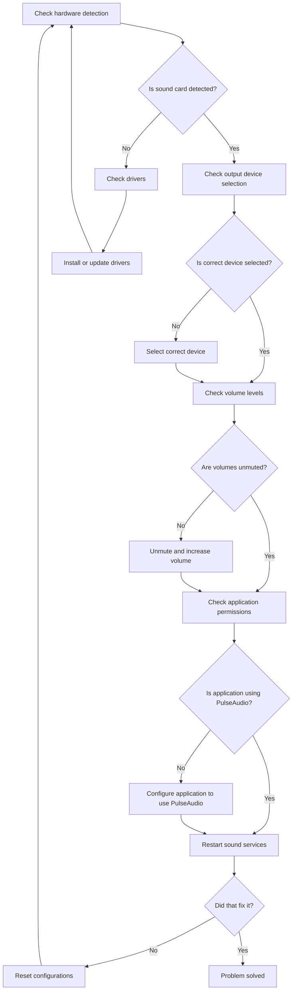

# Debian Sound Problems

## Introduction

Sound issues are among the most common problems that Debian users encounter, especially after new installations or system updates. In this guide, we'll explore the Debian audio architecture, common sound problems, diagnostic approaches, and step-by-step solutions to get your audio working properly.

Debian primarily uses two sound systems:
- **ALSA (Advanced Linux Sound Architecture)**: The low-level kernel component that communicates directly with sound hardware
- **PulseAudio**: A sound server that runs on top of ALSA and provides advanced features like per-application volume control and network audio

Understanding how these components interact is crucial for troubleshooting sound issues effectively.

## Common Sound Problems

### 1. No Sound Output

This is the most common issue where audio doesn't play through speakers or headphones.

#### Diagnostic Steps:

```bash
# Check if your sound card is detected
lspci | grep -i audio

# Verify ALSA sees your sound devices
aplay -l

# Check if your user is in the audio group
groups
```

If your sound card is detected but you still don't hear anything, check if your user is in the audio group. If not, add yourself:

```bash
sudo usermod -aG audio $USER
```

Log out and log back in for the changes to take effect.

### 2. Volume Controls Not Working

Sometimes volume controls in the desktop environment don't control the actual audio output.

#### Solution:

Install and use `alsamixer` for low-level volume control:

```bash
sudo apt install alsa-utils
alsamixer
```

In `alsamixer`:
- Use arrow keys to navigate
- Press `M` to unmute channels (MM means muted)
- Use Up/Down to adjust volume
- Press `F6` to select a different sound card if you have multiple

### 3. PulseAudio Issues

PulseAudio can sometimes crash or malfunction.

#### Restart PulseAudio:

```bash
# Kill the current PulseAudio process
pulseaudio -k

# Start PulseAudio again
pulseaudio --start
```

If problems persist, try resetting the PulseAudio configuration:

```bash
rm -rf ~/.config/pulse
pulseaudio -k
```

### 4. Device Selection Problems

Wrong output device selected is another common issue.

#### Check and Set Default Device:

```bash
# List audio devices
pacmd list-sinks

# Set default device (replace INDEX with the number of your device)
pacmd set-default-sink INDEX
```

To make this persistent, edit `/etc/pulse/default.pa` and add:

```
set-default-sink INDEX
```

## Debugging With Sound Diagnostic Tools

### Using `pavucontrol`

PulseAudio Volume Control is a GUI tool that helps diagnose which applications are outputting sound and where:

```bash
sudo apt install pavucontrol
pavucontrol
```

The interface allows you to:
- See active applications producing sound
- Adjust individual application volumes
- Change output devices per application
- Test output on different devices

### Using `pulseaudio` in Debug Mode

For advanced troubleshooting, run PulseAudio in debug mode:

```bash
pulseaudio -k
pulseaudio -vvv
```

This will show detailed logs about what PulseAudio is doing, which can help identify where things are going wrong.

## Fixing Specific Hardware Issues

### Intel HDA Audio

Intel HDA audio chipsets are common and sometimes require special configuration:

```bash
# Edit the ALSA configuration file
sudo nano /etc/modprobe.d/alsa-base.conf

# Add this line for Intel HDA devices
options snd-hda-intel model=auto
```

Common model options include:
- `auto`: Let ALSA detect the best model
- `generic`: Basic configuration
- `laptop`: For many laptop models
- `dell`: For Dell computers
- `hp`: For HP computers

### Bluetooth Audio Issues

Bluetooth audio requires additional components:

```bash
sudo apt install pulseaudio-module-bluetooth bluez
pulseaudio -k
```

If your Bluetooth device isn't connecting properly, make sure you have the right packages:

```bash
sudo apt install blueman
```

Use the Blueman interface to connect and configure your Bluetooth audio device.

## Advanced Configuration

### Configuring ALSA

Create or edit your `~/.asoundrc` file:

```bash
nano ~/.asoundrc
```

For a basic configuration that uses PulseAudio for most applications:

```
pcm.!default {
  type pulse
}

ctl.!default {
  type pulse
}
```

### Configuring PulseAudio

Edit PulseAudio daemon settings:

```bash
sudo nano /etc/pulse/daemon.conf
```

Common settings to adjust:

```
default-sample-rate = 48000
default-sample-format = s24le
default-sample-channels = 2
resample-method = soxr-vhq
```

These settings can improve audio quality but may increase CPU usage.

## Real-World Examples

### Example 1: Fixing Sound After System Update

Many users experience sound issues after updates. Here's a systematic approach:

1. Identify what changed:
```bash
grep -i pulse /var/log/apt/history.log
```

2. Reinstall audio components:
```bash
sudo apt install --reinstall pulseaudio alsa-base alsa-utils
```

3. Restart PulseAudio:
```bash
pulseaudio -k
pulseaudio --start
```

### Example 2: Fixing HDMI Audio Output

HDMI audio often requires specific configuration:

1. List HDMI devices:
```bash
aplay -l | grep HDMI
```

2. Set HDMI as default in PulseAudio:
```bash
# Find the HDMI sink
pacmd list-sinks | grep -i hdmi -A 1

# Set it as default (replace INDEX with your HDMI device number)
pacmd set-default-sink INDEX
```

3. Test with a sample sound:
```bash
speaker-test -c 2 -r 48000 -D hw:0,3
```

Replace `hw:0,3` with your actual HDMI device from `aplay -l`.

## Troubleshooting Workflow

Here's a systematic approach to diagnosing and fixing Debian sound issues:



## Summary

Sound problems in Debian can be frustrating but are usually solvable by understanding the audio stack and following a systematic troubleshooting approach. Remember these key points:

- Sound in Debian works through ALSA (kernel level) and usually PulseAudio (user level)
- Most issues can be diagnosed with tools like `alsamixer`, `aplay`, and `pavucontrol`
- Configuration files like `.asoundrc` and PulseAudio settings can be customized for better audio quality
- Always check the basics first: hardware detection, muted channels, and correct device selection

## Additional Resources

- [Debian Wiki: PulseAudio](https://wiki.debian.org/PulseAudio)
- [ALSA Project Documentation](https://www.alsa-project.org/wiki/Main_Page)
- [ArchWiki: PulseAudio](https://wiki.archlinux.org/title/PulseAudio) (Although for Arch Linux, it's detailed and applicable to Debian)
- [PulseAudio Documentation](https://www.freedesktop.org/wiki/Software/PulseAudio/Documentation/)

## Practice Exercises

1. Use `alsamixer` to explore your sound card's capabilities and ensure no channels are muted.
2. Try recording audio using `arecord` and playing it back with `aplay` to test your microphone.
3. Set up a custom audio configuration in `.asoundrc` for a specific use case (like gaming or audio production).
4. Use `pavucontrol` to route different applications to different output devices if you have multiple speakers or headphones.
5. Install and configure the `pulseeffects` package to apply audio effects like equalization to your system sound.