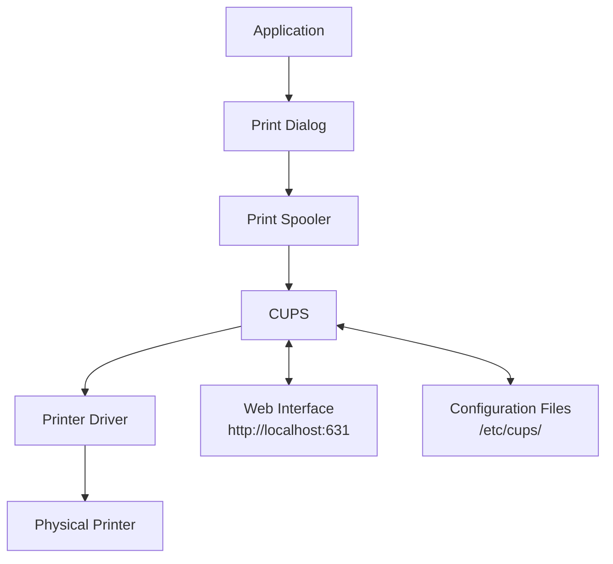

# Debian Printer Issues

## Introduction

Printing in Linux-based systems like Debian can sometimes be challenging for beginners. Debian uses the Common UNIX Printing System (CUPS) as its primary printing architecture. While CUPS provides a robust framework for printer management, users often encounter various issues that prevent successful printing. This guide walks you through common Debian printer problems and their solutions in a beginner-friendly manner.

## Understanding the Debian Printing System

Before we dive into specific issues, let's understand how printing works in Debian:



Debian primarily uses CUPS (Common UNIX Printing System) which:
- Manages print jobs and queues
- Provides network printing capabilities
- Handles printer drivers and PPD files
- Offers both command-line and web-based administration

## Common Printer Issues and Solutions

### 1. Printer Not Detected

**Symptoms**: Your printer is connected but doesn't appear in the list of available printers.

**Troubleshooting Steps**:

1. **Check physical connection**: Ensure your printer is powered on and properly connected.

2. **Verify USB detection** with the `lsusb` command:

```bash
$ lsusb
Bus 001 Device 004: ID 03f0:2b17 HP, Inc LaserJet Pro M15a
```

3. **Check if CUPS service is running**:

```bash
$ systemctl status cups
● cups.service - CUPS Scheduler
     Loaded: loaded (/lib/systemd/system/cups.service; enabled; vendor preset: enabled)
     Active: active (running) since Mon 2023-09-18 10:15:42 EDT; 2h 12min ago
```

4. **Restart CUPS service** if needed:

```bash
$ sudo systemctl restart cups
```

5. **Install missing drivers**:

```bash
$ sudo apt update
$ sudo apt install printer-driver-gutenprint printer-driver-hpcups hplip
```

For HP printers specifically:

```bash
$ sudo apt install hplip hplip-gui
$ sudo hp-setup -i
```

### 2. Print Jobs Stuck in Queue

**Symptoms**: Documents are sent to the printer but remain in the queue and never print.

**Solution**:

1. **Check the print queue**:

```bash
$ lpq
HP_LaserJet_Pro_M15a is ready and printing
Rank    Owner   Job     File(s)                         Total Size
active  user    123     document.pdf                    75008 bytes
```

2. **Clear stuck jobs** with these commands:

```bash
$ sudo cancel -a
$ sudo cupsdisable [printer_name]
$ sudo cupsenable [printer_name]
```

3. **Restart CUPS completely**:

```bash
$ sudo systemctl stop cups
$ sudo rm -rf /var/spool/cups/tmp/*
$ sudo rm -rf /var/spool/cups/cache/*
$ sudo systemctl start cups
```

### 3. Poor Print Quality

**Symptoms**: Prints are blurry, streaked, or have incorrect colors.

**Solutions**:

1. **Use printer-specific settings**:

```bash
$ sudo lpadmin -p [printer_name] -o print-quality=high
```

2. **Check ink/toner levels** (for HP printers):

```bash
$ hp-levels
```

3. **Calibrate your printer** (if supported):

```bash
$ sudo hp-toolbox
```

Then navigate to the calibration section in the GUI that appears.

### 4. Incorrect Printer Driver

**Symptoms**: The printer works but produces garbled output or doesn't print correctly.

**Solution**:

1. **Find the right driver**:

```bash
$ sudo apt search printer-driver | grep [your_printer_brand]
```

2. **Install the appropriate driver**:

```bash
$ sudo apt install printer-driver-[appropriate_driver]
```

3. **Reconfigure the printer** through the CUPS web interface:

   - Open `http://localhost:631` in your browser
   - Navigate to "Administration" → "Manage Printers"
   - Select your printer and choose "Modify Printer"
   - Update the driver selection

### 5. Network Printer Issues

**Symptoms**: Cannot detect or connect to network printers.

**Troubleshooting**:

1. **Verify network connectivity**:

```bash
$ ping [printer_ip_address]
```

2. **Check if avahi-daemon is running** (for automatic discovery):

```bash
$ systemctl status avahi-daemon
```

3. **Manually add the network printer**:

```bash
$ sudo lpadmin -p NetworkPrinter -E -v ipp://192.168.1.100/ipp/print -m everywhere
```

4. **Configure firewall** if needed:

```bash
$ sudo ufw allow from 192.168.1.0/24 to any port 631
```

## Debugging Printer Issues

When facing persistent printer problems, these debugging techniques can help identify the root cause:

### Using CUPS Error Log

CUPS maintains detailed logs that often contain valuable troubleshooting information:

```bash
$ sudo tail -f /var/log/cups/error_log
```

Look for lines containing "ERROR" or "WARNING" that might indicate the problem.

### Testing Print Functionality

You can perform a simple print test to check basic functionality:

```bash
$ echo "Test page" | lp
```

Or print a test page through CUPS:

```bash
$ lpadmin -p [printer_name] -o printer-is-shared=false
$ cupsenable [printer_name]
$ cupsaccept [printer_name]
$ lp -d [printer_name] /usr/share/cups/data/testprint
```

### Checking Printer Status

Get comprehensive information about your printer's status:

```bash
$ lpstat -v
device for HP_LaserJet_Pro_M15a: usb://HP/LaserJet%20Pro%20M15a?serial=HPC1JF23456

$ lpstat -p -d
printer HP_LaserJet_Pro_M15a is idle.  enabled since Mon Sep 18 10:20:32 2023
system default destination: HP_LaserJet_Pro_M15a
```

## Advanced Troubleshooting

### PPD File Issues

PPD (PostScript Printer Description) files define printer capabilities. Sometimes, issues stem from incorrect PPD files:

```bash
$ sudo find /etc/cups/ppd -name "*.ppd" -exec ls -la {} \;
```

To backup and replace a PPD file:

```bash
$ sudo cp /etc/cups/ppd/[printer_name].ppd /etc/cups/ppd/[printer_name].ppd.bak
$ sudo cp /usr/share/cups/model/[new_ppd_file].ppd /etc/cups/ppd/[printer_name].ppd
$ sudo systemctl restart cups
```

### Permissions Problems

Sometimes, CUPS permission issues prevent proper printing:

```bash
$ sudo usermod -a -G lpadmin [your_username]
$ sudo chmod 640 /etc/cups/printers.conf
$ sudo chown root:lp /etc/cups/printers.conf
```

### Using CUPS Command Line Tools

CUPS provides powerful command-line tools for printer management:

```bash
# List available printer drivers
$ lpinfo -m

# List available printer connections
$ lpinfo -v

# Get printer options
$ lpoptions -p [printer_name] -l

# Set default printer
$ lpoptions -d [printer_name]
```

## Common Error Messages and Solutions

| Error Message                | Possible Causes                          | Solution                          |
|------------------------------|------------------------------------------|-----------------------------------|
| `Unable to locate printer`   | Printer disconnected or CUPS not running | Check connection and CUPS service |
| `Filter failed`              | Missing or incompatible driver           | Install correct driver package    |
| `Permission denied`          | Insufficient user privileges             | Add user to lpadmin group         |
| `Unable to open device file` | Device permissions issue                 | Fix USB/device permissions        |
| `Idle - "Filter failed"`     | Processing error in print filter         | Check CUPS error log for details  |

## Printer-Specific Issues

### HP Printers

HP printers often require the HPLIP package:

```bash
$ sudo apt install hplip hplip-gui
$ hp-check -t
$ hp-setup
```

### Canon Printers

Canon printers might need specific drivers:

```bash
$ sudo apt install cnijfilter2
```

### Brother Printers

Brother printers often require downloading drivers from Brother's website:

```bash
# After downloading .deb files
$ sudo dpkg -i brother-printer-driver.deb
$ sudo apt install -f
```

## Summary

Troubleshooting printer issues in Debian involves:

1. Checking physical connections and power
2. Verifying CUPS service status
3. Installing appropriate drivers
4. Managing print queues effectively
5. Using CUPS tools for diagnostics
6. Addressing permissions and configuration issues

With the systematic approach outlined in this guide, you should be able to resolve most printer-related issues in your Debian system. Remember that different printer models may have unique requirements, so always check the printer manufacturer's documentation for specific guidance.

## Additional Resources

- [Debian Wiki Printing Guide](https://wiki.debian.org/Printing)
- [CUPS Documentation](https://www.cups.org/documentation.html)
- [OpenPrinting Database](https://www.openprinting.org/printers) - Check printer compatibility

## Practice Exercises

1. Connect a printer to your Debian system and set it up using both the GUI and command-line methods.
2. Deliberately stop the CUPS service and try to print a document. Then restart CUPS and observe the difference.
3. Explore the CUPS web interface at http://localhost:631 and familiarize yourself with its features.
4. Set up printer sharing between two Debian machines on the same network.
5. Create a simple shell script that checks if CUPS is running and restarts it if needed.