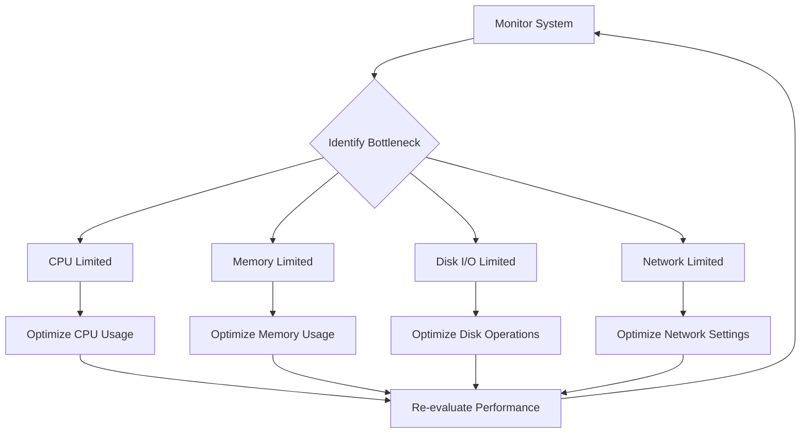

# Debian Performance Issues

## Introduction

Performance issues can arise in any operating system, and Debian Linux is no exception. Whether you're running a desktop environment, a server, or an embedded system, understanding how to identify and resolve performance bottlenecks is crucial for maintaining a responsive and efficient system. This guide focuses on common performance issues in Debian-based systems, providing practical steps to diagnose and resolve them.

## Common Performance Issues in Debian

Debian systems typically encounter performance problems due to one or more of the following factors:

1. **Resource exhaustion** (CPU, memory, disk I/O, network)
2. **Suboptimal configurations**
3. **Outdated or conflicting software**
4. **Hardware limitations**
5. **Background processes consuming resources**

Let's explore each of these areas and learn how to diagnose and address them.

## Monitoring Tools for Performance Analysis

Before we can fix performance issues, we need to identify them. Debian provides several built-in tools for monitoring system performance:

### 1. System Resource Monitoring with `top` and `htop`

`top` is a built-in utility that provides a real-time view of running processes and system resource usage.

```bash
sudo apt-get install htop  # Install htop (enhanced version of top)
htop                      # Run htop
```

Key metrics to observe in `htop`:
- CPU usage (per core and total)
- Memory usage (used, available, cached)
- Swap usage
- Load average
- Process list sorted by resource consumption

### 2. Disk Usage and I/O Performance

```bash
# Check disk space usage
df -h

# Check directory sizes
du -sh /path/to/directory

# Monitor disk I/O
sudo apt-get install iotop
sudo iotop

# Check disk I/O statistics
iostat -x 2
```

### 3. Network Performance Monitoring

```bash
# Monitor network interface statistics
ifstat

# Detailed network traffic analysis
sudo apt-get install iftop
sudo iftop

# Check open network connections
netstat -tuln
```

### 4. System Activity Reporter (SAR)

SAR offers comprehensive system performance tracking and reporting:

```bash
# Install SAR
sudo apt-get install sysstat

# Enable data collection
sudo systemctl enable sysstat
sudo systemctl start sysstat

# View CPU statistics
sar -u

# View memory statistics
sar -r

# View disk I/O statistics
sar -b
```

## CPU Performance Issues

### Diagnosing CPU Bottlenecks

High CPU usage can be diagnosed using tools like `htop`, `top`, or `mpstat`:

```bash
# Install mpstat if needed
sudo apt-get install sysstat
mpstat -P ALL 2
```

### Common CPU Performance Problems

#### 1. Runaway Processes

Sometimes a single process can consume excessive CPU resources. Identify it using `top`:

```bash
top -c  # Show command line with processes
```

Once identified, you can terminate the process if necessary:

```bash
kill -15 process_id  # Graceful termination
# or if necessary
kill -9 process_id   # Forceful termination
```

#### 2. Too Many Background Services

Debian may have unnecessary services running. Verify and disable unneeded services:

```bash
# List running services
systemctl list-units --type=service --state=running

# Disable and stop a service
sudo systemctl disable service_name
sudo systemctl stop service_name
```

#### 3. CPU Frequency Scaling

Your CPU might be running at a lower frequency to save power:

```bash
# Install cpufrequtils
sudo apt-get install cpufrequtils

# Check current CPU frequency
cpufreq-info

# Set performance governor
sudo cpufreq-set -g performance
```

## Memory Performance Issues

### Diagnosing Memory Problems

Check memory usage with:

```bash
free -h
vmstat 2
```

### Common Memory Issues

#### 1. Memory Leaks

Applications with memory leaks gradually consume more RAM. Monitor process memory growth:

```bash
watch -n 2 'ps -o pid,user,%mem,command ax | sort -b -k3 -r | head -n 10'
```

#### 2. Swap Thrashing

Excessive swapping can severely impact performance:

```bash
# Check swap usage
swapon --show

# Adjust swappiness (lower values reduce swap usage)
cat /proc/sys/vm/swappiness
sudo sysctl vm.swappiness=10
```

For permanent changes, edit `/etc/sysctl.conf`:

```bash
# Add or modify the line
vm.swappiness=10
```

Then apply the changes:

```bash
sudo sysctl -p
```

#### 3. Optimizing Caching

Debian uses available RAM for disk caching. You can temporarily clear it if needed:

```bash
# Check current cache 
free -h

# Clear page cache (be careful - this can impact performance)
sudo sync && sudo echo 1 > /proc/sys/vm/drop_caches
```

## Disk I/O Performance Issues

### Identifying Disk Bottlenecks

Slow disk operations can significantly impact system performance:

```bash
# Monitor disk activity
iostat -dx 2

# Find I/O-intensive processes
iotop
```

### Common Disk Performance Problems

#### 1. Fragmented Filesystems

The ext4 filesystem (common in Debian) can experience fragmentation over time:

```bash
# Check fragmentation level
sudo e4defrag -c /

# Defragment a filesystem
sudo e4defrag /home
```

#### 2. Disk Scheduler Optimization

Choosing the right I/O scheduler can improve performance:

```bash
# Check current scheduler
cat /sys/block/sda/queue/scheduler

# Set a different scheduler temporarily
echo deadline > /sys/block/sda/queue/scheduler
```

For permanent changes, add to `/etc/default/grub`:

```bash
GRUB_CMDLINE_LINUX="... elevator=deadline"
```

Then update grub:

```bash
sudo update-grub
```

#### 3. Optimizing File System Mount Options

Edit `/etc/fstab` to include performance optimizations:

```bash
# Example: add noatime to reduce disk writes
UUID=your-uuid / ext4 defaults,noatime 0 1
```

After changes, remount all filesystems:

```bash
sudo mount -a
```

## Network Performance Issues

### Diagnosing Network Problems

```bash
# Check network interface statistics
ip -s link

# Perform a network speed test
sudo apt-get install speedtest-cli
speedtest-cli
```

### Common Network Performance Issues

#### 1. DNS Resolution Delays

Slow DNS resolution can make network operations feel sluggish:

```bash
# Test DNS resolution time
time dig example.com

# Install faster DNS resolver
sudo apt-get install resolvconf
```

Edit `/etc/resolvconf/resolv.conf.d/head` to add faster DNS servers:

```
nameserver 1.1.1.1
nameserver 8.8.8.8
```

Apply changes:

```bash
sudo resolvconf -u
```

#### 2. Network Interface Configuration

Check and optimize network interface settings:

```bash
# Show NIC settings
ethtool eth0

# Enable jumbo frames if supported
sudo ip link set eth0 mtu 9000
```

## Graphical Environment Performance

For desktop Debian installations, the graphical environment can impact overall system performance.

### Desktop Environment Optimization

If you're experiencing lag in your desktop environment:

```bash
# Install a lighter desktop environment
sudo apt-get install xfce4

# Or use an even lighter window manager
sudo apt-get install i3
```

### Graphics Driver Issues

Proper graphics drivers are essential for good performance:

```bash
# Check current graphics driver
lspci -k | grep -A 2 -E "(VGA|3D)"

# For NVIDIA GPUs
sudo apt-get install nvidia-driver

# For AMD GPUs
sudo apt-get install firmware-amd-graphics
```

## Performance Tuning Approaches

### Systemic Performance Optimization



### Creating a Performance Baseline

Before making changes, establish a baseline to measure improvements:

```bash
# Install benchmarking tools
sudo apt-get install sysbench

# CPU benchmark
sysbench cpu --cpu-max-prime=20000 run

# Memory benchmark
sysbench memory run

# File I/O benchmark
sysbench fileio --file-test-mode=rndrw prepare
sysbench fileio --file-test-mode=rndrw run
sysbench fileio --file-test-mode=rndrw cleanup
```

## Practical Examples

### Example 1: Diagnosing a Slow Web Server

Let's consider a Debian server running Apache that's responding slowly:

```bash
# Check overall system load
htop

# Look for Apache processes
top -c | grep apache

# Check disk I/O (may be slow due to log writes)
iostat -dx 2

# Examine Apache error logs
tail -f /var/log/apache2/error.log
```

Solution: After investigation, we found Apache was writing excessive logs to a nearly full disk. Our fix:

```bash
# Rotate and compress logs
sudo logrotate -f /etc/logrotate.d/apache2

# Increase disk space
sudo lvextend -L +10G /dev/mapper/debian-root
sudo resize2fs /dev/mapper/debian-root
```

### Example 2: Desktop System Running Slowly

For a Debian desktop that feels sluggish:

```bash
# Check running processes
htop

# Look for browser memory usage
ps aux | grep firefox

# Check startup applications
ls -la ~/.config/autostart/
```

Solution: We discovered too many browser tabs consuming memory and unnecessary applications starting automatically:

```bash
# Remove unnecessary startup applications
rm ~/.config/autostart/application.desktop

# Use a lightweight browser for less intensive browsing
sudo apt-get install midori
```

## Performance Optimization Checklist

Use this checklist when troubleshooting Debian performance:

1. **Update system packages**
   ```bash
   sudo apt update && sudo apt upgrade
   ```

2. **Remove unneeded packages**
   ```bash
   sudo apt autoremove
   ```

3. **Clean package cache**
   ```bash
   sudo apt clean
   ```

4. **Disable unnecessary services**
   ```bash
   systemctl list-unit-files --type=service
   sudo systemctl disable service_name
   ```

5. **Optimize startup applications** (desktop systems)
   
6. **Check for hardware issues**
   ```bash
   sudo apt-get install smartmontools
   sudo smartctl -a /dev/sda
   ```

7. **Consider hardware upgrades** if necessary
   - Adding RAM
   - Switching to SSD storage
   - Upgrading CPU or GPU

## Summary

Performance optimization in Debian systems involves identifying bottlenecks, understanding their causes, and applying targeted solutions. By using the monitoring tools and techniques described in this guide, you can diagnose and resolve most common performance issues.

Remember that performance tuning is often an iterative process. Make one change at a time, measure its impact, and then decide whether further optimization is necessary. This methodical approach will help you achieve a well-tuned Debian system that performs efficiently for your specific use case.

## Additional Resources

- Official Debian Wiki: [Performance Tuning](https://wiki.debian.org/PerformanceTuning)
- The Linux Documentation Project: [System Optimization](https://tldp.org/HOWTO/Partition-Mass-Storage-Definitions-Naming-HOWTO/x236.html)
- Debian Administrator's Handbook

## Practice Exercises

1. Use the monitoring tools described to create a performance profile of your system during normal usage.
2. Identify the top three processes consuming CPU and memory on your system.
3. Experiment with different I/O schedulers and measure their impact on disk performance.
4. Create a simple shell script that monitors and logs system performance metrics hourly.
5. Benchmark your system before and after applying the optimizations suggested in this guide.