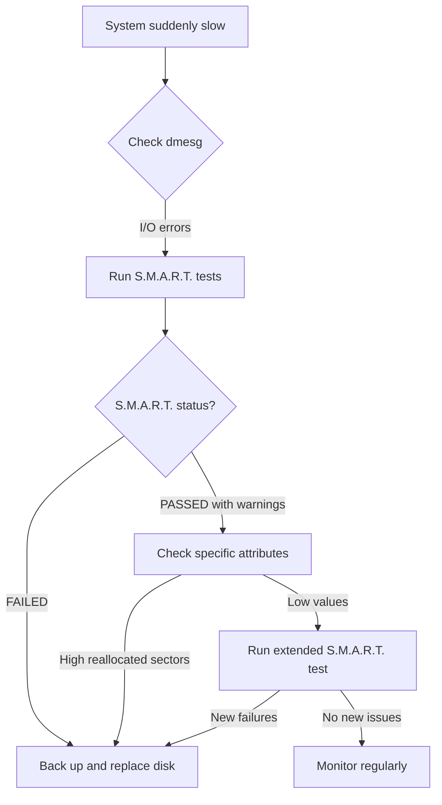

# Debian Disk Errors

## Introduction

Disk errors are among the most critical issues that can affect your Debian system. They can lead to data loss, system instability, or even complete system failure. Understanding how to identify, diagnose, and fix disk errors is an essential skill for anyone managing Debian systems, whether for personal or professional use.

In this guide, we'll explore common disk errors in Debian systems, the tools available for diagnosing these issues, and step-by-step approaches to resolving them. By the end of this guide, you'll have a solid understanding of how to maintain disk health on your Debian system.

## Understanding Disk Errors

Disk errors fall into several categories:

1. **Physical errors**: Actual hardware damage or wear to the disk
2. **Logical errors**: Problems with the file system structure
3. **I/O errors**: Issues with reading from or writing to the disk
4. **Bad sectors/blocks**: Areas of the disk that can no longer reliably store data

These errors can be caused by:

- Power outages or improper shutdowns
- Hardware failures
- Age and wear of the disk
- File system corruption
- Software bugs
- Malware (though less common on Linux systems)

## Identifying Disk Issues

### Common Symptoms

Before diving into diagnostic tools, let's recognize some common symptoms of disk problems:

- System freezes or becomes unresponsive
- Strange noises coming from the hard drive
- Extremely slow disk operations
- Frequent I/O errors in system logs
- Files becoming corrupted or disappearing
- Failed boot sequences with disk-related errors

### Checking System Logs

The first place to look when suspecting disk issues is in your system logs:

```bash
# View system logs for disk-related messages
sudo dmesg | grep -i -E '(error|disk|sda|hda|failure)'

# Check system journal for disk errors
sudo journalctl -p err..emerg | grep -i disk
```

Typical error messages you might see include:

```
[sda] Medium error: sense key=0x3
I/O error, dev sda, sector 1234567
Buffer I/O error on dev sda1, logical block 123456
end_request: I/O error, dev sda, sector 7654321
kernel: EXT4-fs error (device sda1): ext4_find_entry:1456: inode #123456
```

## Essential Diagnostic Tools

Debian provides several powerful tools for diagnosing disk issues:

### 1. `smartctl` - S.M.A.R.T. Monitoring Tool

The `smartctl` utility from the `smartmontools` package monitors disk health using the Self-Monitoring, Analysis, and Reporting Technology (S.M.A.R.T.) built into most modern disks.

Installation:

```bash
sudo apt update
sudo apt install smartmontools
```

Basic usage:

```bash
# Check if S.M.A.R.T. is enabled
sudo smartctl -i /dev/sda

# View S.M.A.R.T. health status
sudo smartctl -H /dev/sda

# Run a short self-test
sudo smartctl -t short /dev/sda

# View detailed S.M.A.R.T. attributes
sudo smartctl -a /dev/sda
```

Example output of a healthy disk:

```
SMART overall-health self-assessment test result: PASSED
```

Example output of a failing disk:

```
SMART overall-health self-assessment test result: FAILED
Warning: The device has SMART Attributes below threshold.
```

Key S.M.A.R.T. attributes to monitor:

1. **Reallocated Sectors Count**: When sectors go bad, they are remapped. A high or increasing count indicates problems.
2. **Current Pending Sectors**: Sectors waiting to be remapped. Any non-zero value warrants attention.
3. **Uncorrectable Sector Count**: Sectors that couldn't be read or written. Any non-zero value is concerning.
4. **Command Timeout**: Excessive timeouts indicate potential problems.

### 2. `fsck` - File System Consistency Check

The `fsck` utility checks and repairs Linux file systems. It's often run automatically after improper shutdowns, but you can also run it manually.

::: warning
Never run `fsck` on a mounted file system except in read-only mode! Always unmount the partition first or boot into recovery mode.
:::

Basic usage:

```bash
# Check an unmounted file system
sudo fsck /dev/sda1

# Force check and auto-repair (only on unmounted file systems)
sudo fsck -y /dev/sda1

# Check all file systems marked for checking in /etc/fstab
sudo fsck -A
```

Example output with errors:

```
fsck.ext4: Superblock has an invalid journal (inode 8).
Clear? yes

/dev/sda1: Inode 12345 has illegal block(s).  Clear? yes
/dev/sda1: Unattached inode 67890
Connect to /lost+found? yes

/dev/sda1: ***** FILE SYSTEM WAS MODIFIED *****
/dev/sda1: 11/60822 files (0.0% non-contiguous), 9875/243285 blocks
```

### 3. `badblocks` - Scan for Bad Blocks

The `badblocks` utility scans storage devices for bad blocks (sectors).

::: warning
The destructive write test mode (`-w` option) will destroy all data on the partition! Use with extreme caution.
:::

Basic usage:

```bash
# Read-only test (safe but may miss some bad blocks)
sudo badblocks -v /dev/sda1

# Non-destructive read-write test (safer for existing data)
sudo badblocks -nsv /dev/sda1

# Destructive read-write test (erases all data!)
sudo badblocks -wsv /dev/sda1
```

Example output:

```
Checking blocks 0 to 3907029
Checking for bad blocks (read-only test): done                                  
Pass completed, 23 bad blocks found.
```

### 4. `iostat` - Monitor I/O Statistics

The `iostat` utility from the `sysstat` package provides continuous I/O statistics, useful for monitoring disk performance.

Installation:

```bash
sudo apt install sysstat
```

Basic usage:

```bash
# Display stats every 2 seconds for 5 iterations
iostat -x 2 5
```

Example output:

```
Device            r/s     w/s     rkB/s     wkB/s   rrqm/s   wrqm/s   %util
sda              0.50    2.00      4.00     16.00     0.00     1.00    0.50
```

Key metrics to watch:
- `%util`: Percentage of CPU time spent on I/O operations (high values indicate bottlenecks)
- `r/s`, `w/s`: Reads and writes per second
- `await`: Average time (in milliseconds) for I/O requests to be served

## Fixing Disk Issues

### Common Solutions for Logical Errors

#### 1. Running fsck from Recovery Mode

For system disks that cannot be unmounted during normal operation:

1. Reboot your system
2. Access the GRUB menu (hold Shift during boot)
3. Select "Advanced options for Debian"
4. Select recovery mode
5. Choose "fsck" from the recovery menu or run it manually from the root shell:

```bash
# At the recovery shell
fsck -f /dev/sda1
```

#### 2. Create a List of Bad Blocks and Avoid Them

If `badblocks` identifies bad sectors, you can tell the file system to avoid them:

```bash
# Create a list of bad blocks
sudo badblocks -v /dev/sda1 > bad-blocks.txt

# Tell e2fsck to mark them as bad in the file system
sudo e2fsck -l bad-blocks.txt /dev/sda1
```

#### 3. Fixing Superblock Issues

If the superblock is corrupted, you can try restoring from backup superblocks:

```bash
# Find backup superblocks
sudo mke2fs -n /dev/sda1

# Output will show something like:
# Superblock backups stored on blocks: 
# 32768, 98304, 163840, 229376, 294912, 819200, 884736

# Use a backup superblock
sudo fsck -b 32768 /dev/sda1
```

### Handling Physical Disk Failures

When S.M.A.R.T. or other diagnostics indicate physical disk failure:

#### 1. Back Up Your Data Immediately

Before doing anything else, back up your important data:

```bash
# Create a recovery image of a failing drive
sudo ddrescue /dev/sda /path/to/backup/image /path/to/logfile
```

#### 2. Replace the Failing Drive

Physical disk failures usually can't be fixed—the drive needs replacement. After replacing:

1. Create new partitions with `fdisk` or `parted`
2. Create new file systems with `mkfs`
3. Restore your data from backups

#### 3. Using RAID for Redundancy

To prevent future data loss, consider implementing RAID:

```bash
# Install mdadm for software RAID
sudo apt install mdadm

# Example: Creating a RAID 1 array (mirroring)
sudo mdadm --create --verbose /dev/md0 --level=1 --raid-devices=2 /dev/sdb1 /dev/sdc1
```

## Preventive Maintenance

### Regular S.M.A.R.T. Monitoring

Set up regular S.M.A.R.T. monitoring with `smartd`:

1. Edit the configuration file:

```bash
sudo nano /etc/smartd.conf
```

2. Add monitoring rules, for example:

```
/dev/sda -a -o on -S on -s (S/../.././02|L/../../6/03) -m admin@example.com
```

This will:
- Monitor all attributes (`-a`)
- Enable automatic offline testing (`-o on`)
- Enable attribute autosave (`-S on`)
- Run short tests weekly on Mondays at 2 AM and long tests monthly on Saturdays at 3 AM
- Email alerts to admin@example.com

3. Start and enable the service:

```bash
sudo systemctl enable smartd
sudo systemctl start smartd
```

### Scheduled File System Checks

Configure periodic file system checks by adjusting the mount count or time interval:

```bash
# Display current settings
sudo tune2fs -l /dev/sda1 | grep -E 'Mount count|Check interval'

# Set maximum mount count (e.g., check every 30 mounts)
sudo tune2fs -c 30 /dev/sda1

# Set check interval (e.g., check every 3 months)
sudo tune2fs -i 3m /dev/sda1
```

### Using System Monitor Tools

Install a system monitoring solution:

```bash
# Install Prometheus and node_exporter for monitoring
sudo apt install prometheus prometheus-node-exporter

# Or install Netdata for real-time monitoring
bash <(curl -Ss https://my-netdata.io/kickstart.sh)
```

## Practical Examples

### Example 1: Diagnosing a Failing Hard Drive

Let's walk through a real-world scenario of diagnosing a failing hard drive:



Command sequence for diagnosis:

```bash
# Check system messages
sudo dmesg | grep -i error

# Check S.M.A.R.T. status
sudo smartctl -H /dev/sda

# Check detailed attributes
sudo smartctl -a /dev/sda

# Run extended test
sudo smartctl -t long /dev/sda
# Wait for test to complete (could take hours)
sudo smartctl -l selftest /dev/sda
```

### Example 2: Recovering from File System Corruption

Here's a practical example of file system recovery after improper shutdown:

```bash
# System won't boot, enter recovery mode from GRUB menu

# Check file system for errors
sudo fsck -f /dev/sda1

# If fsck finds and fixes errors, reboot
sudo reboot

# If problems persist, check for bad blocks
sudo badblocks -v /dev/sda1 > bad-blocks.txt

# Mark bad blocks in file system
sudo e2fsck -l bad-blocks.txt /dev/sda1
```

### Example 3: Setting Up Automated Disk Monitoring

Create a simple script to monitor disk health and email alerts:

```bash
#!/bin/bash
# Save as /usr/local/bin/disk-health-check.sh

SMART_STATUS=$(smartctl -H /dev/sda | grep "SMART overall-health")
REALLOCATED=$(smartctl -A /dev/sda | grep "Reallocated_Sector_Ct" | awk '{print $10}')
PENDING=$(smartctl -A /dev/sda | grep "Current_Pending_Sector" | awk '{print $10}')

if [[ "$SMART_STATUS" != *"PASSED"* || $REALLOCATED -gt 0 || $PENDING -gt 0 ]]; then
    echo "ALERT: Disk issues detected on $(hostname)" | mail -s "Disk Health Alert" admin@example.com
    echo "Details:" >> /tmp/disk-alert.txt
    smartctl -a /dev/sda >> /tmp/disk-alert.txt
    mail -s "Disk Health Details for $(hostname)" -A /tmp/disk-alert.txt admin@example.com
fi
```

Make it executable and add to crontab:

```bash
sudo chmod +x /usr/local/bin/disk-health-check.sh

# Add to crontab to run daily
echo "0 0 * * * /usr/local/bin/disk-health-check.sh" | sudo tee -a /etc/cron.d/disk-health
```

## Summary

In this guide, we've covered:

1. **Understanding disk errors** and their causes
2. **Identifying symptoms** of disk problems
3. **Using diagnostic tools** like `smartctl`, `fsck`, and `badblocks`
4. **Fixing logical errors** with file system repair tools
5. **Handling physical disk failures** with backup and replacement strategies
6. **Implementing preventive maintenance** through monitoring and scheduled checks

Properly maintaining disk health is crucial for system reliability. By regularly monitoring disk status and promptly addressing issues, you can prevent data loss and maintain system uptime.

## Further Resources

- [Debian Wiki: DiskError](https://wiki.debian.org/DiskError)
- [The Linux Documentation Project: Filesystems](https://tldp.org/LDP/sag/html/filesystems.html)
- [S.M.A.R.T. Wikipedia Article](https://en.wikipedia.org/wiki/S.M.A.R.T.)
- `man` pages: `smartctl(8)`, `fsck(8)`, `badblocks(8)`, `tune2fs(8)`

## Exercises

1. Run a basic S.M.A.R.T. test on your main system disk and interpret the results.
2. Create a simple shell script that checks disk space usage and sends an alert if any partition exceeds 85% capacity.
3. Research and document three additional disk diagnostic tools available in Debian repositories.
4. Set up a scheduled task to run a short S.M.A.R.T. test weekly and a long test monthly.
5. Practice using the recovery mode to run `fsck` on a test system or virtual machine.