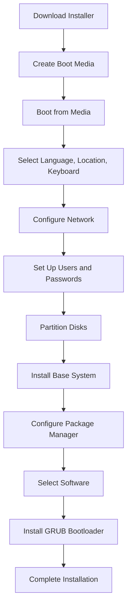

# Debian Server Introduction

## What is Debian?

Debian is one of the oldest and most respected Linux distributions available. First released in 1993, it has built a strong reputation for stability, security, and an extensive software ecosystem. Debian serves as the foundation for many other popular distributions, including Ubuntu.

When we talk about a "Debian server," we're referring to a computer running the Debian operating system that's configured to provide services to other computers or users over a network.

## Why Choose Debian for Servers?

Debian offers several advantages that make it an excellent choice for server environments:

- **Stability**: Debian's "stable" release undergoes extensive testing before release, resulting in a highly reliable system.
- **Security**: The Debian security team provides timely updates for security vulnerabilities.
- **Package Management**: The APT (Advanced Package Tool) system makes software installation and updates straightforward.
- **Longevity**: Each stable release is supported for approximately 5 years.
- **Community Support**: Being one of the oldest Linux distributions, Debian has a vast community and extensive documentation.
- **Free and Open Source**: Debian is committed to free software principles.

## Debian Release Cycles

Debian uses a tiered release system with three main branches:

```mermaid
flowchart LR
    A[Unstable
"Sid"] --> B[Testing]
    B --> C[Stable]
    style C fill:#9f9,stroke:#484
    style B fill:#ff9,stroke:#660
    style A fill:#f99,stroke:#600
```

- **Stable**: Recommended for production servers (currently "Bookworm" or Debian 12)
- **Testing**: The next version being prepared for stable release
- **Unstable**: Cutting-edge packages, not recommended for servers

For servers, you should always use the Stable branch to ensure reliability and security.

## Getting Started with Debian Server

### System Requirements

Debian has modest hardware requirements, making it suitable for various server applications:

- **Minimum**: 512MB RAM, 10GB disk space, 1GHz processor
- **Recommended**: 1GB+ RAM, 20GB+ disk space, dual-core processor

Requirements will vary based on the services you plan to run.

### Installation Basics

The Debian installation process is straightforward:

1. Download the Debian installer from [debian.org](https://www.debian.org/)
2. Create a bootable USB drive or DVD
3. Boot from the installation media
4. Follow the step-by-step installer

For servers, the "netinst" (network installer) image is recommended as it downloads the latest packages during installation.

Here's what the basic installation process looks like:



### First Steps After Installation

Once you've installed Debian, there are several important steps to take:

1. **Update your system**

```bash
sudo apt update
sudo apt upgrade
```

2. **Secure SSH access** (if using remote access)

```bash
sudo nano /etc/ssh/sshd_config
```

Change the default SSH port, disable root login, and use key-based authentication:

```
Port 2222
PermitRootLogin no
PasswordAuthentication no
```

After editing, restart the SSH service:

```bash
sudo systemctl restart sshd
```

3. **Install a firewall**

```bash
sudo apt install ufw
sudo ufw allow 2222/tcp  # Allow your custom SSH port
sudo ufw enable
```

4. **Set up automatic security updates**

```bash
sudo apt install unattended-upgrades
sudo dpkg-reconfigure unattended-upgrades
```

## Basic Server Administration

### Package Management

Debian's package management system is one of its strongest features:

- **apt**: The recommended command-line tool for package management
- **apt-get**: A more traditional alternative
- **dpkg**: The underlying package management system

Common package commands:

```bash
# Search for a package
apt search apache2

# Install a package
sudo apt install apache2

# Remove a package
sudo apt remove apache2

# Update package lists
sudo apt update

# Upgrade installed packages
sudo apt upgrade

# Show package information
apt show apache2
```

### Service Management with systemd

Debian uses systemd to manage services. Here are the basic commands:

```bash
# Start a service
sudo systemctl start apache2

# Stop a service
sudo systemctl stop apache2

# Restart a service
sudo systemctl restart apache2

# Enable a service to start at boot
sudo systemctl enable apache2

# Disable a service from starting at boot
sudo systemctl disable apache2

# Check service status
sudo systemctl status apache2
```

Example output of a status command:

```
● apache2.service - The Apache HTTP Server
     Loaded: loaded (/lib/systemd/system/apache2.service; enabled; vendor preset: enabled)
     Active: active (running) since Mon 2023-09-25 15:30:42 UTC; 2h 12min ago
       Docs: https://httpd.apache.org/docs/2.4/
   Main PID: 1234 (apache2)
      Tasks: 55 (limit: 1132)
     Memory: 26.9M
        CPU: 652ms
     CGroup: /system.slice/apache2.service
             ├─1234 /usr/sbin/apache2 -k start
             ├─1235 /usr/sbin/apache2 -k start
             └─1236 /usr/sbin/apache2 -k start
```

### User Management

Managing users is a fundamental aspect of server administration:

```bash
# Add a new user
sudo adduser username

# Add user to a group
sudo usermod -aG sudo username

# Change user password
sudo passwd username

# Delete a user
sudo deluser username

# List all users
cut -d: -f1 /etc/passwd
```

### File Permissions

Understanding file permissions is crucial for server security:

```bash
# Change file owner
sudo chown username:groupname file.txt

# Change file permissions
sudo chmod 755 file.txt

# Set permissions recursively
sudo chmod -R 755 directory/
```

Permission bits explained:

- **4**: Read permission
- **2**: Write permission
- **1**: Execute permission
- **Common combinations**: 
  - 755 (rwxr-xr-x): Owner can read, write, execute; group and others can read and execute
  - 644 (rw-r--r--): Owner can read and write; group and others can only read
  - 700 (rwx------): Owner can read, write, execute; no access for group and others

## Common Server Configurations

### Web Server (Apache)

```bash
# Install Apache
sudo apt install apache2

# Check status
sudo systemctl status apache2

# Basic configuration file
sudo nano /etc/apache2/apache2.conf

# Site-specific configuration
sudo nano /etc/apache2/sites-available/000-default.conf

# Enable a site
sudo a2ensite site-name

# Enable a module
sudo a2enmod rewrite

# Test configuration
sudo apache2ctl configtest

# Restart after changes
sudo systemctl restart apache2
```

### Database Server (MariaDB/MySQL)

```bash
# Install MariaDB
sudo apt install mariadb-server

# Secure the installation
sudo mysql_secure_installation

# Access MySQL shell
sudo mysql
```

Basic MySQL commands:

```sql
-- Create a database
CREATE DATABASE mywebsite;

-- Create a user
CREATE USER 'webuser'@'localhost' IDENTIFIED BY 'password';

-- Grant privileges
GRANT ALL PRIVILEGES ON mywebsite.* TO 'webuser'@'localhost';

-- Apply privileges
FLUSH PRIVILEGES;

-- Exit
EXIT;
```

### SSH Server

```bash
# Install SSH server if not already installed
sudo apt install openssh-server

# Secure configuration
sudo nano /etc/ssh/sshd_config

# Restart SSH after configuration changes
sudo systemctl restart sshd
```

## Monitoring and Maintenance

Regular maintenance is essential for a healthy server:

```bash
# Check disk usage
df -h

# Check memory usage
free -m

# Check running processes
top

# View system logs
sudo journalctl -xe

# Check load average
uptime

# Update and upgrade
sudo apt update && sudo apt upgrade -y
```

### Basic Backup Strategy

Implement a simple backup strategy:

```bash
# Install rsync
sudo apt install rsync

# Create a backup script
sudo nano /usr/local/bin/backup.sh
```

Example backup script:

```bash
#!/bin/bash
# Simple backup script

# Set variables
BACKUP_DIR="/backup"
SOURCE_DIR="/var/www"
DATE=$(date +%Y-%m-%d)

# Create backup directory if it doesn't exist
mkdir -p $BACKUP_DIR

# Create the backup using rsync
rsync -avh --delete $SOURCE_DIR $BACKUP_DIR/www-$DATE

# Keep only the last 7 backups
find $BACKUP_DIR -type d -name "www-*" | sort | head -n -7 | xargs rm -rf
```

Make the script executable:

```bash
sudo chmod +x /usr/local/bin/backup.sh
```

Schedule with cron:

```bash
sudo crontab -e
```

Add this line to run the backup daily at 2 AM:

```
0 2 * * * /usr/local/bin/backup.sh
```

## Troubleshooting Common Issues

### Service Won't Start

Check these common issues:

1. Configuration errors:
```bash
sudo systemctl status service-name
```

2. Log files:
```bash
sudo journalctl -u service-name
```

3. File permission problems:
```bash
sudo ls -la /path/to/service/directory
```

### System Running Slowly

Investigate with these tools:

```bash
# Check CPU and memory usage
htop

# Check disk I/O
sudo apt install iotop
sudo iotop

# Find large files
sudo find / -type f -size +100M -exec ls -lh {} \;

# Check for running processes consuming resources
ps aux | sort -rk 3,3 | head -n 10
```

## Summary

Debian serves as an excellent platform for servers due to its stability, security, and extensive package ecosystem. In this introduction, we've covered:

- Why Debian is ideal for server environments
- Basic installation and initial setup
- Essential administration tasks including package, service, and user management
- Common server applications like web and database servers
- Monitoring, maintenance, and basic troubleshooting

As you continue your journey with Debian servers, you'll discover its flexibility and power for handling a wide range of server applications.

## Exercises

1. Install Debian in a virtual machine using the netinst installer.
2. Configure SSH for secure remote access with key-based authentication.
3. Set up a basic web server using Apache and create a simple HTML page.
4. Install and secure MariaDB, creating a database and user.
5. Create a backup script that archives a specific directory and schedule it with cron.

## Additional Resources

- [Debian Administrator's Handbook](https://debian-handbook.info/)
- [Debian Wiki](https://wiki.debian.org/)
- [Linux Command Library](https://linuxcommandlibrary.com/)
- [Debian Security Information](https://www.debian.org/security/)
- [The Debian Reference](https://www.debian.org/doc/manuals/debian-reference/)