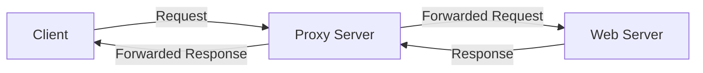

# Debian Proxy Servers

## Introduction

Proxy servers act as intermediaries between clients and other servers, providing various benefits including improved performance, security, and access control. In a Debian environment, setting up proxy servers is a fundamental skill for network administrators and developers alike.

This guide explores the concept of proxy servers in Debian systems, covering different types of proxy servers, their setup, configuration, and practical applications. Whether you're looking to cache web content, filter traffic, or balance loads across multiple servers, understanding proxy servers is essential for efficient network management.

## What is a Proxy Server?

A proxy server is a computer system or application that acts as an intermediary between client requests and the resources they're requesting. Instead of connecting directly to a server, clients connect to the proxy, which evaluates the request and performs the connection on behalf of the client.



### Key Benefits of Proxy Servers

- **Caching**: Stores copies of frequently accessed resources to reduce bandwidth usage and improve response times
- **Access Control**: Filters content and restricts access based on rules
- **Security**: Acts as a barrier between internal networks and the internet
- **Anonymity**: Masks client IP addresses from destination servers
- **Load Balancing**: Distributes traffic across multiple servers

## Types of Proxy Servers on Debian

Debian offers several proxy server solutions, each with specific strengths and use cases:

### 1. Squid: Full-featured Caching Proxy

Squid is one of the most popular and powerful proxy servers available for Debian. It excels at HTTP, HTTPS, and FTP caching, and offers extensive access control capabilities.

### 2. Nginx: Reverse Proxy and Load Balancer

While primarily known as a web server, Nginx can function as an efficient reverse proxy and load balancer, making it ideal for improving web application performance.

### 3. HAProxy: TCP/HTTP Load Balancer

HAProxy is specialized for high availability and load balancing, particularly suitable for environments with high traffic.

### 4. Privoxy: Privacy-enhancing Proxy

Privoxy focuses on privacy protection and ad blocking, modifying web page data and managing cookies.

## Setting Up Squid Proxy Server

Let's start with setting up Squid, which is a versatile forward proxy solution perfect for beginners to understand proxy concepts.

### Installation

To install Squid on Debian, use the following command:

```bash
sudo apt update
sudo apt install squid
```

After installation, Squid starts automatically, and you can verify its status with:

```bash
sudo systemctl status squid
```

Expected output:

```
● squid.service - Squid Web Proxy Server
     Loaded: loaded (/lib/systemd/system/squid.service; enabled; vendor preset: enabled)
     Active: active (running) since Mon 2023-02-20 14:30:25 UTC; 5s ago
       Docs: man:squid(8)
   Main PID: 12345 (squid)
      Tasks: 4 (limit: 4915)
     Memory: 14.8M
        CPU: 650ms
     CGroup: /system.slice/squid.service
             ├─12345 /usr/sbin/squid -sYC
             ├─12347 (squid-1) --kid squid-1
             ├─12348 (logfile-daemon) /var/log/squid/access.log
             └─12349 (basic-ncsa-auth) /etc/squid/passwd
```

### Basic Configuration

The main configuration file for Squid is located at `/etc/squid/squid.conf`. This file controls all aspects of Squid's behavior.

Let's make a basic configuration that allows access from a local network:

```bash
sudo nano /etc/squid/squid.conf
```

Find the ACL (Access Control List) section and modify it to include your local network:

```
# Example ACL for local network
acl localnet src 192.168.1.0/24  # Replace with your network

# Default access rules
http_access allow localnet
http_access deny all
```

After making changes, save the file and restart Squid:

```bash
sudo systemctl restart squid
```

### Configuring Client Browsers

To use your Squid proxy, clients need to configure their browsers to use the proxy server:

1. In most browsers, go to Settings/Preferences
2. Find Network or Connection settings
3. Configure manual proxy settings:
   - HTTP Proxy: Your-Debian-Server-IP
   - Port: 3128 (default Squid port)

### Testing the Proxy

To test if your proxy is working correctly, you can use the `curl` command with the proxy option:

```bash
curl -x http://your-proxy-ip:3128 https://example.com
```

You can also check Squid's access logs:

```bash
sudo tail -f /var/log/squid/access.log
```

Example log entry:
```
1676906425.123  2134 192.168.1.10 TCP_MISS/200 11250 GET http://example.com/ - DIRECT/93.184.216.34 text/html
```

## Setting Up Nginx as a Reverse Proxy

While Squid is excellent as a forward proxy, Nginx shines as a reverse proxy. A reverse proxy sits in front of web servers and forwards client requests to those servers.

### Installation

```bash
sudo apt update
sudo apt install nginx
```

### Basic Configuration as a Reverse Proxy

Create a new configuration file or modify the default:

```bash
sudo nano /etc/nginx/sites-available/reverse-proxy.conf
```

Add a basic reverse proxy configuration:

```nginx
server {
    listen 80;
    server_name example.com;

    location / {
        proxy_pass http://backend-server:8080;
        proxy_set_header Host $host;
        proxy_set_header X-Real-IP $remote_addr;
        proxy_set_header X-Forwarded-For $proxy_add_x_forwarded_for;
        proxy_set_header X-Forwarded-Proto $scheme;
    }
}
```

Enable the configuration and restart Nginx:

```bash
sudo ln -s /etc/nginx/sites-available/reverse-proxy.conf /etc/nginx/sites-enabled/
sudo systemctl restart nginx
```

## Advanced Proxy Server Configurations

### Squid with Authentication

For environments requiring user authentication, Squid can be configured to use basic authentication:

1. Install the Apache utilities to create password files:

```bash
sudo apt install apache2-utils
```

2. Create a password file:

```bash
sudo htpasswd -c /etc/squid/passwd username
```

3. Update the Squid configuration:

```
auth_param basic program /usr/lib/squid/basic_ncsa_auth /etc/squid/passwd
auth_param basic realm Proxy Authentication Required
acl authenticated proxy_auth REQUIRED
http_access allow authenticated localnet
http_access deny all
```

4. Restart Squid:

```bash
sudo systemctl restart squid
```

### Nginx Load Balancing

Nginx can distribute traffic across multiple backend servers:

```nginx
upstream backend_servers {
    server backend1.example.com weight=3;
    server backend2.example.com;
    server backend3.example.com;
}

server {
    listen 80;
    server_name example.com;

    location / {
        proxy_pass http://backend_servers;
        proxy_set_header Host $host;
        proxy_set_header X-Real-IP $remote_addr;
    }
}
```

This configuration routes traffic to three backend servers, with the first one receiving a higher proportion of requests due to its weight parameter.

## Practical Use Cases

### Case Study 1: School Network with Content Filtering

A school might use Squid to:
- Cache frequently accessed educational resources
- Block inappropriate websites
- Monitor and limit internet usage

Configuration snippets for content filtering:

```
# Block specific domains
acl blocked_sites dstdomain .example-inappropriate-site.com
http_access deny blocked_sites

# Use DansGuardian for content filtering
url_rewrite_program /usr/bin/dansguardian
```

### Case Study 2: Business Load Balancing

A business website might use Nginx to:
- Distribute traffic across multiple web servers
- Provide SSL termination
- Cache static content

Configuration for a high-availability setup:

```nginx
upstream backend {
    least_conn;
    server backend1.example.com max_fails=3 fail_timeout=30s;
    server backend2.example.com max_fails=3 fail_timeout=30s;
    server backup.example.com backup;
}

server {
    listen 443 ssl;
    server_name example.com;
    
    ssl_certificate /etc/nginx/ssl/example.com.crt;
    ssl_certificate_key /etc/nginx/ssl/example.com.key;
    
    location / {
        proxy_pass http://backend;
        proxy_next_upstream error timeout invalid_header http_500;
    }
    
    location ~* \.(jpg|jpeg|png|gif|ico|css|js)$ {
        expires 30d;
        proxy_pass http://backend;
    }
}
```

## Performance Optimization

### Squid Optimization Tips

1. Adjust cache size and memory allocation:

```
cache_mem 512 MB
maximum_object_size 128 MB
cache_dir ufs /var/spool/squid 10000 16 256
```

2. Configure refresh patterns for different content types:

```
refresh_pattern ^ftp:           1440    20%     10080
refresh_pattern ^gopher:        1440    0%      1440
refresh_pattern -i (/cgi-bin/|\?) 0     0%      0
refresh_pattern .               0       20%     4320
```

### Nginx Optimization Tips

1. Enable response compression:

```nginx
gzip on;
gzip_comp_level 5;
gzip_min_length 256;
gzip_proxied any;
gzip_types
  application/javascript
  application/json
  text/css
  text/plain;
```

2. Configure proxy buffering:

```nginx
proxy_buffering on;
proxy_buffer_size 16k;
proxy_buffers 4 32k;
proxy_busy_buffers_size 64k;
proxy_temp_file_write_size 64k;
```

## Security Considerations

Properly securing your proxy server is critical:

1. Always update regularly:
```bash
sudo apt update && sudo apt upgrade
```

2. Configure a firewall to restrict access:
```bash
sudo apt install ufw
sudo ufw allow 22/tcp
sudo ufw allow 3128/tcp  # For Squid
sudo ufw enable
```

3. Monitor logs for suspicious activity:
```bash
sudo tail -f /var/log/squid/access.log | grep -E "DENIED|INVALID"
```

4. Use TLS for encrypted connections in Squid:
```
https_port 3129 cert=/etc/squid/ssl/squid.pem
```

## Monitoring and Troubleshooting

### Common Troubleshooting Commands

Check if the proxy server is running:
```bash
sudo systemctl status squid
sudo systemctl status nginx
```

View real-time logs:
```bash
sudo tail -f /var/log/squid/access.log
sudo tail -f /var/log/nginx/error.log
```

Test connectivity to the proxy:
```bash
telnet proxy-server 3128
```

Check configuration syntax:
```bash
sudo squid -k parse
sudo nginx -t
```

### Monitoring Tools

1. Install Prometheus and Grafana for advanced monitoring:
```bash
sudo apt install prometheus grafana
```

2. For Squid, enable the cache manager:
```
cache_mgr admin@example.com
cachemgr_passwd secret all
```

## Summary

Proxy servers are powerful tools in Debian environments that provide caching, security, load balancing, and access control. By properly setting up and configuring proxy servers like Squid and Nginx, you can significantly improve network performance, enhance security, and provide better service to your users.

In this guide, we've covered:
- The fundamentals of proxy servers and their benefits
- Installation and basic configuration of Squid and Nginx
- Advanced configurations for authentication and load balancing
- Real-world applications through case studies
- Performance optimization techniques
- Security considerations
- Monitoring and troubleshooting approaches

## Additional Resources

- [Official Squid Documentation](http://www.squid-cache.org/Doc/)
- [Nginx Documentation](https://nginx.org/en/docs/)
- [Debian Wiki on Proxy Servers](https://wiki.debian.org/Proxy)

## Exercises

1. Set up a basic Squid proxy server and configure a client to use it.
2. Configure Nginx as a reverse proxy for a simple web application.
3. Implement basic authentication for your Squid proxy.
4. Configure a load-balancing setup with Nginx for two backend servers.
5. Monitor proxy performance and analyze access logs to identify potential improvements.