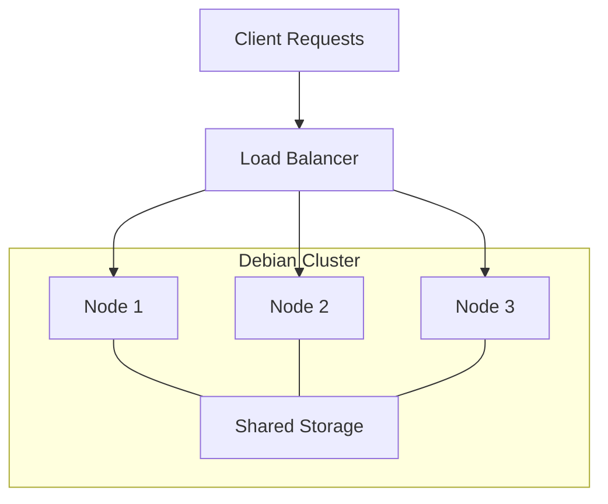

# Debian Cluster Servers

## Introduction

Cluster servers are groups of computers that work together as a single system to provide higher availability, better performance, and more scalability than a single server can offer. In the Debian ecosystem, clustering allows you to build robust infrastructure for applications that require continuous uptime and resource sharing.

This guide will introduce you to cluster server concepts on Debian systems, helping you understand when and how to implement clustering in your own projects. We'll cover different clustering approaches, from simple load balancing to complex high-availability solutions.

## What is a Server Cluster?

A server cluster consists of multiple servers (nodes) connected to work as a single system. The main benefits include:

- **High Availability (HA)**: If one server fails, others take over the workload
- **Load Balancing**: Distributes workload across multiple servers
- **Scalability**: Add more nodes as demand increases
- **Resource Sharing**: Efficiently utilize combined resources



## Types of Clusters on Debian

### 1. High-Availability Clusters

HA clusters are designed to provide continuous service even when individual components fail. Debian supports several HA solutions:

#### Corosync + Pacemaker

This is the most common HA stack on Debian systems:

- **Corosync**: Provides cluster membership and messaging
- **Pacemaker**: Manages resources and handles failover logic

Let's install these components:

```bash
# Update package lists
sudo apt update

# Install Corosync and Pacemaker
sudo apt install pacemaker corosync

# Install cluster glue and resource agents
sudo apt install resource-agents
```

Configuration example for `/etc/corosync/corosync.conf`:

```
totem {
    version: 2
    cluster_name: debian_cluster
    transport: udpu
    interface {
        ringnumber: 0
        bindnetaddr: 192.168.1.0
        mcastport: 5405
        ttl: 1
    }
}

nodelist {
    node {
        ring0_addr: 192.168.1.10
        nodeid: 1
    }
    node {
        ring0_addr: 192.168.1.11
        nodeid: 2
    }
}

quorum {
    provider: corosync_votequorum
    two_node: 1
}

logging {
    to_logfile: yes
    logfile: /var/log/corosync/corosync.log
    to_syslog: yes
}
```

After configuring Corosync, you can start setting up resources with Pacemaker:

```bash
# Enable and start the services
sudo systemctl enable corosync
sudo systemctl enable pacemaker
sudo systemctl start corosync
sudo systemctl start pacemaker

# Check cluster status
sudo crm status
```

Output:
```
Cluster Summary:
  * Stack: corosync
  * Current DC: node1 (version 2.0.5-ba59be7122) - partition with quorum
  * 2 nodes configured
  * 0 resource instances configured
```

### 2. Load Balancing Clusters

Load balancing distributes incoming network traffic across multiple servers to ensure no single server becomes overwhelmed. On Debian, you can use:

#### HAProxy

HAProxy is a popular TCP/HTTP load balancer that's easy to set up on Debian:

```bash
# Install HAProxy
sudo apt install haproxy
```

Example `/etc/haproxy/haproxy.cfg` configuration for load balancing web servers:

```
global
    log /dev/log local0
    log /dev/log local1 notice
    chroot /var/lib/haproxy
    stats socket /run/haproxy/admin.sock mode 660 level admin
    stats timeout 30s
    user haproxy
    group haproxy
    daemon

defaults
    log global
    mode http
    option httplog
    option dontlognull
    timeout connect 5000
    timeout client 50000
    timeout server 50000

frontend http_front
    bind *:80
    default_backend http_back

backend http_back
    balance roundrobin
    server web1 192.168.1.21:80 check
    server web2 192.168.1.22:80 check
    server web3 192.168.1.23:80 check
```

Start and enable HAProxy:

```bash
sudo systemctl enable haproxy
sudo systemctl start haproxy
```

### 3. Distributed Computing Clusters

Distributed computing clusters split computational tasks across multiple nodes. A common implementation on Debian is:

#### MPI (Message Passing Interface)

MPI allows parallel processing across multiple machines:

```bash
# Install Open MPI implementation
sudo apt install openmpi-bin libopenmpi-dev
```

Example MPI program (`mpi_hello.c`):

```c
#include <mpi.h>
#include <stdio.h>

int main(int argc, char** argv) {
    MPI_Init(&argc, &argv);

    int world_size;
    MPI_Comm_size(MPI_COMM_WORLD, &world_size);

    int world_rank;
    MPI_Comm_rank(MPI_COMM_WORLD, &world_rank);

    char processor_name[MPI_MAX_PROCESSOR_NAME];
    int name_len;
    MPI_Get_processor_name(processor_name, &name_len);

    printf("Hello from processor %s, rank %d out of %d processors
",
           processor_name, world_rank, world_size);

    MPI_Finalize();
    return 0;
}
```

Compile and run:

```bash
# Compile
mpicc -o mpi_hello mpi_hello.c

# Run on local machine with 4 processes
mpirun -np 4 ./mpi_hello
```

Output:
```
Hello from processor node1, rank 0 out of 4 processors
Hello from processor node1, rank 1 out of 4 processors
Hello from processor node1, rank 2 out of 4 processors
Hello from processor node1, rank 3 out of 4 processors
```

To run across multiple machines, create a host file (`hosts.txt`):
```
node1 slots=2
node2 slots=2
```

Then run:
```bash
mpirun -np 4 --hostfile hosts.txt ./mpi_hello
```

## Setting Up a Basic Web Server Cluster

Let's build a practical example: a clustered web server setup using Nginx, HAProxy, and a shared storage solution.

### Step 1: Set Up Shared Storage with NFS

First, we need shared storage for our web files:

```bash
# On the NFS server
sudo apt install nfs-kernel-server

# Create a directory to share
sudo mkdir -p /var/www/cluster
sudo chown nobody:nogroup /var/www/cluster

# Edit exports file
sudo nano /etc/exports
```

Add this line to `/etc/exports`:
```
/var/www/cluster 192.168.1.0/24(rw,sync,no_subtree_check)
```

Apply the changes:
```bash
sudo exportfs -a
sudo systemctl restart nfs-kernel-server
```

On each web server node:
```bash
# Install NFS client
sudo apt install nfs-common

# Create mount point
sudo mkdir -p /var/www/cluster

# Mount the shared directory
sudo mount 192.168.1.100:/var/www/cluster /var/www/cluster
```

To make the mount permanent, add to `/etc/fstab`:
```
192.168.1.100:/var/www/cluster /var/www/cluster nfs auto,nofail,noatime,nolock,intr,tcp,actimeo=1800 0 0
```

### Step 2: Install and Configure Nginx on Web Servers

On each web server node:

```bash
# Install Nginx
sudo apt install nginx

# Create a new site configuration
sudo nano /etc/nginx/sites-available/cluster
```

Add this configuration:
```
server {
    listen 80;
    server_name _;
    
    root /var/www/cluster;
    index index.html;
    
    location / {
        try_files $uri $uri/ =404;
    }
}
```

Enable the site:
```bash
sudo ln -s /etc/nginx/sites-available/cluster /etc/nginx/sites-enabled/
sudo rm /etc/nginx/sites-enabled/default  # Remove default site
sudo systemctl restart nginx
```

Create a test file on the shared storage:
```bash
echo "<h1>Debian Cluster Test Page</h1><p>Server: $(hostname)</p>" | sudo tee /var/www/cluster/index.html
```

### Step 3: Set Up HAProxy Load Balancer

On the load balancer node:

```bash
# Install HAProxy
sudo apt install haproxy

# Configure HAProxy
sudo nano /etc/haproxy/haproxy.cfg
```

Use this configuration:
```
global
    log /dev/log local0
    log /dev/log local1 notice
    chroot /var/lib/haproxy
    stats socket /run/haproxy/admin.sock mode 660 level admin
    stats timeout 30s
    user haproxy
    group haproxy
    daemon

defaults
    log global
    mode http
    option httplog
    option dontlognull
    timeout connect 5000
    timeout client 50000
    timeout server 50000
    errorfile 400 /etc/haproxy/errors/400.http
    errorfile 403 /etc/haproxy/errors/403.http
    errorfile 408 /etc/haproxy/errors/408.http
    errorfile 500 /etc/haproxy/errors/500.http
    errorfile 502 /etc/haproxy/errors/502.http
    errorfile 503 /etc/haproxy/errors/503.http
    errorfile 504 /etc/haproxy/errors/504.http

frontend http_front
    bind *:80
    stats uri /haproxy?stats
    default_backend http_back

backend http_back
    balance roundrobin
    option httpchk
    http-check send meth GET uri /index.html
    server web1 192.168.1.21:80 check
    server web2 192.168.1.22:80 check
    server web3 192.168.1.23:80 check
```

Start and enable HAProxy:
```bash
sudo systemctl enable haproxy
sudo systemctl start haproxy
```

### Step 4: Test the Cluster

To test your cluster, you can access the HAProxy load balancer IP in a web browser. You should see the test page loading, and if you refresh multiple times, you might notice the hostname changing as requests are distributed across different nodes.

You can also check HAProxy statistics by visiting: `http://load-balancer-ip/haproxy?stats`

## Advanced Cluster Configurations

### Database Clustering with MariaDB Galera

MariaDB Galera Cluster provides synchronous multi-master replication for MariaDB:

```bash
# Install MariaDB Galera
sudo apt install mariadb-server galera-4

# Stop MariaDB on all nodes
sudo systemctl stop mariadb
```

Configure the first node by editing `/etc/mysql/mariadb.conf.d/60-galera.cnf`:

```
[galera]
wsrep_on=ON
wsrep_provider=/usr/lib/galera/libgalera_smm.so
wsrep_cluster_address="gcomm://192.168.1.31,192.168.1.32,192.168.1.33"
wsrep_cluster_name="mariadb_cluster"
wsrep_node_address="192.168.1.31"
wsrep_node_name="db1"
wsrep_sst_method=rsync
```

Start the first node in bootstrap mode:
```bash
sudo galera_new_cluster
```

On subsequent nodes, adjust the node-specific parameters:
```
wsrep_node_address="192.168.1.32"  # Change for each node
wsrep_node_name="db2"  # Change for each node
```

Then start MariaDB normally:
```bash
sudo systemctl start mariadb
```

Verify the cluster status:
```bash
mysql -u root -p -e "SHOW STATUS LIKE 'wsrep_cluster_size'"
```

## Monitoring Your Debian Cluster

Monitoring is essential for cluster management. Here are some tools you can use:

### Nagios

```bash
# Install Nagios
sudo apt install nagios4
```

### Prometheus and Grafana

```bash
# Install Prometheus
sudo apt install prometheus

# Install Grafana
sudo apt install apt-transport-https software-properties-common
wget -q -O - https://packages.grafana.com/gpg.key | sudo apt-key add -
echo "deb https://packages.grafana.com/oss/deb stable main" | sudo tee /etc/apt/sources.list.d/grafana.list
sudo apt update
sudo apt install grafana

# Start and enable services
sudo systemctl enable prometheus
sudo systemctl start prometheus
sudo systemctl enable grafana-server
sudo systemctl start grafana-server
```

## Security Considerations for Clusters

When setting up clusters, consider these security aspects:

1. **Dedicated Cluster Network**: Use a separate network for cluster communication
2. **Firewall Rules**: Restrict access to cluster ports
3. **Encryption**: Enable encryption for cluster traffic
4. **Authentication**: Use strong authentication between nodes

Example of securing HAProxy with SSL:

```bash
# Generate SSL certificate (for production, use Let's Encrypt)
sudo openssl req -x509 -nodes -days 365 -newkey rsa:2048 -keyout /etc/ssl/private/haproxy.key -out /etc/ssl/certs/haproxy.crt

# Update HAProxy configuration
frontend http_front
    bind *:80
    bind *:443 ssl crt /etc/ssl/certs/haproxy.pem
    redirect scheme https if !{ ssl_fc }
    default_backend http_back
```

## Troubleshooting Common Cluster Issues

### Node Not Joining the Cluster

Check the following:
- Network connectivity (`ping`, `telnet`)
- Firewall settings (`ufw status`, `iptables -L`)
- Service status (`systemctl status service_name`)
- Logs (`/var/log/syslog`, service-specific logs)

### Split-Brain Syndrome

This occurs when nodes can't communicate and both think they're in charge:
- Use an odd number of nodes or a quorum device
- Check network connectivity
- Review cluster logs

Example of fixing split-brain in Corosync/Pacemaker:
```bash
# Stop the cluster on all nodes
sudo pcs cluster stop --all

# Start on the node with the most up-to-date data
sudo pcs cluster start nodename

# Then start on other nodes
sudo pcs cluster start --all
```

## Summary

In this guide, we've covered the fundamentals of setting up and managing Debian cluster servers, including:

- High-availability clusters with Corosync and Pacemaker
- Load balancing using HAProxy
- Distributed computing with MPI
- Practical example of a web server cluster
- Database clustering with MariaDB Galera
- Monitoring and security considerations

Clustering provides critical benefits for production systems that require high availability, scalability, and performance. By following these steps, you can build robust Debian-based clusters for various applications.

## Further Learning

To deepen your understanding of Debian clusters, consider:

- Exploring container orchestration with Kubernetes on Debian
- Learning about GlusterFS or Ceph for distributed storage
- Setting up advanced service monitoring with Prometheus and Grafana
- Experimenting with automatic failover scenarios
- Implementing database clustering for specific applications

## Exercises

1. Set up a two-node HAProxy load balancer with failover capability
2. Create a three-node web server cluster with shared NFS storage
3. Configure a MariaDB Galera cluster and test replication
4. Implement a monitoring solution using Prometheus and Grafana
5. Simulate a node failure and observe how your cluster handles it