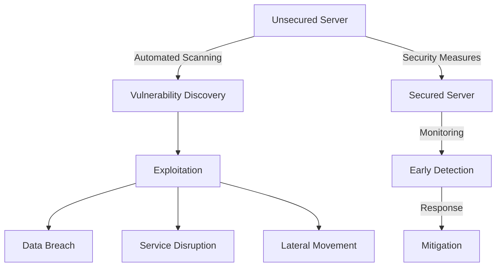

# Debian Server Security

## Introduction

Security is a critical aspect of server administration. A compromised server can lead to data breaches, service disruptions, and even be used to attack other systems. Debian, known for its stability and security focus, provides excellent tools to create a secure server environment. This guide will walk you through essential security practices for your Debian server.

## Why Server Security Matters

Server security is not optional—it's a necessity. Consider these facts:

- Servers are constantly targeted by automated scanning tools looking for vulnerabilities
- A single vulnerability can lead to complete system compromise
- Recovering from a security breach is far more difficult than preventing one
- You have ethical and potentially legal responsibilities to protect data



## Core Security Principles

Before diving into specific techniques, let's understand the key principles of server security:

1. **Principle of Least Privilege**: Only grant the minimum permissions necessary
2. **Defense in Depth**: Implement multiple layers of security
3. **Keep It Simple**: Complexity is the enemy of security
4. **Regular Updates**: Patching is your first line of defense
5. **Monitoring and Logging**: You can't protect what you don't observe

## Initial Server Hardening

### Updating Your System

Always start with a fully updated system:

```bash
# Update package lists
sudo apt update

# Upgrade all packages
sudo apt upgrade -y

# Perform distribution upgrade
sudo apt dist-upgrade -y

# Remove unused packages
sudo apt autoremove -y
```

### Creating a Non-Root User

Never use the root account for daily operations:

```bash
# Create a new user
sudo adduser username

# Add user to sudo group
sudo usermod -aG sudo username
```

### Securing SSH Access

SSH is often the primary entry point to your server. Securing it is critical:

```bash
# Edit SSH configuration
sudo nano /etc/ssh/sshd_config
```

Make these important changes:

```
# Disable root login
PermitRootLogin no

# Use SSH protocol 2
Protocol 2

# Disable password authentication (use keys instead)
PasswordAuthentication no

# Limit user access
AllowUsers username

# Change default port (optional but helpful)
Port 2222
```

After making changes, restart the SSH service:

```bash
sudo systemctl restart ssh
```

### Setting Up SSH Key Authentication

SSH keys are much more secure than passwords:

1. On your local machine, generate an SSH key pair:

```bash
ssh-keygen -t ed25519 -C "your_email@example.com"
```

2. Copy the public key to your server:

```bash
ssh-copy-id -i ~/.ssh/id_ed25519.pub username@server_ip
```

3. Now you can log in without a password:

```bash
ssh username@server_ip
```

## Implementing a Firewall

A firewall controls traffic to and from your server. Debian provides `ufw` (Uncomplicated Firewall) which simplifies iptables configuration.

```bash
# Install UFW
sudo apt install ufw

# Set default policies
sudo ufw default deny incoming
sudo ufw default allow outgoing

# Allow SSH (adjust port if you changed it)
sudo ufw allow 22/tcp

# Allow other necessary services (examples)
sudo ufw allow 80/tcp  # HTTP
sudo ufw allow 443/tcp # HTTPS

# Enable the firewall
sudo ufw enable

# Check status
sudo ufw status verbose
```

Example output:

```
Status: active
Logging: on (low)
Default: deny (incoming), allow (outgoing)
New profiles: skip

To                         Action      From
--                         ------      ----
22/tcp                     ALLOW IN    Anywhere
80/tcp                     ALLOW IN    Anywhere
443/tcp                    ALLOW IN    Anywhere
22/tcp (v6)                ALLOW IN    Anywhere (v6)
80/tcp (v6)                ALLOW IN    Anywhere (v6)
443/tcp (v6)               ALLOW IN    Anywhere (v6)
```

## Setting Up Fail2ban

Fail2ban protects against brute force attacks by temporarily banning IP addresses that show malicious behavior:

```bash
# Install Fail2ban
sudo apt install fail2ban

# Create a local configuration file
sudo cp /etc/fail2ban/jail.conf /etc/fail2ban/jail.local

# Edit the configuration
sudo nano /etc/fail2ban/jail.local
```

Configure SSH protection by adding or modifying:

```
[sshd]
enabled = true
port = ssh
filter = sshd
logpath = /var/log/auth.log
maxretry = 3
bantime = 3600
```

Start the service:

```bash
sudo systemctl enable fail2ban
sudo systemctl start fail2ban
```

Check its status:

```bash
sudo fail2ban-client status
```

## Securing Package Management

APT (Advanced Package Tool) is Debian's package manager. Ensure it's secure:

### Using HTTPS for Repository Access

```bash
# Install the required package
sudo apt install apt-transport-https

# Update sources to use HTTPS
sudo sed -i 's/http:/https:/g' /etc/apt/sources.list
```

### Verifying Package Integrity

```bash
# Update package lists
sudo apt update

# Install debsums for package verification
sudo apt install debsums

# Verify installed packages
sudo debsums -c
```

## Implementing Automatic Security Updates

Keep your system patched automatically with `unattended-upgrades`:

```bash
# Install the package
sudo apt install unattended-upgrades apt-listchanges

# Configure automatic updates
sudo dpkg-reconfigure -plow unattended-upgrades
```

Edit the configuration for more control:

```bash
sudo nano /etc/apt/apt.conf.d/50unattended-upgrades
```

Common settings to enable:

```
Unattended-Upgrade::Allowed-Origins {
    "${distro_id}:${distro_codename}";
    "${distro_id}:${distro_codename}-security";
    "${distro_id}ESMApps:${distro_codename}-apps-security";
    "${distro_id}ESM:${distro_codename}-infra-security";
};

// Automatically reboot if required
Unattended-Upgrade::Automatic-Reboot "true";
Unattended-Upgrade::Automatic-Reboot-Time "02:00";
```

## Securing the File System

### Setting Proper Permissions

Always ensure files have the minimum necessary permissions:

```bash
# Find files with improper permissions
sudo find /etc -type f -perm -o+w -exec ls -l {} \;

# Fix world-writable files
sudo find /etc -type f -perm -o+w -exec chmod o-w {} \;

# Fix files without owner
sudo find /var -nouser -o -nogroup -exec ls -l {} \;
```

### Mounting Partitions with Security Options

Edit your `/etc/fstab` file to include secure mount options:

```bash
sudo nano /etc/fstab
```

Add security options:

```
# Example for adding security options to / partition
UUID=your-uuid / ext4 defaults,nodev,nosuid,noexec 0 1
```

Common security mount options:
- `nodev`: Prevents device files on the partition
- `nosuid`: Prevents SUID/SGID binaries from executing
- `noexec`: Prevents execution of binaries on the partition

## Using AppArmor for Application Confinement

AppArmor is a Mandatory Access Control system that restricts program capabilities:

```bash
# Verify AppArmor is installed
sudo apt install apparmor apparmor-utils

# Check status
sudo aa-status

# Put AppArmor in enforce mode
sudo aa-enforce /etc/apparmor.d/*
```

Example of creating a custom AppArmor profile:

```bash
# Generate a profile for a specific application
sudo aa-genprof /usr/bin/program-name

# Test the profile
sudo aa-complain /etc/apparmor.d/usr.bin.program-name

# Once satisfied, enforce it
sudo aa-enforce /etc/apparmor.d/usr.bin.program-name
```

## Implementing System Auditing

### Setting Up Auditd

The Linux Audit system helps track security-relevant events:

```bash
# Install the audit system
sudo apt install auditd

# Start the service
sudo systemctl enable auditd
sudo systemctl start auditd
```

Create basic audit rules:

```bash
sudo nano /etc/audit/rules.d/audit.rules
```

Add security-focused rules:

```
# Monitor changes to authentication configuration
-w /etc/pam.d/ -p wa -k auth_changes
-w /etc/nsswitch.conf -p wa -k auth_changes

# Monitor system calls
-a always,exit -F arch=b64 -S execve -k exec_commands

# Monitor user/group modifications
-w /etc/group -p wa -k group_modification
-w /etc/passwd -p wa -k passwd_modification
-w /etc/shadow -p wa -k shadow_modification
```

Reload the rules:

```bash
sudo auditctl -R /etc/audit/rules.d/audit.rules
```

## Monitoring and Intrusion Detection

### Setting Up Rootkit Detection

```bash
# Install rkhunter
sudo apt install rkhunter

# Update its database
sudo rkhunter --update

# Perform a check
sudo rkhunter --check
```

### Implementing LogWatch

LogWatch provides daily reports summarizing system activity:

```bash
# Install LogWatch
sudo apt install logwatch

# Run manually
sudo logwatch --output mail --mailto your-email@example.com --detail high
```

Configure daily reports:

```bash
sudo nano /etc/cron.daily/00logwatch
```

## Network Security Hardening

### Disable Unused Network Protocols

```bash
# Create a sysctl configuration file
sudo nano /etc/sysctl.d/99-security.conf
```

Add these common hardening parameters:

```
# Prevent IP spoofing
net.ipv4.conf.all.rp_filter = 1
net.ipv4.conf.default.rp_filter = 1

# Disable IP forwarding
net.ipv4.ip_forward = 0

# Disable ICMP redirect acceptance
net.ipv4.conf.all.accept_redirects = 0
net.ipv4.conf.default.accept_redirects = 0
net.ipv6.conf.all.accept_redirects = 0
net.ipv6.conf.default.accept_redirects = 0

# Enable protection against SYN flood attacks
net.ipv4.tcp_syncookies = 1

# Ignore ICMP broadcast requests
net.ipv4.icmp_echo_ignore_broadcasts = 1

# Disable source routing
net.ipv4.conf.all.accept_source_route = 0
net.ipv4.conf.default.accept_source_route = 0
```

Apply the changes:

```bash
sudo sysctl -p /etc/sysctl.d/99-security.conf
```

## Regular Security Practices

### Creating a Security Checklist

Implement a regular security routine:

1. Run system updates weekly
2. Check system logs daily
3. Verify running services monthly
4. Conduct vulnerability scans quarterly
5. Review user accounts semi-annually
6. Test backups monthly

### Scanning for Vulnerabilities

```bash
# Install OpenVAS
sudo apt install openvas

# Set up the vulnerability scanner
sudo openvas-setup

# Start the scanner
sudo openvas-start
```

## Practical Example: Securing a Web Server

Let's apply our security principles to a Debian web server running Apache:

```bash
# Install Apache
sudo apt install apache2

# Remove server information
sudo nano /etc/apache2/conf-enabled/security.conf
```

Add or modify these lines:

```
ServerTokens Prod
ServerSignature Off
TraceEnable Off
```

Set up proper file permissions:

```bash
# Set ownership
sudo chown -R root:www-data /var/www/html/

# Set proper permissions
sudo find /var/www/html/ -type d -exec chmod 750 {} \;
sudo find /var/www/html/ -type f -exec chmod 640 {} \;
```

Enable ModSecurity (Web Application Firewall):

```bash
# Install ModSecurity
sudo apt install libapache2-mod-security2

# Enable it
sudo a2enmod security2

# Set up base rules
sudo cp /etc/modsecurity/modsecurity.conf-recommended /etc/modsecurity/modsecurity.conf

# Edit the configuration
sudo nano /etc/modsecurity/modsecurity.conf
```

Change the SecRuleEngine setting from DetectionOnly to On:

```
SecRuleEngine On
```

Restart Apache:

```bash
sudo systemctl restart apache2
```

## Summary

Securing a Debian server requires a multi-layered approach:

1. **Keep your system updated** - This is your first line of defense
2. **Implement proper authentication** - Use SSH keys, disable root login
3. **Control network access** - Configure firewalls, secure network settings
4. **Restrict permissions** - Apply the principle of least privilege
5. **Monitor and audit** - Set up logging and intrusion detection
6. **Automate security tasks** - Use tools like unattended-upgrades
7. **Test and verify** - Regularly check your security posture

Remember that security is an ongoing process, not a one-time setup. Regular maintenance and vigilance are essential to maintaining a secure server environment.

## Additional Resources

- [Debian Security Information](https://www.debian.org/security/)
- [Linux Server Hardening Guide](https://linuxsecurity.com/features/linux-security-guide)
- [CIS Benchmarks for Debian](https://www.cisecurity.org/benchmark/debian_linux/)

## Exercises

1. Set up a test Debian server and implement all the security measures discussed in this guide.
2. Create a custom security checklist for your specific server use case.
3. Configure auditd to monitor a specific directory for changes.
4. Set up automated security scans and email notifications.
5. Research and implement additional security measures not covered in this guide.