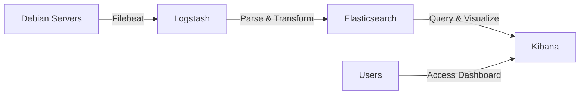

# Debian Server Monitoring

## Introduction

Server monitoring is a critical aspect of maintaining a healthy and efficient server infrastructure. For Debian servers, proper monitoring ensures that you can detect and resolve issues before they impact your services, optimize resource usage, and maintain security standards. This guide will walk you through the fundamentals of monitoring Debian servers, introduce essential monitoring tools, and provide practical examples to implement a comprehensive monitoring strategy.

Monitoring a Debian server involves tracking various system metrics including:

- CPU, memory, and disk usage
- Network traffic and connectivity
- Running processes and services
- System logs and error messages
- Security events and potential threats

By the end of this guide, you'll understand how to set up and configure monitoring tools specifically for Debian-based systems, interpret monitoring data, and take appropriate actions based on the information collected.

## Basic System Monitoring Commands

Before diving into specialized monitoring tools, let's explore some built-in commands that provide immediate insights into your Debian server's health.

### System Resource Monitoring

#### top Command

The `top` command provides a real-time, dynamic view of the running system:

```bash
top
```

Sample output:
```
top - 14:24:03 up 15 days, 2:42, 1 user, load average: 0.02, 0.04, 0.05
Tasks: 104 total,   1 running, 103 sleeping,   0 stopped,   0 zombie
%Cpu(s):  0.3 us,  0.3 sy,  0.0 ni, 99.3 id,  0.0 wa,  0.0 hi,  0.0 si,  0.0 st
MiB Mem :   3957.7 total,    159.1 free,   1736.5 used,   2062.1 buff/cache
MiB Swap:   2048.0 total,   2047.5 free,      0.5 used,   2062.1 avail Mem

  PID USER      PR  NI    VIRT    RES    SHR S  %CPU  %MEM     TIME+ COMMAND
 1831 www-data  20   0  715904 111656  39596 S   0.7   2.8   9:32.84 apache2
 1256 mysql     20   0 1635696 357832  33208 S   0.3   8.8  41:13.62 mysqld
    1 root      20   0  171620  13464   8276 S   0.0   0.3   1:07.10 systemd
```

Key information displayed:
- System uptime and load averages
- CPU usage breakdown
- Memory and swap usage
- Process information sorted by resource usage

#### htop - An Enhanced Alternative

`htop` is a more user-friendly and feature-rich alternative to `top`:

```bash
# Install htop if not already installed
sudo apt-get install htop

# Run htop
htop
```

`htop` offers color-coding, vertical and horizontal scrolling, and mouse operation for an improved monitoring experience.

### Disk Usage Monitoring

#### df Command

Check disk space usage of file systems:

```bash
df -h
```

Sample output:
```
Filesystem      Size  Used Avail Use% Mounted on
/dev/sda1        30G   15G   14G  52% /
/dev/sdb1       950G  320G  583G  36% /data
tmpfs           2.0G     0  2.0G   0% /run/user/1000
```

The `-h` flag displays sizes in human-readable format (GB, MB).

#### du Command

Analyze directory space usage:

```bash
# Check disk usage of a specific directory
du -sh /var/log

# List and sort largest directories
du -h /var | sort -rh | head -10
```

Sample output for `du -sh /var/log`:
```
156M    /var/log
```

### Network Monitoring

#### netstat Command

View network connections and listening ports:

```bash
# Show all listening ports and established connections
netstat -tuln

# Show process information for each connection
sudo netstat -tulnp
```

Sample output:
```
Proto Recv-Q Send-Q Local Address           Foreign Address         State       PID/Program name
tcp        0      0 0.0.0.0:22              0.0.0.0:*               LISTEN      1234/sshd
tcp        0      0 0.0.0.0:80              0.0.0.0:*               LISTEN      5678/apache2
tcp6       0      0 :::22                   :::*                    LISTEN      1234/sshd
tcp6       0      0 :::80                   :::*                    LISTEN      5678/apache2
```

#### iftop - Network Bandwidth Monitoring

`iftop` displays bandwidth usage on network interfaces:

```bash
# Install iftop
sudo apt-get install iftop

# Monitor bandwidth on default interface
sudo iftop

# Monitor specific interface
sudo iftop -i eth0
```

## Advanced Monitoring Solutions

While command-line tools provide immediate insights, a comprehensive monitoring strategy requires dedicated monitoring systems. Here are some popular options for Debian servers.

### Prometheus and Grafana

Prometheus is a powerful monitoring and alerting toolkit, while Grafana provides beautiful visualization dashboards. Together, they form a robust monitoring solution.

#### Installing Prometheus

```bash
# Create a user for Prometheus
sudo useradd --no-create-home --shell /bin/false prometheus

# Create directories
sudo mkdir /etc/prometheus
sudo mkdir /var/lib/prometheus

# Download Prometheus
wget https://github.com/prometheus/prometheus/releases/download/v2.37.0/prometheus-2.37.0.linux-amd64.tar.gz
tar xvf prometheus-2.37.0.linux-amd64.tar.gz

# Copy binaries
sudo cp prometheus-2.37.0.linux-amd64/prometheus /usr/local/bin/
sudo cp prometheus-2.37.0.linux-amd64/promtool /usr/local/bin/

# Set correct ownership
sudo chown prometheus:prometheus /usr/local/bin/prometheus
sudo chown prometheus:prometheus /usr/local/bin/promtool
sudo chown -R prometheus:prometheus /etc/prometheus
sudo chown prometheus:prometheus /var/lib/prometheus

# Configure Prometheus
sudo cp -r prometheus-2.37.0.linux-amd64/consoles /etc/prometheus
sudo cp -r prometheus-2.37.0.linux-amd64/console_libraries /etc/prometheus
sudo chown -R prometheus:prometheus /etc/prometheus/consoles
sudo chown -R prometheus:prometheus /etc/prometheus/console_libraries
```

Create a configuration file:

```bash
sudo nano /etc/prometheus/prometheus.yml
```

Add the following configuration:

```yaml
global:
  scrape_interval: 15s

scrape_configs:
  - job_name: 'prometheus'
    scrape_interval: 5s
    static_configs:
      - targets: ['localhost:9090']
  
  - job_name: 'node_exporter'
    scrape_interval: 5s
    static_configs:
      - targets: ['localhost:9100']
```

Create a systemd service file:

```bash
sudo nano /etc/systemd/system/prometheus.service
```

Add the following content:

```
[Unit]
Description=Prometheus
Wants=network-online.target
After=network-online.target

[Service]
User=prometheus
Group=prometheus
Type=simple
ExecStart=/usr/local/bin/prometheus \
    --config.file /etc/prometheus/prometheus.yml \
    --storage.tsdb.path /var/lib/prometheus/ \
    --web.console.templates=/etc/prometheus/consoles \
    --web.console.libraries=/etc/prometheus/console_libraries

[Install]
WantedBy=multi-user.target
```

Start and enable Prometheus:

```bash
sudo systemctl daemon-reload
sudo systemctl start prometheus
sudo systemctl enable prometheus
```

#### Installing Node Exporter

Node Exporter collects system metrics from the Debian server:

```bash
# Create a user for Node Exporter
sudo useradd --no-create-home --shell /bin/false node_exporter

# Download Node Exporter
wget https://github.com/prometheus/node_exporter/releases/download/v1.3.1/node_exporter-1.3.1.linux-amd64.tar.gz
tar xvf node_exporter-1.3.1.linux-amd64.tar.gz

# Copy binary
sudo cp node_exporter-1.3.1.linux-amd64/node_exporter /usr/local/bin/
sudo chown node_exporter:node_exporter /usr/local/bin/node_exporter

# Create systemd service
sudo nano /etc/systemd/system/node_exporter.service
```

Add the following content:

```
[Unit]
Description=Node Exporter
Wants=network-online.target
After=network-online.target

[Service]
User=node_exporter
Group=node_exporter
Type=simple
ExecStart=/usr/local/bin/node_exporter

[Install]
WantedBy=multi-user.target
```

Start and enable Node Exporter:

```bash
sudo systemctl daemon-reload
sudo systemctl start node_exporter
sudo systemctl enable node_exporter
```

#### Installing Grafana

```bash
# Add Grafana GPG key
wget -q -O - https://packages.grafana.com/gpg.key | sudo apt-key add -

# Add Grafana repository
echo "deb https://packages.grafana.com/oss/deb stable main" | sudo tee -a /etc/apt/sources.list.d/grafana.list

# Update package list and install Grafana
sudo apt-get update
sudo apt-get install grafana

# Start and enable Grafana service
sudo systemctl start grafana-server
sudo systemctl enable grafana-server
```

Access Grafana at http://your-server-ip:3000 (default credentials: admin/admin).

Configure Prometheus as a data source in Grafana:
1. Navigate to Configuration > Data Sources
2. Click "Add data source"
3. Select "Prometheus"
4. Set URL to http://localhost:9090
5. Click "Save & Test"

You can now create dashboards to visualize your Debian server metrics.

### Zabbix

Zabbix is an enterprise-class open-source monitoring solution suitable for monitoring servers, networks, and applications.

#### Installing Zabbix Server

```bash
# Add Zabbix repository
wget https://repo.zabbix.com/zabbix/6.0/debian/pool/main/z/zabbix-release/zabbix-release_6.0-4+debian11_all.deb
sudo dpkg -i zabbix-release_6.0-4+debian11_all.deb
sudo apt-get update

# Install Zabbix server, frontend, and agent
sudo apt-get install zabbix-server-mysql zabbix-frontend-php zabbix-apache-conf zabbix-sql-scripts zabbix-agent

# Install and configure MySQL (if not already installed)
sudo apt-get install mysql-server
sudo mysql_secure_installation

# Create database for Zabbix
sudo mysql -u root -p
```

In MySQL:

```sql
create database zabbix character set utf8mb4 collate utf8mb4_bin;
create user zabbix@localhost identified by 'password';
grant all privileges on zabbix.* to zabbix@localhost;
quit;
```

Import initial schema and data:

```bash
sudo zcat /usr/share/doc/zabbix-sql-scripts/mysql/server.sql.gz | mysql -u zabbix -p zabbix
```

Configure Zabbix server:

```bash
sudo nano /etc/zabbix/zabbix_server.conf
```

Update the following lines:

```
DBHost=localhost
DBName=zabbix
DBUser=zabbix
DBPassword=password
```

Start Zabbix services:

```bash
sudo systemctl restart zabbix-server zabbix-agent apache2
sudo systemctl enable zabbix-server zabbix-agent apache2
```

Access the Zabbix web interface at http://your-server-ip/zabbix and follow the setup wizard.

### Setting Up Monitoring with Monit

Monit is a lightweight monitoring and management tool that can monitor services, files, directories, and devices.

#### Installing Monit

```bash
sudo apt-get install monit
```

#### Basic Configuration

Edit the main configuration file:

```bash
sudo nano /etc/monit/monitrc
```

Configure basic settings:

```
set daemon 60            # Check services at 60-second intervals
set logfile /var/log/monit.log
set idfile /var/lib/monit/id
set statefile /var/lib/monit/state

set httpd port 2812      # Web interface
    allow admin:monit    # Username:password for web interface
```

#### Monitoring System Resources

Add system monitoring:

```
check system $HOST
    if loadavg (1min) > 4 then alert
    if loadavg (5min) > 2 then alert
    if memory usage > 75% then alert
    if swap usage > 25% then alert
    if cpu usage (user) > 70% then alert
    if cpu usage (system) > 30% then alert
    if cpu usage (wait) > 20% then alert
```

#### Monitoring a Service

To monitor a service like Apache:

```
check process apache with pidfile /var/run/apache2/apache2.pid
    start program = "/etc/init.d/apache2 start"
    stop program = "/etc/init.d/apache2 stop"
    if failed host 127.0.0.1 port 80 protocol http then restart
    if cpu > 60% for 2 cycles then alert
    if cpu > 80% for 5 cycles then restart
    if memory > 200 MB for 5 cycles then restart
    if 3 restarts within 5 cycles then timeout
```

Start and enable Monit:

```bash
sudo systemctl start monit
sudo systemctl enable monit
```

Access the web interface at http://your-server-ip:2812.

## Log Monitoring and Analysis

### Using logwatch

Logwatch is a customizable log analysis system that creates daily reports:

```bash
# Install logwatch
sudo apt-get install logwatch

# Generate a report for today
sudo logwatch --detail high --range today
```

### Centralized Logging with ELK Stack

For larger environments, consider implementing the ELK Stack (Elasticsearch, Logstash, Kibana) for centralized log management.

Here's a diagram showing the basic flow of logs in an ELK stack:



## Setting Up Alerting

Effective monitoring requires timely notifications when issues arise.

### Email Alerts with Prometheus Alertmanager

Create an alertmanager configuration file:

```bash
sudo nano /etc/prometheus/alertmanager.yml
```

Add the following configuration:

```yaml
global:
  smtp_smarthost: 'smtp.example.com:587'
  smtp_from: 'alertmanager@example.com'
  smtp_auth_username: 'username'
  smtp_auth_password: 'password'
  smtp_require_tls: true

route:
  group_by: ['alertname', 'instance', 'severity']
  group_wait: 30s
  group_interval: 5m
  repeat_interval: 1h
  receiver: 'email-notifications'

receivers:
- name: 'email-notifications'
  email_configs:
  - to: 'admin@example.com'
    send_resolved: true
```

Create alert rules:

```bash
sudo nano /etc/prometheus/alert_rules.yml
```

Define some alert rules:

```yaml
groups:
- name: example
  rules:
  - alert: HighCPULoad
    expr: 100 - (avg by(instance) (irate(node_cpu_seconds_total{mode="idle"}[5m])) * 100) > 80
    for: 5m
    labels:
      severity: warning
    annotations:
      summary: "High CPU load (instance {{ $labels.instance }})"
      description: "CPU load is > 80%
  VALUE = {{ $value }}
  LABELS: {{ $labels }}"
      
  - alert: HighMemoryLoad
    expr: (node_memory_MemTotal_bytes - node_memory_MemAvailable_bytes) / node_memory_MemTotal_bytes * 100 > 85
    for: 5m
    labels:
      severity: warning
    annotations:
      summary: "High memory load (instance {{ $labels.instance }})"
      description: "Memory load is > 85%
  VALUE = {{ $value }}
  LABELS: {{ $labels }}"
      
  - alert: LowDiskSpace
    expr: (node_filesystem_avail_bytes / node_filesystem_size_bytes) * 100 < 10
    for: 5m
    labels:
      severity: warning
    annotations:
      summary: "Low disk space (instance {{ $labels.instance }})"
      description: "Disk space is < 10%
  VALUE = {{ $value }}
  LABELS: {{ $labels }}"
```

Update the Prometheus configuration to include these files:

```bash
sudo nano /etc/prometheus/prometheus.yml
```

Add the following to the configuration:

```yaml
# Load rules once and periodically evaluate them according to the global 'evaluation_interval'.
rule_files:
  - alert_rules.yml

# Alertmanager configuration
alerting:
  alertmanagers:
  - static_configs:
    - targets:
      - localhost:9093
```

### SMS Alerts with Pushover

For critical alerts, you might want SMS notifications. Pushover is a service that can deliver notifications to mobile devices:

```bash
# Install curl if not already installed
sudo apt-get install curl

# Sample script to send Pushover notification
#!/bin/bash
TOKEN="your_app_token"
USER="your_user_key"
MESSAGE="$1"
TITLE="Server Alert"

curl -s \
  --form-string "token=$TOKEN" \
  --form-string "user=$USER" \
  --form-string "message=$MESSAGE" \
  --form-string "title=$TITLE" \
  https://api.pushover.net/1/messages.json
```

Save this script as `/usr/local/bin/send_alert.sh` and make it executable:

```bash
sudo chmod +x /usr/local/bin/send_alert.sh
```

You can then integrate this with your monitoring tools.

## Best Practices for Debian Server Monitoring

1. **Focus on key metrics**:
   - CPU, memory, disk usage and I/O
   - Network throughput and errors
   - Service availability and response time
   - Security events (login attempts, firewall logs)

2. **Set appropriate thresholds**:
   - Understand normal performance patterns before setting alert thresholds
   - Avoid alert fatigue by tuning thresholds appropriately
   - Implement different severity levels for alerts

3. **Implement redundancy**:
   - Use multiple monitoring methods for critical services
   - Ensure monitoring systems have their own resources

4. **Automate responses where appropriate**:
   - Create scripts to automatically restart failed services
   - Set up auto-scaling for predictable resource constraints

5. **Regular review and optimization**:
   - Periodically review monitoring configurations
   - Adjust thresholds based on system changes
   - Remove unnecessary monitors to reduce overhead

## Summary

Monitoring Debian servers is essential for maintaining reliable, secure, and efficient systems. We've covered a range of monitoring approaches from simple command-line tools to comprehensive solutions like Prometheus/Grafana and Zabbix.

Key takeaways:
- Start with basic system commands (`top`, `df`, `netstat`) for immediate insights
- Implement a dedicated monitoring solution for ongoing surveillance
- Configure alerts to be notified of issues before they impact users
- Follow monitoring best practices to optimize your approach

By implementing these monitoring strategies, you'll be better equipped to manage your Debian servers proactively, minimize downtime, and ensure optimal performance.

## Additional Resources

- [Debian System Administrator's Manual](https://www.debian.org/doc/manuals/debian-handbook/)
- [Prometheus Documentation](https://prometheus.io/docs/introduction/overview/)
- [Grafana Documentation](https://grafana.com/docs/grafana/latest/)
- [Zabbix Documentation](https://www.zabbix.com/documentation/current/en/manual/introduction)
- [Monit Documentation](https://mmonit.com/monit/documentation/)

## Exercises

1. Set up basic monitoring using `top`, `htop`, and `df` on your Debian server and interpret the output.
2. Install and configure Prometheus and Node Exporter to collect system metrics.
3. Create a Grafana dashboard that displays CPU, memory, disk, and network metrics.
4. Configure email alerts for when disk space drops below 15% free.
5. Write a shell script that checks critical services and sends notifications if they're down.
6. Implement log rotation and analysis for system logs using logwatch.
7. Design a monitoring strategy for a multi-server Debian environment.