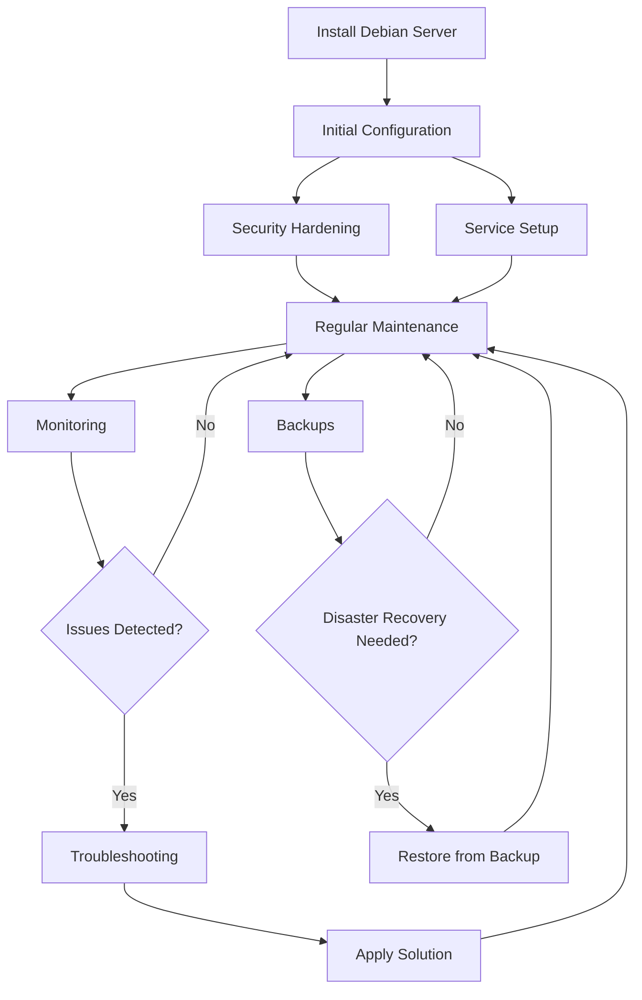

# Debian Server Management

## Introduction

Debian is one of the most stable and secure Linux distributions, making it an excellent choice for server deployments. Effective server management involves monitoring resources, managing services, maintaining security, and performing regular maintenance. This guide will walk you through the essential aspects of Debian server management, providing you with the knowledge to maintain a healthy, secure, and efficient server environment.

## Basic Server Administration

### Updating Your System

Keeping your Debian server updated is crucial for security and stability. Debian uses the APT (Advanced Package Tool) package management system.

```bash
# Update package lists
sudo apt update

# Upgrade installed packages
sudo apt upgrade

# Full distribution upgrade
sudo apt dist-upgrade
```

Output example:
```
Reading package lists... Done
Building dependency tree... Done
Reading state information... Done
Calculating upgrade... Done
The following packages will be upgraded:
  base-files linux-image-amd64 openssl
3 upgraded, 0 newly installed, 0 to remove and 0 not upgraded.
Need to get 8,456 kB of archives.
After this operation, 12.3 kB of additional disk space will be used.
Do you want to continue? [Y/n] 
```

It's recommended to set up automatic security updates:

```bash
# Install unattended-upgrades package
sudo apt install unattended-upgrades apt-listchanges

# Configure automatic updates
sudo dpkg-reconfigure -plow unattended-upgrades
```

### Managing Services with systemd

Debian uses systemd to manage system services. Here are essential commands:

```bash
# Check status of a service
sudo systemctl status apache2

# Start a service
sudo systemctl start apache2

# Stop a service
sudo systemctl stop apache2

# Restart a service
sudo systemctl restart apache2

# Enable a service to start at boot
sudo systemctl enable apache2

# Disable a service from starting at boot
sudo systemctl disable apache2
```

Service status output example:
```
● apache2.service - The Apache HTTP Server
     Loaded: loaded (/lib/systemd/system/apache2.service; enabled; vendor preset: enabled)
     Active: active (running) since Tue 2023-08-15 14:30:42 UTC; 2h 25min ago
       Docs: https://httpd.apache.org/docs/2.4/
   Main PID: 12345 (apache2)
      Tasks: 6 (limit: 4675)
     Memory: 24.2M
     CGroup: /system.slice/apache2.service
             ├─12345 /usr/sbin/apache2 -k start
             ├─12346 /usr/sbin/apache2 -k start
             ├─12347 /usr/sbin/apache2 -k start
             ├─12348 /usr/sbin/apache2 -k start
             ├─12349 /usr/sbin/apache2 -k start
             └─12350 /usr/sbin/apache2 -k start
```

### User Management

Managing users is a fundamental administrative task:

```bash
# Create a new user
sudo adduser username

# Add user to sudo group
sudo usermod -aG sudo username

# Switch to another user
su - username

# Change user password
sudo passwd username

# Delete a user
sudo deluser username

# Delete a user and their home directory
sudo deluser --remove-home username
```

## Monitoring Server Resources

### System Information and Resource Usage

Monitor system resources to ensure optimal performance:

```bash
# View system information
uname -a

# Check CPU information
lscpu

# Display memory usage
free -h

# Show disk usage
df -h

# Display running processes
ps aux

# See real-time process information
top
```

Example output of `free -h`:
```
              total        used        free      shared  buff/cache   available
Mem:          7.7Gi       1.2Gi       4.8Gi        11Mi       1.7Gi       6.2Gi
Swap:         2.0Gi          0B       2.0Gi
```

### Installing and Using htop

`htop` provides an improved interface over the standard `top` command:

```bash
# Install htop
sudo apt install htop

# Run htop
htop
```

### Monitoring with Netdata

Netdata is a powerful, real-time performance monitoring solution:

```bash
# Install dependencies
sudo apt install zlib1g-dev uuid-dev libuv1-dev liblz4-dev libjudy-dev libssl-dev libmnl-dev gcc make git autoconf autoconf-archive autogen automake pkg-config curl

# Clone Netdata repository
git clone https://github.com/netdata/netdata.git --depth=100

# Install Netdata
cd netdata
sudo ./netdata-installer.sh
```

After installation, access Netdata dashboard by navigating to `http://your-server-ip:19999` in your web browser.

## Log Management

### Understanding Debian Logs

Logs provide valuable information about system events and issues:

```bash
# View system logs
sudo journalctl

# View logs for a specific service
sudo journalctl -u apache2

# View logs since a specific time
sudo journalctl --since "2023-08-15 14:00:00"

# Follow logs in real-time
sudo journalctl -f
```

Important log files in Debian:

- `/var/log/syslog`: General system logs
- `/var/log/auth.log`: Authentication logs
- `/var/log/kern.log`: Kernel logs
- `/var/log/apache2/`: Apache web server logs
- `/var/log/mysql/`: MySQL database logs

### Log Rotation with logrotate

`logrotate` helps manage log files to prevent them from growing too large:

```bash
# Check logrotate configuration
cat /etc/logrotate.conf

# Create a custom log rotation configuration
sudo nano /etc/logrotate.d/custom-logs
```

Example logrotate configuration:
```
/var/log/custom-application/*.log {
    daily
    missingok
    rotate 14
    compress
    delaycompress
    notifempty
    create 640 root adm
    sharedscripts
    postrotate
        systemctl reload custom-application
    endscript
}
```

## Backup and Recovery

### Setting Up Basic Backups

Regular backups are essential for disaster recovery:

```bash
# Install rsync
sudo apt install rsync

# Backup important directories
sudo rsync -av --delete /path/to/source/ /path/to/backup/

# Schedule backups with cron
sudo crontab -e
```

Example cron entry for daily backups at 2 AM:
```
0 2 * * * rsync -av --delete /var/www/ /mnt/backup/www/
```

### Using Timeshift for System Snapshots

Timeshift creates system snapshots for easy recovery:

```bash
# Install Timeshift
sudo apt install timeshift

# Create a snapshot
sudo timeshift --create --comments "Before major update"

# List available snapshots
sudo timeshift --list

# Restore a snapshot
sudo timeshift --restore --snapshot '2023-08-15_02-00-01'
```

## Security Management

### Configuring the Firewall with UFW

Uncomplicated Firewall (UFW) simplifies firewall management:

```bash
# Install UFW
sudo apt install ufw

# Check UFW status
sudo ufw status

# Enable UFW
sudo ufw enable

# Allow SSH connections
sudo ufw allow ssh

# Allow web traffic
sudo ufw allow 80/tcp
sudo ufw allow 443/tcp

# Deny a specific IP address
sudo ufw deny from 192.168.1.100

# Delete a rule
sudo ufw delete allow 80/tcp
```

### Fail2Ban for Intrusion Prevention

Fail2Ban protects against brute force attacks:

```bash
# Install Fail2Ban
sudo apt install fail2ban

# Create a local configuration
sudo cp /etc/fail2ban/jail.conf /etc/fail2ban/jail.local
sudo nano /etc/fail2ban/jail.local
```

Example Fail2Ban configuration for SSH:
```
[sshd]
enabled = true
port = ssh
filter = sshd
logpath = /var/log/auth.log
maxretry = 5
bantime = 3600
```

After configuration:
```bash
# Restart Fail2Ban
sudo systemctl restart fail2ban

# Check Fail2Ban status
sudo fail2ban-client status

# Check specific jail status
sudo fail2ban-client status sshd
```

### Keeping Your System Secure

Security best practices:

```bash
# Check for rootkits
sudo apt install rkhunter
sudo rkhunter --check

# Scan for vulnerabilities
sudo apt install lynis
sudo lynis audit system
```

## Advanced Server Management

### Setting Up Cron Jobs

Cron allows you to schedule tasks:

```bash
# Edit crontab for current user
crontab -e

# Edit crontab for another user
sudo crontab -u username -e
```

Cron format: `minute hour day-of-month month day-of-week command`

Example crontab entries:
```
# Run a script every day at 3:30 AM
30 3 * * * /path/to/script.sh

# Run a command every Monday at 2:00 PM
0 14 * * 1 /path/to/command

# Run a backup every 6 hours
0 */6 * * * rsync -av /source/ /backup/
```

### Remote Server Management with SSH

Secure Shell (SSH) is essential for remote administration:

```bash
# Connect to a remote server
ssh username@server_ip

# Use a specific identity file
ssh -i /path/to/private_key username@server_ip

# Create SSH key pair
ssh-keygen -t ed25519 -C "your_email@example.com"

# Copy SSH key to remote server
ssh-copy-id username@server_ip
```

For improved SSH security, edit `/etc/ssh/sshd_config`:
```
# Disable password authentication
PasswordAuthentication no

# Disable root login
PermitRootLogin no

# Use a non-standard port
Port 2222
```

After making changes:
```bash
# Restart SSH service
sudo systemctl restart ssh
```

### Server Performance Tuning

Optimize your server for better performance:

```bash
# Check current I/O scheduler
cat /sys/block/sda/queue/scheduler

# Set I/O scheduler
echo 'deadline' | sudo tee /sys/block/sda/queue/scheduler

# Adjust swappiness (lower values prefer RAM over swap)
echo 'vm.swappiness=10' | sudo tee -a /etc/sysctl.conf

# Apply sysctl changes
sudo sysctl -p
```

## Automation with Ansible

Ansible allows for infrastructure as code and automation:

```bash
# Install Ansible
sudo apt install ansible

# Create inventory file
sudo nano /etc/ansible/hosts
```

Example inventory file:
```
[webservers]
web1 ansible_host=192.168.1.101
web2 ansible_host=192.168.1.102

[dbservers]
db1 ansible_host=192.168.1.201
```

Create a simple playbook:
```yaml
# update_servers.yml
---
- hosts: all
  become: yes
  tasks:
    - name: Update apt cache
      apt:
        update_cache: yes

    - name: Upgrade all packages
      apt:
        upgrade: dist
```

Run the playbook:
```bash
ansible-playbook update_servers.yml
```

## Container Management with Docker

Docker simplifies application deployment:

```bash
# Install Docker
sudo apt install docker.io

# Start and enable Docker
sudo systemctl start docker
sudo systemctl enable docker

# Add current user to docker group
sudo usermod -aG docker $USER

# Pull a Docker image
docker pull nginx

# Run a container
docker run -d -p 80:80 --name webserver nginx

# List running containers
docker ps

# Stop a container
docker stop webserver

# Remove a container
docker rm webserver
```

## Server Workflow Visualization

Here's a typical server management workflow:



## Summary

Effective Debian server management requires a combination of regular maintenance, security practices, monitoring, and automation. By following the guidelines in this guide, you'll be able to:

- Keep your server updated and secure
- Monitor resources effectively
- Manage services efficiently
- Set up proper backup and recovery procedures
- Implement security best practices
- Automate repetitive tasks

These skills form the foundation of professional server administration and will help ensure your Debian servers run reliably and securely.

## Additional Resources

To continue learning about Debian server management, consider exploring:

- The official [Debian Administrator's Handbook](https://debian-handbook.info/)
- The [Debian Wiki](https://wiki.debian.org/)
- [Linux System Administration](https://www.linuxfoundation.org/blog/blog/classic-sysadmin-getting-started-with-linux-system-administration)

## Exercises

1. Set up a basic LAMP (Linux, Apache, MySQL, PHP) stack on a Debian server.
2. Configure a regular backup system using rsync and cron.
3. Create a firewall configuration that allows only necessary services.
4. Set up fail2ban to protect SSH and other services.
5. Create a simple monitoring dashboard using Netdata.
6. Write an Ansible playbook to automate the setup of a new Debian web server.