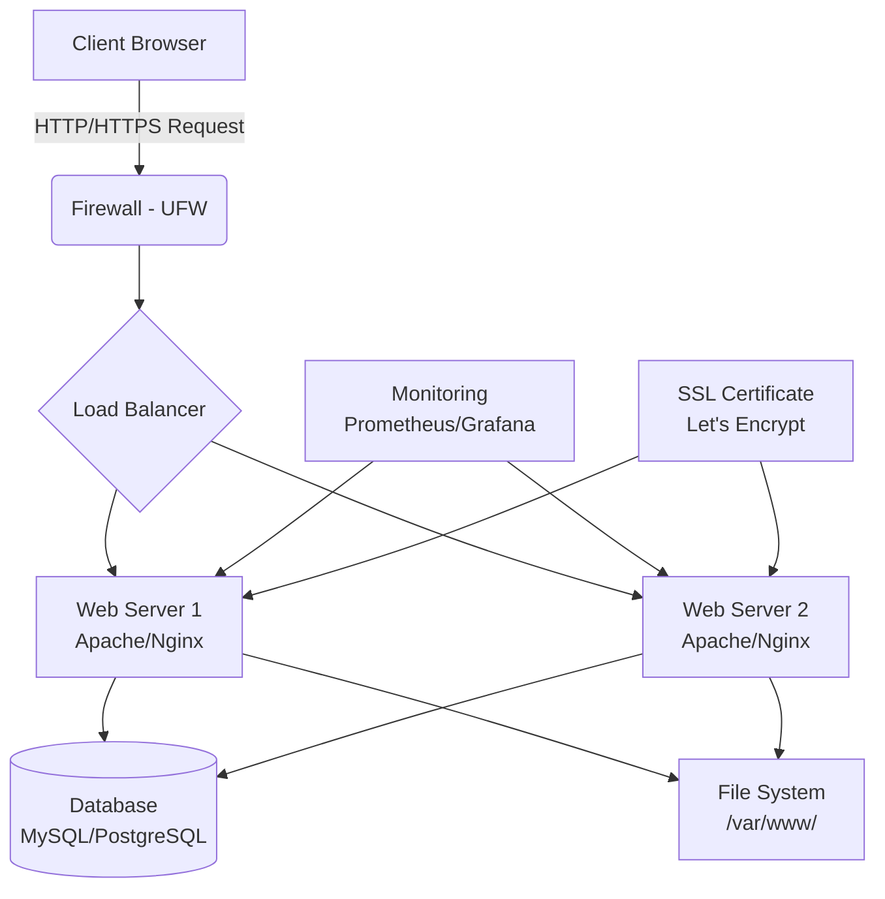

# Debian Web Servers

## Introduction

Web servers are essential software components that enable your Debian system to deliver web content over the internet. They receive HTTP requests from clients (typically web browsers) and respond with the requested resources, such as HTML pages, images, or application data. Setting up a web server on Debian is a fundamental skill for anyone interested in web development, system administration, or hosting their own applications.

In this guide, we'll explore how to install, configure, and secure popular web servers on Debian. We'll focus primarily on Apache and Nginx, the two most widely used web server solutions in the Debian ecosystem.

## Why Debian for Web Servers?

Debian provides an excellent platform for web servers due to its:

- Stability and reliability
- Strong security focus and regular updates
- Extensive package repository
- Conservative approach to software updates
- Well-documented configuration standards
- Low resource requirements
- Large community support

## Apache Web Server

Apache HTTP Server (commonly referred to as "Apache") is the most widely used web server software in the world. It's known for its flexibility, power, and extensive module system.

### Installing Apache on Debian

Let's start by installing Apache:

```bash
# Update package lists
sudo apt update

# Install Apache
sudo apt install apache2

# Start Apache and enable on boot
sudo systemctl start apache2
sudo systemctl enable apache2

# Check status
sudo systemctl status apache2
```

After installation, Apache will be running and serving the default welcome page. You can verify this by opening a web browser and navigating to `http://localhost` or your server's IP address.

### Apache Directory Structure

Understanding Apache's directory structure is crucial:

```
/etc/apache2/              # Main configuration directory
├── apache2.conf          # Main configuration file
├── sites-available/      # Site configurations (not active until enabled)
├── sites-enabled/        # Symlinks to enabled site configurations
├── mods-available/       # Available modules
├── mods-enabled/         # Enabled modules
├── conf-available/       # Available configurations
└── conf-enabled/         # Enabled configurations
```

The default web content is stored in `/var/www/html/`.

### Creating a Virtual Host

Virtual hosts allow you to host multiple websites on a single Apache server. Here's how to create one:

1. Create a directory for your site:

```bash
sudo mkdir -p /var/www/example.com/public_html
```

2. Set ownership:

```bash
sudo chown -R www-data:www-data /var/www/example.com
```

3. Create a virtual host configuration file:

```bash
sudo nano /etc/apache2/sites-available/example.com.conf
```

4. Add the following configuration:

```apache
<VirtualHost *:80>
    ServerAdmin webmaster@example.com
    ServerName example.com
    ServerAlias www.example.com
    DocumentRoot /var/www/example.com/public_html
    
    ErrorLog ${APACHE_LOG_DIR}/example.com_error.log
    CustomLog ${APACHE_LOG_DIR}/example.com_access.log combined
    
    <Directory /var/www/example.com/public_html>
        Options Indexes FollowSymLinks
        AllowOverride All
        Require all granted
    </Directory>
</VirtualHost>
```

5. Enable the site and restart Apache:

```bash
sudo a2ensite example.com.conf
sudo systemctl reload apache2
```

### Common Apache Modules

Apache's modular architecture allows you to extend functionality. Here are some essential modules:

```bash
# Enable mod_rewrite for URL rewriting
sudo a2enmod rewrite

# Enable SSL for HTTPS
sudo a2enmod ssl

# Enable headers module for security headers
sudo a2enmod headers

# Restart Apache after enabling modules
sudo systemctl restart apache2
```

## Nginx Web Server

Nginx (pronounced "engine-x") is known for its high performance, stability, rich feature set, and low resource consumption. It's particularly good at serving static content and acting as a reverse proxy.

### Installing Nginx on Debian

To install Nginx:

```bash
# Update package lists
sudo apt update

# Install Nginx
sudo apt install nginx

# Start Nginx and enable on boot
sudo systemctl start nginx
sudo systemctl enable nginx

# Check status
sudo systemctl status nginx
```

After installation, Nginx will be running and serving the default welcome page. Verify by visiting `http://localhost` or your server's IP.

### Nginx Directory Structure

Key directories and files for Nginx:

```
/etc/nginx/                 # Main configuration directory
├── nginx.conf             # Main configuration file
├── sites-available/       # Site configurations
├── sites-enabled/         # Symlinks to enabled site configurations
└── conf.d/                # Additional configuration files
```

The default web content is stored in `/var/www/html/`.

### Creating a Server Block (Virtual Host)

The equivalent of Apache's virtual hosts in Nginx are called server blocks:

1. Create a directory for your site:

```bash
sudo mkdir -p /var/www/example.com/html
```

2. Set ownership:

```bash
sudo chown -R www-data:www-data /var/www/example.com
```

3. Create a server block configuration:

```bash
sudo nano /etc/nginx/sites-available/example.com
```

4. Add the following configuration:

```nginx
server {
    listen 80;
    listen [::]:80;
    
    root /var/www/example.com/html;
    index index.html index.htm index.php;
    
    server_name example.com www.example.com;
    
    location / {
        try_files $uri $uri/ =404;
    }
    
    # Additional configuration for PHP (if needed)
    location ~ \.php$ {
        include snippets/fastcgi-php.conf;
        fastcgi_pass unix:/var/run/php/php7.4-fpm.sock;
    }
    
    # Deny access to .htaccess files
    location ~ /\.ht {
        deny all;
    }
}
```

5. Enable the site and restart Nginx:

```bash
sudo ln -s /etc/nginx/sites-available/example.com /etc/nginx/sites-enabled/
sudo systemctl reload nginx
```

## Web Server Security

Securing your web server is crucial to protect your applications and data.

### Basic Security Measures

1. Keep your system updated:

```bash
sudo apt update && sudo apt upgrade
```

2. Use a firewall (UFW - Uncomplicated Firewall):

```bash
sudo apt install ufw
sudo ufw allow 80/tcp
sudo ufw allow 443/tcp
sudo ufw allow 22/tcp  # SSH
sudo ufw enable
```

3. Install and configure fail2ban to protect against brute force attacks:

```bash
sudo apt install fail2ban
sudo systemctl enable fail2ban
sudo systemctl start fail2ban
```

### SSL/TLS Configuration

Enabling HTTPS is essential for secure communications. Let's use Certbot with Let's Encrypt:

#### For Apache:

```bash
# Install Certbot and Apache plugin
sudo apt install certbot python3-certbot-apache

# Obtain and install certificate
sudo certbot --apache -d example.com -d www.example.com
```

#### For Nginx:

```bash
# Install Certbot and Nginx plugin
sudo apt install certbot python3-certbot-nginx

# Obtain and install certificate
sudo certbot --nginx -d example.com -d www.example.com
```

### Security Headers

Adding security headers helps protect against various attacks:

#### For Apache:

Add to your VirtualHost configuration:

```apache
<IfModule mod_headers.c>
    Header always set X-Frame-Options "SAMEORIGIN"
    Header always set X-Content-Type-Options "nosniff"
    Header always set X-XSS-Protection "1; mode=block"
    Header always set Referrer-Policy "strict-origin-when-cross-origin"
    Header always set Content-Security-Policy "default-src 'self';"
</IfModule>
```

#### For Nginx:

Add to your server block:

```nginx
add_header X-Frame-Options "SAMEORIGIN" always;
add_header X-Content-Type-Options "nosniff" always;
add_header X-XSS-Protection "1; mode=block" always;
add_header Referrer-Policy "strict-origin-when-cross-origin" always;
add_header Content-Security-Policy "default-src 'self';" always;
```

## Web Server Performance Tuning

### Apache Performance Tuning

1. Switch to MPM Event:

```bash
sudo a2dismod mpm_prefork
sudo a2enmod mpm_event
```

2. Edit MPM Event configuration:

```bash
sudo nano /etc/apache2/mods-available/mpm_event.conf
```

Adjust these parameters based on your server resources:

```apache
<IfModule mpm_event_module>
    StartServers             2
    MinSpareThreads         25
    MaxSpareThreads         75
    ThreadLimit             64
    ThreadsPerChild         25
    MaxRequestWorkers      150
    MaxConnectionsPerChild   0
</IfModule>
```

### Nginx Performance Tuning

Edit the main configuration file:

```bash
sudo nano /etc/nginx/nginx.conf
```

Adjust these settings based on your server:

```nginx
worker_processes auto;
worker_rlimit_nofile 65535;

events {
    worker_connections 1024;
    multi_accept on;
    use epoll;
}

http {
    sendfile on;
    tcp_nopush on;
    tcp_nodelay on;
    keepalive_timeout 65;
    types_hash_max_size 2048;
    server_tokens off;
    
    # ... other settings ...
}
```

## Monitoring Web Servers

### Using GoAccess for Real-time Monitoring

GoAccess is a useful tool for real-time web log analysis:

```bash
# Install GoAccess
sudo apt install goaccess

# For Apache, analyze logs in terminal
sudo goaccess /var/log/apache2/access.log -c

# For Nginx
sudo goaccess /var/log/nginx/access.log -c
```

### Setting Up Monitoring with Prometheus and Grafana

1. Install Prometheus Node Exporter:

```bash
sudo apt install prometheus-node-exporter
```

2. For Apache, install the Apache Exporter:

```bash
# Download and extract Apache Exporter
wget https://github.com/Lusitaniae/apache_exporter/releases/download/v0.8.0/apache_exporter-0.8.0.linux-amd64.tar.gz
tar xvfz apache_exporter-0.8.0.linux-amd64.tar.gz
cd apache_exporter-0.8.0.linux-amd64/

# Run the exporter
./apache_exporter --scrape_uri=http://localhost/server-status?auto
```

3. For Nginx, install the Nginx Exporter.

## Web Server Architecture Diagram

Here's a visual representation of a typical Debian web server setup:



## Comparison: Apache vs. Nginx

| Feature               | Apache                          | Nginx                         |
|-----------------------|---------------------------------|-------------------------------|
| **Performance**       | Good for dynamic content        | Excellent for static content  |
| **Resource Usage**    | Higher memory usage             | Lower memory footprint        |
| **Scalability**       | Good                            | Excellent                     |
| **Configuration**     | More complex, .htaccess support | Simpler, no .htaccess         |
| **Modules**           | Dynamic loading                 | Static compilation            |
| **Platform Support**  | Excellent                       | Good                          |
| **Community Support** | Very large                      | Large and growing             |
| **Use Case**          | Dynamic content, shared hosting | Static content, reverse proxy |

## Practical Exercise: Setting Up a LAMP Stack

A LAMP (Linux, Apache, MySQL, PHP) stack is a common web server setup. Here's how to implement it:

1. Install Apache (already covered)

2. Install MySQL:

```bash
# Install MySQL
sudo apt install mysql-server

# Secure the installation
sudo mysql_secure_installation
```

3. Install PHP:

```bash
# Install PHP and necessary modules
sudo apt install php libapache2-mod-php php-mysql

# Restart Apache
sudo systemctl restart apache2
```

4. Create a test PHP file:

```bash
# Create info.php
sudo nano /var/www/html/info.php
```

Add this content:

```php
<?php
phpinfo();
?>
```

5. Test by visiting `http://your-server-ip/info.php`

## Summary

In this guide, we've covered:

- Installing and configuring Apache and Nginx web servers on Debian
- Setting up virtual hosts/server blocks
- Implementing SSL/TLS for secure communications
- Adding security headers and basic security measures
- Performance tuning for both web servers
- Monitoring solutions
- A practical LAMP stack implementation

Web servers are fundamental components of modern web infrastructure. Whether you choose Apache or Nginx depends on your specific requirements, but both offer robust solutions for hosting web applications on Debian systems.

## Additional Resources

### Books
- "Apache Cookbook" by Rich Bowen and Ken Coar
- "Nginx HTTP Server" by Clément Nedelcu

### Online Documentation
- [Debian Wiki - Apache](https://wiki.debian.org/Apache)
- [Debian Wiki - Nginx](https://wiki.debian.org/Nginx)
- [Apache Documentation](https://httpd.apache.org/docs/)
- [Nginx Documentation](https://nginx.org/en/docs/)

### Exercises

1. Set up a virtual host in both Apache and Nginx and compare the performance.
2. Configure a reverse proxy with Nginx to serve an application running on another port.
3. Implement rate limiting in Nginx to protect against DDoS attacks.
4. Configure a web application firewall (ModSecurity) for Apache.
5. Set up HTTP/2 support for both Apache and Nginx.