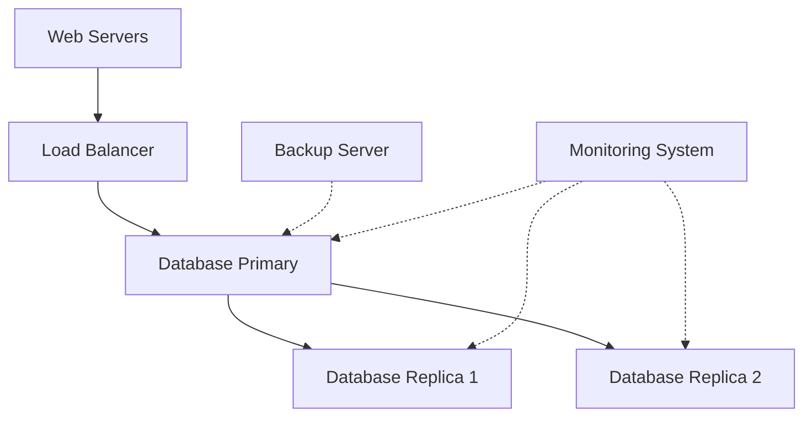

# Debian Database Servers

## Introduction

Database servers are essential components of modern web applications and information systems. They provide structured storage, efficient data retrieval, and ensure data integrity across applications. Debian, with its stability and robust package management, is an excellent choice for hosting database servers in production environments.

In this guide, we'll explore how to set up, configure, and manage popular database servers on Debian. Whether you're building a personal project or preparing for enterprise deployment, understanding database servers on Debian will provide you with valuable skills for your development journey.

## Common Database Servers for Debian

Debian supports various database management systems through its package repositories. Here are the most commonly used options:

1. **MySQL/MariaDB** - Relational database management systems popular for web applications
2. **PostgreSQL** - Advanced open-source relational database with strong standards compliance
3. **SQLite** - Lightweight, file-based database ideal for embedded applications
4. **MongoDB** - Document-oriented NoSQL database for flexible data models
5. **Redis** - In-memory key-value store often used for caching and real-time applications

Let's explore how to set up and use the most popular ones.

## Setting Up MySQL/MariaDB on Debian

MariaDB is a community-developed fork of MySQL and is the default in Debian repositories. It offers drop-in replacement functionality for MySQL with enhanced features.

### Installation

```bash
# Update package lists
sudo apt update

# Install MariaDB server
sudo apt install mariadb-server
```

After installation, the MariaDB service starts automatically. You can verify its status:

```bash
sudo systemctl status mariadb
```

Output:
```
● mariadb.service - MariaDB 10.5.15 database server
     Loaded: loaded (/lib/systemd/system/mariadb.service; enabled; vendor preset: enabled)
     Active: active (running) since Fri 2023-07-14 15:30:22 UTC; 5s ago
       Docs: man:mariadbd(8)
             https://mariadb.com/kb/en/library/systemd/
    Process: 3326 ExecStartPre=/usr/bin/install -m 755 -o mysql -g root -d /var/run/mysqld (code=exited, status=0/SUCCESS)
    Process: 3327 ExecStartPre=/bin/sh -c systemctl unset-environment _WSREP_START_POSITION (code=exited, status=0/SUCCESS)
    Process: 3329 ExecStartPre=/bin/sh -c [ ! -e /usr/bin/galera_recovery ] && VAR= ||   VAR=`cd /usr/bin/..; /usr/bin/galera_recovery`; [ $? -eq 0 ]   && systemctl set-environment _WSREP_START_POSITION=$VAR || exit 1 (code=exited, status=0/SUCCESS)
    Process: 3393 ExecStartPost=/bin/sh -c systemctl unset-environment _WSREP_START_POSITION (code=exited, status=0/SUCCESS)
    Process: 3395 ExecStartPost=/etc/mysql/debian-start (code=exited, status=0/SUCCESS)
   Main PID: 3350 (mariadbd)
     Status: "Taking your SQL requests now..."
      Tasks: 8 (limit: 4653)
     Memory: 65.8M
        CPU: 335ms
     CGroup: /system.slice/mariadb.service
             └─3350 /usr/sbin/mariadbd
```

### Securing Your MariaDB Installation

Run the security script to set a root password and remove insecure defaults:

```bash
sudo mysql_secure_installation
```

Follow the prompts to:
- Set a root password
- Remove anonymous users
- Disallow root login remotely
- Remove test database
- Reload privilege tables

### Creating a Database and User

Log in to MariaDB as root:

```bash
sudo mysql -u root -p
```

Create a database and user with appropriate permissions:

```sql
-- Create a new database
CREATE DATABASE mywebapp;

-- Create a new user with password
CREATE USER 'webuser'@'localhost' IDENTIFIED BY 'password';

-- Grant privileges to the user for the database
GRANT ALL PRIVILEGES ON mywebapp.* TO 'webuser'@'localhost';

-- Apply changes
FLUSH PRIVILEGES;

-- Exit
EXIT;
```

### Basic Database Operations

Connect to the database with your new user:

```bash
mysql -u webuser -p mywebapp
```

Create a table:

```sql
CREATE TABLE users (
    id INT AUTO_INCREMENT PRIMARY KEY,
    username VARCHAR(50) NOT NULL UNIQUE,
    email VARCHAR(100) NOT NULL,
    created_at TIMESTAMP DEFAULT CURRENT_TIMESTAMP
);
```

Insert data:

```sql
INSERT INTO users (username, email) VALUES ('john_doe', 'john@example.com');
INSERT INTO users (username, email) VALUES ('jane_smith', 'jane@example.com');
```

Query data:

```sql
SELECT * FROM users;
```

Output:
```
+----+------------+------------------+---------------------+
| id | username   | email            | created_at          |
+----+------------+------------------+---------------------+
|  1 | john_doe   | john@example.com | 2023-07-14 15:45:22 |
|  2 | jane_smith | jane@example.com | 2023-07-14 15:45:30 |
+----+------------+------------------+---------------------+
2 rows in set (0.00 sec)
```

### Configuring MySQL/MariaDB

The main configuration file is located at `/etc/mysql/mariadb.conf.d/50-server.cnf`. Common settings to adjust include:

```
[mysqld]
# Basic Settings
bind-address            = 127.0.0.1  # Change to server IP or 0.0.0.0 for remote access
port                    = 3306
max_connections         = 100
connect_timeout         = 5

# InnoDB Settings
innodb_buffer_pool_size = 256M       # Adjust based on available RAM
```

After changing configuration, restart the service:

```bash
sudo systemctl restart mariadb
```

## Setting Up PostgreSQL on Debian

PostgreSQL is a powerful, open-source object-relational database system with a strong reputation for reliability, feature robustness, and performance.

### Installation

```bash
# Update package lists
sudo apt update

# Install PostgreSQL
sudo apt install postgresql postgresql-contrib
```

The service starts automatically. Verify the status:

```bash
sudo systemctl status postgresql
```

### Basic PostgreSQL Administration

PostgreSQL uses a different user management approach than MySQL. It creates a system user called `postgres` during installation.

Switch to the postgres user and access the PostgreSQL prompt:

```bash
sudo -i -u postgres
psql
```

### Creating a Database and User

```sql
-- Create a database
CREATE DATABASE myappdb;

-- Create a user with password
CREATE USER webuser WITH ENCRYPTED PASSWORD 'password';

-- Grant privileges
GRANT ALL PRIVILEGES ON DATABASE myappdb TO webuser;

-- Exit
\q
```

Return to your regular user:

```bash
exit
```

### Connecting to Your Database

```bash
psql -h localhost -U webuser -d myappdb
```

### Basic PostgreSQL Operations

Create a table:

```sql
CREATE TABLE customers (
    id SERIAL PRIMARY KEY,
    name VARCHAR(100) NOT NULL,
    email VARCHAR(100) UNIQUE NOT NULL,
    created_at TIMESTAMP DEFAULT CURRENT_TIMESTAMP
);
```

Insert data:

```sql
INSERT INTO customers (name, email) VALUES ('Alice Johnson', 'alice@example.com');
INSERT INTO customers (name, email) VALUES ('Bob Williams', 'bob@example.com');
```

Query data:

```sql
SELECT * FROM customers;
```

Output:
```
 id |     name     |      email       |         created_at
----+--------------+------------------+----------------------------
  1 | Alice Johnson | alice@example.com | 2023-07-14 16:12:45.123456
  2 | Bob Williams  | bob@example.com   | 2023-07-14 16:12:58.234567
(2 rows)
```

### Configuring PostgreSQL

Main configuration files:
- `/etc/postgresql/13/main/postgresql.conf` - General settings
- `/etc/postgresql/13/main/pg_hba.conf` - Client authentication

Important settings in `postgresql.conf`:

```
listen_addresses = 'localhost'     # Change to '*' for all interfaces
max_connections = 100
shared_buffers = 128MB             # Adjust based on available RAM
```

After changing configuration, restart PostgreSQL:

```bash
sudo systemctl restart postgresql
```

## Database Backup and Recovery

Regular backups are essential for any production database. Here's how to back up and restore your databases.

### MySQL/MariaDB Backup

Create a full backup:

```bash
# Backup a specific database
mysqldump -u root -p mywebapp > mywebapp_backup.sql

# Backup all databases
mysqldump -u root -p --all-databases > all_databases_backup.sql
```

Restore from backup:

```bash
# Restore a database
mysql -u root -p mywebapp < mywebapp_backup.sql
```

### PostgreSQL Backup

Create a backup:

```bash
# Backup a specific database
pg_dump -U postgres -d myappdb > myappdb_backup.sql

# Backup all databases
pg_dumpall -U postgres > all_postgres_backup.sql
```

Restore from backup:

```bash
# Restore a database
psql -U postgres -d myappdb < myappdb_backup.sql
```

## Database Monitoring and Maintenance

Regular maintenance ensures optimal database performance and reliability.

### MySQL/MariaDB Maintenance

Check database status:

```bash
mysqladmin -u root -p status
```

Output:
```
Uptime: 12345  Threads: 5  Questions: 234  Slow queries: 0  Opens: 21  Flush tables: 1  Open tables: 14  Queries per second avg: 0.018
```

Optimize tables:

```bash
mysqlcheck -u root -p --optimize --all-databases
```

### PostgreSQL Maintenance

Analyze database statistics:

```bash
sudo -u postgres vacuumdb --analyze --all
```

## Database Architecture for Web Applications

A typical web application database setup on Debian might look like this:



This architecture provides:
- High availability through replication
- Read scalability by directing read queries to replicas
- Backup strategy for disaster recovery
- Monitoring for performance and issue detection

## Real-World Example: Setting Up a WordPress Database

WordPress is a popular content management system that uses MySQL/MariaDB. Here's how to set up a database for it:

```bash
# Create database
sudo mysql -u root -p
```

```sql
CREATE DATABASE wordpress;
CREATE USER 'wpuser'@'localhost' IDENTIFIED BY 'secure_password';
GRANT ALL PRIVILEGES ON wordpress.* TO 'wpuser'@'localhost';
FLUSH PRIVILEGES;
EXIT;
```

Edit your WordPress configuration to use these settings:

```php
// In wp-config.php
define('DB_NAME', 'wordpress');
define('DB_USER', 'wpuser');
define('DB_PASSWORD', 'secure_password');
define('DB_HOST', 'localhost');
```

## Summary

In this guide, we've covered:

1. The importance of database servers in web applications
2. Setting up and configuring MySQL/MariaDB on Debian
3. Installing and managing PostgreSQL on Debian
4. Basic database operations for both systems
5. Backup and recovery procedures
6. Monitoring and maintenance tasks
7. Database architecture for production environments
8. A real-world WordPress database setup example

Debian provides a stable and secure platform for running database servers, making it ideal for both development and production environments. By understanding the fundamentals covered here, you're well-equipped to start working with databases for your applications.

## Additional Resources and Exercises

### Resources
- [Official MariaDB Documentation](https://mariadb.org/documentation/)
- [PostgreSQL Official Documentation](https://www.postgresql.org/docs/)
- [Debian Wiki: Database](https://wiki.debian.org/Database)

### Exercises

1. **Basic Database Exercise**
   Set up a MariaDB database for a simple blog with tables for posts, users, and comments.

2. **Database Optimization Exercise**
   Create a large test table (100,000+ rows) and practice optimizing queries using indexes.

3. **Replication Exercise**
   Configure a master-slave replication setup with two MariaDB instances on the same Debian server.

4. **Backup Automation Exercise**
   Create a cron job that automatically backs up your database daily and keeps the last 7 days of backups.

5. **Database Migration Exercise**
   Practice migrating a database from MySQL to PostgreSQL using appropriate tools.