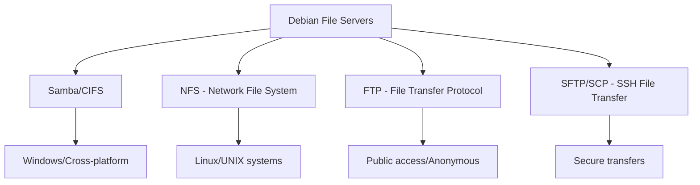

# Debian File Servers

## Introduction

File servers are essential components in any network environment, allowing users to share, store, and access files from various devices. In this guide, we'll explore how to set up and configure different types of file servers on Debian Linux, one of the most stable and reliable server platforms available.

A file server centralizes file storage and provides controlled access to multiple users across a network. Whether you're setting up a home media server, a small business file sharing system, or an enterprise-level storage solution, Debian provides robust tools to meet your needs.

## Types of File Servers on Debian

Debian supports several file sharing protocols, each with its own advantages and use cases:



Let's explore each of these options in detail.

## Setting Up Samba for Windows-Compatible File Sharing

Samba implements the SMB/CIFS protocol used by Windows, making it perfect for mixed environments.

### Installation

First, let's install the necessary packages:

```bash
sudo apt update
sudo apt install samba samba-common-bin
```

### Basic Configuration

The main Samba configuration file is located at `/etc/samba/smb.conf`. Here's a basic configuration to create a shared folder:

1. Back up the original configuration:

```bash
sudo cp /etc/samba/smb.conf /etc/samba/smb.conf.bak
```

2. Edit the configuration file:

```bash
sudo nano /etc/samba/smb.conf
```

3. Add the following basic configuration:

```ini
[global]
   workgroup = WORKGROUP
   server string = Debian File Server
   log file = /var/log/samba/log.%m
   max log size = 1000
   logging = file
   map to guest = bad user
   security = user

[SharedFolder]
   comment = Public Shared Folder
   path = /srv/samba/shared
   browsable = yes
   guest ok = yes
   read only = no
   create mask = 0755
```

4. Create the directory and set permissions:

```bash
sudo mkdir -p /srv/samba/shared
sudo chmod 777 /srv/samba/shared
```

5. Restart Samba to apply the changes:

```bash
sudo systemctl restart smbd nmbd
```

### Creating Samba Users

To restrict access to specific users:

```bash
sudo smbpasswd -a username
```

This command creates a Samba user that matches an existing system user.

### Accessing Samba Shares

From a Windows computer:
- Open File Explorer
- In the address bar, type `\\server-ip-address`

From a Linux machine:
```bash
# Temporarily mount the share
sudo mount -t cifs //server-ip-address/SharedFolder /mnt/samba -o username=sambauser

# Or add to /etc/fstab for persistent mounting
echo "//server-ip-address/SharedFolder /mnt/samba cifs username=sambauser,password=password 0 0" | sudo tee -a /etc/fstab
```

## NFS for Linux/UNIX File Sharing

NFS (Network File System) is perfect for Linux-to-Linux file sharing with better performance and UNIX permissions support.

### Installation

```bash
sudo apt update
sudo apt install nfs-kernel-server
```

### Configuration

1. Create a directory to share:

```bash
sudo mkdir -p /srv/nfs/shared
sudo chown nobody:nogroup /srv/nfs/shared
sudo chmod 777 /srv/nfs/shared
```

2. Edit the exports file:

```bash
sudo nano /etc/exports
```

3. Add the following line to share the directory:

```
/srv/nfs/shared 192.168.1.0/24(rw,sync,no_subtree_check)
```

This will allow access from any device on the 192.168.1.0/24 subnet.

4. Apply the changes and restart the NFS server:

```bash
sudo exportfs -a
sudo systemctl restart nfs-kernel-server
```

### Accessing NFS Shares

From another Linux machine:

```bash
# Create a mount point
sudo mkdir -p /mnt/nfs

# Mount the share temporarily
sudo mount -t nfs server-ip-address:/srv/nfs/shared /mnt/nfs

# For permanent mounting, add to /etc/fstab
echo "server-ip-address:/srv/nfs/shared /mnt/nfs nfs defaults 0 0" | sudo tee -a /etc/fstab
```

## FTP Server Setup

FTP is a traditional protocol for file transfers that's widely supported.

### Installing and Configuring vsftpd

1. Install the FTP server package:

```bash
sudo apt update
sudo apt install vsftpd
```

2. Backup the original configuration:

```bash
sudo cp /etc/vsftpd.conf /etc/vsftpd.conf.bak
```

3. Edit the configuration file:

```bash
sudo nano /etc/vsftpd.conf
```

4. Configure the following settings:

```ini
listen=YES
anonymous_enable=NO
local_enable=YES
write_enable=YES
local_umask=022
dirmessage_enable=YES
use_localtime=YES
xferlog_enable=YES
connect_from_port_20=YES
chroot_local_user=YES
secure_chroot_dir=/var/run/vsftpd/empty
pam_service_name=vsftpd
ssl_enable=NO
```

5. Restart the FTP server:

```bash
sudo systemctl restart vsftpd
```

### Accessing FTP

Users can access the FTP server using various clients:

- Command line: `ftp server-ip-address`
- File managers: Most file managers support FTP via addresses like `ftp://username@server-ip-address`
- Dedicated FTP clients like FileZilla

## Secure File Transfer with SFTP

SFTP uses SSH for secure file transfers and is included by default in most Debian installations.

### Configuration

1. Edit the SSH configuration file:

```bash
sudo nano /etc/ssh/sshd_config
```

2. Ensure the following line is uncommented:

```
Subsystem sftp /usr/lib/openssh/sftp-server
```

3. Restart the SSH service:

```bash
sudo systemctl restart sshd
```

### Creating a Dedicated SFTP User

To restrict a user to SFTP only without SSH access:

1. Create a new group:

```bash
sudo groupadd sftpusers
```

2. Create a user and add them to the group:

```bash
sudo useradd -m sftpuser -g sftpusers
sudo passwd sftpuser
```

3. Configure SSH to restrict this user:

```bash
sudo nano /etc/ssh/sshd_config
```

4. Add the following at the end:

```
Match Group sftpusers
    ChrootDirectory /home/%u
    ForceCommand internal-sftp
    AllowTcpForwarding no
    X11Forwarding no
```

5. Restart SSH:

```bash
sudo systemctl restart sshd
```

### Accessing SFTP

Users can connect via:

```bash
sftp username@server-ip-address
```

Or using graphical clients that support SFTP.

## File Server Security Best Practices

Regardless of the protocol you choose, here are some important security considerations:

1. **Firewall Configuration**: Allow only necessary ports:
   - Samba: 139, 445
   - NFS: 2049
   - FTP: 21, 20
   - SFTP: 22

   Example using UFW (Uncomplicated Firewall):

   ```bash
   sudo apt install ufw
   sudo ufw allow ssh
   sudo ufw allow samba  # Or the specific ports
   sudo ufw enable
   ```

2. **Regular Updates**:

   ```bash
   sudo apt update
   sudo apt upgrade
   ```

3. **Use Strong Authentication**: 
   - Disable guest access when possible
   - Use complex passwords
   - Consider key-based authentication for SFTP

4. **Encrypted Transfers**:
   - Use SFTP instead of FTP when possible
   - Consider configuring FTPS (FTP with SSL/TLS)

## Performance Tuning

For high-traffic file servers, consider these optimizations:

### Samba Performance

```bash
sudo nano /etc/samba/smb.conf
```

Add these parameters to the `[global]` section:

```ini
socket options = TCP_NODELAY IPTOS_LOWDELAY
read raw = yes
write raw = yes
oplocks = yes
max xmit = 65535
dead time = 15
getwd cache = yes
```

### NFS Performance

```bash
sudo nano /etc/nfs.conf
```

Modify the following options:

```ini
[nfsd]
threads=8
```

Increase the number of threads based on your server's CPU cores.

## Monitoring Your File Server

### Installing Monitoring Tools

```bash
sudo apt install sysstat iotop
```

### Checking Server Activity

```bash
# Check disk I/O
sudo iotop

# Check general system statistics
sar -u 1 10

# Monitor Samba connections
smbstatus

# Monitor NFS statistics
nfsstat
```

## Real-World Example: Media Server Setup

Let's create a complete media server configuration using Samba that allows sharing videos, music, and photos:

1. Install Samba:

```bash
sudo apt update
sudo apt install samba
```

2. Create directories for different media types:

```bash
sudo mkdir -p /srv/media/{videos,music,photos}
sudo chmod -R 775 /srv/media
sudo chown -R nobody:nogroup /srv/media
```

3. Configure Samba for media sharing:

```bash
sudo nano /etc/samba/smb.conf
```

Add the following configurations:

```ini
[global]
   workgroup = WORKGROUP
   server string = Debian Media Server
   netbios name = MEDIASERVER
   security = user
   map to guest = bad user
   dns proxy = no

[Videos]
   path = /srv/media/videos
   browsable = yes
   writable = yes
   guest ok = no
   valid users = @mediagroup
   create mask = 0775
   directory mask = 0775

[Music]
   path = /srv/media/music
   browsable = yes
   writable = yes
   guest ok = no
   valid users = @mediagroup
   create mask = 0775
   directory mask = 0775

[Photos]
   path = /srv/media/photos
   browsable = yes
   writable = yes
   guest ok = no
   valid users = @mediagroup
   create mask = 0775
   directory mask = 0775
```

4. Create a user group and add users:

```bash
sudo groupadd mediagroup
sudo useradd -m mediauser -G mediagroup
sudo smbpasswd -a mediauser
```

5. Restart Samba:

```bash
sudo systemctl restart smbd nmbd
```

## Summary

In this guide, we've explored various file server options available on Debian systems:

1. **Samba/CIFS** for Windows-compatible file sharing
2. **NFS** for efficient Linux/UNIX file sharing
3. **FTP** for traditional file transfer capabilities
4. **SFTP** for secure file transfers

Each solution has its strengths and ideal use cases:
- Use Samba when you need Windows compatibility
- Choose NFS for Linux-to-Linux sharing with better performance
- Select FTP for broad compatibility with legacy systems
- Implement SFTP when security is a priority

By understanding these different protocols and their configurations, you can select the right file server solution for your specific needs, whether for home, small business, or enterprise use.

## Additional Resources

For further learning, consider exploring:

- Advanced authentication methods like LDAP integration
- High-availability file server clustering
- Backup strategies for file servers
- Quota management for user storage

## Exercises

1. Set up a Samba server with two shares: one public (read-only) and one private (authenticated).
2. Configure an NFS server that exports different directories with different permissions.
3. Create a secure SFTP server with chroot jails for three different user groups.
4. Set up a hybrid file server that offers the same directories via multiple protocols (Samba, NFS, and SFTP).
5. Implement and test a backup solution for your file server.