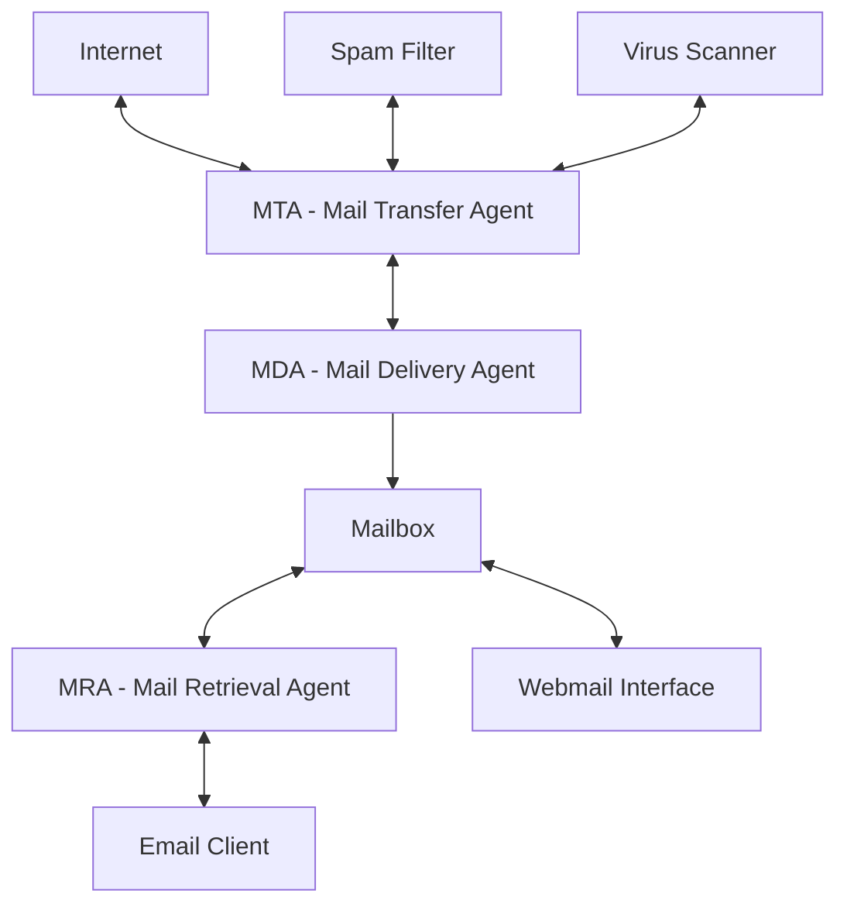

# Debian Mail Servers

## Introduction

Email remains one of the most critical communication services on the internet. Setting up your own mail server gives you complete control over your email infrastructure, allowing for customization, privacy, and independence from third-party providers. Debian, with its stability and security focus, provides an excellent platform for hosting mail servers.

In this guide, we'll explore how to set up a complete mail server solution on Debian, using industry-standard software like Postfix (SMTP server) and Dovecot (IMAP/POP3 server). We'll also cover spam filtering with SpamAssassin and webmail access with Roundcube.

## Prerequisites

Before beginning, you should have:

- A Debian server (Debian 11 "Bullseye" or newer recommended)
- A domain name with proper DNS records (MX, A, and PTR records)
- Basic Linux command line knowledge
- Root or sudo access to your server
- A static IP address (strongly recommended)

## Understanding Email Server Components

A complete mail server system typically consists of several components working together:



- **MTA (Mail Transfer Agent)**: Handles sending and receiving emails between servers using SMTP protocol (we'll use Postfix)
- **MDA (Mail Delivery Agent)**: Delivers received emails to the appropriate mailbox
- **MRA (Mail Retrieval Agent)**: Allows users to retrieve their emails using IMAP or POP3 protocols (we'll use Dovecot)
- **Webmail**: Provides web-based access to emails (we'll use Roundcube)
- **Spam/Virus Filters**: Help protect your server from unwanted emails (we'll use SpamAssassin)

## Setting Up Postfix: The SMTP Server

Postfix is a powerful and secure MTA that handles sending and receiving emails.

### Installation

Let's start by installing Postfix:

```bash
sudo apt update
sudo apt install postfix
```

During installation, you'll be prompted to select a configuration type. Choose "Internet Site" and enter your fully qualified domain name (FQDN) when asked.

### Basic Configuration

The main Postfix configuration file is located at `/etc/postfix/main.cf`. Let's modify it with some basic settings:

```bash
sudo nano /etc/postfix/main.cf
```

Here's a minimal configuration to get you started:

```
# Basic configuration
myhostname = mail.yourdomain.com
mydomain = yourdomain.com
myorigin = $mydomain
mydestination = $myhostname, localhost.$mydomain, localhost, $mydomain
mynetworks = 127.0.0.0/8 [::ffff:127.0.0.0]/104 [::1]/128
inet_interfaces = all
inet_protocols = all

# Mail directories
mail_owner = postfix
mailbox_size_limit = 0
recipient_delimiter = +
home_mailbox = Maildir/

# TLS parameters
smtpd_tls_cert_file = /etc/ssl/certs/ssl-cert-snakeoil.pem
smtpd_tls_key_file = /etc/ssl/private/ssl-cert-snakeoil.key
smtpd_tls_security_level = may
smtp_tls_security_level = may
```

For production use, you should replace the self-signed certificates with proper ones, ideally from Let's Encrypt.

After editing, restart Postfix:

```bash
sudo systemctl restart postfix
```

### Testing Postfix

To test if Postfix is working correctly, you can send a test email from the command line:

```bash
echo "This is a test email sent from my Debian mail server." | mail -s "Test Email" you@example.com
```

Check your logs for any errors:

```bash
sudo tail -f /var/log/mail.log
```

## Setting Up Dovecot: The IMAP/POP3 Server

Dovecot allows users to retrieve their emails using IMAP or POP3 protocols.

### Installation

Install Dovecot with:

```bash
sudo apt install dovecot-imapd dovecot-pop3d
```

### Basic Configuration

The main Dovecot configuration is split across several files in the `/etc/dovecot/` directory. Let's modify some key settings:

1. First, edit the main configuration file:

```bash
sudo nano /etc/dovecot/dovecot.conf
```

Make sure the protocols are enabled:

```
protocols = imap pop3
```

2. Next, configure mail locations:

```bash
sudo nano /etc/dovecot/conf.d/10-mail.conf
```

Set the mail location to match Postfix:

```
mail_location = maildir:~/Maildir
```

3. Configure authentication:

```bash
sudo nano /etc/dovecot/conf.d/10-auth.conf
```

Enable plaintext authentication (disable this if you only use SSL/TLS):

```
disable_plaintext_auth = no
auth_mechanisms = plain login
```

4. Finally, configure SSL/TLS:

```bash
sudo nano /etc/dovecot/conf.d/10-ssl.conf
```

Set up the SSL parameters:

```
ssl = yes
ssl_cert = </etc/ssl/certs/ssl-cert-snakeoil.pem
ssl_key = </etc/ssl/private/ssl-cert-snakeoil.key
```

Again, replace these with proper certificates for production use.

Restart Dovecot to apply changes:

```bash
sudo systemctl restart dovecot
```

## Implementing User Authentication

For a mail server, you'll need to manage users who can send and receive emails.

### System Users Method

The simplest approach is to use Debian system users. Create a new user with:

```bash
sudo adduser email_user
```

This user will automatically be able to receive emails at `email_user@yourdomain.com`.

### Virtual Users Method (More Advanced)

For larger deployments, using virtual users with a database like MySQL or PostgreSQL is more flexible. This setup is more complex and involves:

1. Installing additional packages:

```bash
sudo apt install postfix-mysql dovecot-mysql mariadb-server
```

2. Creating a database and tables for users and domains
3. Configuring Postfix and Dovecot to use this database

This advanced setup is beyond the scope of our basic guide, but it's worth considering for production environments.

## Setting Up SpamAssassin for Spam Filtering

SpamAssassin helps filter out unwanted spam emails.

### Installation

Install SpamAssassin with:

```bash
sudo apt install spamassassin spamc
```

### Configuration

1. Enable the SpamAssassin service:

```bash
sudo systemctl enable spamassassin
sudo systemctl start spamassassin
```

2. Configure Postfix to use SpamAssassin by editing `/etc/postfix/master.cf`:

```bash
sudo nano /etc/postfix/master.cf
```

Add this content at the end of the file:

```
# SpamAssassin integration
spamassassin unix -     n       n       -       -       pipe
  user=debian-spamd argv=/usr/bin/spamc -f -e /usr/sbin/sendmail -oi -f ${sender} ${recipient}

localhost:10025 inet n  -       n       -       -       smtpd
  -o content_filter=
  -o receive_override_options=no_unknown_recipient_checks,no_header_body_checks
  -o smtpd_helo_restrictions=
  -o smtpd_client_restrictions=
  -o smtpd_sender_restrictions=
  -o smtpd_recipient_restrictions=permit_mynetworks,reject
  -o mynetworks=127.0.0.0/8
  -o smtpd_authorized_xforward_hosts=127.0.0.0/8
```

3. Modify the Postfix main configuration:

```bash
sudo nano /etc/postfix/main.cf
```

Add this line at the end:

```
content_filter = spamassassin
```

4. Restart services:

```bash
sudo systemctl restart postfix spamassassin
```

## Installing Roundcube Webmail

Roundcube provides a web interface for accessing emails.

### Installation

Install Roundcube with:

```bash
sudo apt install roundcube roundcube-mysql
```

During installation, you'll be prompted to configure the database. Follow the instructions to set up the MySQL database.

### Web Server Configuration

If you're using Apache (installed with `sudo apt install apache2`), create a configuration file:

```bash
sudo nano /etc/apache2/conf-available/roundcube.conf
```

Add:

```
Alias /webmail /var/lib/roundcube

<Directory /var/lib/roundcube>
    Options -FollowSymLinks
    <IfModule mod_php.c>
        php_flag register_globals Off
        php_flag magic_quotes_gpc Off
        php_flag magic_quotes_runtime Off
        php_flag allow_url_fopen Off
        php_flag display_errors Off
        php_value post_max_size 20M
        php_value upload_max_filesize 20M
    </IfModule>
</Directory>
```

Enable the configuration:

```bash
sudo a2enconf roundcube
sudo systemctl reload apache2
```

Now you can access Roundcube at `http://your-server-ip/webmail` or `http://your-domain/webmail`.

## Securing Your Mail Server

Security is critical for mail servers. Here are some important measures:

### 1. Set Up DKIM, SPF, and DMARC

These DNS records help prevent email spoofing:

#### SPF (Sender Policy Framework)

Add an SPF record to your domain's DNS:

```
TXT @ "v=spf1 mx a ip4:YOUR_SERVER_IP -all"
```

#### DKIM (DomainKeys Identified Mail)

Install OpenDKIM:

```bash
sudo apt install opendkim opendkim-tools
```

Configure it by following the documentation and add the generated DKIM record to your DNS.

#### DMARC (Domain-based Message Authentication, Reporting & Conformance)

Add a DMARC record to your domain's DNS:

```
_dmarc TXT "v=DMARC1; p=none; rua=mailto:admin@yourdomain.com"
```

### 2. Use Proper SSL/TLS Certificates

Replace the self-signed certificates with proper ones from Let's Encrypt:

```bash
sudo apt install certbot
sudo certbot certonly --standalone -d mail.yourdomain.com
```

Then update your Postfix and Dovecot configurations to use these certificates.

### 3. Implement Firewall Rules

Allow only the necessary ports:

```bash
sudo apt install ufw
sudo ufw allow 22/tcp   # SSH
sudo ufw allow 25/tcp   # SMTP
sudo ufw allow 465/tcp  # SMTPS
sudo ufw allow 587/tcp  # Submission
sudo ufw allow 110/tcp  # POP3
sudo ufw allow 995/tcp  # POP3S
sudo ufw allow 143/tcp  # IMAP
sudo ufw allow 993/tcp  # IMAPS
sudo ufw allow 80/tcp   # HTTP (for webmail)
sudo ufw allow 443/tcp  # HTTPS (for webmail)
sudo ufw enable
```

## Troubleshooting Common Issues

Here are solutions to common mail server problems:

### Emails Are Not Being Sent/Received

Check your mail logs:

```bash
sudo tail -f /var/log/mail.log
```

Verify that your DNS records are correctly set up (MX, A, PTR).

### Authentication Failures

Check Dovecot authentication logs:

```bash
sudo tail -f /var/log/dovecot.log
```

Ensure that user permissions are set correctly for the mailbox directories.

### Emails Are Being Marked as Spam

Implement proper SPF, DKIM, and DMARC records as mentioned in the security section.

Ensure your server has a proper reverse DNS (PTR) record.

## Maintenance and Monitoring

Regular maintenance is essential for a healthy mail server:

### Regular Updates

Keep your system and mail server software updated:

```bash
sudo apt update
sudo apt upgrade
```

### Monitoring Tools

Consider installing monitoring tools like:

```bash
sudo apt install logwatch fail2ban
```

Logwatch will send you daily reports, while Fail2ban helps prevent brute force attacks.

## Summary

In this guide, we've covered:

1. Setting up Postfix as an SMTP server to send and receive emails
2. Configuring Dovecot for IMAP/POP3 access to mailboxes
3. Implementing SpamAssassin for spam filtering
4. Installing Roundcube for webmail access
5. Securing your mail server with proper configuration and DNS records
6. Troubleshooting common issues
7. Maintaining and monitoring your mail server

Running your own mail server on Debian provides flexibility, privacy, and control over your email infrastructure. While the setup requires careful attention to detail, the rewards of having your own mail server are significant, especially for businesses or privacy-conscious individuals.

## Additional Resources

For further learning:

- [Postfix Documentation](http://www.postfix.org/documentation.html)
- [Dovecot Documentation](https://doc.dovecot.org/)
- [SpamAssassin Wiki](https://wiki.apache.org/spamassassin/)
- [Roundcube Webmail Documentation](https://github.com/roundcube/roundcubemail/wiki)

## Exercises

1. Set up a test mail server in a virtual machine or container.
2. Configure Postfix to relay through another SMTP server when sending emails to external domains.
3. Implement virtual domains to host emails for multiple domains on a single server.
4. Set up email aliases for forwarding emails to different addresses.
5. Configure server-side email filtering using Sieve scripts in Dovecot.