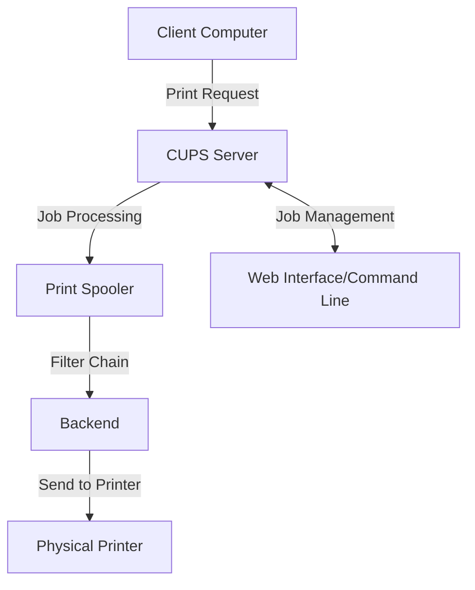

# Debian Print Servers

## Introduction

A print server is a system that connects printers to client computers over a network. In Debian, the Common Unix Printing System (CUPS) serves as the primary printing solution, allowing you to share printers with multiple users and manage print jobs efficiently. Setting up a Debian print server enables centralized printer management, reduces hardware costs, and simplifies maintenance across your organization.

In this guide, you'll learn how to:
- Install and configure CUPS on Debian
- Add and manage printers 
- Configure printer sharing across your network
- Manage print jobs and user permissions
- Troubleshoot common printing issues

## Prerequisites

Before setting up your Debian print server, ensure you have:

- A Debian system (this guide uses Debian 11 "Bullseye" or newer)
- Root or sudo access to the server
- A printer connected to your Debian system or accessible over the network
- Basic knowledge of Linux command line
- A network with client computers that need printing capabilities

## Installing CUPS

CUPS (Common Unix Printing System) is the standard printing system used on Debian and most Linux distributions. Let's install it:

```bash
# Update package lists
sudo apt update

# Install CUPS and recommended packages
sudo apt install cups cups-client cups-bsd cups-filters
```

After installation, CUPS starts automatically. You can verify its status with:

```bash
sudo systemctl status cups
```

You should see output indicating that the service is active:

```
● cups.service - CUPS Scheduler
     Loaded: loaded (/lib/systemd/system/cups.service; enabled; vendor preset: enabled)
     Active: active (running) since Mon 2023-02-20 15:30:45 UTC; 12s ago
       Docs: man:cupsd(8)
   Main PID: 12345 (cupsd)
      Tasks: 1 (limit: 4915)
     Memory: 2.3M
        CPU: 67ms
     CGroup: /system.slice/cups.service
             └─12345 /usr/sbin/cupsd -l
```

## Configuring CUPS for Network Access

By default, CUPS only listens on localhost. To make it accessible over the network, we need to modify its configuration:

1. Open the CUPS configuration file:

```bash
sudo nano /etc/cups/cupsd.conf
```

2. Find the "Listen" directive and add your server's IP address or listen on all interfaces:

```
# Listen on all interfaces on port 631
Listen *:631

# Or specify a particular IP address
# Listen 192.168.1.100:631
```

3. Find the `<Location />` section and modify it to allow access from your network:

```
<Location />
  Order allow,deny
  Allow @LOCAL
  Allow from 192.168.1.0/24  # Replace with your network
</Location>
```

4. Apply similar changes to other `<Location>` sections:

```
<Location /admin>
  Order allow,deny
  Allow @LOCAL
  Allow from 192.168.1.0/24  # Replace with your network
  AuthType Default
  Require valid-user
</Location>

<Location /admin/conf>
  Order allow,deny
  Allow @LOCAL
  Allow from 192.168.1.0/24  # Replace with your network
  AuthType Default
  Require valid-user
</Location>
```

5. Save the file and restart CUPS:

```bash
sudo systemctl restart cups
```

## Configuring Firewall (if applicable)

If you have a firewall enabled, you'll need to allow traffic on port 631 (the default CUPS port):

```bash
# For UFW
sudo ufw allow 631/tcp
sudo ufw allow 631/udp

# For iptables
sudo iptables -A INPUT -p tcp --dport 631 -j ACCEPT
sudo iptables -A INPUT -p udp --dport 631 -j ACCEPT
```

## Adding Printers to CUPS

You can add printers through the web interface or command line:

### Using the Web Interface

1. Access the CUPS web interface at: `http://your-server-ip:631/admin`
2. Log in with a user who has sudo privileges (not the root user)
3. Click "Add Printer"
4. Follow the wizard to select your printer connection, model, and default settings

### Using the Command Line

For local USB printers, you can use the `lpadmin` command:

```bash
# List available printers
lpinfo -v

# Add a printer (example for a USB printer)
sudo lpadmin -p MyPrinter -E -v usb://Brother/HL-L2340D -m everywhere
```

For network printers:

```bash
# Add a network printer using its IP
sudo lpadmin -p NetworkPrinter -E -v ipp://192.168.1.200/ipp/print -m everywhere
```

The `-m everywhere` option uses the driverless printing feature. For printers that need specific drivers, you'll need to specify the correct PPD file:

```bash
# List available drivers
lpinfo -m

# Add a printer with a specific driver
sudo lpadmin -p LaserPrinter -E -v usb://Brother/HL-2270DW -m drv:///sample.drv/generic.ppd
```

## Sharing Printers on the Network

To share a printer:

1. Enable printer sharing in the CUPS web interface or via command line:

```bash
sudo lpadmin -p MyPrinter -o printer-is-shared=true
```

2. Ensure your configuration allows sharing:

```bash
sudo cupsctl --share-printers
```

## How Printing Works with CUPS

Let's understand the process flow of a print job in CUPS:



1. A client sends a print job to the CUPS server
2. CUPS processes the job through filters that convert it to a printer-ready format
3. The job is sent to the appropriate printer via a backend
4. The job is printed on the physical printer

## Accessing the Print Server from Clients

### From Linux Clients

Linux clients can discover and use your print server easily:

```bash
# Install CUPS client packages
sudo apt install cups-client

# Find network printers
lpinfo --include-schemes dnssd,mdns -v

# Add a printer from the print server
sudo lpadmin -p RemotePrinter -E -v ipp://printserver.local:631/printers/MyPrinter -m everywhere
```

### From Windows Clients

1. Go to "Add a printer" in Windows settings
2. Choose "The printer that I want isn't listed"
3. Select "Select a shared printer by name"
4. Enter: `http://your-server-ip:631/printers/MyPrinter`

### From macOS Clients

1. Open System Preferences > Printers & Scanners
2. Click the "+" button
3. The shared CUPS printer should appear automatically if using Bonjour/mDNS
4. If not, click "IP" and enter the server details using IPP protocol

## Managing Print Jobs

You can manage print jobs through the web interface or command line:

```bash
# List all print jobs
lpstat -o

# Cancel a specific job
cancel 123

# Move jobs between printers
lpmove job-123 OtherPrinter
```

## Setting Printer Defaults and Policies

Configure default settings for your printers:

```bash
# Set default printer
lpoptions -d MyPrinter

# Set default options like duplex printing
lpadmin -p MyPrinter -o sides=two-sided-long-edge
```

Set printer access control:

```bash
# Allow only specific users
lpadmin -p MyPrinter -u allow:user1,user2

# Deny specific users
lpadmin -p MyPrinter -u deny:user3
```

## Print Quota Management

For larger environments, you might want to enforce print quotas. Install and configure the `pyykota` package:

```bash
sudo apt install pyykota
```

Basic quota configuration:

```bash
# Create a quota for a user
edpykota --add user1
edpykota --add user1 --printer MyPrinter --softlimit 100 --hardlimit 150

# Check quota status
pykotame
```

## Print Logs and Monitoring

CUPS logs are stored in `/var/log/cups/`. The main log files are:

- `access_log`: Records all requests processed by the CUPS server
- `error_log`: Contains error messages and debugging information
- `page_log`: Records information about each page printed

View the recent logs with:

```bash
# View error log
tail -f /var/log/cups/error_log

# View access log
tail -f /var/log/cups/access_log
```

## Backup and Restore CUPS Configuration

It's a good practice to backup your CUPS configuration:

```bash
# Backup the entire CUPS configuration
sudo tar -czf cups-backup.tar.gz /etc/cups

# Restore from backup
sudo tar -xzf cups-backup.tar.gz -C /
sudo systemctl restart cups
```

## Troubleshooting Common Issues

### Printer Not Detected

Check USB or network connectivity:

```bash
# For USB printers
lsusb

# For network printers
ping printer-ip-address
```

### Print Jobs Stuck in Queue

Clear the print queue:

```bash
# Cancel all jobs
cancel -a

# Restart CUPS
sudo systemctl restart cups
```

### Print Quality Issues

Adjust printer settings:

```bash
# Show printer options
lpoptions -p MyPrinter -l

# Set resolution
lpadmin -p MyPrinter -o Resolution=600dpi
```

### Permission Issues

Check and fix permissions:

```bash
# Add user to lpadmin group
sudo usermod -aG lpadmin username

# Fix CUPS directory permissions
sudo chmod -R 640 /etc/cups
sudo chown -R root:lpadmin /etc/cups
```

## Summary

In this guide, you've learned how to:

- Install and configure CUPS on Debian
- Set up network access to your print server
- Add and share printers
- Configure client systems to use your print server
- Manage print jobs and printer settings
- Troubleshoot common printing issues

A properly configured Debian print server provides centralized printing services for your home or organization, making printer management more efficient and reducing costs.

## Additional Resources

- [CUPS Documentation](https://www.cups.org/documentation.html)
- [Debian Wiki - Printing](https://wiki.debian.org/Printing)
- [OpenPrinting Database](https://www.openprinting.org/printers)

## Practice Exercises

1. Set up a CUPS print server on a Debian virtual machine
2. Configure two virtual printers using the "CUPS-PDF" driver
3. Create different print queues with different settings
4. Configure automatic print job routing based on content type
5. Implement a basic print quota system for different users