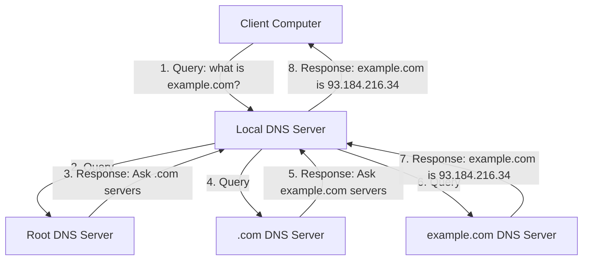

# Debian DNS Servers

## Introduction

Domain Name System (DNS) is a fundamental internet service that translates human-readable domain names (like `example.com`) into IP addresses (like `93.184.216.34`) that computers use to identify each other. Think of DNS as the internet's phone book - it helps users access websites without memorizing complex IP addresses.

In this guide, we'll learn how to set up and configure DNS servers on Debian systems. Debian provides robust support for DNS services primarily through BIND (Berkeley Internet Name Domain), the most widely used DNS software on the internet. We'll focus on BIND9, which is the version available in Debian repositories.

## Understanding DNS Basics

Before diving into the installation process, let's understand some key DNS concepts:

1. **DNS Record Types**: Different types of records serve different purposes:
   - `A` records: Map domain names to IPv4 addresses
   - `AAAA` records: Map domain names to IPv6 addresses
   - `CNAME` records: Create aliases for domain names
   - `MX` records: Define mail servers for a domain
   - `NS` records: Specify DNS servers for a domain
   - `TXT` records: Store text information (often used for verification)

2. **DNS Server Roles**:
   - **Primary (Master)**: Holds the original zone files and where changes are made
   - **Secondary (Slave)**: Gets copies of zone data from the primary server
   - **Caching**: Stores recent lookups to improve performance
   - **Forwarding**: Passes requests to another DNS server

3. **DNS Zones**: Administrative spaces in the DNS namespace that store records for domains

Let's visualize the DNS lookup process:



## Installing BIND9 on Debian

Let's start by installing BIND9 on your Debian server:

```bash
sudo apt update
sudo apt install bind9 bind9utils bind9-doc
```

This command installs:
- `bind9`: The DNS server package
- `bind9utils`: Utilities for DNS management
- `bind9-doc`: Documentation for BIND9

After installation, BIND will automatically start. You can verify this with:

```bash
sudo systemctl status bind9
```

Expected output:
```
● bind9.service - BIND Domain Name Server
     Loaded: loaded (/lib/systemd/system/bind9.service; enabled; vendor preset: enabled)
     Active: active (running) since Mon 2023-03-20 15:30:45 UTC; 5s ago
       Docs: man:named(8)
   Main PID: 12345 (named)
      Tasks: 4 (limit: 1132)
     Memory: 14.3M
        CPU: 45ms
     CGroup: /system.slice/bind9.service
             └─12345 /usr/sbin/named -f -u bind
```

## Configuring BIND9

BIND's configuration is primarily managed through these files:

- `/etc/bind/named.conf`: Main configuration file
- `/etc/bind/named.conf.options`: Server options
- `/etc/bind/named.conf.local`: Zone configurations
- `/etc/bind/named.conf.default-zones`: Default zone configurations

### Basic Configuration

Let's modify the options file to set up a caching DNS server:

```bash
sudo nano /etc/bind/named.conf.options
```

Replace the content with:

```
options {
        directory "/var/cache/bind";

        // Forward DNS queries to Google's DNS servers
        forwarders {
                8.8.8.8;
                8.8.4.4;
        };

        // Allow query from local network
        allow-query { localhost; 192.168.1.0/24; };

        // Disable zone transfers
        allow-transfer { none; };

        // Enable recursive queries
        recursion yes;

        // Disable DNSSEC validation for beginners
        dnssec-validation auto;

        // Listen on all IPv4 addresses
        listen-on { any; };
        
        // IPv6 configuration (optional)
        listen-on-v6 { any; };
};
```

Save the file and restart BIND:

```bash
sudo systemctl restart bind9
```

### Setting Up a Local Zone

Now, let's create a local zone for our internal network. This is useful for managing domains in your local network:

1. Edit the local configuration file:

```bash
sudo nano /etc/bind/named.conf.local
```

2. Add a zone definition:

```
zone "example.local" {
        type master;
        file "/etc/bind/zones/db.example.local";
        allow-query { any; };
};

zone "1.168.192.in-addr.arpa" {
        type master;
        file "/etc/bind/zones/db.192.168.1";
        allow-query { any; };
};
```

3. Create the zones directory:

```bash
sudo mkdir -p /etc/bind/zones
```

4. Create the forward zone file:

```bash
sudo nano /etc/bind/zones/db.example.local
```

Add the following content:

```
$TTL    604800      ; 1 week
@       IN      SOA     ns1.example.local. admin.example.local. (
                        2023032001      ; Serial
                        604800          ; Refresh
                        86400           ; Retry
                        2419200         ; Expire
                        604800 )        ; Negative Cache TTL
;
@       IN      NS      ns1.example.local.
@       IN      A       192.168.1.10
@       IN      AAAA    ::1
ns1     IN      A       192.168.1.10
www     IN      A       192.168.1.20
mail    IN      A       192.168.1.30
mail    IN      MX      10 mail.example.local.
```

5. Create the reverse zone file:

```bash
sudo nano /etc/bind/zones/db.192.168.1
```

Add the following content:

```
$TTL    604800      ; 1 week
@       IN      SOA     ns1.example.local. admin.example.local. (
                        2023032001      ; Serial
                        604800          ; Refresh
                        86400           ; Retry
                        2419200         ; Expire
                        604800 )        ; Negative Cache TTL
;
@       IN      NS      ns1.example.local.
10      IN      PTR     ns1.example.local.
20      IN      PTR     www.example.local.
30      IN      PTR     mail.example.local.
```

6. Check the configuration and restart BIND:

```bash
sudo named-checkconf
sudo named-checkzone example.local /etc/bind/zones/db.example.local
sudo named-checkzone 1.168.192.in-addr.arpa /etc/bind/zones/db.192.168.1
sudo systemctl restart bind9
```

## Testing Your DNS Server

Let's test our DNS server configuration:

1. Using `dig` to query for specific records:

```bash
dig www.example.local @192.168.1.10
```

Expected output:
```
; <<>> DiG 9.16.33-Debian <<>> www.example.local @192.168.1.10
;; global options: +cmd
;; Got answer:
;; ->>HEADER<<- opcode: QUERY, status: NOERROR, id: 39271
;; flags: qr aa rd ra; QUERY: 1, ANSWER: 1, AUTHORITY: 1, ADDITIONAL: 1

;; QUESTION SECTION:
;www.example.local.		IN	A

;; ANSWER SECTION:
www.example.local.	604800	IN	A	192.168.1.20

;; AUTHORITY SECTION:
example.local.		604800	IN	NS	ns1.example.local.

;; ADDITIONAL SECTION:
ns1.example.local.	604800	IN	A	192.168.1.10

;; Query time: 1 msec
;; SERVER: 192.168.1.10#53(192.168.1.10)
;; WHEN: Mon Mar 20 16:45:33 UTC 2023
;; MSG SIZE  rcvd: 97
```

2. Test reverse DNS lookup:

```bash
dig -x 192.168.1.20 @192.168.1.10
```

3. Configure a client to use your DNS server:

Edit `/etc/resolv.conf` on a client machine:

```
nameserver 192.168.1.10
search example.local
```

## Securing Your DNS Server

Security is crucial for DNS servers. Here are some best practices:

1. **Implement Access Control**:

```bash
sudo nano /etc/bind/named.conf.options
```

Add or modify:

```
// Define access control lists
acl "trusted" {
        192.168.1.0/24;    // Local network
        localhost;
        localnets;
};

options {
        // ... other options ...
        
        // Only allow queries from trusted sources
        allow-query { trusted; };
        
        // Restrict recursive queries
        allow-recursion { trusted; };
        
        // Hide version
        version "not disclosed";
};
```

2. **Enable Query Logging**:

```bash
sudo nano /etc/bind/named.conf.logging
```

Add:

```
logging {
        channel query_log {
                file "/var/log/bind/query.log";
                severity info;
                print-time yes;
        };
        category queries { query_log; };
};
```

Then include this file in `/etc/bind/named.conf`:

```bash
sudo nano /etc/bind/named.conf
```

Add:

```
include "/etc/bind/named.conf.logging";
```

Create the log directory:

```bash
sudo mkdir -p /var/log/bind
sudo chown bind:bind /var/log/bind
```

3. **Enable DNSSEC** (for production environments):

DNSSEC adds digital signatures to DNS data to protect against tampering:

```bash
sudo nano /etc/bind/named.conf.options
```

Change:

```
dnssec-validation auto;
dnssec-enable yes;
```

## Setting Up a Secondary DNS Server

For redundancy, it's good practice to set up a secondary DNS server:

1. On the primary server, allow zone transfers to the secondary:

```bash
sudo nano /etc/bind/named.conf.local
```

Modify the zone definition:

```
zone "example.local" {
        type master;
        file "/etc/bind/zones/db.example.local";
        allow-transfer { 192.168.1.11; };  // Secondary DNS server IP
        notify yes;
};
```

2. On the secondary server, install BIND9 and configure:

```bash
sudo nano /etc/bind/named.conf.local
```

Add:

```
zone "example.local" {
        type slave;
        file "/var/cache/bind/db.example.local";
        masters { 192.168.1.10; };  // Primary DNS server IP
};

zone "1.168.192.in-addr.arpa" {
        type slave;
        file "/var/cache/bind/db.192.168.1";
        masters { 192.168.1.10; };  // Primary DNS server IP
};
```

3. Restart BIND on both servers:

```bash
sudo systemctl restart bind9
```

## Common DNS Server Configurations

### 1. Setting Up a Forwarding DNS Server

A forwarding server passes queries to external DNS servers:

```
options {
        directory "/var/cache/bind";
        
        forwarders {
                8.8.8.8;
                1.1.1.1;
        };
        
        forward only;
        
        // ... other options ...
};
```

### 2. Creating a DNS View for Different Networks

Views allow different responses based on the client's network:

```
view "internal" {
        match-clients { 192.168.1.0/24; localhost; };
        
        zone "example.local" {
                type master;
                file "/etc/bind/zones/internal/db.example.local";
        };
        
        // Include default zones
        include "/etc/bind/named.conf.default-zones";
};

view "external" {
        match-clients { any; };
        
        zone "example.com" {
                type master;
                file "/etc/bind/zones/external/db.example.com";
        };
        
        // Include default zones
        include "/etc/bind/named.conf.default-zones";
};
```

### 3. Configuring DNS Round Robin for Load Balancing

DNS round robin is a simple way to distribute traffic:

```
; In your zone file
www     IN      A       192.168.1.20
www     IN      A       192.168.1.21
www     IN      A       192.168.1.22
```

## Troubleshooting DNS Server Issues

Here are common issues and their solutions:

1. **Check BIND Status**:

```bash
sudo systemctl status bind9
```

2. **View DNS Server Logs**:

```bash
sudo journalctl -u bind9
sudo less /var/log/syslog
```

3. **Test Zone Files**:

```bash
sudo named-checkzone example.local /etc/bind/zones/db.example.local
```

4. **Debug DNS Queries**:

```bash
dig +trace example.local
```

5. **Check Network Connectivity**:

```bash
sudo netstat -tulpn | grep named
```

Expected output:
```
tcp        0      0 0.0.0.0:53              0.0.0.0:*               LISTEN      12345/named
tcp6       0      0 :::53                    :::*                    LISTEN      12345/named
udp        0      0 0.0.0.0:53              0.0.0.0:*                           12345/named
udp6       0      0 :::53                    :::*                                12345/named
```

## Summary

In this guide, we've covered:

1. DNS fundamentals and BIND9 installation on Debian
2. Configuring primary and secondary DNS servers
3. Creating forward and reverse zones
4. Implementing security best practices
5. Setting up different DNS server configurations
6. Troubleshooting common DNS issues

Running your own DNS server on Debian provides greater control over your network, improves performance, and enhances privacy. It's a foundational skill for any system administrator.

## Additional Resources

- [BIND9 Documentation](https://bind9.readthedocs.io/)
- [Debian Wiki: BIND9](https://wiki.debian.org/Bind9)
- [DNS and BIND (O'Reilly Book)](https://www.oreilly.com/library/view/dns-and-bind/0596100574/)

## Practice Exercises

1. Configure your Debian DNS server to block known advertising domains
2. Set up DNSSEC for your local zone and verify the signatures
3. Create a split DNS configuration with different views for internal and external clients
4. Configure DNS server to use Response Policy Zones (RPZ) for security
5. Set up a local DNS server that caches responses for improved performance