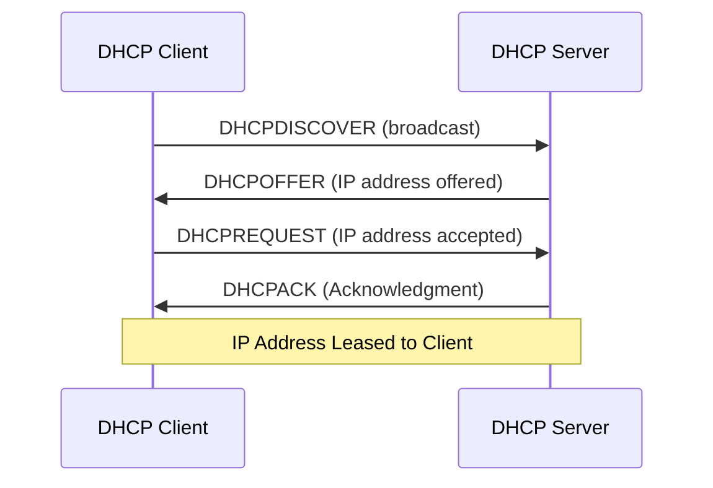

# Debian DHCP Servers

## Introduction

A Dynamic Host Configuration Protocol (DHCP) server plays a crucial role in modern networks by automatically assigning IP addresses and network configuration parameters to devices. On Debian systems, setting up a DHCP server provides a reliable way to manage IP addresses across your network without manual configuration for each device.

In this guide, we'll explore how to install, configure, and manage a DHCP server on Debian. You'll learn the fundamentals of DHCP operation, how to set up different types of address assignments, and how to troubleshoot common issues.

## What is DHCP?

DHCP (Dynamic Host Configuration Protocol) is a network management protocol that automatically assigns IP addresses and other network configuration parameters to devices on a network. Without DHCP, network administrators would need to manually assign and track IP addresses for every device.

Here's how DHCP works in a simplified form:



## Installing the DHCP Server on Debian

Debian uses the ISC DHCP server, which is a reliable and feature-rich implementation. Let's start by installing it:

```bash
sudo apt update
sudo apt install isc-dhcp-server
```

After installation, the service might fail to start immediately because we haven't configured it yet. Don't worry, this is normal.

## Configuring the DHCP Server

### 1. Specify the Network Interface

First, we need to tell the DHCP server which network interface to use. Edit the `/etc/default/isc-dhcp-server` file:

```bash
sudo nano /etc/default/isc-dhcp-server
```

Find and modify the `INTERFACESv4` line to specify your network interface (replace `eth0` with your actual interface name):

```
INTERFACESv4="eth0"
```

You can find your interface name by running:

```bash
ip a
```

### 2. Configure the DHCP Server

The main configuration file for the DHCP server is `/etc/dhcp/dhcpd.conf`. Let's create a basic configuration:

```bash
sudo nano /etc/dhcp/dhcpd.conf
```

Here's a sample configuration:

```
# Global options
default-lease-time 600;          # Default lease time in seconds
max-lease-time 7200;             # Maximum lease time in seconds
authoritative;                   # This is the official DHCP server for the network

# Subnet configuration
subnet 192.168.1.0 netmask 255.255.255.0 {
  range 192.168.1.100 192.168.1.200;  # Range of IP addresses to assign
  option routers 192.168.1.1;         # Default gateway
  option domain-name-servers 8.8.8.8, 8.8.4.4;  # DNS servers
  option domain-name "example.local";  # Local domain name
}
```

Let's break down this configuration:

- `default-lease-time`: How long (in seconds) a client can use an IP address before it needs to renew
- `max-lease-time`: The maximum time a client can hold onto an IP address
- `authoritative`: Indicates this DHCP server is the official one for the local network
- `subnet`: Defines the network this DHCP server will manage
- `range`: The range of IP addresses that can be assigned to clients
- `option routers`: The default gateway for clients
- `option domain-name-servers`: DNS servers clients should use
- `option domain-name`: The domain name clients should use

### 3. Start and Enable the DHCP Server

After configuration, restart the DHCP server and enable it to start on boot:

```bash
sudo systemctl restart isc-dhcp-server
sudo systemctl enable isc-dhcp-server
```

Check if the service is running correctly:

```bash
sudo systemctl status isc-dhcp-server
```

You should see output indicating the service is active (running).

## Advanced DHCP Configuration

### Static IP Address Assignments

Sometimes you want specific devices to always get the same IP address. You can do this with static assignments:

```
host server1 {
  hardware ethernet 00:11:22:33:44:55;  # MAC address of the device
  fixed-address 192.168.1.10;           # The static IP to assign
}
```

This configuration ensures that the device with MAC address `00:11:22:33:44:55` always receives the IP address `192.168.1.10`.

### DHCP Options for PXE Boot

If you want to set up network booting, you can add these options:

```
allow booting;
allow bootp;

# PXE boot server information
next-server 192.168.1.5;
filename "pxelinux.0";
```

### Setting Up DHCP Failover

For critical networks, you might want to set up DHCP failover to ensure availability:

```
failover peer "dhcp-failover" {
  primary;                       # This is the primary server
  address 192.168.1.1;           # IP address of this server
  port 647;
  peer address 192.168.1.2;      # IP address of the secondary server
  peer port 647;
  max-response-delay 30;
  max-unacked-updates 10;
  load balance max seconds 3;
  mclt 3600;                     # Maximum client lead time
  split 128;                     # Load balancing split
}

subnet 192.168.1.0 netmask 255.255.255.0 {
  pool {
    failover peer "dhcp-failover";
    range 192.168.1.100 192.168.1.200;
  }
  option routers 192.168.1.1;
  option domain-name-servers 8.8.8.8, 8.8.4.4;
  option domain-name "example.local";
}
```

## Monitoring and Troubleshooting

### Checking DHCP Leases

To see current DHCP leases, check the lease file:

```bash
sudo cat /var/lib/dhcp/dhcpd.leases
```

This file contains information about all active leases, including client identifiers, IP addresses, and lease expiration times.

### Monitoring DHCP Activity

To monitor DHCP activity in real-time, you can use the syslog:

```bash
sudo tail -f /var/log/syslog | grep dhcp
```

### Common Issues and Solutions

1. **DHCP server won't start**
   
   Check for configuration errors:
   
   ```bash
   sudo dhcpd -t
   ```
   
   This tests the configuration file for syntax errors without actually starting the server.

2. **Clients not receiving IP addresses**
   
   - Verify the DHCP server is running: `sudo systemctl status isc-dhcp-server`
   - Check that the firewall allows DHCP: `sudo ufw status` (if using UFW)
   - Verify the network interface is correct in `/etc/default/isc-dhcp-server`
   - Ensure the subnet configuration matches your network

3. **Incorrect IP range**
   
   Make sure the IP range in your configuration doesn't overlap with statically assigned IPs on your network.

## Practical Example: Setting up a DHCP Server for a Small Office

Let's put everything together in a practical example for a small office network:

```
# Global settings
default-lease-time 28800;         # 8 hours
max-lease-time 86400;             # 24 hours
authoritative;

# Define the DNS servers for the entire network
option domain-name-servers 8.8.8.8, 1.1.1.1;
option domain-name "office.local";

# Office network
subnet 192.168.10.0 netmask 255.255.255.0 {
  range 192.168.10.50 192.168.10.200;  # Dynamic IPs
  option routers 192.168.10.1;         # Gateway

  # Define different options for different device types using classes
  class "VoIP-Phones" {
    match if substring (hardware, 1, 3) = 00:11:22;
    option tftp-server-name "192.168.10.5";
    option time-servers 192.168.10.5;
  }
}

# Static assignments for important equipment
host office-printer {
  hardware ethernet 00:11:22:33:44:66;
  fixed-address 192.168.10.10;
}

host file-server {
  hardware ethernet 00:11:22:33:44:77;
  fixed-address 192.168.10.20;
}
```

In this example:
- Regular clients get dynamic IPs in the range 192.168.10.50-200
- VoIP phones (identified by their MAC address prefix) get special TFTP and time server configurations
- The office printer and file server receive static IP addresses

## Summary

In this guide, we've covered:

1. The basics of DHCP and why it's important for network management
2. How to install and configure a DHCP server on Debian
3. Setting up different types of address assignments (dynamic and static)
4. Advanced configurations including failover and PXE boot support
5. Monitoring and troubleshooting DHCP servers
6. A practical example for a small office network

Setting up a DHCP server on Debian provides an efficient way to manage IP addresses in your network. By automating the IP assignment process, you reduce administrative overhead and ensure consistent network configuration across all devices.

## Exercises

1. Install and configure a basic DHCP server on a virtual machine running Debian.
2. Set up static IP assignments for at least two devices based on their MAC addresses.
3. Modify your DHCP configuration to use a different DNS server for a specific range of IP addresses.
4. Configure DHCP logging and analyze the logs to track IP assignments.
5. Set up a test environment with a primary and secondary DHCP server in failover mode.

## Additional Resources

- The [ISC DHCP Server documentation](https://kb.isc.org/docs/isc-dhcp-44-manual-pages-dhcpdconf)
- The Debian Wiki page on [DHCP Server](https://wiki.debian.org/DHCP_Server)
- For more advanced networking, explore how DHCP integrates with DNS using DDNS (Dynamic DNS)
- Learn about DHCPv6 for IPv6 address management