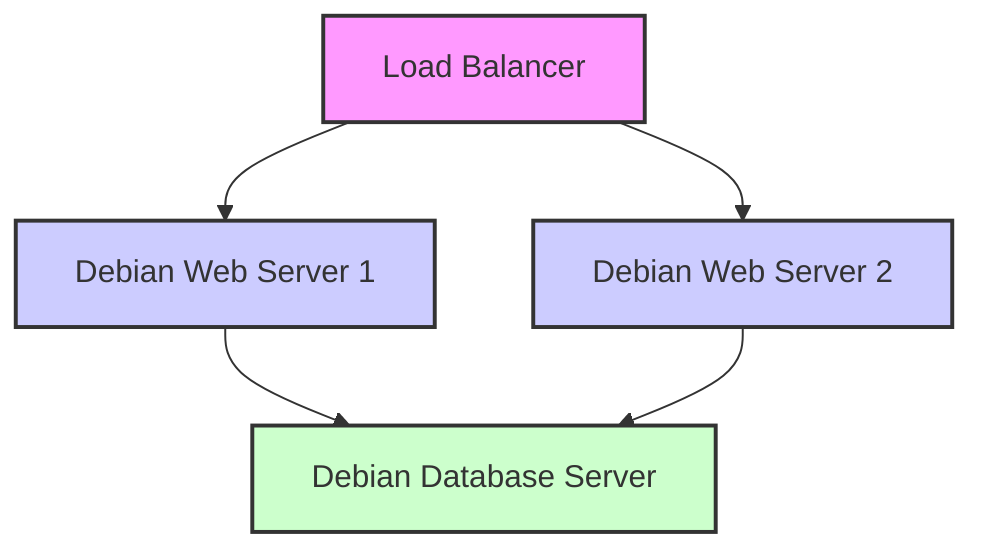
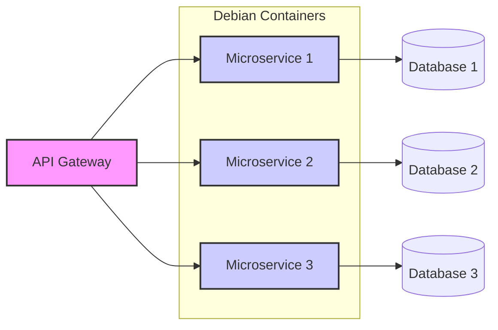

# Debian Cloud Basics

## Introduction

Debian is one of the most popular and stable Linux distributions available, making it an excellent choice for cloud deployments. This guide introduces you to the fundamentals of using Debian in cloud environments, whether you're deploying to public clouds like AWS, Azure, and Google Cloud Platform, or setting up your own private cloud infrastructure.

Debian's reliability, security-focused design, and minimal resource requirements make it particularly well-suited for cloud computing where efficiency and stability are paramount. By the end of this guide, you'll understand how Debian integrates with major cloud platforms and how to get started with your own Debian cloud deployments.

## What is Debian Cloud?

Debian Cloud refers to the specialized Debian images and tools designed specifically for cloud environments. These official images are optimized for various cloud providers and virtualization technologies.

### Key Characteristics of Debian Cloud Images

- **Pre-configured for cloud environments**: Includes cloud-init for initialization
- **Minimal footprint**: Reduced size for faster deployment and lower storage costs
- **Security-focused**: Regular security updates and minimal attack surface
- **Stability**: The same Debian reliability you expect, adapted for cloud use

## Finding Debian Cloud Images

Debian provides official cloud images for major platforms. These images are regularly updated with security patches and are available in different formats depending on the target platform.

```bash
# Example: Listing available Debian cloud images
curl https://cloud.debian.org/images/cloud/
```

### Official Debian Cloud Image Locations

- **Debian Cloud Images Website**: [https://cloud.debian.org/images/cloud/](https://cloud.debian.org/images/cloud/)
- **AWS Marketplace**: Official Debian AMIs
- **Azure Marketplace**: Official Debian VM images
- **Google Cloud Platform**: Debian images in GCP Marketplace

## Getting Started with Debian in the Cloud

Let's walk through the process of deploying Debian on different cloud platforms.

### Prerequisites

- An account with a cloud provider (AWS, Azure, GCP, etc.)
- Basic understanding of cloud concepts (VMs, networking, storage)
- Command-line interface tools for your chosen cloud platform

### Deploying Debian on AWS

AWS offers Debian AMIs (Amazon Machine Images) that you can use to launch EC2 instances.

```bash
# Using AWS CLI to launch a Debian instance
aws ec2 run-instances \
  --image-id ami-0dba2cb6798deb6d8 \  # Example Debian 11 AMI ID (check for current ID)
  --instance-type t2.micro \
  --key-name your-key-pair \
  --security-group-ids sg-0123456789abcdef0
```

The output will show details of your newly launched instance:

```
{
    "Instances": [
        {
            "InstanceId": "i-0123456789abcdef0",
            "InstanceType": "t2.micro",
            "State": {
                "Code": 0,
                "Name": "pending"
            },
            ...
        }
    ],
    ...
}
```

### Deploying Debian on Azure

Azure provides Debian images through its marketplace.

```bash
# Using Azure CLI to create a Debian VM
az vm create \
  --resource-group myResourceGroup \
  --name myDebianVM \
  --image Debian:debian-11:11:latest \
  --admin-username azureuser \
  --generate-ssh-keys
```

Example output:

```
{
  "fqdns": "",
  "id": "/subscriptions/00000000-0000-0000-0000-000000000000/resourceGroups/myResourceGroup/providers/Microsoft.Compute/virtualMachines/myDebianVM",
  "location": "eastus",
  "macAddress": "00-0D-3A-1E-1B-3B",
  "powerState": "VM running",
  "privateIpAddress": "10.0.0.4",
  "publicIpAddress": "40.85.169.125",
  "resourceGroup": "myResourceGroup",
  "zones": ""
}
```

### Deploying Debian on Google Cloud Platform

GCP offers Debian images in its public images repository.

```bash
# Using Google Cloud CLI to create a Debian VM
gcloud compute instances create debian-instance \
  --image-family debian-11 \
  --image-project debian-cloud \
  --zone us-central1-a \
  --machine-type e2-medium
```

Example output:

```
NAME             ZONE           MACHINE_TYPE  PREEMPTIBLE  INTERNAL_IP  EXTERNAL_IP    STATUS
debian-instance  us-central1-a  e2-medium     false        10.0.0.2     35.184.125.196  RUNNING
```

## Understanding Cloud-Init with Debian

Cloud-init is a widely used industry-standard method for initializing cloud instances. Debian cloud images come pre-installed with cloud-init, allowing you to customize your instances at launch time.

### Basic Cloud-Init Configuration

Create a cloud-init configuration file (user-data.yaml):

```yaml
#cloud-config
package_update: true
package_upgrade: true

packages:
  - nginx
  - git
  - build-essential

runcmd:
  - systemctl start nginx
  - systemctl enable nginx

final_message: "The system is ready to use after $UPTIME seconds"
```

### Using Cloud-Init with AWS

```bash
# Launch an instance with cloud-init
aws ec2 run-instances \
  --image-id ami-0dba2cb6798deb6d8 \
  --instance-type t2.micro \
  --key-name your-key-pair \
  --security-group-ids sg-0123456789abcdef0 \
  --user-data file://user-data.yaml
```

## Managing Debian Cloud Instances

Once your Debian instance is running in the cloud, you'll need to know how to manage it effectively.

### SSH Access

```bash
# Connect to your instance
ssh admin@your-instance-ip

# Example output
The authenticity of host '203.0.113.1 (203.0.113.1)' can't be established.
ECDSA key fingerprint is SHA256:DxIsVGPYPCqnxD9/YxjzoHUGMQ8oDuVYoEBDO9EQJdg.
Are you sure you want to continue connecting (yes/no)? yes
Warning: Permanently added '203.0.113.1' (ECDSA) to the list of known hosts.
Linux debian-cloud 5.10.0-18-cloud-amd64 #1 SMP Debian 5.10.140-1 (2022-09-02) x86_64

The programs included with the Debian GNU/Linux system are free software;
the exact distribution terms for each program are described in the
individual files in /usr/share/doc/*/copyright.

Debian GNU/Linux comes with ABSOLUTELY NO WARRANTY, to the extent
permitted by applicable law.
Last login: Thu Feb 23 18:31:22 2023 from 192.168.1.1
admin@debian-cloud:~$
```

### Updating Your Debian Cloud Instance

Keeping your instances updated is crucial for security:

```bash
# Update package lists
sudo apt update

# Upgrade installed packages
sudo apt upgrade -y

# Alternatively, use unattended-upgrades for automatic security updates
sudo apt install unattended-upgrades -y
sudo dpkg-reconfigure -plow unattended-upgrades
```

## Common Debian Cloud Architecture Patterns

Let's explore some typical architectures for Debian in the cloud.

### Web Application Architecture



### Microservices Architecture with Debian



## Creating Custom Debian Cloud Images

You might need to create custom Debian images for your specific requirements. Here's how you can build your own images using standard tools.

### Using Debian Cloud Image Builder

Debian provides tools to build custom cloud images:

```bash
# Install the required packages
sudo apt install debootstrap cloud-utils cloud-image-utils -y

# Create a base image 
sudo debootstrap --arch=amd64 bullseye /mnt/debian-chroot

# Enter the chroot environment
sudo chroot /mnt/debian-chroot

# Install necessary packages
apt update
apt install -y linux-image-cloud-amd64 grub-pc cloud-init

# Exit chroot
exit

# Create an image file
sudo qemu-img create -f raw debian-custom.img 2G

# Convert to various formats (if needed)
qemu-img convert -f raw -O qcow2 debian-custom.img debian-custom.qcow2
```

## Automating Debian Cloud Deployments

For production environments, you'll want to automate your deployments using Infrastructure as Code (IaC) tools.

### Using Terraform with Debian

Terraform is a popular IaC tool that works well with Debian cloud deployments.

```hcl
# Example Terraform configuration for AWS
provider "aws" {
  region = "us-west-2"
}

resource "aws_instance" "debian_server" {
  ami           = "ami-0dba2cb6798deb6d8"  # Debian 11 AMI
  instance_type = "t2.micro"
  
  tags = {
    Name = "debian-web-server"
  }
  
  user_data = <<-EOF
              #!/bin/bash
              apt-get update
              apt-get install -y nginx
              systemctl enable nginx
              systemctl start nginx
              echo "<h1>Hello from Debian in the cloud!</h1>" > /var/www/html/index.html
              EOF
}

output "public_ip" {
  value = aws_instance.debian_server.public_ip
}
```

### Using Ansible with Debian Cloud

Ansible works seamlessly with Debian for configuration management:

```yaml
---
# Playbook for configuring Debian web servers
- hosts: debian_web_servers
  become: yes
  tasks:
    - name: Update apt cache
      apt:
        update_cache: yes
        cache_valid_time: 3600

    - name: Install required packages
      apt:
        name:
          - nginx
          - certbot
          - python3-certbot-nginx
        state: present

    - name: Start and enable Nginx
      service:
        name: nginx
        state: started
        enabled: yes

    - name: Copy website files
      copy:
        src: files/website/
        dest: /var/www/html/
        owner: www-data
        group: www-data
        mode: '0644'
```

## Security Best Practices for Debian in the Cloud

Security is critical for cloud deployments. Here are some Debian-specific best practices:

### 1. Minimize Installed Packages

```bash
# List installed packages
dpkg -l | grep ^ii

# Remove unnecessary packages
sudo apt purge package-name -y
```

### 2. Configure Automatic Security Updates

```bash
# Install unattended-upgrades
sudo apt install unattended-upgrades apt-listchanges -y

# Configure for security updates only
sudo nano /etc/apt/apt.conf.d/50unattended-upgrades

# Ensure this line is uncommented:
# Unattended-Upgrade::Origins-Pattern {
#   "origin=Debian,codename=${distro_codename},label=Debian-Security";
# };
```

### 3. Use SSH Key Authentication Only

Edit `/etc/ssh/sshd_config`:

```
PermitRootLogin no
PasswordAuthentication no
PubkeyAuthentication yes
```

Then restart SSH:

```bash
sudo systemctl restart ssh
```

## Monitoring Debian Cloud Instances

Monitoring is essential for maintaining healthy cloud deployments.

### Basic Monitoring with Standard Tools

```bash
# Check system resources
top
htop  # must be installed: apt install htop

# Disk usage
df -h

# Memory usage
free -m

# Network connections
netstat -tulpn
```

### Setting Up Prometheus and Grafana on Debian

For more advanced monitoring, you can use Prometheus and Grafana:

```bash
# Install Prometheus Node Exporter
sudo apt update
sudo apt install -y prometheus-node-exporter

# Install and start Prometheus
sudo apt install -y prometheus

# Install Grafana (following the official repository method)
sudo apt install -y apt-transport-https software-properties-common
curl -fsSL https://packages.grafana.com/gpg.key | sudo apt-key add -
echo "deb https://packages.grafana.com/oss/deb stable main" | sudo tee /etc/apt/sources.list.d/grafana.list
sudo apt update
sudo apt install -y grafana

# Start and enable the services
sudo systemctl enable prometheus-node-exporter prometheus grafana-server
sudo systemctl start prometheus-node-exporter prometheus grafana-server
```

## Troubleshooting Common Issues

When working with Debian in the cloud, you might encounter some common issues:

### Instance Not Booting Properly

Check the cloud provider's console logs or serial output:

```bash
# AWS example
aws ec2 get-console-output --instance-id i-0123456789abcdef0

# GCP example
gcloud compute instances get-serial-port-output debian-instance --zone us-central1-a
```

### Network Configuration Issues

Verify your cloud-init networking configuration:

```bash
# Check cloud-init logs
sudo cat /var/log/cloud-init.log
sudo cat /var/log/cloud-init-output.log

# Network interface status
ip addr
```

### Package Management Problems

Fix broken package installations:

```bash
sudo apt update
sudo apt --fix-broken install
sudo dpkg --configure -a
```

## Summary

Debian Cloud provides a reliable, secure, and efficient platform for your cloud deployments. In this guide, we've covered:

- Finding and using official Debian cloud images
- Deploying Debian on major cloud platforms (AWS, Azure, GCP)
- Using cloud-init for instance customization
- Managing, updating, and securing your Debian cloud instances
- Creating custom Debian cloud images
- Automating deployments with infrastructure as code
- Implementing security best practices
- Setting up monitoring for your Debian instances
- Troubleshooting common issues

Debian's stability, security-focused design, and excellent community support make it an ideal choice for cloud deployments of all sizes, from small personal projects to enterprise-level applications.

## Additional Resources

- [Official Debian Cloud Documentation](https://wiki.debian.org/Cloud)
- [Debian Cloud Images Repository](https://cloud.debian.org/images/cloud/)
- [Cloud-Init Documentation](https://cloudinit.readthedocs.io/en/latest/)

## Exercises

1. Deploy a Debian instance on your preferred cloud provider and secure it following the best practices outlined in this guide.
2. Create a custom Debian cloud image with your preferred software pre-installed.
3. Set up a simple web server using cloud-init and make it accessible from the internet.
4. Implement a monitoring solution for your Debian cloud instance using Prometheus and Grafana.
5. Create a Terraform configuration to deploy a three-tier application architecture using Debian instances.