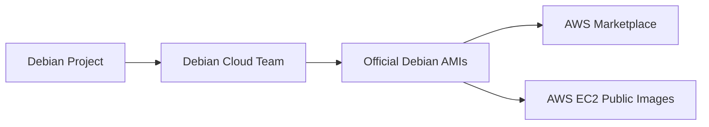

# Debian AWS Integration

## Introduction

Debian is one of the most stable and well-respected Linux distributions available, known for its reliability and adherence to free software principles. Amazon Web Services (AWS) is the world's leading cloud platform. Integrating Debian with AWS allows you to leverage Debian's stability and security within AWS's flexible cloud infrastructure.

This guide will walk you through the process of deploying, configuring, and optimizing Debian systems on AWS. Whether you're setting up a simple web server or building complex cloud applications, understanding how to effectively integrate Debian with AWS will help you create robust cloud solutions.

## Understanding Debian AWS AMIs

### What are AMIs?

Amazon Machine Images (AMIs) are pre-configured templates used to create virtual machines in AWS. Debian provides official AMIs that allow you to quickly deploy Debian-based instances.

### Debian Official AMIs

Debian maintains official AMIs for different Debian versions and AWS regions. These images are maintained by the Debian Cloud team and follow Debian's security and quality standards.



## Finding Debian AMIs on AWS

You can find official Debian AMIs through several methods:

### Method 1: Using the AWS Management Console

1. Log into the AWS Management Console
2. Navigate to EC2 Dashboard
3. Click "Launch Instance"
4. In the AMI search bar, enter "Debian"
5. Look for images owned by "379101102735" (Debian's official AWS account)

### Method 2: Using the AWS CLI

The AWS Command Line Interface provides a quick way to find Debian AMIs:

```bash
aws ec2 describe-images \
    --owners 379101102735 \
    --filters "Name=name,Values=debian-11-*" \
    --query 'sort_by(Images, &CreationDate)[-1].ImageId' \
    --output text
```

This command returns the latest Debian 11 AMI ID for your current region.

## Launching a Debian Instance on AWS

Once you've identified the appropriate AMI, you can launch a Debian instance:

### Using the AWS Management Console

1. In the EC2 Dashboard, click "Launch Instance"
2. Enter the AMI ID or search for Debian
3. Choose an instance type (t2.micro is free tier eligible)
4. Configure instance details (VPC, subnet, etc.)
5. Add storage as needed
6. Configure security groups to control access
7. Launch the instance with a key pair for SSH access

### Using the AWS CLI

```bash
aws ec2 run-instances \
    --image-id ami-0c7217cdde317cfec \
    --instance-type t2.micro \
    --key-name your-key-name \
    --security-group-ids sg-0123456789abcdef \
    --subnet-id subnet-0123456789abcdef
```

Remember to replace the placeholder values with your actual AMI ID, key name, security group, and subnet IDs.

## Initial Configuration

### SSH into Your Instance

Once your instance is running, connect to it using SSH:

```bash
ssh admin@your-instance-public-ip -i /path/to/your-key.pem
```

For Debian AMIs, the default username is usually `admin`.

### System Updates

First, update your system:

```bash
sudo apt update
sudo apt upgrade -y
```

### Setting Up the AWS CLI on Debian

To manage AWS resources from your Debian instance:

```bash
sudo apt update
sudo apt install -y awscli
```

Configure the AWS CLI with your credentials:

```bash
aws configure
```

You'll need to enter:
- AWS Access Key ID
- AWS Secret Access Key
- Default region
- Default output format (json recommended)

## Using Instance Metadata

AWS provides metadata about each instance that can be accessed from within the instance. This is useful for scripts and automation.

```bash
# Get instance ID
curl http://169.254.169.254/latest/meta-data/instance-id

# Get instance type
curl http://169.254.169.254/latest/meta-data/instance-type

# Get public IPv4 address
curl http://169.254.169.254/latest/meta-data/public-ipv4
```

## Storage Management

### Working with EBS Volumes

Elastic Block Store (EBS) provides persistent block storage for EC2 instances. Here's how to work with EBS volumes on Debian:

#### Viewing Attached Volumes

```bash
lsblk
```

#### Creating a Filesystem on a New Volume

```bash
sudo mkfs -t ext4 /dev/xvdf
```

#### Mounting the Volume

```bash
sudo mkdir /mnt/data
sudo mount /dev/xvdf /mnt/data
```

#### Automounting at Boot

Edit `/etc/fstab` to mount the volume automatically at boot:

```bash
echo '/dev/xvdf /mnt/data ext4 defaults,nofail 0 2' | sudo tee -a /etc/fstab
```

## Networking Configuration

### Security Groups

Security groups act as virtual firewalls for your instances. Configure them to control inbound and outbound traffic:

```bash
# Allow SSH access only from your IP
aws ec2 authorize-security-group-ingress \
    --group-id sg-0123456789abcdef \
    --protocol tcp \
    --port 22 \
    --cidr your-ip-address/32

# Allow HTTP access from anywhere
aws ec2 authorize-security-group-ingress \
    --group-id sg-0123456789abcdef \
    --protocol tcp \
    --port 80 \
    --cidr 0.0.0.0/0
```

### Elastic IP Addresses

To assign a fixed public IP to your Debian instance:

```bash
# Allocate a new Elastic IP
aws ec2 allocate-address

# Associate the Elastic IP with your instance
aws ec2 associate-address \
    --instance-id i-0123456789abcdef \
    --allocation-id eipalloc-0123456789abcdef
```

## Automation with User Data

AWS allows you to run scripts during instance launch using User Data. This is useful for automation:

```bash
#!/bin/bash
apt update
apt install -y nginx
systemctl enable nginx
systemctl start nginx
echo '<html><body><h1>My Debian AWS Server</h1></body></html>' > /var/www/html/index.html
```

You can specify this script in the "User data" field when launching an instance through the console, or using the `--user-data` parameter with the AWS CLI.

## Setting Up a Web Server

Let's set up a simple web server on Debian:

```bash
# Install Nginx
sudo apt update
sudo apt install -y nginx

# Start and enable Nginx
sudo systemctl start nginx
sudo systemctl enable nginx

# Check status
sudo systemctl status nginx
```

Now you can access your web server by entering your instance's public IP address in a browser.

## Backup and Restoration

### Creating EBS Snapshots

Back up your EBS volumes using snapshots:

```bash
aws ec2 create-snapshot \
    --volume-id vol-0123456789abcdef \
    --description "Backup of my Debian server data"
```

### Creating AMIs

Create a custom AMI from your configured instance:

```bash
aws ec2 create-image \
    --instance-id i-0123456789abcdef \
    --name "My-Debian-Server" \
    --description "Custom Debian server with Nginx"
```

## Cost Optimization

### Using Spot Instances

Spot instances offer significant cost savings for non-critical workloads:

```bash
aws ec2 request-spot-instances \
    --spot-price "0.03" \
    --instance-count 1 \
    --type "one-time" \
    --launch-specification file://spot-specification.json
```

Where `spot-specification.json` contains:

```json
{
  "ImageId": "ami-0c7217cdde317cfec",
  "InstanceType": "t2.micro",
  "KeyName": "your-key-name",
  "SecurityGroupIds": ["sg-0123456789abcdef"]
}
```

### Instance Scheduling

For non-production environments, consider scheduling instances to run only during business hours:

```bash
# Create a script to stop instances
cat > /home/admin/stop-instances.sh << 'EOF'
#!/bin/bash
aws ec2 stop-instances --instance-ids i-0123456789abcdef
EOF

# Make it executable
chmod +x /home/admin/stop-instances.sh

# Schedule with cron (stop at 6 PM weekdays)
echo "0 18 * * 1-5 /home/admin/stop-instances.sh" | crontab -
```

## Advanced Topics

### Integration with AWS Services

Debian instances can interact with other AWS services. Here's an example of storing data in S3:

```bash
# Install boto3 (Python AWS SDK)
sudo apt install -y python3-pip
pip3 install boto3

# Python script to interact with S3
cat > s3upload.py << 'EOF'
import boto3
import sys

def upload_to_s3(file_path, bucket, object_name=None):
    if object_name is None:
        object_name = file_path.split('/')[-1]
    
    s3_client = boto3.client('s3')
    try:
        s3_client.upload_file(file_path, bucket, object_name)
        print(f"Successfully uploaded {file_path} to {bucket}/{object_name}")
        return True
    except Exception as e:
        print(f"Error uploading to S3: {e}")
        return False

if __name__ == "__main__":
    if len(sys.argv) < 3:
        print("Usage: python3 s3upload.py file_path bucket_name [object_name]")
        sys.exit(1)
    
    file_path = sys.argv[1]
    bucket = sys.argv[2]
    object_name = sys.argv[3] if len(sys.argv) > 3 else None
    
    upload_to_s3(file_path, bucket, object_name)
EOF

# Example usage
python3 s3upload.py /path/to/file your-bucket-name
```

### Using Instance Metadata Service Version 2

For enhanced security, AWS recommends using IMDSv2, which is token-based:

```bash
# Get a token (valid for 6 hours)
TOKEN=`curl -X PUT "http://169.254.169.254/latest/api/token" -H "X-aws-ec2-metadata-token-ttl-seconds: 21600"`

# Use the token to retrieve metadata
curl -H "X-aws-ec2-metadata-token: $TOKEN" http://169.254.169.254/latest/meta-data/instance-id
```

## Troubleshooting

### Common Issues and Solutions

#### SSH Connection Refused

If you can't connect to your instance via SSH:

1. Check the security group rules to ensure port 22 is open
2. Verify your key pair is correct
3. Make sure the instance is running

```bash
aws ec2 describe-instances \
    --instance-ids i-0123456789abcdef \
    --query "Reservations[0].Instances[0].State.Name"
```

#### Instance Boot Problems

If your instance doesn't boot properly, check the system log:

```bash
aws ec2 get-console-output \
    --instance-id i-0123456789abcdef
```

#### Disk Space Issues

If you're running out of disk space:

```bash
# Check disk usage
df -h

# Find large files
sudo find / -type f -size +100M -exec ls -lh {} \;

# Clean apt cache
sudo apt clean
```

## Summary

In this guide, we've covered the essentials of Debian AWS integration:

- Finding and launching official Debian AMIs
- Basic instance configuration and management
- Storage and network setup
- Web server deployment
- Backup and restoration
- Cost optimization techniques
- Advanced integration with AWS services
- Troubleshooting common issues

By leveraging Debian's stability and AWS's cloud infrastructure, you can build reliable, scalable, and cost-effective solutions for a wide range of applications.

## Additional Resources

- [Debian Cloud Team Wiki](https://wiki.debian.org/Cloud)
- [Official Debian AMI Finder](https://cloud.debian.org/images/cloud/)
- [AWS EC2 Documentation](https://docs.aws.amazon.com/ec2/)
- [AWS CLI Documentation](https://docs.aws.amazon.com/cli/latest/userguide/)

## Exercises

1. Launch a Debian instance on AWS and configure it as a web server.
2. Create a custom AMI from your configured instance.
3. Set up automated backups using EBS snapshots.
4. Create a script that uses the AWS CLI to start and stop your instance on a schedule.
5. Configure your Debian instance to interact with other AWS services like S3 or DynamoDB.