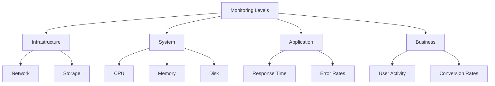

# Debian Cloud Monitoring

## Introduction

Cloud monitoring is an essential aspect of maintaining reliable and efficient cloud infrastructure. When working with Debian-based systems in the cloud, implementing robust monitoring solutions ensures you can track system health, resource utilization, and application performance. This guide introduces you to monitoring Debian systems in cloud environments, covering fundamental concepts and practical implementations suitable for beginners.

## Why Monitor Debian Cloud Instances?

Monitoring your Debian cloud instances provides several benefits:

- **Early issue detection**: Identify and resolve problems before they affect users
- **Resource optimization**: Track resource usage to optimize costs and performance
- **Performance insights**: Gather data on application performance to guide improvements
- **Security awareness**: Detect unusual activities that might indicate security breaches
- **Capacity planning**: Use historical data to plan for future resource needs

## Basic Monitoring Concepts

Before diving into specific tools, let's understand some fundamental monitoring concepts:

### Metrics vs. Logs

- **Metrics**: Numerical measurements collected at regular intervals (CPU usage, memory consumption, etc.)
- **Logs**: Text records of events that occurred in the system or application

### Push vs. Pull Monitoring

- **Push monitoring**: Systems send metrics to a central monitoring server
- **Pull monitoring**: A central server scrapes metrics from systems at regular intervals

### Monitoring Levels



## Setting Up Basic System Monitoring

Let's start with basic system monitoring using built-in Debian tools.

### Using the `top` Command

The `top` command provides a real-time view of system performance:

```bash
top
```

Sample output:
```
top - 17:30:25 up 15 days,  5:27,  1 user,  load average: 0.15, 0.22, 0.25
Tasks: 128 total,   1 running, 127 sleeping,   0 stopped,   0 zombie
%Cpu(s):  2.7 us,  1.0 sy,  0.0 ni, 96.3 id,  0.0 wa,  0.0 hi,  0.0 si,  0.0 st
MiB Mem :   7950.1 total,   5023.8 free,   1384.7 used,   1541.7 buff/cache
MiB Swap:   2048.0 total,   2048.0 free,      0.0 used.   6256.6 avail Mem

PID USER      PR  NI    VIRT    RES    SHR S  %CPU  %MEM     TIME+ COMMAND
1359 root      20   0  743516  43296  24600 S   2.0   0.5   8:12.85 containerd
1 root      20   0  169004  11756   8484 S   0.0   0.1   0:21.41 systemd
2 root      20   0       0      0      0 S   0.0   0.0   0:00.03 kthreadd
```

### Installing and Using `htop`

`htop` is an enhanced version of `top` with a more user-friendly interface:

```bash
# Install htop
sudo apt update
sudo apt install htop -y

# Run htop
htop
```

`htop` provides a colorful, interactive display with easy-to-read metrics and the ability to scroll horizontally and vertically.

## Setting Up Prometheus for Cloud Monitoring

Prometheus is a powerful open-source monitoring and alerting toolkit that's particularly well-suited for cloud environments.

### Installing Prometheus Node Exporter

First, let's install the Node Exporter to collect system metrics:

```bash
# Download the Node Exporter
wget https://github.com/prometheus/node_exporter/releases/download/v1.5.0/node_exporter-1.5.0.linux-amd64.tar.gz

# Extract the archive
tar xvfz node_exporter-1.5.0.linux-amd64.tar.gz

# Move the binary to /usr/local/bin
sudo mv node_exporter-1.5.0.linux-amd64/node_exporter /usr/local/bin/

# Create a system user for the Node Exporter
sudo useradd -rs /bin/false node_exporter

# Create a systemd service file
sudo nano /etc/systemd/system/node_exporter.service
```

Add the following content to the service file:

```
[Unit]
Description=Node Exporter
After=network.target

[Service]
User=node_exporter
Group=node_exporter
Type=simple
ExecStart=/usr/local/bin/node_exporter

[Install]
WantedBy=multi-user.target
```

Now enable and start the service:

```bash
sudo systemctl daemon-reload
sudo systemctl enable node_exporter
sudo systemctl start node_exporter
```

You can verify it's running by checking:

```bash
sudo systemctl status node_exporter
```

### Installing Prometheus Server

Next, set up the Prometheus server to collect and store the metrics:

```bash
# Download Prometheus
wget https://github.com/prometheus/prometheus/releases/download/v2.42.0/prometheus-2.42.0.linux-amd64.tar.gz

# Extract the archive
tar xvfz prometheus-2.42.0.linux-amd64.tar.gz

# Create required directories
sudo mkdir -p /etc/prometheus
sudo mkdir -p /var/lib/prometheus

# Move binaries
sudo mv prometheus-2.42.0.linux-amd64/prometheus /usr/local/bin/
sudo mv prometheus-2.42.0.linux-amd64/promtool /usr/local/bin/

# Move configuration files
sudo mv prometheus-2.42.0.linux-amd64/consoles /etc/prometheus
sudo mv prometheus-2.42.0.linux-amd64/console_libraries /etc/prometheus

# Create a configuration file
sudo nano /etc/prometheus/prometheus.yml
```

Add this basic configuration to the file:

```yaml
global:
  scrape_interval: 15s

scrape_configs:
  - job_name: 'node_exporter'
    static_configs:
      - targets: ['localhost:9100']
```

Create a systemd service file for Prometheus:

```bash
sudo nano /etc/systemd/system/prometheus.service
```

Add the following content:

```
[Unit]
Description=Prometheus
Wants=network-online.target
After=network-online.target

[Service]
User=prometheus
Group=prometheus
Type=simple
ExecStart=/usr/local/bin/prometheus \
    --config.file /etc/prometheus/prometheus.yml \
    --storage.tsdb.path /var/lib/prometheus/ \
    --web.console.templates=/etc/prometheus/consoles \
    --web.console.libraries=/etc/prometheus/console_libraries

[Install]
WantedBy=multi-user.target
```

Create a user for Prometheus and set proper permissions:

```bash
sudo useradd -rs /bin/false prometheus
sudo chown prometheus:prometheus /etc/prometheus
sudo chown prometheus:prometheus /var/lib/prometheus
sudo chown prometheus:prometheus /usr/local/bin/prometheus
sudo chown prometheus:prometheus /usr/local/bin/promtool
sudo chown -R prometheus:prometheus /etc/prometheus/consoles
sudo chown -R prometheus:prometheus /etc/prometheus/console_libraries
```

Enable and start the Prometheus service:

```bash
sudo systemctl daemon-reload
sudo systemctl enable prometheus
sudo systemctl start prometheus
```

Now you can access the Prometheus web interface at `http://your-server-ip:9090`.

## Setting Up Grafana for Visualization

Grafana provides beautiful visualizations for your monitoring data:

```bash
# Add the Grafana APT repository
sudo apt-get install -y apt-transport-https software-properties-common
sudo wget -q -O /usr/share/keyrings/grafana.key https://apt.grafana.com/gpg.key

echo "deb [signed-by=/usr/share/keyrings/grafana.key] https://apt.grafana.com stable main" | sudo tee -a /etc/apt/sources.list.d/grafana.list

# Update and install Grafana
sudo apt-get update
sudo apt-get install grafana

# Enable and start Grafana
sudo systemctl enable grafana-server
sudo systemctl start grafana-server
```

Access Grafana at `http://your-server-ip:3000` with the default credentials (admin/admin).

### Connecting Prometheus to Grafana

1. Log in to Grafana
2. Go to Configuration > Data Sources
3. Click "Add data source"
4. Select "Prometheus"
5. Set the URL to `http://localhost:9090`
6. Click "Save & Test"

### Creating a Basic Dashboard

1. Click on "+ Create" and select "Dashboard"
2. Click "Add new panel"
3. In the query editor, select your Prometheus data source
4. Enter a query like `node_cpu_seconds_total{mode="idle"}`
5. Click "Apply"

You now have a basic dashboard showing CPU metrics!

## Cloud-Specific Monitoring

### AWS CloudWatch Integration

If you're running Debian on AWS, you can integrate with CloudWatch:

```bash
# Install the CloudWatch agent
wget https://amazoncloudwatch-agent.s3.amazonaws.com/debian/amd64/latest/amazon-cloudwatch-agent.deb
sudo dpkg -i amazon-cloudwatch-agent.deb

# Configure the agent
sudo /opt/aws/amazon-cloudwatch-agent/bin/amazon-cloudwatch-agent-config-wizard
```

### Azure Monitor Integration

For Azure, use the Azure Monitor agent:

```bash
# Install the Azure Linux agent
sudo apt-get update
sudo apt-get install waagent

# Enable and start the service
sudo systemctl enable waagent
sudo systemctl start waagent
```

## Setting Up Log Monitoring with ELK Stack

The ELK Stack (Elasticsearch, Logstash, Kibana) is excellent for log monitoring:

### Installing Filebeat

```bash
# Add the Elastic repository
wget -qO - https://artifacts.elastic.co/GPG-KEY-elasticsearch | sudo apt-key add -
echo "deb https://artifacts.elastic.co/packages/7.x/apt stable main" | sudo tee /etc/apt/sources.list.d/elastic-7.x.list

# Install Filebeat
sudo apt update
sudo apt install filebeat

# Configure Filebeat
sudo nano /etc/filebeat/filebeat.yml
```

Basic Filebeat configuration:

```yaml
filebeat.inputs:
- type: log
  enabled: true
  paths:
    - /var/log/*.log
    - /var/log/syslog

output.elasticsearch:
  hosts: ["your-elasticsearch-host:9200"]
```

Enable and start Filebeat:

```bash
sudo systemctl enable filebeat
sudo systemctl start filebeat
```

## Best Practices for Debian Cloud Monitoring

1. **Monitor the right metrics**: Focus on metrics that matter for your application
2. **Set meaningful alerts**: Avoid alert fatigue by setting appropriate thresholds
3. **Implement log rotation**: Prevent logs from filling up your disk space
4. **Secure your monitoring stack**: Use firewalls, TLS, and authentication
5. **Automate remediation**: When possible, automate responses to common issues
6. **Document your monitoring**: Keep track of what you're monitoring and why

## Automating Monitoring Setup with Ansible

Ansible can help you deploy monitoring across multiple Debian cloud instances:

```yaml
---
- name: Set up monitoring
  hosts: debian_servers
  become: yes
  tasks:
    - name: Install Node Exporter
      apt:
        name: prometheus-node-exporter
        state: present
        update_cache: yes
    
    - name: Ensure Node Exporter is running
      systemd:
        name: prometheus-node-exporter
        state: started
        enabled: yes
```

## Summary

In this guide, we've covered the essentials of monitoring Debian systems in cloud environments. We started with basic system monitoring tools, then moved on to setting up a comprehensive monitoring solution with Prometheus and Grafana. We also explored cloud-specific monitoring options and log monitoring with the ELK Stack.

Effective monitoring is crucial for maintaining reliable cloud infrastructure. By implementing the solutions described in this guide, you'll gain visibility into your Debian cloud instances, allowing you to detect issues early, optimize resources, and ensure optimal performance.

## Additional Resources

- [Prometheus Documentation](https://prometheus.io/docs/introduction/overview/)
- [Grafana Documentation](https://grafana.com/docs/)
- [Debian Wiki - System Monitoring](https://wiki.debian.org/SystemMonitoring)
- [ELK Stack Documentation](https://www.elastic.co/guide/index.html)

## Exercises

1. Set up Prometheus and Node Exporter on a Debian cloud instance
2. Create a Grafana dashboard showing CPU, memory, disk, and network metrics
3. Configure alerts in Prometheus for high CPU usage and low disk space
4. Set up log monitoring for a web server using the ELK Stack
5. Write an Ansible playbook to deploy your monitoring solution to multiple instances