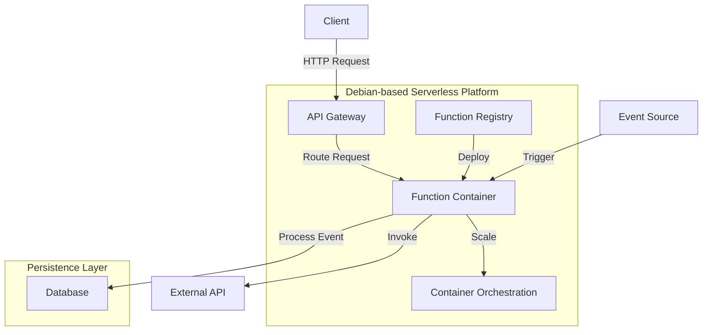

# Debian Serverless

## Introduction

Serverless computing represents a cloud computing execution model where the cloud provider dynamically manages the allocation and provisioning of servers. A serverless architecture allows developers to build and run applications without thinking about servers. Despite the name, physical servers are still used, but developers can focus solely on individual functions in their application code.

Debian, as a stable and versatile Linux distribution, provides an excellent foundation for implementing serverless architectures. This guide explores how to leverage Debian systems within serverless paradigms, focusing on Function as a Service (FaaS) implementations and Debian's integration with popular serverless frameworks.

## Understanding Serverless in the Debian Context

### What is Serverless Computing?

Serverless computing is characterized by:

- No server management required
- Pay-per-execution billing
- Auto-scaling capabilities
- Built-in high availability

Contrary to its name, serverless doesn't mean "no servers"; rather, it means that as a developer, you don't need to manage, provision, or scale servers directly.

### Why Debian for Serverless?

Debian offers several advantages for serverless implementations:

- Stability and reliability
- Minimal resource footprint
- Strong security update policy
- Extensive package ecosystem
- Wide compatibility with cloud providers

## Setting Up Your Debian Environment for Serverless Development

Before diving into serverless frameworks, let's ensure your Debian system is prepared.

### Prerequisites

```bash
# Update your system
sudo apt update && sudo apt upgrade -y

# Install essential development tools
sudo apt install -y build-essential git curl wget unzip

# Install Node.js and npm (required for most serverless frameworks)
curl -fsSL https://deb.nodesource.com/setup_16.x | sudo -E bash -
sudo apt install -y nodejs

# Verify installations
node --version
npm --version
```

Output:
```
v16.19.1
8.19.3
```

## Popular Serverless Frameworks on Debian

### AWS Lambda with Debian

AWS Lambda doesn't directly support Debian as a runtime environment, but you can use container images based on Debian to deploy your functions.

#### Creating a Debian-based Lambda Container

1. First, create a Dockerfile:

```dockerfile
FROM debian:bullseye-slim

# Install runtime dependencies
RUN apt-get update && \
    apt-get install -y \
    python3 \
    python3-pip \
    && rm -rf /var/lib/apt/lists/*

# Copy function code
COPY app.py requirements.txt ./

# Install dependencies
RUN pip3 install -r requirements.txt

# Set the CMD to your handler
CMD [ "python3", "app.py" ]
```

2. Create a simple Python function (app.py):

```python
import json

def handler(event, context):
    return {
        "statusCode": 200,
        "body": json.dumps({
            "message": "Hello from Debian-based Lambda!",
        }),
    }

# Local testing support
if __name__ == "__main__":
    print(handler(None, None))
```

3. Build and deploy:

```bash
# Build the Docker image
docker build -t debian-lambda .

# Tag the image for ECR
docker tag debian-lambda:latest 123456789012.dkr.ecr.us-east-1.amazonaws.com/debian-lambda:latest

# Push to ECR
aws ecr get-login-password --region us-east-1 | docker login --username AWS --password-stdin 123456789012.dkr.ecr.us-east-1.amazonaws.com
docker push 123456789012.dkr.ecr.us-east-1.amazonaws.com/debian-lambda:latest
```

### OpenFaaS on Debian

OpenFaaS is an open-source framework for building serverless functions that can run on any cloud or on-premises. It's particularly well-suited for Debian environments.

#### Installing OpenFaaS on Debian

1. Install Docker:

```bash
sudo apt update
sudo apt install -y apt-transport-https ca-certificates curl gnupg lsb-release
curl -fsSL https://download.docker.com/linux/debian/gpg | sudo gpg --dearmor -o /usr/share/keyrings/docker-archive-keyring.gpg
echo "deb [arch=amd64 signed-by=/usr/share/keyrings/docker-archive-keyring.gpg] https://download.docker.com/linux/debian $(lsb_release -cs) stable" | sudo tee /etc/apt/sources.list.d/docker.list > /dev/null
sudo apt update
sudo apt install -y docker-ce docker-ce-cli containerd.io
```

2. Install Kubernetes (using k3s for simplicity):

```bash
curl -sfL https://get.k3s.io | sh -
```

3. Install OpenFaaS:

```bash
# Install OpenFaaS CLI
curl -sSL https://cli.openfaas.com | sudo sh

# Get OpenFaaS Kubernetes deployment files
git clone https://github.com/openfaas/faas-netes
cd faas-netes

# Deploy OpenFaaS
kubectl apply -f namespaces.yml
kubectl -n openfaas create secret generic basic-auth \
  --from-literal=basic-auth-user=admin \
  --from-literal=basic-auth-password=admin
kubectl apply -f ./yaml/
```

4. Create your first function:

```bash
# Log in to OpenFaaS
PASSWORD=$(kubectl get secret -n openfaas basic-auth -o jsonpath="{.data.basic-auth-password}" | base64 --decode)
echo $PASSWORD | faas-cli login -u admin --password-stdin

# Create a new function
faas-cli new --lang python3 hello-debian
```

This creates a new directory structure with your function:

```
hello-debian/
├── hello-debian.yml
└── hello-debian
    └── handler.py
```

5. Edit the handler.py file:

```python
def handle(req):
    """
    Function handler for processing incoming requests
    """
    return "Hello from Debian OpenFaaS function!"
```

6. Build, push, and deploy your function:

```bash
faas-cli up -f hello-debian.yml
```

7. Invoke your function:

```bash
echo "Testing" | faas-cli invoke hello-debian
```

Output:
```
Hello from Debian OpenFaaS function!
```

## Apache OpenWhisk on Debian

Apache OpenWhisk is an open-source, distributed serverless platform that executes functions in response to events.

### Installing OpenWhisk on Debian

1. Prerequisites:

```bash
sudo apt update
sudo apt install -y nodejs npm docker.io docker-compose git
```

2. Clone OpenWhisk repository:

```bash
git clone https://github.com/apache/openwhisk.git
cd openwhisk
```

3. Configure and deploy:

```bash
# Copy default configuration
cp ./ansible/environments/local/template.env ./ansible/environments/local/.env

# Deploy OpenWhisk
./gradlew core:standalone:bootRun
```

4. Install OpenWhisk CLI:

```bash
wget https://github.com/apache/openwhisk-cli/releases/download/latest/OpenWhisk_CLI-latest-linux-amd64.tgz
tar -xzf OpenWhisk_CLI-latest-linux-amd64.tgz
sudo mv wsk /usr/local/bin/
```

5. Configure the CLI:

```bash
wsk property set --apihost 'http://localhost:3233' --auth '23bc46b1-71f6-4ed5-8c54-816aa4f8c502:123zO3xZCLrMN6v2BKK1dXYFpXlPkccOFqm12CdAsMgRU4VrNZ9lyGVCGuMDGIwP'
```

6. Create and invoke a simple action:

```bash
# Create an action file hello.js
cat > hello.js << 'EOF'
function main() {
    return {payload: 'Hello from OpenWhisk on Debian!'};
}
EOF

# Create the action
wsk action create helloDebian hello.js

# Invoke the action
wsk action invoke --result helloDebian
```

Output:
```json
{
    "payload": "Hello from OpenWhisk on Debian!"
}
```

## Building a Complete Serverless Application on Debian

Let's create a practical example: a serverless API for a simple note-taking application using OpenFaaS on Debian.

### Project Structure

```
notes-app/
├── create-note/
│   ├── handler.py
│   └── requirements.txt
├── get-notes/
│   ├── handler.py
│   └── requirements.txt
├── delete-note/
│   ├── handler.py
│   └── requirements.txt
└── stack.yml
```

### Implementation

1. Create the project structure:

```bash
mkdir -p notes-app/{create-note,get-notes,delete-note}
cd notes-app
```

2. Define the stack.yml:

```yaml
version: 1.0
provider:
  name: openfaas
  gateway: http://127.0.0.1:8080

functions:
  create-note:
    lang: python3
    handler: ./create-note
    image: username/create-note:latest
    environment:
      DATABASE_URL: redis://redis:6379
    secrets:
      - db-secret

  get-notes:
    lang: python3
    handler: ./get-notes
    image: username/get-notes:latest
    environment:
      DATABASE_URL: redis://redis:6379
    secrets:
      - db-secret

  delete-note:
    lang: python3
    handler: ./delete-note
    image: username/delete-note:latest
    environment:
      DATABASE_URL: redis://redis:6379
    secrets:
      - db-secret
```

3. Create the create-note function:

Create `create-note/handler.py`:

```python
import json
import redis
import os
import uuid
from datetime import datetime

def handle(req):
    """Create a new note"""
    try:
        # Parse request
        request_data = json.loads(req)
        title = request_data.get('title', '')
        content = request_data.get('content', '')
        
        # Validate input
        if not title or not content:
            return json.dumps({"error": "Title and content are required"}), 400
        
        # Connect to Redis
        r = redis.Redis.from_url(os.environ['DATABASE_URL'])
        
        # Create note object
        note_id = str(uuid.uuid4())
        note = {
            "id": note_id,
            "title": title,
            "content": content,
            "created_at": datetime.now().isoformat()
        }
        
        # Save to Redis
        r.hset("notes", note_id, json.dumps(note))
        
        return json.dumps({"message": "Note created", "note": note})
    except Exception as e:
        return json.dumps({"error": str(e)}), 500
```

Create `create-note/requirements.txt`:

```
redis==4.3.4
```

4. Create the get-notes function:

Create `get-notes/handler.py`:

```python
import json
import redis
import os

def handle(req):
    """Get all notes or a specific note by ID"""
    try:
        # Connect to Redis
        r = redis.Redis.from_url(os.environ['DATABASE_URL'])
        
        # Parse request
        request_data = json.loads(req) if req else {}
        note_id = request_data.get('id', None)
        
        # Get specific note or all notes
        if note_id:
            note_json = r.hget("notes", note_id)
            if not note_json:
                return json.dumps({"error": "Note not found"}), 404
            return note_json.decode('utf-8')
        else:
            # Get all notes
            notes = []
            for _, note_json in r.hgetall("notes").items():
                notes.append(json.loads(note_json))
            
            return json.dumps({"notes": notes})
    except Exception as e:
        return json.dumps({"error": str(e)}), 500
```

Create `get-notes/requirements.txt`:

```
redis==4.3.4
```

5. Create the delete-note function:

Create `delete-note/handler.py`:

```python
import json
import redis
import os

def handle(req):
    """Delete a note by ID"""
    try:
        # Parse request
        request_data = json.loads(req)
        note_id = request_data.get('id', None)
        
        # Validate input
        if not note_id:
            return json.dumps({"error": "Note ID is required"}), 400
        
        # Connect to Redis
        r = redis.Redis.from_url(os.environ['DATABASE_URL'])
        
        # Check if note exists
        if not r.hexists("notes", note_id):
            return json.dumps({"error": "Note not found"}), 404
        
        # Delete note
        r.hdel("notes", note_id)
        
        return json.dumps({"message": "Note deleted successfully"})
    except Exception as e:
        return json.dumps({"error": str(e)}), 500
```

Create `delete-note/requirements.txt`:

```
redis==4.3.4
```

6. Deploy Redis as a backing service:

```bash
# Deploy Redis
kubectl create deployment redis --image=redis:alpine
kubectl expose deployment redis --port=6379

# Create a secret for database credentials
kubectl create secret generic db-secret --from-literal=db-password=your_password
```

7. Deploy the functions:

```bash
faas-cli up -f stack.yml
```

8. Test the API:

```bash
# Create a note
curl -X POST http://localhost:8080/function/create-note \
  -d '{"title":"My First Note","content":"This is a test note"}'

# Get all notes
curl http://localhost:8080/function/get-notes

# Delete a note (replace note_id with actual ID)
curl -X POST http://localhost:8080/function/delete-note \
  -d '{"id":"note_id_here"}'
```

## Architectural Pattern: Event-Driven Debian Serverless



The diagram above shows a typical event-driven architecture for a Debian-based serverless application. Events can originate from HTTP requests, database changes, message queues, or scheduled triggers.

## Performance Optimization for Debian Serverless Applications

### Cold Start Optimization

Cold starts occur when a function executes after being idle. To minimize cold start times on Debian-based functions:

1. Keep function dependencies minimal:

```bash
# Analyze dependencies
pip install pipdeptree
pipdeptree -f | grep -v '^\s' | wc -l
```

2. Use slim Debian base images:

```dockerfile
# Instead of 
FROM debian:bullseye

# Use
FROM debian:bullseye-slim
```

3. Implement function warming:

```bash
# Create a cron job to periodically invoke functions
echo "*/5 * * * * curl -s http://localhost:8080/function/my-function > /dev/null" | crontab -
```

### Memory Optimization

1. Profile your function's memory usage:

```bash
# Add memory profiling to your function
pip install memory-profiler

# In your function:
from memory_profiler import profile

@profile
def my_function():
    # Function code
    pass
```

2. Use environment variable settings to allocate appropriate memory:

```yaml
functions:
  create-note:
    # ... other settings
    limits:
      memory: 128Mi
```

## Security Considerations for Debian Serverless

### Function Isolation

When running serverless functions on Debian systems, proper isolation is crucial:

1. Use container security features:

```bash
# Run containers with security options
docker run --security-opt=no-new-privileges --cap-drop=ALL debian-function
```

2. Apply Debian security updates automatically:

```bash
# Install unattended-upgrades
sudo apt install unattended-upgrades

# Configure security updates
sudo dpkg-reconfigure -plow unattended-upgrades
```

### Secret Management

Never hardcode sensitive information in your functions:

```python
# Bad - hardcoded credentials
db_password = "my_secret_password"

# Good - environment variables
import os
db_password = os.environ.get("DB_PASSWORD")
```

Use Kubernetes secrets or cloud provider secret management:

```bash
# Create a secret
kubectl create secret generic api-secret --from-literal=api-key=YOUR_API_KEY

# Reference in function deployment
functions:
  my-function:
    secrets:
      - api-secret
```

## Monitoring and Observability

### Prometheus and Grafana

1. Install Prometheus for metrics:

```bash
# Deploy Prometheus operator
kubectl apply -f https://raw.githubusercontent.com/prometheus-operator/prometheus-operator/master/bundle.yaml
```

2. Configure function metrics:

```yaml
functions:
  my-function:
    annotations:
      prometheus.io/scrape: "true"
      prometheus.io/port: "8080"
```

### Logging

Implement structured logging in your functions:

```python
import json
import logging

# Configure logger
logging.basicConfig(level=logging.INFO)
logger = logging.getLogger()

def handle(req):
    logger.info(json.dumps({
        "event": "function_invoked",
        "data": {
            "request_id": "12345",
            "timestamp": "2023-03-10T15:30:45Z"
        }
    }))
    # Function code
```

## Summary

Debian provides an excellent foundation for serverless architectures, offering stability, security, and compatibility with major serverless frameworks. In this guide, we've explored:

- Setting up Debian environments for serverless development
- Working with serverless frameworks like AWS Lambda, OpenFaaS, and OpenWhisk
- Building a complete serverless application
- Optimizing performance and security
- Implementing monitoring and observability

By leveraging Debian's strengths in the serverless world, developers can create reliable, scalable, and efficient cloud-native applications without the operational burden of server management.

## Additional Resources

- [Debian Cloud Documentation](https://cloud.debian.org/images/cloud/)
- [OpenFaaS Documentation](https://docs.openfaas.com/)
- [OpenWhisk GitHub Repository](https://github.com/apache/openwhisk)
- [Kubernetes Documentation](https://kubernetes.io/docs/home/)

## Exercises

1. Create a simple "Hello World" function using OpenFaaS on Debian and measure its cold start time.
2. Extend the notes application to include user authentication.
3. Implement a serverless ETL pipeline on Debian that processes CSV files and stores the results in a database.
4. Build a Debian-based image recognition service using a pre-trained model with serverless functions.
5. Design a multi-stage CI/CD pipeline for deploying serverless functions to production, staging, and development environments.