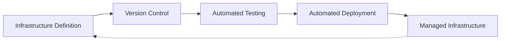
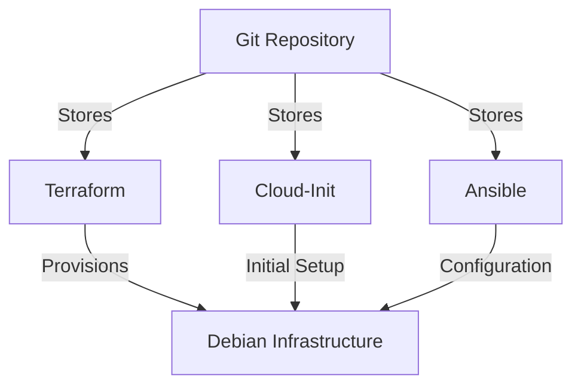

# Debian Infrastructure as Code

## Introduction

Infrastructure as Code (IaC) represents a paradigm shift in how we manage and provision computing infrastructure. Rather than manually configuring servers or using custom scripts, IaC allows us to define our infrastructure using declarative code and version control systems. In the context of Debian-based systems, this approach enables consistent, repeatable, and scalable deployment of Debian environments across various platforms.

This guide introduces you to Infrastructure as Code concepts specifically tailored for Debian systems. You'll learn how to automate the provisioning, configuration, and management of Debian servers using popular IaC tools, enabling you to build robust cloud infrastructure efficiently.

## What is Infrastructure as Code?

Infrastructure as Code is the practice of managing and provisioning computing infrastructure through machine-readable definition files rather than physical hardware configuration or interactive configuration tools. It treats infrastructure configuration like software code:



Key benefits of using IaC with Debian include:

- **Consistency**: Every deployment follows the same configuration
- **Version Control**: Track changes, roll back when needed
- **Automation**: Reduce manual errors and save time
- **Documentation**: Your infrastructure is self-documenting
- **Scalability**: Easily deploy multiple identical environments

## Getting Started with Debian IaC

Let's explore the essential tools and approaches for implementing Infrastructure as Code with Debian systems.

### Prerequisites

Before you begin, ensure you have:

- Basic knowledge of Debian Linux
- Familiarity with command-line operations
- A Debian-based system (local or cloud-based)
- Git for version control

## Popular IaC Tools for Debian

Several tools work well with Debian for Infrastructure as Code implementation:

### 1. Ansible for Debian Configuration Management

Ansible is a popular choice for Debian systems due to its agentless architecture and straightforward YAML syntax.

#### Installing Ansible on Debian

```bash
# Update package lists
sudo apt update

# Install Ansible
sudo apt install -y ansible
```

#### Example: Creating Your First Ansible Playbook for Debian

Create a file named `debian-web-server.yml`:

```yaml
---
- name: Configure Debian Web Server
  hosts: webservers
  become: yes
  tasks:
    - name: Update apt cache
      apt:
        update_cache: yes
        
    - name: Install Apache web server
      apt:
        name: apache2
        state: present
        
    - name: Start and enable Apache service
      service:
        name: apache2
        state: started
        enabled: yes
        
    - name: Create custom index page
      copy:
        content: "<html><body><h1>Welcome to my Debian web server!</h1></body></html>"
        dest: /var/www/html/index.html
```

Running this playbook:

```bash
ansible-playbook -i inventory.ini debian-web-server.yml
```

Output:
```
PLAY [Configure Debian Web Server] *********************************************

TASK [Gathering Facts] *********************************************************
ok: [webserver1]

TASK [Update apt cache] ********************************************************
changed: [webserver1]

TASK [Install Apache web server] ***********************************************
changed: [webserver1]

TASK [Start and enable Apache service] *****************************************
ok: [webserver1]

TASK [Create custom index page] ************************************************
changed: [webserver1]

PLAY RECAP *********************************************************************
webserver1                 : ok=5    changed=3    unreachable=0    failed=0
```

### 2. Terraform for Debian Infrastructure Provisioning

While Ansible excels at configuration management, Terraform specializes in provisioning the infrastructure itself.

#### Installing Terraform on Debian

```bash
# Add HashiCorp GPG key
curl -fsSL https://apt.releases.hashicorp.com/gpg | sudo apt-key add -

# Add HashiCorp repository
sudo apt-add-repository "deb [arch=amd64] https://apt.releases.hashicorp.com $(lsb_release -cs) main"

# Update package lists
sudo apt update

# Install Terraform
sudo apt install terraform
```

#### Example: Provisioning Debian VMs on a Cloud Provider

Create a file named `main.tf`:

```hcl
provider "aws" {
  region = "us-west-2"
}

resource "aws_instance" "debian_server" {
  ami           = "ami-0bc99f302cbfb3dc9"  # Debian 11 AMI
  instance_type = "t2.micro"
  
  tags = {
    Name = "debian-web-server"
  }
  
  user_data = <<-EOF
              #!/bin/bash
              apt-get update
              apt-get install -y apache2
              echo "<html><body><h1>Hello from Terraform-provisioned Debian!</h1></body></html>" > /var/www/html/index.html
              systemctl enable apache2
              systemctl start apache2
              EOF
}

output "public_ip" {
  value = aws_instance.debian_server.public_ip
}
```

Running Terraform commands:

```bash
# Initialize Terraform
terraform init

# Preview changes
terraform plan

# Apply changes
terraform apply
```

### 3. Cloud-Init for Debian Initial Configuration

Cloud-Init is particularly useful for initial system setup when launching Debian cloud instances.

#### Example: Cloud-Init User Data for Debian

```yaml
#cloud-config
package_update: true
package_upgrade: true

packages:
  - nginx
  - git
  - ufw

write_files:
  - path: /var/www/html/index.html
    content: |
      <!DOCTYPE html>
      <html>
      <head>
        <title>Debian Cloud Server</title>
      </head>
      <body>
        <h1>Hello from my Cloud-Init configured Debian server!</h1>
      </body>
      </html>
    permissions: '0644'

runcmd:
  - systemctl start nginx
  - systemctl enable nginx
  - ufw allow 'Nginx HTTP'
  - ufw --force enable
```

## Combining Tools for Complete Debian IaC Solutions

For comprehensive Infrastructure as Code implementation with Debian, you can combine multiple tools:



### Example: A Complete Debian IaC Workflow

1. **Define Infrastructure**: Use Terraform to define Debian VMs and network configuration
2. **Initial Setup**: Use Cloud-Init for basic system configuration
3. **Configuration Management**: Use Ansible for detailed application setup and ongoing management
4. **Version Control**: Store all configurations in Git
5. **CI/CD**: Implement automated testing and deployment with tools like GitLab CI or GitHub Actions

## Best Practices for Debian IaC

To make the most of Infrastructure as Code with Debian systems:

1. **Use Debian-specific modules and providers** when available
2. **Leverage Debian's package management system** (APT) in your IaC definitions
3. **Implement proper secret management** - never hardcode credentials
4. **Test your infrastructure code** with tools like Molecule (for Ansible) or Terratest
5. **Document your architecture** with diagrams and comprehensive READMEs
6. **Implement proper state management** for your infrastructure
7. **Consider immutable infrastructure** approaches with Debian container images

## Practical Example: Deploying a Multi-Tier Debian Application

Let's combine these concepts to deploy a complete application stack with a web server, application server, and database - all running on Debian.

### 1. Directory Structure

```
debian-app-iac/
├── terraform/
│   ├── main.tf
│   ├── variables.tf
│   └── outputs.tf
├── ansible/
│   ├── inventory/
│   ├── roles/
│   │   ├── common/
│   │   ├── web/
│   │   ├── app/
│   │   └── db/
│   └── site.yml
└── cloud-init/
    ├── web-server.yml
    ├── app-server.yml
    └── db-server.yml
```

### 2. Terraform Configuration (main.tf)

```hcl
provider "aws" {
  region = var.region
}

resource "aws_instance" "web" {
  ami           = var.debian_ami
  instance_type = "t2.micro"
  key_name      = var.key_name
  
  user_data = file("../cloud-init/web-server.yml")
  
  tags = {
    Name = "debian-web"
  }
}

resource "aws_instance" "app" {
  ami           = var.debian_ami
  instance_type = "t2.small"
  key_name      = var.key_name
  
  user_data = file("../cloud-init/app-server.yml")
  
  tags = {
    Name = "debian-app"
  }
}

resource "aws_instance" "db" {
  ami           = var.debian_ami
  instance_type = "t2.medium"
  key_name      = var.key_name
  
  user_data = file("../cloud-init/db-server.yml")
  
  tags = {
    Name = "debian-db"
  }
}

# Output the public IP addresses
output "web_ip" {
  value = aws_instance.web.public_ip
}

output "app_ip" {
  value = aws_instance.app.public_ip
}

output "db_ip" {
  value = aws_instance.db.public_ip
}
```

### 3. Ansible Playbook (site.yml)

```yaml
---
- name: Configure Debian web servers
  hosts: web
  become: yes
  roles:
    - common
    - web

- name: Configure Debian application servers
  hosts: app
  become: yes
  roles:
    - common
    - app

- name: Configure Debian database servers
  hosts: db
  become: yes
  roles:
    - common
    - db
```

### 4. Deployment Process

To deploy this infrastructure:

```bash
# Initialize and apply Terraform configuration
cd terraform
terraform init
terraform apply -auto-approve

# Get the output IPs and add to Ansible inventory
terraform output > ../ansible/inventory/hosts

# Run Ansible playbook to configure servers
cd ../ansible
ansible-playbook -i inventory/hosts site.yml
```

## Advanced Topics

### Containerizing Debian Applications

Taking IaC further with containerization:

```dockerfile
FROM debian:11

RUN apt-get update && apt-get install -y \
    nginx \
    vim \
    curl \
    && apt-get clean \
    && rm -rf /var/lib/apt/lists/*

COPY app/ /var/www/html/

EXPOSE 80

CMD ["nginx", "-g", "daemon off;"]
```

### Monitoring Your Debian Infrastructure

Implementing monitoring as code:

```yaml
---
- name: Set up monitoring on Debian servers
  hosts: all
  become: yes
  tasks:
    - name: Install Prometheus Node Exporter
      apt:
        name: prometheus-node-exporter
        state: present
        
    - name: Start Node Exporter
      service:
        name: prometheus-node-exporter
        state: started
        enabled: yes
        
    - name: Allow Prometheus traffic
      ufw:
        rule: allow
        port: 9100
        proto: tcp
```

## Troubleshooting Common Issues

When implementing IaC with Debian, you might encounter these common issues:

1. **Apt Lock Errors**: When multiple processes try to use apt simultaneously
   ```bash
   # Solution: Wait and retry or use a lock check in your scripts
   while lsof /var/lib/apt/lists/lock >/dev/null 2>&1; do
     sleep 1
   done
   ```

2. **SSH Connection Issues**: When Ansible can't connect to the server
   ```bash
   # Check SSH connectivity
   ssh -i key.pem admin@server-ip
   
   # Use -vvv for verbose Ansible debugging
   ansible-playbook -vvv -i inventory playbook.yml
   ```

3. **Terraform State Conflicts**: When multiple team members update infrastructure
   ```bash
   # Use remote state with locking
   terraform {
     backend "s3" {
       bucket = "terraform-state-bucket"
       key    = "debian-infrastructure/terraform.tfstate"
       region = "us-east-1"
       dynamodb_table = "terraform-locks"
     }
   }
   ```

## Summary

Infrastructure as Code has revolutionized how we manage Debian systems in the cloud. By codifying your infrastructure with tools like Ansible, Terraform, and Cloud-Init, you can achieve:

- **Reproducibility**: Consistently deploy identical Debian environments
- **Scalability**: Easily provision more resources as needed
- **Maintainability**: Manage infrastructure through version control
- **Automation**: Reduce manual tasks and human errors

The combination of Debian's stability and IaC's automation creates powerful, reliable infrastructure that can be version-controlled, tested, and deployed with confidence.

## Additional Resources

To further expand your knowledge on Debian Infrastructure as Code:

- Official Debian Cloud Images: [Debian Cloud](https://cloud.debian.org/)
- Ansible Documentation: [Ansible Docs](https://docs.ansible.com/)
- Terraform Documentation: [Terraform Docs](https://www.terraform.io/docs/)
- Cloud-Init Documentation: [Cloud-Init Docs](https://cloudinit.readthedocs.io/)

## Exercises

1. Create a Terraform configuration to deploy a Debian 11 VM on your preferred cloud provider.
2. Write an Ansible playbook to install and configure a LAMP stack on Debian.
3. Design a Cloud-Init script that secures a Debian server (firewall, SSH hardening, automatic updates).
4. Implement a GitLab CI/CD pipeline that validates and applies your Debian infrastructure code.
5. Create a complete IaC solution that deploys a highly available Debian web application with load balancing.