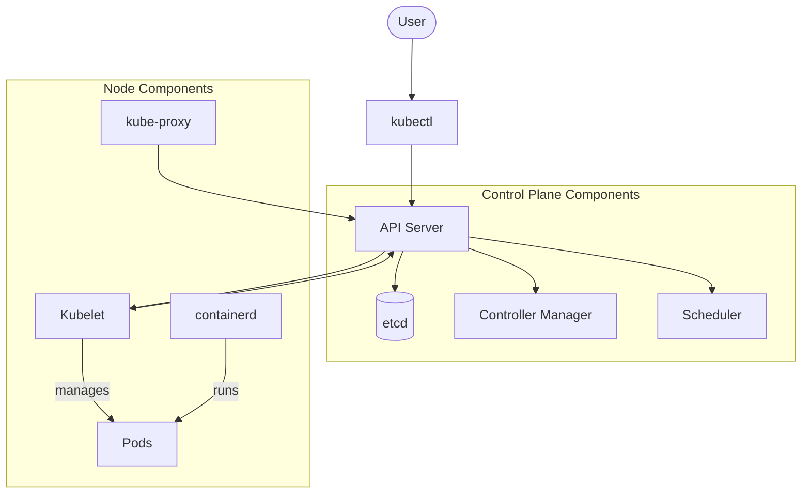

# Debian Kubernetes

## Introduction

Kubernetes (often abbreviated as K8s) is a powerful open-source container orchestration platform designed to automate the deployment, scaling, and management of containerized applications. When combined with Debian, one of the most stable and secure Linux distributions, you get a robust foundation for your cloud infrastructure.

This guide explores how to integrate Kubernetes with Debian systems, providing you with the knowledge to build resilient, scalable container environments on Debian's reliable base. Whether you're setting up a development environment or building production-ready clusters, understanding Debian Kubernetes integration is a valuable skill for modern cloud deployment.

## Prerequisites

Before diving into Debian Kubernetes, make sure you have:

- A Debian 11 (Bullseye) or newer system
- Root or sudo access on your system
- Basic understanding of Linux commands
- Familiarity with container concepts
- At least 2GB RAM and 2 CPU cores for minimal setup

## Installing Kubernetes on Debian

Let's start by installing Kubernetes components on a Debian system:

### 1. Update your system

Always start with updated packages:

```bash
sudo apt update
sudo apt upgrade -y
```

### 2. Install dependencies

```bash
sudo apt install -y apt-transport-https ca-certificates curl gnupg lsb-release
```

### 3. Add Kubernetes repository keys

```bash
curl -fsSL https://packages.cloud.google.com/apt/doc/apt-key.gpg | sudo gpg --dearmor -o /usr/share/keyrings/kubernetes-archive-keyring.gpg
```

### 4. Add the Kubernetes repository

```bash
echo "deb [signed-by=/usr/share/keyrings/kubernetes-archive-keyring.gpg] https://apt.kubernetes.io/ kubernetes-xenial main" | sudo tee /etc/apt/sources.list.d/kubernetes.list
```

### 5. Update package list with new repository

```bash
sudo apt update
```

### 6. Install Kubernetes components

```bash
sudo apt install -y kubelet kubeadm kubectl
sudo apt-mark hold kubelet kubeadm kubectl
```

The `apt-mark hold` command prevents these packages from being automatically updated, ensuring cluster stability.

## Setting Up Container Runtime

Kubernetes requires a container runtime. Let's install containerd:

### 1. Load necessary modules

```bash
cat <<EOF | sudo tee /etc/modules-load.d/containerd.conf
overlay
br_netfilter
EOF

sudo modprobe overlay
sudo modprobe br_netfilter
```

### 2. Set up networking requirements

```bash
cat <<EOF | sudo tee /etc/sysctl.d/99-kubernetes-cri.conf
net.bridge.bridge-nf-call-iptables  = 1
net.bridge.bridge-nf-call-ip6tables = 1
net.ipv4.ip_forward                 = 1
EOF

sudo sysctl --system
```

### 3. Install containerd

```bash
sudo apt install -y containerd
```

### 4. Configure containerd

```bash
sudo mkdir -p /etc/containerd
containerd config default | sudo tee /etc/containerd/config.toml
```

### 5. Update containerd configuration to use systemd cgroup driver

```bash
sudo sed -i 's/SystemdCgroup \= false/SystemdCgroup \= true/g' /etc/containerd/config.toml
```

### 6. Restart containerd

```bash
sudo systemctl restart containerd
```

## Initializing a Kubernetes Cluster

Now let's create a single-node Kubernetes cluster:

### 1. Disable swap (required for Kubernetes)

```bash
sudo swapoff -a
```

For a permanent change, edit `/etc/fstab` and comment out any swap lines.

### 2. Initialize the cluster

```bash
sudo kubeadm init --pod-network-cidr=10.244.0.0/16
```

The output will look something like:

```
Your Kubernetes control-plane has initialized successfully!

To start using your cluster, you need to run the following as a regular user:

  mkdir -p $HOME/.kube
  sudo cp -i /etc/kubernetes/admin.conf $HOME/.kube/config
  sudo chown $(id -u):$(id -g) $HOME/.kube/config

You should now deploy a pod network to the cluster.
Run "kubectl apply -f [podnetwork].yaml" with one of the options listed at:
  https://kubernetes.io/docs/concepts/cluster-administration/addons/

Then you can join any number of worker nodes by running the following on each as root:

kubeadm join 192.168.1.100:6443 --token abcdef.0123456789abcdef \
        --discovery-token-ca-cert-hash sha256:1234567890abcdef1234567890abcdef1234567890abcdef1234567890abcdef
```

### 3. Configure kubectl for the non-root user

```bash
mkdir -p $HOME/.kube
sudo cp -i /etc/kubernetes/admin.conf $HOME/.kube/config
sudo chown $(id -u):$(id -g) $HOME/.kube/config
```

### 4. Install a pod network add-on (Flannel)

```bash
kubectl apply -f https://raw.githubusercontent.com/flannel-io/flannel/master/Documentation/kube-flannel.yml
```

### 5. Allow pods to run on the control-plane node (for single-node clusters)

```bash
kubectl taint nodes --all node-role.kubernetes.io/control-plane-
```

## Verifying Your Cluster

Let's make sure everything is running correctly:

### 1. Check node status

```bash
kubectl get nodes
```

Output should show:

```
NAME        STATUS   ROLES           AGE     VERSION
debian-k8s  Ready    control-plane   5m32s   v1.25.3
```

### 2. Check system pods

```bash
kubectl get pods -n kube-system
```

Output should show all pods in `Running` status:

```
NAME                                READY   STATUS    RESTARTS   AGE
coredns-565d847f94-bjv6m            1/1     Running   0          5m25s
coredns-565d847f94-xnrj6            1/1     Running   0          5m25s
etcd-debian-k8s                     1/1     Running   0          5m40s
kube-apiserver-debian-k8s           1/1     Running   0          5m40s
kube-controller-manager-debian-k8s  1/1     Running   0          5m40s
kube-flannel-ds-amd64-jk8p2         1/1     Running   0          2m15s
kube-proxy-wz5j8                    1/1     Running   0          5m25s
kube-scheduler-debian-k8s           1/1     Running   0          5m40s
```

## Kubernetes Architecture in Debian

Let's understand the architecture of our Debian Kubernetes setup:



## Deploying Your First Application

Let's deploy a simple web application to test our cluster:

### 1. Create a deployment

```bash
kubectl create deployment nginx-demo --image=nginx
```

### 2. Expose the deployment

```bash
kubectl expose deployment nginx-demo --port=80 --type=NodePort
```

### 3. Check the created service

```bash
kubectl get svc nginx-demo
```

Output will show something like:

```
NAME        TYPE       CLUSTER-IP      EXTERNAL-IP   PORT(S)        AGE
nginx-demo  NodePort   10.96.158.234   <none>        80:30007/TCP   10s
```

### 4. Access your application

You can now access your NGINX server at `http://your-debian-ip:30007` (replace 30007 with the actual port from your output).

## Scaling Applications in Kubernetes

One of Kubernetes' strengths is the ability to scale applications easily:

### Scale up deployments

```bash
kubectl scale deployment nginx-demo --replicas=3
```

### Verify scaling

```bash
kubectl get pods
```

Output should show three pods running:

```
NAME                          READY   STATUS    RESTARTS   AGE
nginx-demo-6d4986566c-7vz4f   1/1     Running   0          30s
nginx-demo-6d4986566c-cqz8p   1/1     Running   0          30s
nginx-demo-6d4986566c-xslfr   1/1     Running   0          5m30s
```

## Managing Kubernetes Resources with YAML

While the command line is convenient, defining resources in YAML files provides better version control and repeatability:

### Sample deployment YAML file

Create a file named `webapp-deployment.yaml`:

```yaml
apiVersion: apps/v1
kind: Deployment
metadata:
  name: webapp
  labels:
    app: webapp
spec:
  replicas: 2
  selector:
    matchLabels:
      app: webapp
  template:
    metadata:
      labels:
        app: webapp
    spec:
      containers:
      - name: webapp
        image: nginx:latest
        ports:
        - containerPort: 80
---
apiVersion: v1
kind: Service
metadata:
  name: webapp-service
spec:
  selector:
    app: webapp
  ports:
  - port: 80
    targetPort: 80
    nodePort: 30080
  type: NodePort
```

### Apply the configuration

```bash
kubectl apply -f webapp-deployment.yaml
```

### Verify the resources

```bash
kubectl get pods,svc
```

Output:

```
NAME                          READY   STATUS    RESTARTS   AGE
pod/nginx-demo-6d4986566c-7vz4f   1/1     Running   0          10m
pod/nginx-demo-6d4986566c-cqz8p   1/1     Running   0          10m
pod/nginx-demo-6d4986566c-xslfr   1/1     Running   0          15m
pod/webapp-85c78796d5-b6v4t       1/1     Running   0          1m
pod/webapp-85c78796d5-zx8kt       1/1     Running   0          1m

NAME                   TYPE        CLUSTER-IP       EXTERNAL-IP   PORT(S)        AGE
service/kubernetes     ClusterIP   10.96.0.1        <none>        443/TCP        30m
service/nginx-demo     NodePort    10.96.158.234    <none>        80:30007/TCP   12m
service/webapp-service NodePort    10.110.218.167   <none>        80:30080/TCP   1m
```

## Persistent Storage in Debian Kubernetes

For applications that need to persist data, we can use Persistent Volumes:

### 1. Create a storage class for local storage

Create a file named `local-storage.yaml`:

```yaml
apiVersion: storage.k8s.io/v1
kind: StorageClass
metadata:
  name: local-storage
provisioner: kubernetes.io/no-provisioner
volumeBindingMode: WaitForFirstConsumer
```

Apply it:

```bash
kubectl apply -f local-storage.yaml
```

### 2. Create a persistent volume

Create a directory on your host for storage:

```bash
sudo mkdir -p /mnt/data
```

Create a file named `local-pv.yaml`:

```yaml
apiVersion: v1
kind: PersistentVolume
metadata:
  name: local-pv
spec:
  capacity:
    storage: 1Gi
  accessModes:
  - ReadWriteOnce
  persistentVolumeReclaimPolicy: Retain
  storageClassName: local-storage
  local:
    path: /mnt/data
  nodeAffinity:
    required:
      nodeSelectorTerms:
      - matchExpressions:
        - key: kubernetes.io/hostname
          operator: In
          values:
          - debian-k8s  # Replace with your node name from 'kubectl get nodes'
```

Apply it:

```bash
kubectl apply -f local-pv.yaml
```

### 3. Create a persistent volume claim

Create a file named `local-pvc.yaml`:

```yaml
apiVersion: v1
kind: PersistentVolumeClaim
metadata:
  name: local-pvc
spec:
  accessModes:
  - ReadWriteOnce
  resources:
    requests:
      storage: 1Gi
  storageClassName: local-storage
```

Apply it:

```bash
kubectl apply -f local-pvc.yaml
```

### 4. Create a pod that uses the persistent volume claim

Create a file named `pod-with-pvc.yaml`:

```yaml
apiVersion: v1
kind: Pod
metadata:
  name: task-pv-pod
spec:
  containers:
  - name: task-pv-container
    image: nginx
    ports:
    - containerPort: 80
    volumeMounts:
    - mountPath: "/usr/share/nginx/html"
      name: task-pv-storage
  volumes:
  - name: task-pv-storage
    persistentVolumeClaim:
      claimName: local-pvc
```

Apply it:

```bash
kubectl apply -f pod-with-pvc.yaml
```

## Debian Kubernetes Maintenance

Maintaining your Kubernetes cluster is crucial for long-term stability:

### Updating Kubernetes components

```bash
sudo apt-mark unhold kubelet kubeadm kubectl
sudo apt update && sudo apt upgrade -y kubelet kubeadm kubectl
sudo apt-mark hold kubelet kubeadm kubectl
```

### Upgrading a cluster

For a control plane upgrade:

```bash
sudo kubeadm upgrade plan
sudo kubeadm upgrade apply v1.26.0  # Replace with target version
```

For worker nodes:

```bash
sudo kubeadm upgrade node
sudo systemctl restart kubelet
```

### Backing up etcd

The cluster's state is stored in etcd, so regular backups are important:

```bash
ETCDCTL_API=3 etcdctl --endpoints=https://127.0.0.1:2379 \
  --cacert=/etc/kubernetes/pki/etcd/ca.crt \
  --cert=/etc/kubernetes/pki/etcd/server.crt \
  --key=/etc/kubernetes/pki/etcd/server.key \
  snapshot save /path/to/backup/etcd-snapshot.db
```

## Troubleshooting Debian Kubernetes

Here are some common issues and troubleshooting steps:

### Check node status

```bash
kubectl get nodes
kubectl describe node <node-name>
```

### View pod logs

```bash
kubectl logs <pod-name>
```

### Check pod details

```bash
kubectl describe pod <pod-name>
```

### Common Issues and Solutions

1. **Pods stuck in `Pending` state**
   - Check for resource constraints: `kubectl describe pod <pod-name>`
   - Check if the node is full: `kubectl top nodes`

2. **Pods stuck in `ContainerCreating` state**
   - Check for image pull issues: `kubectl describe pod <pod-name>`
   - Check container runtime: `sudo systemctl status containerd`

3. **Node NotReady**
   - Check kubelet status: `sudo systemctl status kubelet`
   - Check kubelet logs: `sudo journalctl -u kubelet`

## Real-World Application: Deploying a Multi-Tier Web Application

Let's deploy a more complex application - a simple guestbook with Redis:

### 1. Create Redis master deployment and service

Create a file named `redis-master.yaml`:

```yaml
apiVersion: apps/v1
kind: Deployment
metadata:
  name: redis-master
spec:
  selector:
    matchLabels:
      app: redis
      role: master
  replicas: 1
  template:
    metadata:
      labels:
        app: redis
        role: master
    spec:
      containers:
      - name: master
        image: redis
        ports:
        - containerPort: 6379
---
apiVersion: v1
kind: Service
metadata:
  name: redis-master
  labels:
    app: redis
    role: master
spec:
  ports:
  - port: 6379
    targetPort: 6379
  selector:
    app: redis
    role: master
```

Apply it:

```bash
kubectl apply -f redis-master.yaml
```

### 2. Create Redis replica deployment and service

Create a file named `redis-replica.yaml`:

```yaml
apiVersion: apps/v1
kind: Deployment
metadata:
  name: redis-replica
spec:
  selector:
    matchLabels:
      app: redis
      role: replica
  replicas: 2
  template:
    metadata:
      labels:
        app: redis
        role: replica
    spec:
      containers:
      - name: replica
        image: redis
        command:
        - redis-server
        - "--slaveof"
        - "redis-master"
        - "6379"
        ports:
        - containerPort: 6379
---
apiVersion: v1
kind: Service
metadata:
  name: redis-replica
  labels:
    app: redis
    role: replica
spec:
  ports:
  - port: 6379
    targetPort: 6379
  selector:
    app: redis
    role: replica
```

Apply it:

```bash
kubectl apply -f redis-replica.yaml
```

### 3. Create frontend deployment and service

Create a file named `frontend.yaml`:

```yaml
apiVersion: apps/v1
kind: Deployment
metadata:
  name: frontend
spec:
  selector:
    matchLabels:
      app: guestbook
      tier: frontend
  replicas: 3
  template:
    metadata:
      labels:
        app: guestbook
        tier: frontend
    spec:
      containers:
      - name: php-redis
        image: us-docker.pkg.dev/google-samples/containers/gke/gb-frontend:v5
        env:
        - name: GET_HOSTS_FROM
          value: dns
        ports:
        - containerPort: 80
---
apiVersion: v1
kind: Service
metadata:
  name: frontend
  labels:
    app: guestbook
    tier: frontend
spec:
  type: NodePort
  ports:
  - port: 80
  selector:
    app: guestbook
    tier: frontend
```

Apply it:

```bash
kubectl apply -f frontend.yaml
```

### 4. Verify the application

```bash
kubectl get pods
kubectl get svc frontend
```

You should be able to access the guestbook application at `http://your-debian-ip:NodePort`.

## Conclusion

In this guide, we've covered everything you need to know to get started with Kubernetes on Debian systems. We've explored installation, basic operations, application deployment, scaling, persistence, and maintenance. Debian's stability combined with Kubernetes' orchestration capabilities provides an excellent platform for deploying containerized applications.

Remember that Kubernetes is a deep technology with many advanced features not covered here. As you grow more comfortable with the basics, you can explore concepts like:

- Automated deployments with CI/CD pipelines
- Advanced networking with Network Policies
- Access control with RBAC
- Monitoring and logging solutions
- Helm for package management

## Additional Resources

- [Official Kubernetes Documentation](https://kubernetes.io/docs/home/)
- [Debian Wiki: Kubernetes](https://wiki.debian.org/Kubernetes)
- [Kubernetes Patterns Book](https://www.oreilly.com/library/view/kubernetes-patterns/9781492050278/)
- [Kubernetes Up and Running](https://www.oreilly.com/library/view/kubernetes-up-and/9781492046523/)

## Exercises

1. Deploy a stateful application like WordPress with a MySQL database.
2. Set up a monitoring stack with Prometheus and Grafana.
3. Create a CI/CD pipeline that automatically deploys to your Kubernetes cluster.
4. Implement auto-scaling for your application based on CPU usage.
5. Set up network policies to secure your applications.

Happy containerizing with Debian Kubernetes!