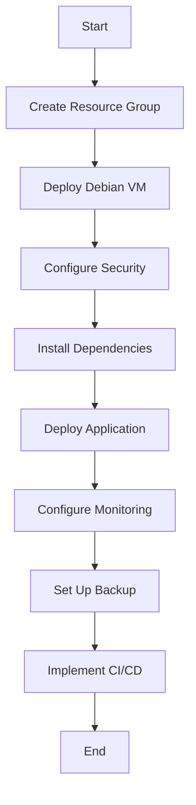

# Debian Azure Integration

## Introduction

Debian Azure Integration refers to the process of deploying, managing, and optimizing Debian Linux distributions within Microsoft's Azure cloud computing platform. This integration brings together the stability and security of Debian with the scalability and global reach of Azure, creating a powerful environment for application development and deployment.

Debian, known for its commitment to free software principles and stable releases, has become a popular choice for cloud deployments. Microsoft Azure actively supports Debian as a first-class citizen in its marketplace, offering optimized images and specialized tools to ensure seamless integration.

In this guide, we'll explore how to effectively integrate Debian with Azure, from initial deployment to advanced configuration and maintenance tasks.

## Understanding Debian on Azure

### What Makes Debian a Good Choice for Azure?

Debian offers several advantages when deployed on Azure:

- **Stability**: Debian's thorough testing process ensures reliable operation in production environments
- **Security**: Regular security updates and a proactive security team
- **Compatibility**: Excellent support for a wide range of applications and services
- **Community**: A large, active community providing support and resources
- **Flexibility**: Available in multiple versions (Stable, Testing, Unstable) to meet different needs

### Available Debian Images on Azure

Azure Marketplace offers several Debian images:

| Debian Version | Codename | Support Status | Notable Features |
|----------------|----------|----------------|------------------|
| Debian 12      | Bookworm | Current Stable | Modern kernel, systemd, up-to-date packages |
| Debian 11      | Bullseye | Old Stable     | Long-term support, widely used |
| Debian 10      | Buster   | Legacy         | Extended security support available |

## Getting Started with Debian on Azure

### Deploying a Debian VM on Azure

Let's walk through the process of deploying a Debian virtual machine on Azure using the Azure CLI:

```bash
# Login to Azure
az login

# Create a resource group
az group create --name debian-resource-group --location eastus

# Create a Debian VM
az vm create \
  --resource-group debian-resource-group \
  --name debian-vm \
  --image Debian:debian-12:12:latest \
  --admin-username azureuser \
  --generate-ssh-keys \
  --size Standard_B1s

# Output will include public IP address and other VM details
```

This command creates a Debian 12 (Bookworm) VM with:
- A randomly generated SSH key pair (or uses existing keys)
- The Standard_B1s size (1 vCPU, 1 GB RAM) - good for testing
- Default settings for networking and storage

### Connecting to Your Debian VM

Once the VM is deployed, you can connect to it using SSH:

```bash
# Connect using the public IP displayed in the output of the previous command
ssh azureuser@<public-ip-address>

# Expected output:
# The authenticity of host '<public-ip-address>' can't be established.
# ECDSA key fingerprint is SHA256:AbCdEfGhIjKlMnOpQrStUvWxYz123456789.
# Are you sure you want to continue connecting (yes/no/[fingerprint])? yes
# Warning: Permanently added '<public-ip-address>' (ECDSA) to the list of known hosts.
# Linux debian-vm 6.1.0-17-amd64 #1 SMP PREEMPT_DYNAMIC Debian 6.1.69-1 (2023-12-30) x86_64
# 
# The programs included with the Debian GNU/Linux system are free software;
# the exact distribution terms for each program are described in the
# individual files in /usr/share/doc/*/copyright.
# 
# Debian GNU/Linux comes with ABSOLUTELY NO WARRANTY, to the extent
# permitted by applicable law.
# azureuser@debian-vm:~$
```

## Optimizing Debian for Azure

### Azure-Specific Packages

Debian includes several packages specifically designed for Azure integration:

```bash
# Install Azure-specific packages
sudo apt update
sudo apt install -y \
  waagent \
  cloud-init \
  cloud-utils \
  azure-cli

# Expected output:
# Reading package lists... Done
# Building dependency tree... Done
# Reading state information... Done
# ...
# azure-cli is already the newest version (...)
# ...
# 0 upgraded, 0 newly installed, 0 to remove and 0 not upgraded.
```

Key packages include:
- **waagent**: The Azure Linux Agent that handles communication with the Azure platform
- **cloud-init**: Industry-standard configuration tool for cloud instances
- **cloud-utils**: Utilities for cloud instance management
- **azure-cli**: Command-line tools for Azure management (can be installed directly on Debian)

### Understanding the Azure Linux Agent (waagent)

The Azure Linux Agent (waagent) plays a crucial role in Debian-Azure integration:

```bash
# Check the status of the Azure Linux Agent
sudo systemctl status walinuxagent

# Expected output:
# ● walinuxagent.service - Azure Linux Agent
#      Loaded: loaded (/lib/systemd/system/walinuxagent.service; enabled; vendor preset: enabled)
#      Active: active (running) since Mon 2023-01-09 12:34:56 UTC; 2h 7min ago
#    Main PID: 1234 (python3)
#       Tasks: 9 (limit: 4915)
#      Memory: 98.2M
#         CPU: 25.693s
#      CGroup: /system.slice/walinuxagent.service
#              └─1234 /usr/bin/python3 -u /usr/sbin/waagent -daemon
```

The agent handles several important functions:
- VM provisioning and configuration
- Communication with the Azure fabric
- Image handling and deployments
- Networking configuration
- Extension management

## Cloud-Init Configuration for Debian on Azure

Cloud-init is the industry standard for early initialization of cloud instances. On Debian Azure VMs, it's used to configure various aspects of the system during first boot.

### Sample Cloud-Init Configuration

Here's a basic cloud-init configuration file for a Debian VM on Azure:

```yaml
#cloud-config
package_upgrade: true
packages:
  - nginx
  - postgresql
  - git

write_files:
  - path: /var/www/html/index.html
    content: |
      <!DOCTYPE html>
      <html>
        <head>
          <title>Debian on Azure</title>
        </head>
        <body>
          <h1>Hello from Debian on Azure!</h1>
          <p>This instance was configured using cloud-init.</p>
        </body>
      </html>
    permissions: '0644'

runcmd:
  - systemctl enable nginx
  - systemctl start nginx
  - echo "Setup complete!" > /tmp/setup_complete
```

This configuration:
1. Updates all packages
2. Installs nginx, PostgreSQL, and git
3. Creates a simple HTML file
4. Enables and starts the nginx service

### Applying Cloud-Init to a New VM

To deploy a Debian VM with this configuration:

```bash
# Save the above cloud-init config to a file named cloud-init.yml
# Then deploy a VM using this configuration

az vm create \
  --resource-group debian-resource-group \
  --name debian-web-vm \
  --image Debian:debian-12:12:latest \
  --admin-username azureuser \
  --generate-ssh-keys \
  --custom-data cloud-init.yml \
  --size Standard_B2s

# Open port 80 for web traffic
az vm open-port \
  --resource-group debian-resource-group \
  --name debian-web-vm \
  --port 80
```

After deployment (which may take a few minutes for cloud-init to complete), you can access the nginx web server at the VM's public IP address.

## Networking and Security

### Virtual Network Configuration

Azure Virtual Networks integrate well with Debian VMs:

```bash
# Create a virtual network and subnet
az network vnet create \
  --resource-group debian-resource-group \
  --name debian-vnet \
  --address-prefix 10.0.0.0/16 \
  --subnet-name debian-subnet \
  --subnet-prefix 10.0.1.0/24

# Create a VM in the specific virtual network
az vm create \
  --resource-group debian-resource-group \
  --name debian-net-vm \
  --image Debian:debian-12:12:latest \
  --admin-username azureuser \
  --generate-ssh-keys \
  --vnet-name debian-vnet \
  --subnet debian-subnet
```

### Network Security Groups

To secure your Debian VMs, Azure uses Network Security Groups (NSGs):

```bash
# Create a network security group
az network nsg create \
  --resource-group debian-resource-group \
  --name debian-nsg

# Add a rule to allow SSH
az network nsg rule create \
  --resource-group debian-resource-group \
  --nsg-name debian-nsg \
  --name AllowSSH \
  --priority 1000 \
  --destination-port-ranges 22 \
  --access Allow \
  --protocol Tcp

# Associate the NSG with a network interface
az network nic update \
  --resource-group debian-resource-group \
  --name debian-net-vmVMNic \
  --network-security-group debian-nsg
```

## Automating Debian Deployments on Azure

### ARM Templates

Azure Resource Manager (ARM) templates allow for repeatable, consistent deployments. Here's a simplified ARM template for deploying a Debian VM:

```json
{
  "$schema": "https://schema.management.azure.com/schemas/2019-04-01/deploymentTemplate.json#",
  "contentVersion": "1.0.0.0",
  "parameters": {
    "vmName": {
      "type": "string",
      "defaultValue": "debian-vm"
    },
    "adminUsername": {
      "type": "string",
      "metadata": {
        "description": "Username for the Virtual Machine."
      }
    },
    "adminPasswordOrKey": {
      "type": "securestring",
      "metadata": {
        "description": "SSH Key or password for the Virtual Machine."
      }
    },
    "authenticationType": {
      "type": "string",
      "defaultValue": "sshPublicKey",
      "allowedValues": [
        "sshPublicKey",
        "password"
      ],
      "metadata": {
        "description": "Type of authentication to use on the Virtual Machine."
      }
    }
  },
  "variables": {
    "vmSize": "Standard_B1s",
    "imagePublisher": "Debian",
    "imageOffer": "debian-12",
    "imageSku": "12",
    "imageVersion": "latest"
  },
  "resources": [
    {
      "type": "Microsoft.Compute/virtualMachines",
      "apiVersion": "2021-11-01",
      "name": "[parameters('vmName')]",
      "location": "[resourceGroup().location]",
      "properties": {
        "hardwareProfile": {
          "vmSize": "[variables('vmSize')]"
        },
        "storageProfile": {
          "imageReference": {
            "publisher": "[variables('imagePublisher')]",
            "offer": "[variables('imageOffer')]",
            "sku": "[variables('imageSku')]",
            "version": "[variables('imageVersion')]"
          },
          "osDisk": {
            "createOption": "FromImage",
            "managedDisk": {
              "storageAccountType": "Standard_LRS"
            }
          }
        },
        "osProfile": {
          "computerName": "[parameters('vmName')]",
          "adminUsername": "[parameters('adminUsername')]",
          "linuxConfiguration": {
            "disablePasswordAuthentication": true,
            "ssh": {
              "publicKeys": [
                {
                  "path": "[concat('/home/', parameters('adminUsername'), '/.ssh/authorized_keys')]",
                  "keyData": "[parameters('adminPasswordOrKey')]"
                }
              ]
            }
          }
        },
        "networkProfile": {
          "networkInterfaces": [
            {
              "id": "[resourceId('Microsoft.Network/networkInterfaces', concat(parameters('vmName'), 'VMNic'))]"
            }
          ]
        }
      }
    }
  ]
}
```

### Terraform for Debian on Azure

Terraform provides a more infrastructure-as-code approach to deploying Debian on Azure:

```hcl
provider "azurerm" {
  features {}
}

resource "azurerm_resource_group" "example" {
  name     = "debian-resources"
  location = "East US"
}

resource "azurerm_virtual_network" "example" {
  name                = "debian-network"
  address_space       = ["10.0.0.0/16"]
  location            = azurerm_resource_group.example.location
  resource_group_name = azurerm_resource_group.example.name
}

resource "azurerm_subnet" "example" {
  name                 = "internal"
  resource_group_name  = azurerm_resource_group.example.name
  virtual_network_name = azurerm_virtual_network.example.name
  address_prefixes     = ["10.0.2.0/24"]
}

resource "azurerm_network_interface" "example" {
  name                = "debian-nic"
  location            = azurerm_resource_group.example.location
  resource_group_name = azurerm_resource_group.example.name

  ip_configuration {
    name                          = "internal"
    subnet_id                     = azurerm_subnet.example.id
    private_ip_address_allocation = "Dynamic"
    public_ip_address_id          = azurerm_public_ip.example.id
  }
}

resource "azurerm_public_ip" "example" {
  name                = "debian-publicip"
  resource_group_name = azurerm_resource_group.example.name
  location            = azurerm_resource_group.example.location
  allocation_method   = "Dynamic"
}

resource "azurerm_linux_virtual_machine" "example" {
  name                = "debian-machine"
  resource_group_name = azurerm_resource_group.example.name
  location            = azurerm_resource_group.example.location
  size                = "Standard_B1s"
  admin_username      = "adminuser"
  network_interface_ids = [
    azurerm_network_interface.example.id,
  ]
  
  admin_ssh_key {
    username   = "adminuser"
    public_key = file("~/.ssh/id_rsa.pub")
  }

  os_disk {
    caching              = "ReadWrite"
    storage_account_type = "Standard_LRS"
  }

  source_image_reference {
    publisher = "Debian"
    offer     = "debian-12"
    sku       = "12"
    version   = "latest"
  }
}
```

## Advanced Azure Integration

### Azure Monitor Integration

Monitor your Debian VMs using Azure Monitor:

```bash
# Install the Azure Monitor Agent
sudo apt update
sudo apt install -y azuremonitoragent

# Configure data collection using Azure CLI
az monitor data-collection rule create \
  --resource-group debian-resource-group \
  --name debian-data-collection \
  --data-flows "[{\"streams\":[\"Microsoft-Syslog\"],\"destinations\":[\"logAnalyticsWorkspace\"]}]" \
  --destinations "{\"logAnalyticsWorkspaces\":{\"logAnalyticsWorkspace\":{\"name\":\"my-workspace\"}}}" \
  --data-sources "{\"syslog\":[{\"streams\":[\"Microsoft-Syslog\"],\"facilityNames\":[\"syslog\"],\"logLevels\":[\"Alert\",\"Critical\",\"Emergency\"]}]}"
```

### Managed Identities

Debian VMs can use Azure Managed Identities for authentication:

```bash
# Assign a managed identity to a VM
az vm identity assign \
  --resource-group debian-resource-group \
  --name debian-vm

# Install the Azure Identity package
sudo apt install -y azure-identity

# Use managed identity in applications
# Example code snippet showing how to authenticate with managed identity
```

Here's a Python example using managed identity:

```python
from azure.identity import DefaultAzureCredential
from azure.storage.blob import BlobServiceClient

# DefaultAzureCredential will use managed identity when running on Azure
credential = DefaultAzureCredential()

# Connect to Azure Storage using managed identity
blob_service_client = BlobServiceClient(
    account_url="https://mystorageaccount.blob.core.windows.net",
    credential=credential
)

# List containers
containers = blob_service_client.list_containers()
for container in containers:
    print(container.name)
```

## Troubleshooting Debian on Azure

### Common Issues and Solutions

Here are some common issues you might encounter with Debian on Azure and how to resolve them:

| Issue | Symptoms | Solution |
|-------|----------|----------|
| Agent Communication Failure | VM shows as "Not Ready" in Azure | `sudo systemctl restart walinuxagent` |
| Network Connectivity | Unable to connect to external services | Check NSG rules and routes |
| SSH Access Issues | Cannot SSH into VM | Verify SSH keys and NSG rules |
| Disk Space Problems | System running out of space | Use `df -h` to check, consider disk resize |

### Azure Serial Console Access

When traditional SSH access is unavailable, use Azure Serial Console:

```bash
# In the Azure Portal, navigate to:
# Virtual Machine > Support + troubleshooting > Serial console

# At the serial console prompt, log in with your VM credentials
# Example commands to troubleshoot:
dmesg | grep -i error
systemctl status walinuxagent
journalctl -xeu walinuxagent
```

### Diagnosing Boot Issues

If your Debian VM fails to boot properly:

```bash
# Enable boot diagnostics in the Azure Portal
az vm boot-diagnostics enable \
  --resource-group debian-resource-group \
  --name debian-vm

# View the boot diagnostics logs
az vm boot-diagnostics get-boot-log \
  --resource-group debian-resource-group \
  --name debian-vm
```

## Debian Azure Workflow: Real-World Example

Let's walk through a complete example of setting up a web application on Debian in Azure:



### Step-by-Step Implementation

1. **Create Resource Group and Virtual Network**

```bash
# Create resource group
az group create --name debian-app-rg --location eastus

# Create virtual network
az network vnet create \
  --resource-group debian-app-rg \
  --name debian-app-vnet \
  --address-prefix 10.0.0.0/16 \
  --subnet-name web-subnet \
  --subnet-prefix 10.0.1.0/24
```

2. **Deploy Debian VM with Web Server**

```bash
# Create cloud-init file
cat > web-cloud-init.yml << EOF
#cloud-config
package_upgrade: true
packages:
  - nginx
  - nodejs
  - npm
  - git

write_files:
  - path: /etc/nginx/sites-available/webapp
    content: |
      server {
          listen 80;
          server_name _;
          
          location / {
              proxy_pass http://localhost:3000;
              proxy_http_version 1.1;
              proxy_set_header Upgrade \$http_upgrade;
              proxy_set_header Connection 'upgrade';
              proxy_set_header Host \$host;
              proxy_cache_bypass \$http_upgrade;
          }
      }

runcmd:
  - ln -s /etc/nginx/sites-available/webapp /etc/nginx/sites-enabled/
  - systemctl restart nginx
  - mkdir -p /opt/webapp
  - git clone https://github.com/example/webapp.git /opt/webapp
  - cd /opt/webapp && npm install
  - npm install -g pm2
  - pm2 start /opt/webapp/app.js
  - pm2 startup systemd
  - pm2 save
EOF

# Deploy VM with cloud-init
az vm create \
  --resource-group debian-app-rg \
  --name debian-web-vm \
  --image Debian:debian-12:12:latest \
  --admin-username azureuser \
  --generate-ssh-keys \
  --custom-data web-cloud-init.yml \
  --vnet-name debian-app-vnet \
  --subnet web-subnet \
  --public-ip-address-allocation static \
  --size Standard_B2s

# Open port 80
az vm open-port \
  --resource-group debian-app-rg \
  --name debian-web-vm \
  --port 80
```

3. **Set Up Application Insights**

```bash
# Create Application Insights resource
az monitor app-insights component create \
  --app debian-webapp-insights \
  --location eastus \
  --resource-group debian-app-rg \
  --kind web

# Get the instrumentation key
APPINSIGHTS_KEY=$(az monitor app-insights component show \
  --app debian-webapp-insights \
  --resource-group debian-app-rg \
  --query instrumentationKey -o tsv)

# SSH to the VM and configure App Insights
ssh azureuser@<vm-public-ip> "echo \"APPINSIGHTS_INSTRUMENTATIONKEY=$APPINSIGHTS_KEY\" >> /opt/webapp/.env && pm2 restart all"
```

4. **Set Up Database**

```bash
# Create Azure Database for PostgreSQL
az postgres server create \
  --resource-group debian-app-rg \
  --name debian-app-db \
  --location eastus \
  --admin-user dbadmin \
  --admin-password "ComplexPassword123!" \
  --sku-name GP_Gen5_2

# Configure firewall rules
az postgres server firewall-rule create \
  --resource-group debian-app-rg \
  --server-name debian-app-db \
  --name AllowVNet \
  --start-ip-address 10.0.1.0 \
  --end-ip-address 10.0.1.255
```

5. **Set Up Backup**

```bash
# Create a Recovery Services vault
az backup vault create \
  --resource-group debian-app-rg \
  --name debian-backup-vault \
  --location eastus

# Enable backup for the VM
az backup protection enable-for-vm \
  --resource-group debian-app-rg \
  --vault-name debian-backup-vault \
  --vm debian-web-vm \
  --policy-name DefaultPolicy
```

## Performance Tuning Debian for Azure

### Filesystem Considerations

Optimizing the filesystem for Azure:

```bash
# Install the azure-tuned package
sudo apt update
sudo apt install -y azure-tuned

# Enable and start the service
sudo systemctl enable azure-tuned
sudo systemctl start azure-tuned

# Check that optimizations are applied
sudo azure-tuned status

# Expected output:
# Azure tuning daemon is running
# Current profile: azure
# Optimizations applied: disk I/O scheduler, network tuning, memory management
```

### Disk Performance

To optimize disk performance on Debian Azure VMs:

```bash
# Check current I/O scheduler
cat /sys/block/sda/queue/scheduler

# Set to deadline scheduler for better performance
echo 'deadline' | sudo tee /sys/block/sda/queue/scheduler

# For persistent setting, add to /etc/default/grub
sudo sed -i 's/GRUB_CMDLINE_LINUX=""/GRUB_CMDLINE_LINUX="elevator=deadline"/' /etc/default/grub
sudo update-grub
```

### Network Optimization

```bash
# Enable TCP BBR congestion control
echo 'net.core.default_qdisc=fq' | sudo tee -a /etc/sysctl.conf
echo 'net.ipv4.tcp_congestion_control=bbr' | sudo tee -a /etc/sysctl.conf
sudo sysctl -p

# Optimize for Azure network
cat > /etc/sysctl.d/60-azure-network-optimizations.conf << EOF
# Increase TCP window size
net.core.rmem_max=16777216
net.core.wmem_max=16777216
net.ipv4.tcp_rmem=4096 87380 16777216
net.ipv4.tcp_wmem=4096 65536 16777216

# Increase number of connections
net.core.somaxconn=65535
EOF

sudo sysctl -p /etc/sysctl.d/60-azure-network-optimizations.conf
```

## Summary

In this guide, we've explored how to effectively integrate Debian Linux with Microsoft Azure. We've covered:

1. Deploying Debian VMs on Azure using multiple methods
2. Configuring and optimizing Debian for the Azure environment
3. Network and security considerations
4. Automation through ARM templates and Terraform
5. Advanced integrations with Azure services
6. Troubleshooting common issues
7. Real-world deployment examples
8. Performance tuning for optimal operation

Debian on Azure combines the stability and flexibility of Debian Linux with the scalability and global reach of Microsoft Azure. This powerful combination provides a solid foundation for a wide range of applications, from simple web servers to complex, mission-critical systems.

## Additional Resources

- [Official Debian Documentation](https://www.debian.org/doc/)
- [Azure Linux Documentation](https://docs.microsoft.com/en-us/azure/virtual-machines/linux/)
- [Cloud-Init Documentation](https://cloudinit.readthedocs.io/)
- [Azure Linux Agent GitHub Repository](https://github.com/Azure/WALinuxAgent)

## Exercises

1. Deploy a Debian VM on Azure and install a LAMP stack (Linux, Apache, MySQL, PHP) using cloud-init.
2. Create a Terraform configuration to deploy multiple Debian VMs in an availability set.
3. Set up a Debian VM with Azure Managed Identity and use it to access Azure Storage without credentials.
4. Configure monitoring for a Debian VM using Azure Monitor and create alert rules.
5. Implement a backup and disaster recovery solution for a Debian VM running a critical application.