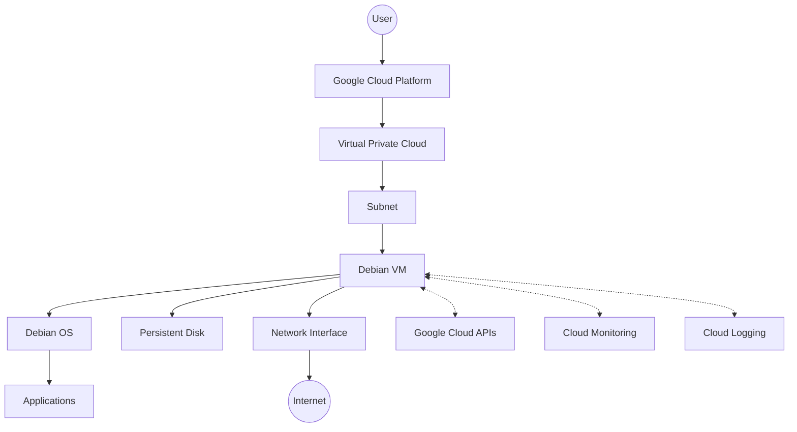

# Debian Google Cloud

## Introduction

Debian is one of the most popular and reliable Linux distributions, known for its stability, security, and extensive software repository. Google Cloud Platform (GCP) is a suite of cloud computing services that provides virtual machines, storage, and other resources to run applications at scale. This guide explores how to work with Debian within Google Cloud, enabling you to leverage the reliability of Debian with the power and flexibility of cloud infrastructure.

Debian on Google Cloud offers several advantages:
- Stable and secure operating system base
- Official images maintained by Google and the Debian community
- Wide range of software packages available through apt
- Consistent environment from development to production
- Cost-effective cloud computing solution

## Getting Started with Debian on Google Cloud

### Prerequisites

Before working with Debian on Google Cloud, you'll need:

1. A Google Cloud account with billing enabled
2. Basic familiarity with Linux command line
3. Google Cloud SDK installed on your local machine (optional but recommended)

### Available Debian Images on Google Cloud

Google Cloud Platform offers several officially supported Debian images:

| Debian Version | Codename | Support Status | Architecture |
|----------------|----------|---------------|--------------|
| Debian 12      | Bookworm | Stable        | x86_64, ARM64 |
| Debian 11      | Bullseye | Old Stable    | x86_64, ARM64 |
| Debian 10      | Buster   | Legacy        | x86_64 |

## Creating a Debian VM on Google Cloud

Let's create a basic Debian virtual machine using the Google Cloud Console.

### Using the Google Cloud Console

1. Navigate to the Google Cloud Console at [https://console.cloud.google.com](https://console.cloud.google.com)
2. Select or create a project
3. Go to "Compute Engine" > "VM instances"
4. Click "Create Instance"
5. Configure your VM:
   - Name: `debian-test-vm`
   - Region and Zone: Select based on your location
   - Machine type: `e2-micro` (for testing)
   - Boot disk: Click "Change" and select "Debian" (choose version)
   - Firewall: Check "Allow HTTP traffic" if needed
6. Click "Create"

### Using Google Cloud CLI

If you prefer using the command line, you can create a Debian VM with the following command:

```bash
# Create a new Debian 12 VM
gcloud compute instances create debian-test-vm \
  --project=your-project-id \
  --zone=us-central1-a \
  --machine-type=e2-micro \
  --network-interface=network=default,subnet=default \
  --maintenance-policy=MIGRATE \
  --provisioning-model=STANDARD \
  --image-project=debian-cloud \
  --image-family=debian-12 \
  --boot-disk-size=10GB \
  --boot-disk-type=pd-balanced
```

The output will look similar to:

```
NAME           ZONE           MACHINE_TYPE  PREEMPTIBLE  INTERNAL_IP  EXTERNAL_IP    STATUS
debian-test-vm  us-central1-a  e2-micro      false        10.0.0.5     34.123.45.67   RUNNING
```

## Connecting to Your Debian VM

### SSH via Google Cloud Console

The easiest way to connect is through the web-based SSH:

1. In the VM instances list, click the "SSH" button next to your VM
2. A browser-based terminal will open, connected to your VM

### SSH via Command Line

For command-line access:

```bash
# Connect via gcloud
gcloud compute ssh debian-test-vm --zone=us-central1-a

# Or use standard SSH if you've set up SSH keys
ssh username@external-ip-address
```

## Managing Your Debian System on Google Cloud

Once connected, you can manage your Debian system as you normally would.

### Updating the System

First, update your package lists and upgrade installed packages:

```bash
# Update package lists
sudo apt update

# Upgrade installed packages
sudo apt upgrade -y
```

### Installing Software

Install software using the apt package manager:

```bash
# Example: Install nginx web server
sudo apt install -y nginx

# Start and enable the service
sudo systemctl start nginx
sudo systemctl enable nginx
```

To verify nginx is running, you can use:

```bash
sudo systemctl status nginx
```

Which should return output similar to:

```
● nginx.service - A high performance web server and a reverse proxy server
     Loaded: loaded (/lib/systemd/system/nginx.service; enabled; vendor preset: enabled)
     Active: active (running) since Mon 2023-09-18 15:20:10 UTC; 5s ago
       Docs: man:nginx(8)
   Main PID: 12345 (nginx)
      Tasks: 5 (limit: 4915)
     Memory: 6.5M
        CPU: 35ms
     CGroup: /system.slice/nginx.service
             ├─12345 "nginx: master process /usr/sbin/nginx -g daemon on; master_process on;"
             ├─12346 "nginx: worker process" "" "" "" "" "" "" "" "" "" "" "" "" "" "" "" "" "" ""
             ├─12347 "nginx: worker process" "" "" "" "" "" "" "" "" "" "" "" "" "" "" "" "" "" ""
             └─12348 "nginx: worker process" "" "" "" "" "" "" "" "" "" "" "" "" "" "" "" "" "" ""
```

## Debian-Specific Features on Google Cloud

### Cloud-Init Integration

Debian images on Google Cloud come pre-configured with cloud-init, which handles initialization tasks when a VM is created or booted:

```bash
# View cloud-init logs
sudo cat /var/log/cloud-init.log

# View cloud-init status
cloud-init status
```

### Google Cloud Integration

Debian VMs on Google Cloud include several integrations:

1. **Google Cloud Agents**: Monitoring and logging agents
2. **OS Login**: Simplified SSH access management
3. **Guest Environment**: Facilitates communication between the VM and Google Cloud

To check if the Google Cloud guest agent is running:

```bash
sudo systemctl status google-guest-agent
```

## Creating a Custom Debian Image

After configuring a Debian VM to your needs, you might want to create a custom image for future deployments.

### Preparing the VM

Before creating an image, prepare your VM:

```bash
# Remove SSH host keys
sudo rm -f /etc/ssh/ssh_host_*

# Clean apt cache
sudo apt clean

# Remove machine-specific info
sudo truncate -s 0 /etc/machine-id
sudo rm -f /var/lib/dbus/machine-id
sudo ln -s /etc/machine-id /var/lib/dbus/machine-id
```

### Creating the Image

Using the Google Cloud Console:

1. Go to "Compute Engine" > "VM instances"
2. Stop your VM
3. Click on your VM name
4. Click "Create image" from the top menu
5. Fill in the image details and click "Create"

Using gcloud CLI:

```bash
# Create custom image from disk
gcloud compute images create debian-custom-image \
  --source-disk=debian-test-vm \
  --source-disk-zone=us-central1-a \
  --family=debian-custom
```

## Automating Debian VM Deployment

For more advanced usage, we can automate the deployment of Debian VMs using Terraform.

Here's a basic Terraform configuration to deploy a Debian VM:

```hcl
provider "google" {
  project = "your-project-id"
  region  = "us-central1"
  zone    = "us-central1-a"
}

resource "google_compute_instance" "debian_vm" {
  name         = "debian-terraform-vm"
  machine_type = "e2-micro"
  
  boot_disk {
    initialize_params {
      image = "debian-cloud/debian-12"
      size  = 10
    }
  }
  
  network_interface {
    network = "default"
    access_config {
      // This creates an external IP
    }
  }
  
  metadata_startup_script = <<-EOF
    #!/bin/bash
    apt update
    apt install -y nginx
    echo "Hello from Debian on Google Cloud!" > /var/www/html/index.html
  EOF
}

output "ip" {
  value = google_compute_instance.debian_vm.network_interface[0].access_config[0].nat_ip
}
```

## Best Practices for Debian on Google Cloud

### Security Recommendations

1. **Keep your system updated**:
   ```bash
   sudo apt update && sudo apt upgrade -y
   ```

2. **Configure a firewall**:
   Google Cloud provides firewall rules, but you can also use iptables:
   ```bash
   sudo apt install -y iptables-persistent
   sudo iptables -A INPUT -p tcp --dport 22 -j ACCEPT
   sudo iptables -A INPUT -p tcp --dport 80 -j ACCEPT
   sudo iptables -A INPUT -m state --state ESTABLISHED,RELATED -j ACCEPT
   sudo iptables -A INPUT -j DROP
   sudo netfilter-persistent save
   ```

3. **Use SSH keys instead of passwords**:
   By default, Google Cloud VMs use SSH keys for authentication.

### Performance Optimization

1. **Choose the right machine type**:
   Match your VM size to your workload requirements

2. **Use a modern kernel**:
   Debian 12 includes kernel optimizations for virtualized environments

3. **Consider using Local SSDs for high I/O workloads**:
   ```bash
   gcloud compute instances create debian-high-perf \
     --image-family=debian-12 \
     --image-project=debian-cloud \
     --local-ssd interface=nvme
   ```

## Troubleshooting Common Issues

### VM Won't Start

If your VM fails to start, check:
1. Quota limits in your Google Cloud project
2. Billing status
3. The Google Cloud Status Dashboard for service disruptions

### Connection Issues

If you can't connect to your VM:
1. Verify the external IP address hasn't changed
2. Check firewall rules allow SSH (port 22)
3. Ensure SSH keys are correctly configured

### Package Installation Problems

If you encounter package installation issues:
1. Ensure your VM has internet access
2. Check that your apt sources list is correct:
   ```bash
   cat /etc/apt/sources.list
   ```
3. Try changing to a different mirror:
   ```bash
   sudo sed -i 's/deb.debian.org/ftp.us.debian.org/g' /etc/apt/sources.list
   sudo apt update
   ```

## Architecture Diagram

Here's a high-level architecture of how Debian integrates with Google Cloud:



## Summary

Debian on Google Cloud provides a powerful, flexible, and cost-effective platform for running applications in the cloud. We've covered the basics of creating and managing Debian VMs, customizing and automating deployment, and following best practices for security and performance.

The integration between Debian and Google Cloud gives you the stability and extensive package repository of Debian combined with the scalability and managed services of Google Cloud Platform.

## Additional Resources

- [Debian Wiki - Cloud Images](https://wiki.debian.org/Cloud/GoogleComputeEngineImage)
- [Google Cloud Documentation - Compute Engine](https://cloud.google.com/compute/docs)
- [Google Cloud CLI Reference](https://cloud.google.com/sdk/gcloud/reference)

## Exercises

1. Create a Debian VM and install a LAMP stack (Linux, Apache, MySQL, PHP)
2. Configure a Debian VM with a static IP and custom domain name
3. Create a custom Debian image with your preferred software pre-installed
4. Set up automatic backups for your Debian VM using Google Cloud Snapshots
5. Deploy a multi-VM Debian architecture with load balancing