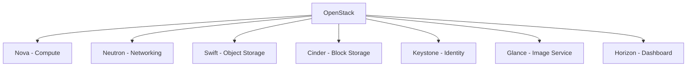

# Debian OpenStack Integration

## Introduction

OpenStack is a powerful open-source cloud computing platform that provides Infrastructure as a Service (IaaS). When integrated with Debian, one of the most stable and security-focused Linux distributions, it creates a robust foundation for cloud deployments. This guide explores how to integrate OpenStack with Debian systems, allowing you to build and manage cloud resources efficiently.

Debian's commitment to stability and security makes it an excellent choice for OpenStack deployments in production environments. The integration between these two open-source technologies offers organizations a cost-effective way to implement private and public cloud infrastructure without vendor lock-in.

## What You'll Learn

- Basic concepts of OpenStack and its architecture
- How to install OpenStack on Debian
- Configuring core OpenStack services
- Managing OpenStack resources via CLI and Dashboard
- Best practices for Debian OpenStack deployments

## Prerequisites

- A Debian 11 (Bullseye) or newer system
- Root or sudo access to your Debian system
- Familiarity with basic Linux commands
- Understanding of networking concepts
- At least 8GB RAM and 20GB disk space for a minimal deployment

## Understanding OpenStack Architecture

Before diving into the installation, it's important to understand OpenStack's modular architecture. OpenStack consists of several core components (services), each responsible for a specific aspect of cloud infrastructure:



- **Nova**: Manages compute resources
- **Neutron**: Provides networking as a service
- **Swift**: Handles object storage
- **Cinder**: Manages block storage
- **Keystone**: Handles authentication and authorization
- **Glance**: Manages VM images
- **Horizon**: Web-based dashboard for management

## Installation Methods

There are two primary methods to install OpenStack on Debian:

1. **Manual Installation**: Installing and configuring each component separately
2. **Deployment Tools**: Using tools like DevStack or OpenStack-Ansible

For beginners, we'll focus on the deployment tool approach as it simplifies the process significantly.

## Installing OpenStack on Debian using DevStack

DevStack is a series of scripts designed to quickly bring up a complete OpenStack environment. It's ideal for development, testing, and learning.

### Step 1: Update Your Debian System

First, ensure your system is up to date:

```bash
sudo apt update
sudo apt upgrade -y
```

### Step 2: Install Git and Clone DevStack

```bash
sudo apt install -y git
git clone https://opendev.org/openstack/devstack
cd devstack
```

### Step 3: Create the local.conf Configuration File

Create a `local.conf` file with the following content:

```ini
[[local|localrc]]
ADMIN_PASSWORD=password
DATABASE_PASSWORD=password
RABBIT_PASSWORD=password
SERVICE_PASSWORD=password

# Disable unwanted services
disable_service n-net
enable_service q-svc
enable_service q-agt
enable_service q-dhcp
enable_service q-l3
enable_service q-meta

# Enable Swift
enable_service s-proxy s-object s-container s-account

# Enable Cinder
enable_service c-api c-vol c-sch

# Set the host IP
HOST_IP=your_server_ip
```

Replace `your_server_ip` with your server's actual IP address.

### Step 4: Run DevStack Installation

```bash
./stack.sh
```

This script will take some time to complete (typically 20-40 minutes) as it downloads and configures all OpenStack components.

### Step 5: Access the OpenStack Dashboard

Once the installation completes, you can access the OpenStack Dashboard (Horizon) by navigating to `http://your_server_ip/dashboard` in your web browser.

Login with:
- Username: `admin`
- Password: The password specified in your `local.conf` file

## Core OpenStack Services Configuration

After installation, you'll need to configure the core services for a production-ready environment. Let's look at some important configurations:

### Keystone (Identity Service)

Create a new project and user:

```bash
# Source the admin credentials
source /opt/stack/devstack/openrc admin admin

# Create a new project
openstack project create --description "Example Project" example-project

# Create a new user
openstack user create --password-prompt example-user

# Add the user to the project with the member role
openstack role add --project example-project --user example-user member
```

### Glance (Image Service)

Upload an image to use for VM instances:

```bash
# Download a Debian cloud image
wget https://cloud.debian.org/images/cloud/bullseye/latest/debian-11-generic-amd64.qcow2

# Upload the image to Glance
openstack image create "Debian 11" \
  --file debian-11-generic-amd64.qcow2 \
  --disk-format qcow2 \
  --container-format bare \
  --public
```

### Neutron (Networking)

Create a private network for your instances:

```bash
# Create a private network
openstack network create private-network

# Create a subnet within the private network
openstack subnet create private-subnet \
  --network private-network \
  --subnet-range 192.168.1.0/24 \
  --gateway 192.168.1.1

# Create a router for external connectivity
openstack router create main-router

# Connect the router to the private subnet
openstack router add subnet main-router private-subnet

# Connect the router to the external network
openstack router set --external-gateway ext-net main-router
```

### Nova (Compute)

Create a flavor (instance type) and launch an instance:

```bash
# Create a flavor
openstack flavor create --ram 2048 --disk 20 --vcpus 2 m1.small

# Create a keypair for SSH access
openstack keypair create --public-key ~/.ssh/id_rsa.pub mykey

# Create security group rules to allow SSH and ICMP
openstack security group rule create --protocol icmp default
openstack security group rule create --protocol tcp --dst-port 22 default

# Launch an instance
openstack server create --flavor m1.small \
  --image "Debian 11" \
  --key-name mykey \
  --network private-network \
  my-first-instance
```

## Managing OpenStack with Debian Cloud Tools

Debian provides several tools that can enhance your OpenStack experience:

### cloud-init

`cloud-init` is a tool that handles early initialization of cloud instances. Install it on your Debian-based images to enable automatic configuration:

```bash
sudo apt install -y cloud-init
```

Configure `/etc/cloud/cloud.cfg` to customize initialization behavior:

```yaml
# Example cloud-init configuration
users:
  - name: debian
    sudo: ALL=(ALL) NOPASSWD:ALL
    shell: /bin/bash
    ssh_authorized_keys:
      - ssh-rsa AAAA...

# Disable cloud-init from managing the system's hostname
preserve_hostname: true
```

### python-openstackclient

For comprehensive CLI management, install the unified OpenStack client:

```bash
sudo apt install -y python3-openstackclient
```

This provides a single command-line interface for all OpenStack services:

```bash
# List all available instances
openstack server list

# Show details of a specific instance
openstack server show my-first-instance

# Create a snapshot of a running instance
openstack server image create --name my-snapshot my-first-instance
```

## Integrating Debian-Specific Features

Debian's package management and stability features can be leveraged to enhance your OpenStack deployment:

### Using apt Repository Mirroring

Set up a local mirror of Debian packages to speed up instance provisioning:

```bash
sudo apt install -y apt-mirror

# Configure apt-mirror
sudo vi /etc/apt/mirror.list

# Add the following lines:
deb http://deb.debian.org/debian bullseye main contrib non-free
deb http://security.debian.org/debian-security bullseye-security main contrib non-free
deb http://deb.debian.org/debian bullseye-updates main contrib non-free

# Run the mirror
sudo apt-mirror
```

Then configure your OpenStack images to use this mirror by modifying their `/etc/apt/sources.list`.

### Automating Debian Updates

Create a Heat template (OpenStack orchestration) to automate Debian updates on your instances:

```yaml
heat_template_version: 2018-08-31

description: Template to deploy a Debian instance with automatic updates

resources:
  debian_server:
    type: OS::Nova::Server
    properties:
      image: Debian 11
      flavor: m1.small
      key_name: mykey
      networks:
        - network: private-network
      user_data: |
        #!/bin/bash
        apt update
        apt install -y unattended-upgrades apt-listchanges
        echo 'APT::Periodic::Update-Package-Lists "1";' > /etc/apt/apt.conf.d/20auto-upgrades
        echo 'APT::Periodic::Unattended-Upgrade "1";' >> /etc/apt/apt.conf.d/20auto-upgrades
        systemctl restart unattended-upgrades
```

Save this as `debian-auto-updates.yaml` and deploy it with:

```bash
openstack stack create -t debian-auto-updates.yaml auto-update-stack
```

## Advanced Integration: Kubernetes on Debian OpenStack

For more complex cloud-native applications, you can deploy Kubernetes on your Debian OpenStack infrastructure:

1. Create a template for Kubernetes nodes:

```bash
# Create a specialized flavor for Kubernetes
openstack flavor create --ram 4096 --disk 40 --vcpus 2 k8s.node

# Upload a Debian image with container runtime pre-installed
openstack image create "Debian-K8s" \
  --file debian-k8s-prepared.qcow2 \
  --disk-format qcow2 \
  --container-format bare \
  --public
```

2. Use Magnum (OpenStack's Container Infrastructure Management service) to deploy Kubernetes:

```bash
# Create a Kubernetes cluster template
openstack coe cluster template create k8s-debian-template \
  --image Debian-K8s \
  --external-network ext-net \
  --dns-nameserver 8.8.8.8 \
  --master-flavor k8s.node \
  --flavor k8s.node \
  --coe kubernetes

# Create a Kubernetes cluster
openstack coe cluster create k8s-cluster \
  --cluster-template k8s-debian-template \
  --master-count 1 \
  --node-count 3
```

## Best Practices for Debian OpenStack Deployments

For a production-ready Debian OpenStack environment, follow these best practices:

1. **Security Updates**: Regularly apply Debian security updates to all hosts
   ```bash
   sudo apt update && sudo apt upgrade -y
   ```

2. **Network Segregation**: Use separate networks for management, storage, and VM traffic
   ```bash
   # Example - Creating a dedicated storage network
   openstack network create storage-network
   openstack subnet create storage-subnet \
     --network storage-network \
     --subnet-range 10.0.2.0/24
   ```

3. **Resource Monitoring**: Implement monitoring with Prometheus and Grafana
   ```bash
   sudo apt install -y prometheus prometheus-node-exporter grafana
   ```

4. **Backup Strategy**: Regularly backup configuration files and databases
   ```bash
   # Example - Backing up MariaDB
   mysqldump -u root -p --all-databases > openstack-db-backup.sql
   ```

5. **High Availability**: Deploy critical services in a highly available configuration using HAProxy and Keepalived
   ```bash
   sudo apt install -y haproxy keepalived
   ```

## Troubleshooting Common Issues

### Issue: OpenStack Services Not Starting

Check the status of the service and its logs:

```bash
# Check service status
sudo systemctl status nova-compute

# Check logs
sudo journalctl -u nova-compute
```

Common solution: Ensure configuration files have the correct permissions and parameters.

### Issue: Unable to Connect to Instances

Verify network configuration and security groups:

```bash
# Check if the security group allows the traffic
openstack security group rule list

# Check the network status
openstack network list
openstack router list
```

Common solution: Add appropriate security group rules or check that the router is properly connected.

### Issue: Images Fail to Boot

Check that the image is compatible with OpenStack:

```bash
# Verify image properties
openstack image show "Debian 11"
```

Common solution: Ensure the image is in the correct format (qcow2) and has cloud-init installed.

## Summary

Integrating OpenStack with Debian provides a robust, secure, and flexible cloud infrastructure solution. By following this guide, you've learned how to:

- Install OpenStack on Debian using DevStack
- Configure core OpenStack services
- Manage OpenStack resources via CLI and Dashboard
- Integrate Debian-specific features
- Deploy advanced configurations like Kubernetes
- Follow best practices for production deployments
- Troubleshoot common issues

The combination of Debian's stability and OpenStack's flexibility makes it an excellent choice for organizations looking to build private or hybrid cloud environments without vendor lock-in.

## Additional Resources

- [Debian Cloud Images](https://cloud.debian.org/images/)
- [OpenStack Documentation](https://docs.openstack.org/)
- [Debian Wiki - OpenStack](https://wiki.debian.org/OpenStack)

## Exercises

1. Create a custom Debian cloud image with your preferred packages pre-installed.
2. Set up a multi-node OpenStack deployment with separate controller and compute nodes.
3. Create a Heat template to automate the deployment of a LAMP stack on Debian.
4. Implement backup and recovery procedures for your OpenStack deployment.
5. Configure OpenStack to use Debian's AppArmor for additional security.