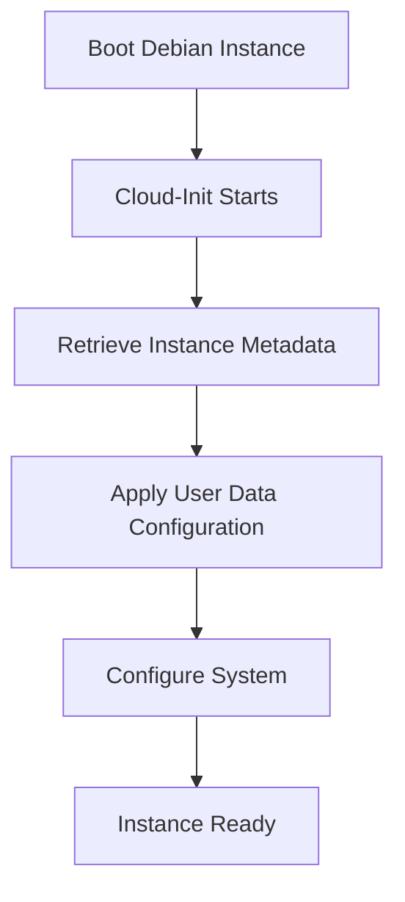

# Debian Cloud-Init

## Introduction

Cloud-init is a powerful tool that automates the initialization and configuration of cloud instances. When working with Debian in cloud environments, cloud-init becomes an essential component for efficiently deploying and managing your infrastructure. This guide explores how cloud-init works specifically with Debian systems, providing you with the knowledge to automate your cloud deployments effectively.

Cloud-init runs during the first boot of a cloud instance and can handle various tasks:

- Setting up users and SSH keys
- Installing packages
- Configuring networking
- Running custom scripts
- Mounting filesystems
- And much more!

## Understanding Cloud-Init in Debian

### What is Cloud-Init?

Cloud-init was originally developed for Ubuntu but has been integrated into Debian and many other Linux distributions. It serves as the industry standard for early initialization of cloud instances.

### How Cloud-Init Works in Debian

When a Debian cloud instance boots for the first time, the following process occurs:



Cloud-init in Debian operates in several stages:

1. **Local**: Sets up local hostname
2. **Network**: Configures networking
3. **Config**: Retrieves and processes user data
4. **Final**: Executes final scripts and user-defined tasks

## Installing Cloud-Init on Debian

Cloud-init comes pre-installed on most Debian cloud images. If you need to install it manually:

```bash
sudo apt update
sudo apt install cloud-init
```

You can verify the installation with:

```bash
cloud-init --version
```

Example output:
```
cloud-init 22.4.2
```

## Basic Cloud-Init Configuration

Cloud-init configurations in Debian are typically stored in:

- `/etc/cloud/cloud.cfg` - Main configuration file
- `/etc/cloud/cloud.cfg.d/` - Directory for additional configuration files

### Example: Default User Configuration

The default `/etc/cloud/cloud.cfg` includes user settings:

```yaml
# Default user configuration
system_info:
  default_user:
    name: debian
    lock_passwd: true
    gecos: Debian Cloud User
    groups: [sudo]
    sudo: ["ALL=(ALL) NOPASSWD:ALL"]
    shell: /bin/bash
```

## Using Cloud-Init User Data

One of the most powerful features of cloud-init is the ability to provide "user data" when launching a cloud instance. This allows you to define configurations and scripts that will run on first boot.

### YAML User Data Example

Here's a simple cloud-init user data file in YAML format:

```yaml
#cloud-config
hostname: debian-web-server
package_update: true
package_upgrade: true

packages:
  - nginx
  - htop
  - vim

users:
  - name: devops
    groups: sudo
    shell: /bin/bash
    sudo: ['ALL=(ALL) NOPASSWD:ALL']
    ssh_authorized_keys:
      - ssh-rsa AAAAB3NzaC1yc2EAAAADAQABAAABAQ... user@example.com

write_files:
  - path: /var/www/html/index.html
    content: |
      <!DOCTYPE html>
      <html>
        <head>
          <title>Welcome to my Debian web server!</title>
        </head>
        <body>
          <h1>Successfully deployed with cloud-init</h1>
        </body>
      </html>
    permissions: '0644'

runcmd:
  - systemctl enable nginx
  - systemctl start nginx
```

This configuration:
1. Sets the hostname
2. Updates and upgrades packages
3. Installs specified packages
4. Creates a user with sudo privileges and an SSH key
5. Creates a custom web page
6. Starts and enables the nginx service

### Shell Script User Data

You can also provide a shell script as user data:

```bash
#!/bin/bash
echo "Starting custom cloud-init setup"

# Update system
apt update && apt upgrade -y

# Install web server
apt install -y nginx

# Create custom index page
cat > /var/www/html/index.html << EOF
<!DOCTYPE html>
<html>
  <head>
    <title>My Debian Server</title>
  </head>
  <body>
    <h1>Hello from cloud-init!</h1>
    <p>This page was created by a cloud-init script.</p>
  </body>
</html>
EOF

# Start and enable nginx
systemctl enable nginx
systemctl start nginx

echo "Cloud-init setup complete!"
```

## Practical Examples

### Example 1: Deploying a Debian Web Server

This example shows how to deploy a complete web server with cloud-init:

```yaml
#cloud-config
hostname: debian-webserver

# Update and install packages
package_update: true
package_upgrade: true
packages:
  - nginx
  - php-fpm
  - git
  - fail2ban

# Configure users
users:
  - name: webadmin
    groups: sudo
    shell: /bin/bash
    sudo: ['ALL=(ALL) NOPASSWD:ALL']
    ssh_authorized_keys:
      - ssh-rsa AAAAB3NzaC1yc2EAAAADAQABAAABAQ... webadmin@example.com

# Create web app directory
runcmd:
  - mkdir -p /var/www/myapp
  - git clone https://github.com/example/myapp.git /var/www/myapp
  - chown -R www-data:www-data /var/www/myapp
  - systemctl restart nginx php-fpm

# Configure nginx
write_files:
  - path: /etc/nginx/sites-available/myapp
    content: |
      server {
        listen 80;
        server_name _;
        root /var/www/myapp;
        
        index index.php index.html;
        
        location / {
          try_files $uri $uri/ /index.php?$args;
        }
        
        location ~ \.php$ {
          include snippets/fastcgi-php.conf;
          fastcgi_pass unix:/var/run/php/php-fpm.sock;
        }
      }
    permissions: '0644'

  - path: /etc/nginx/sites-enabled/myapp
    content: |
      /etc/nginx/sites-available/myapp
    permissions: '0644'
```

### Example 2: Setting Up a Database Server

```yaml
#cloud-config
hostname: debian-db

package_update: true
package_upgrade: true
packages:
  - mariadb-server
  - mariadb-client
  - python3-pymysql

write_files:
  - path: /root/db_setup.sql
    content: |
      CREATE DATABASE appdb;
      CREATE USER 'appuser'@'%' IDENTIFIED BY 'securePassword123';
      GRANT ALL PRIVILEGES ON appdb.* TO 'appuser'@'%';
      FLUSH PRIVILEGES;
    permissions: '0600'

runcmd:
  - systemctl enable mariadb
  - systemctl start mariadb
  - sleep 10
  - mysql -u root < /root/db_setup.sql
  - rm /root/db_setup.sql
  - sed -i 's/bind-address\s*=\s*127.0.0.1/bind-address = 0.0.0.0/' /etc/mysql/mariadb.conf.d/50-server.cnf
  - systemctl restart mariadb
```

## Advanced Techniques

### Using Cloud-Init Modules

Cloud-init consists of various modules that handle different aspects of system configuration. You can configure which modules are executed and their order in `/etc/cloud/cloud.cfg`.

Example configuration:

```yaml
cloud_init_modules:
 - migrator
 - seed_random
 - bootcmd
 - write-files
 - growpart
 - resizefs
 - disk_setup
 - mounts
 - set_hostname
 - update_hostname
 - update_etc_hosts
 - ca-certs
 - rsyslog
 - users-groups
 - ssh

cloud_config_modules:
 - emit_upstart
 - ssh-import-id
 - locale
 - set-passwords
 - grub-dpkg
 - apt-pipelining
 - apt-configure
 - package-update-upgrade-install
 - timezone
 - puppet
 - chef
 - salt-minion
 - mcollective
 - disable-ec2-metadata
 - runcmd

cloud_final_modules:
 - scripts-vendor
 - scripts-per-once
 - scripts-per-boot
 - scripts-per-instance
 - scripts-user
 - ssh-authkey-fingerprints
 - keys-to-console
 - phone-home
 - final-message
 - power-state-change
```

### Using Cloud-Init with Configuration Management Tools

Cloud-init can bootstrap configuration management tools like Ansible, Puppet, or Chef:

```yaml
#cloud-config
package_update: true
package_upgrade: true

packages:
  - ansible

write_files:
  - path: /etc/ansible/hosts
    content: |
      [webservers]
      localhost ansible_connection=local
    permissions: '0644'
    
  - path: /root/playbook.yml
    content: |
      ---
      - hosts: webservers
        become: yes
        tasks:
          - name: Install web server
            apt:
              name: nginx
              state: present
          
          - name: Start and enable nginx
            service:
              name: nginx
              state: started
              enabled: yes
    permissions: '0644'

runcmd:
  - ansible-playbook /root/playbook.yml
```

### Debugging Cloud-Init

When troubleshooting cloud-init on Debian, these commands are useful:

```bash
# View cloud-init status
cloud-init status

# View detailed logs
cat /var/log/cloud-init.log
cat /var/log/cloud-init-output.log

# Debug a specific module
cloud-init single --name=<module_name> --frequency=always
```

Example output of `cloud-init status`:
```
status: done
```

## Integrating with Cloud Providers

Different cloud providers have specific ways to provide user data to Debian instances:

### AWS

When launching an EC2 instance, you can provide user data in the "Advanced details" section:

```yaml
#cloud-config
package_update: true
package_upgrade: true
packages:
  - nginx
write_files:
  - path: /var/www/html/index.html
    content: |
      <h1>Hello from AWS!</h1>
    permissions: '0644'
runcmd:
  - systemctl enable nginx
  - systemctl start nginx
```

### Azure

In Azure, you can provide custom data when creating a VM:

```yaml
#cloud-config
package_update: true
package_upgrade: true
packages:
  - nginx
write_files:
  - path: /var/www/html/index.html
    content: |
      <h1>Hello from Azure!</h1>
    permissions: '0644'
runcmd:
  - systemctl enable nginx
  - systemctl start nginx
```

### Google Cloud Platform

In GCP, you can add metadata with a "user-data" key when creating a VM:

```yaml
#cloud-config
package_update: true
package_upgrade: true
packages:
  - nginx
write_files:
  - path: /var/www/html/index.html
    content: |
      <h1>Hello from GCP!</h1>
    permissions: '0644'
runcmd:
  - systemctl enable nginx
  - systemctl start nginx
```

## Security Considerations

When using cloud-init with Debian, keep these security best practices in mind:

1. **Avoid hardcoding sensitive data** in user data scripts (use secrets management services instead)
2. **Minimize sudo access** granted through cloud-init
3. **Use SSH keys instead of passwords** for authentication
4. **Remove temporary files** created during initialization
5. **Restrict network access** appropriately with firewall rules

Example of implementing some security practices:

```yaml
#cloud-config
package_update: true
package_upgrade: true

packages:
  - ufw
  - fail2ban

users:
  - name: appuser
    sudo: ['ALL=(ALL) NOPASSWD:/usr/bin/apt']
    shell: /bin/bash
    ssh_authorized_keys:
      - ssh-rsa AAAAB3NzaC1yc2EAAAADAQABAAABAQ... user@example.com

write_files:
  - path: /etc/fail2ban/jail.local
    content: |
      [sshd]
      enabled = true
      bantime = 3600
      maxretry = 3
    permissions: '0644'

runcmd:
  - ufw allow 22/tcp
  - ufw allow 80/tcp
  - ufw allow 443/tcp
  - ufw --force enable
  - systemctl enable fail2ban
  - systemctl start fail2ban
  - find /root -type f -name "*.sh" -delete
```

## Summary

Cloud-init is an essential tool for automating the deployment and configuration of Debian cloud instances. It provides a standardized way to initialize instances across various cloud providers. With cloud-init, you can:

- Automate the installation and configuration of software
- Set up users and SSH keys
- Configure networking
- Run custom scripts
- Integrate with configuration management tools

By mastering cloud-init with Debian, you can significantly improve your cloud deployment efficiency, consistency, and reproducibility.

## Additional Resources

- [Official cloud-init Documentation](https://cloudinit.readthedocs.io/)
- [Debian Cloud Images](https://cloud.debian.org/)
- [Cloud-Init Examples Repository](https://github.com/canonical/cloud-init/tree/main/doc/examples)

## Exercises

1. Create a cloud-init configuration that sets up a Debian LAMP stack (Linux, Apache, MySQL, PHP).
2. Develop a user data script that secures a new Debian instance by configuring the firewall and installing security updates.
3. Write a cloud-init configuration that deploys a simple Node.js application on Debian.
4. Configure cloud-init to automatically backup the `/etc` directory to an S3-compatible storage upon first boot.
5. Create a cloud-init configuration that sets up a Debian instance as a Docker host and deploys a specific container.