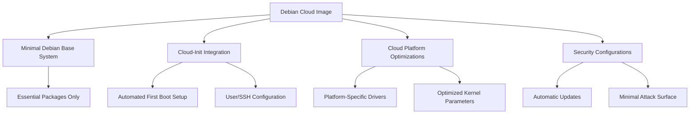

# Debian Cloud Images

## Introduction

Debian Cloud Images are pre-configured, ready-to-use system images that contain the Debian operating system specifically optimized for cloud environments. These images serve as templates for creating virtual machines in various cloud platforms such as Amazon Web Services (AWS), Google Cloud Platform (GCP), Microsoft Azure, and OpenStack-based clouds.

For beginners venturing into cloud computing with Debian, these images provide a standardized, secure starting point that eliminates much of the manual setup typically required when deploying a new server. They're maintained by the Debian Cloud Team and updated regularly with security patches, making them ideal for production environments.

## Why Use Debian Cloud Images?

Before diving into the technical details, let's understand why Debian Cloud Images are valuable:

1. **Consistency**: The same trusted Debian environment across different cloud platforms
2. **Security**: Regular updates with the latest security patches
3. **Minimalism**: Optimized for cloud with unnecessary packages removed
4. **Official Support**: Maintained by the Debian project directly
5. **Stability**: Follows Debian's renowned stability principles

## Available Image Types

Debian provides several types of cloud images for different use cases:

| Image Type | Description | Best For |
|------------|-------------|----------|
| Generic Cloud | Standard cloud image optimized for most environments | General use cases |
| AWS AMI | Amazon Machine Images for EC2 | AWS deployments |
| Azure VHD | Virtual Hard Disk for Microsoft Azure | Azure deployments |
| GCE | Google Compute Engine images | GCP deployments |
| OpenStack | Images for OpenStack-based clouds | Private clouds |
| Docker | Container images | Containerized applications |
| Vagrant | Images for local development | Development environments |

## Finding Official Debian Cloud Images

The official Debian Cloud Images can be found in several locations:

### 1. Debian Cloud Images Website

The primary source for Debian Cloud Images is the official Debian Cloud Image Finder:

```bash
# Browse to
https://cloud.debian.org/images/cloud/
```

Here, you'll find directories organized by Debian version (like bullseye, bookworm) and then by build date.

### 2. Cloud Provider Marketplaces

Official Debian images are also available directly in cloud provider marketplaces:

- **AWS**: Search for "Debian" in the EC2 AMI marketplace
- **Azure**: Look for Debian in the Azure Marketplace
- **GCP**: Find Debian in the Google Cloud Marketplace

## Anatomy of a Debian Cloud Image

A typical Debian Cloud Image includes:



## Using Debian Cloud Images

Let's look at practical examples of deploying Debian Cloud Images in different environments:

### Example 1: Launching a Debian Instance on AWS

```bash
# Find the latest Debian 12 (Bookworm) AMI ID for your region
aws ec2 describe-images \
    --owners 136693071363 \
    --filters "Name=name,Values=debian-12-amd64-*" \
    --query 'sort_by(Images, &CreationDate)[-1].ImageId' \
    --output text

# Launch an instance using the AMI
aws ec2 run-instances \
    --image-id ami-0abcdef1234567890 \
    --instance-type t2.micro \
    --key-name your-key-pair \
    --security-group-ids sg-0123456789abcdef0
```

Output:
```
{
    "Instances": [
        {
            "InstanceId": "i-0123456789abcdef0",
            "ImageId": "ami-0abcdef1234567890",
            "State": {
                "Code": 0,
                "Name": "pending"
            },
            ...
        }
    ]
}
```

### Example 2: Using Debian Cloud Images with OpenStack

```bash
# Download the latest Debian OpenStack image
wget https://cloud.debian.org/images/cloud/bookworm/latest/debian-12-generic-amd64.qcow2

# Upload the image to OpenStack
openstack image create \
    --container-format bare \
    --disk-format qcow2 \
    --file debian-12-generic-amd64.qcow2 \
    --public \
    "Debian 12 Bookworm"

# Launch an instance
openstack server create \
    --flavor m1.small \
    --image "Debian 12 Bookworm" \
    --key-name my-keypair \
    --security-group default \
    my-debian-server
```

## Customizing Debian Cloud Images with cloud-init

One of the powerful features of Debian Cloud Images is their integration with `cloud-init`, which allows for first-boot customization.

### Example: Basic cloud-init Configuration

Create a file named `cloud-config.yaml`:

```yaml
#cloud-config
package_update: true
package_upgrade: true

packages:
  - nginx
  - git
  - htop

users:
  - name: devuser
    sudo: ALL=(ALL) NOPASSWD:ALL
    shell: /bin/bash
    ssh_authorized_keys:
      - ssh-rsa AAAAB3Nz...your_ssh_public_key...

write_files:
  - path: /var/www/html/index.html
    content: |
      <!DOCTYPE html>
      <html>
      <body>
        <h1>Hello from Debian Cloud!</h1>
      </body>
      </html>
    permissions: '0644'

runcmd:
  - systemctl enable nginx
  - systemctl start nginx
```

When launching a new instance, you can pass this file as user data:

```bash
# AWS Example
aws ec2 run-instances \
    --image-id ami-0abcdef1234567890 \
    --instance-type t2.micro \
    --key-name your-key-pair \
    --security-group-ids sg-0123456789abcdef0 \
    --user-data file://cloud-config.yaml
```

## Building Custom Debian Cloud Images

For advanced users, you might want to create your own customized Debian Cloud Images.

### Using the Debian Cloud Team's Build Tools

```bash
# Clone the repository
git clone https://salsa.debian.org/cloud-team/debian-cloud-images.git
cd debian-cloud-images

# Install dependencies
sudo apt update
sudo apt install -y \
    python3-debian python3-docopt python3-libcloud \
    python3-marshmallow python3-pytest python3-yaml \
    qemu-utils

# Build a custom cloud image for AWS
./debian-cloud-images build \
    --distribution bookworm \
    --architecture amd64 \
    --output-format aws \
    --version 1.0 \
    --build-id custom1
```

This process creates a customized AMI that you can then register with AWS.

## Troubleshooting Common Issues

### Issue 1: SSH Key Not Working

If you can't connect to your newly launched instance:

```bash
# Verify your SSH key has correct permissions
chmod 600 ~/.ssh/your-key.pem

# Connect with verbose output
ssh -i ~/.ssh/your-key.pem -v admin@your-instance-ip
```

### Issue 2: Cloud-Init Failures

If cloud-init configurations aren't applying correctly:

```bash
# Connect to the instance and check cloud-init logs
ssh -i ~/.ssh/your-key.pem admin@your-instance-ip
sudo cat /var/log/cloud-init.log
sudo cat /var/log/cloud-init-output.log
```

## Best Practices for Using Debian Cloud Images

1. **Always use the latest images** for security updates
2. **Minimize customization** in the base image; use cloud-init instead
3. **Create snapshots** before making significant changes
4. **Script your deployments** for reproducibility
5. **Enable automatic security updates**

```bash
# Example: Enable automatic security updates
sudo apt update
sudo apt install -y unattended-upgrades
sudo dpkg-reconfigure -plow unattended-upgrades
```

## Summary

Debian Cloud Images provide a reliable, secure, and efficient way to deploy Debian systems in cloud environments. By leveraging these pre-built images maintained by the Debian project, you benefit from:

- Official support and security updates
- Cloud-optimized configurations
- Consistent environments across different platforms
- Easy customization through cloud-init

Whether you're deploying a simple web server or building a complex infrastructure, starting with Debian Cloud Images gives you a solid foundation based on Debian's principles of stability and security.

## Additional Resources

- [Official Debian Cloud Images Portal](https://cloud.debian.org/)
- [Debian Wiki: Cloud](https://wiki.debian.org/Cloud)
- [cloud-init Documentation](https://cloudinit.readthedocs.io/)

## Exercises

1. **Beginner**: Launch a Debian Cloud Image on your preferred cloud provider and connect to it via SSH.
2. **Intermediate**: Create a cloud-init configuration that installs a LAMP stack (Linux, Apache, MySQL, PHP) on first boot.
3. **Advanced**: Build a custom Debian Cloud Image with your organization's standard security configurations pre-installed.