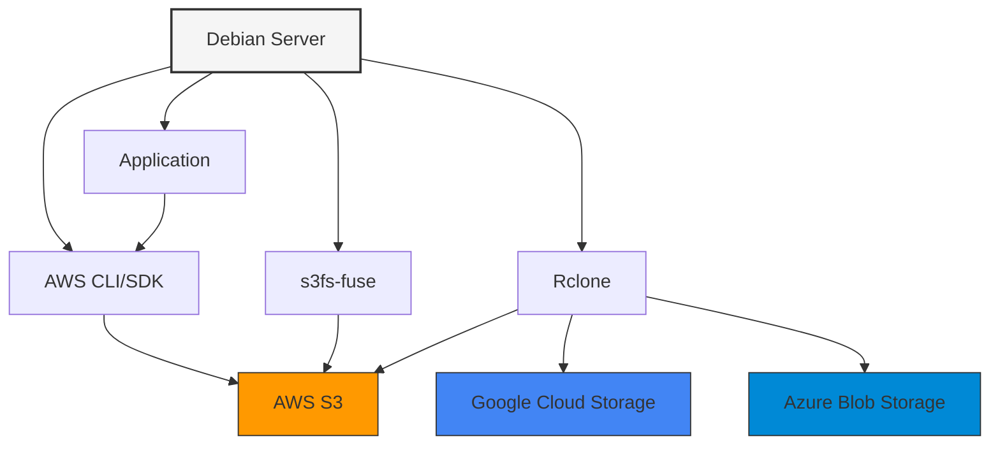

# Debian Cloud Storage

## Introduction

Cloud storage has become an essential component of modern infrastructure, allowing applications to store and retrieve data reliably without managing physical hardware. For Debian users, integrating with cloud storage solutions provides scalability, redundancy, and cost-effectiveness that traditional storage cannot match.

In this guide, we'll explore how to implement cloud storage solutions on Debian systems. Whether you're running Debian on your development machine or on cloud instances, these techniques will help you seamlessly integrate with popular cloud storage providers while maintaining the stability and security that Debian is known for.

## Understanding Cloud Storage Models

Before diving into implementation, let's understand the main types of cloud storage available:

1. **Object Storage** - Stores unstructured data as objects (files) with metadata and unique identifiers (like AWS S3, Google Cloud Storage)
2. **Block Storage** - Provides raw storage volumes that can be attached to instances (like AWS EBS, Google Persistent Disks)
3. **File Storage** - Provides shared file systems accessible via network protocols (like AWS EFS, Azure Files)

Each model has specific use cases:

- Use **object storage** for static assets, backups, and large media files
- Use **block storage** for database storage, system volumes, and applications needing high I/O
- Use **file storage** for shared access across multiple instances

## Setting Up S3-Compatible Object Storage with Debian

Let's start with a practical example using S3-compatible storage, which is widely supported across providers.

### Installing Required Tools

First, we'll install the AWS CLI and s3cmd tools:

```bash
# Update package lists
sudo apt update

# Install AWS CLI
sudo apt install -y awscli

# Install s3cmd
sudo apt install -y s3cmd
```

### Configuring AWS CLI

After installation, configure the AWS CLI with your credentials:

```bash
aws configure
```

You'll be prompted to enter:

```
AWS Access Key ID: YOUR_ACCESS_KEY
AWS Secret Access Key: YOUR_SECRET_KEY
Default region name: us-east-1
Default output format: json
```

### Basic S3 Operations

Now let's perform some basic operations with the AWS CLI:

#### Listing buckets

```bash
aws s3 ls
```

Example output:
```
2023-07-15 14:32:12 my-debian-backups
2023-08-20 09:45:23 debian-app-assets
```

#### Creating a new bucket

```bash
aws s3 mb s3://my-debian-project
```

Example output:
```
make_bucket: my-debian-project
```

#### Uploading a file

```bash
# Create a test file
echo "Hello from Debian!" > test-file.txt

# Upload to S3
aws s3 cp test-file.txt s3://my-debian-project/
```

Example output:
```
upload: ./test-file.txt to s3://my-debian-project/test-file.txt
```

#### Downloading a file

```bash
aws s3 cp s3://my-debian-project/test-file.txt downloaded-file.txt
```

Example output:
```
download: s3://my-debian-project/test-file.txt to ./downloaded-file.txt
```

#### Removing a file

```bash
aws s3 rm s3://my-debian-project/test-file.txt
```

Example output:
```
delete: s3://my-debian-project/test-file.txt
```

## Mounting S3 Storage as a File System

For certain applications, you might want to mount S3 storage as a file system. We can use `s3fs-fuse` for this purpose:

```bash
# Install s3fs-fuse
sudo apt install -y s3fs-fuse

# Store credentials safely
echo "YOUR_ACCESS_KEY:YOUR_SECRET_KEY" > ~/.s3fs-credentials
chmod 600 ~/.s3fs-credentials

# Create a mount point
mkdir ~/s3-mount

# Mount the S3 bucket
s3fs my-debian-project ~/s3-mount -o passwd_file=~/.s3fs-credentials
```

Now you can interact with your S3 bucket as if it were a local file system:

```bash
# Create a directory
mkdir ~/s3-mount/data

# Create a file
echo "This file is stored in S3" > ~/s3-mount/data/example.txt

# List files
ls -la ~/s3-mount/data/
```

Example output:
```
total 1
-rw-rw-r-- 1 debian debian 26 Sep 12 14:23 example.txt
```

To unmount:

```bash
fusermount -u ~/s3-mount
```

## Automating Cloud Storage Operations

For regular backup operations or automated workflows, let's create a simple Bash script:

```bash
#!/bin/bash
# backup-to-s3.sh - Backup script for Debian to S3

# Configuration
BUCKET_NAME="my-debian-backups"
BACKUP_DIR="/var/www/html"
TIMESTAMP=$(date +%Y%m%d-%H%M%S)
BACKUP_FILE="backup-$TIMESTAMP.tar.gz"

# Create backup archive
echo "Creating backup archive..."
tar -czf /tmp/$BACKUP_FILE $BACKUP_DIR

# Upload to S3
echo "Uploading to S3..."
aws s3 cp /tmp/$BACKUP_FILE s3://$BUCKET_NAME/

# Clean up
echo "Cleaning up temporary files..."
rm /tmp/$BACKUP_FILE

echo "Backup completed: $BACKUP_FILE"
```

Make the script executable:

```bash
chmod +x backup-to-s3.sh
```

You can then schedule this with cron:

```bash
# Open crontab editor
crontab -e

# Add this line to run daily at 2 AM
0 2 * * * /path/to/backup-to-s3.sh
```

## Integrating Cloud Storage with Debian Applications

Let's look at how to integrate S3 storage with a simple Python web application running on Debian:

```python
# app.py
from flask import Flask, request, redirect
import boto3
import os
from werkzeug.utils import secure_filename

app = Flask(__name__)

# Configure S3 client
s3_client = boto3.client(
    's3',
    aws_access_key_id=os.environ.get('AWS_ACCESS_KEY'),
    aws_secret_access_key=os.environ.get('AWS_SECRET_KEY')
)

BUCKET_NAME = 'my-debian-app-assets'

@app.route('/upload', methods=['POST'])
def upload_file():
    if 'file' not in request.files:
        return redirect(request.url)
    
    file = request.files['file']
    if file.filename == '':
        return 'No file selected'
    
    filename = secure_filename(file.filename)
    
    # Upload to S3
    s3_client.upload_fileobj(
        file,
        BUCKET_NAME,
        filename,
        ExtraArgs={'ACL': 'public-read'}
    )
    
    file_url = f"https://{BUCKET_NAME}.s3.amazonaws.com/{filename}"
    return f"File uploaded: {file_url}"

if __name__ == '__main__':
    app.run(debug=True, host='0.0.0.0')
```

Install the requirements:

```bash
sudo apt install -y python3-pip
pip3 install flask boto3
```

Run the application:

```bash
export AWS_ACCESS_KEY="your_access_key"
export AWS_SECRET_KEY="your_secret_key"
python3 app.py
```

## Using Rclone for Multi-Cloud Storage

Rclone is a powerful tool that supports multiple cloud storage providers, giving you flexibility in your cloud storage strategy:

```bash
# Install Rclone
sudo apt install -y rclone

# Configure Rclone (interactive)
rclone config
```

Example configuration for AWS S3:

```
n) New remote
name> aws-s3
Storage> s3
provider> AWS
access_key_id> YOUR_ACCESS_KEY
secret_access_key> YOUR_SECRET_KEY
region> us-east-1
location_constraint> us-east-1
acl> private
q) Quit config
```

Basic Rclone operations:

```bash
# List buckets
rclone lsd aws-s3:

# Copy a local file to S3
rclone copy local-file.txt aws-s3:my-debian-project/

# Sync a local directory with S3
rclone sync /path/to/local/dir aws-s3:my-debian-project/dir
```

## Architecture Diagram

For visual learners, here's a diagram showing how Debian integrates with cloud storage:



## Performance Considerations

When working with cloud storage on Debian, consider these performance factors:

1. **Network Bandwidth** - Cloud storage operations are constrained by your network connection
2. **Latency** - Operations have higher latency compared to local storage
3. **Caching** - Implement local caching for frequently accessed files
4. **Request Rate** - Most providers have rate limits on API requests

For improved performance:

```bash
# Use parallel uploads with AWS CLI
aws s3 cp --recursive /local/directory/ s3://my-bucket/ --parallel

# Optimize s3fs mount options
s3fs my-bucket /mnt/s3 -o passwd_file=~/.s3fs-credentials,use_cache=/tmp,stat_cache_expire=30,readahead_size=10485760
```

## Security Best Practices

Secure your cloud storage integration with these best practices:

1. **Use IAM Roles** - For EC2 instances, use IAM roles instead of hard-coded credentials
2. **Encrypt Data** - Enable server-side encryption for sensitive data
3. **Rotate Credentials** - Regularly rotate access keys
4. **Least Privilege** - Use minimal permissions required for your application
5. **Audit Logging** - Enable access logging for your storage buckets

Example of enabling server-side encryption:

```bash
# Create a new bucket with encryption
aws s3api create-bucket --bucket my-encrypted-bucket --create-bucket-configuration LocationConstraint=us-east-1
aws s3api put-bucket-encryption --bucket my-encrypted-bucket --server-side-encryption-configuration '{"Rules": [{"ApplyServerSideEncryptionByDefault": {"SSEAlgorithm": "AES256"}}]}'
```

## Troubleshooting Common Issues

Here are solutions to common problems you might encounter:

### Permission Denied Errors

```bash
# Check IAM policies
aws iam get-user-policy --user-name your-user --policy-name your-policy

# Verify bucket policy
aws s3api get-bucket-policy --bucket my-bucket
```

### Connection Issues

```bash
# Test connectivity
ping s3.amazonaws.com

# Check DNS resolution
nslookup s3.amazonaws.com

# Verify proxy settings (if applicable)
echo $http_proxy
echo $https_proxy
```

### Mounting Issues with s3fs

```bash
# Debug s3fs with verbose output
s3fs my-bucket /mnt/s3 -o passwd_file=~/.s3fs-credentials,dbglevel=info -f -d
```

## Summary

In this guide, we've explored how to integrate Debian systems with cloud storage solutions, focusing primarily on S3-compatible storage. We've covered:

- Basic concepts of cloud storage models
- Setting up and using AWS CLI and s3cmd
- Mounting S3 storage as a file system with s3fs-fuse
- Automating backups to cloud storage
- Integrating cloud storage with web applications
- Using Rclone for multi-cloud flexibility
- Performance considerations and security best practices

Cloud storage integration with Debian provides powerful capabilities for your applications and infrastructure. By following the techniques in this guide, you can build scalable, resilient systems that leverage the best of both Debian's stability and cloud storage's flexibility.

## Additional Resources

To continue learning about Debian cloud storage integration:

- Official AWS CLI documentation: [https://docs.aws.amazon.com/cli/](https://docs.aws.amazon.com/cli/)
- s3fs-fuse project: [https://github.com/s3fs-fuse/s3fs-fuse](https://github.com/s3fs-fuse/s3fs-fuse)
- Rclone documentation: [https://rclone.org/docs/](https://rclone.org/docs/)

## Exercises

1. Set up an automated backup system that archives and uploads a directory to S3 weekly, keeping only the last 4 backups.
2. Create a simple web application that allows users to upload images to S3 and displays them from the bucket.
3. Compare performance between direct file system access, s3fs-mounted storage, and using the AWS SDK for a file upload scenario.
4. Implement a multi-cloud storage solution using Rclone that synchronizes critical files across AWS S3 and Google Cloud Storage.