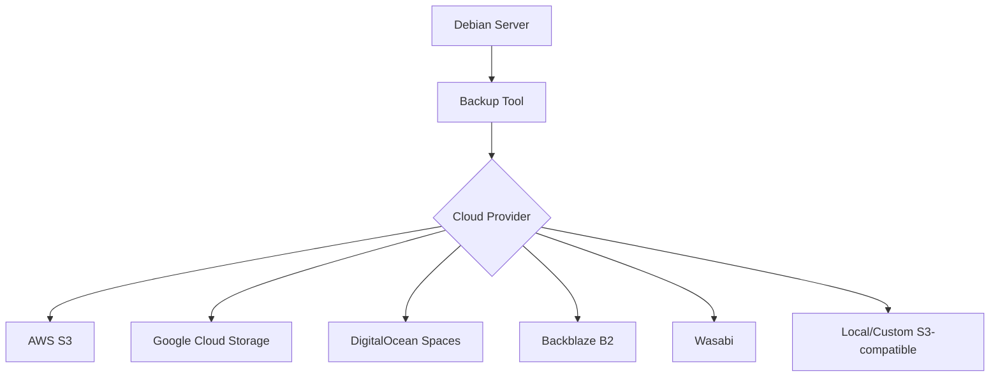

# Debian Cloud Backup

## Introduction

Cloud backup solutions for Debian systems provide essential data protection by storing your critical information in remote cloud environments. This approach ensures your data remains safe even if your physical hardware fails or gets damaged. In this guide, we'll explore how to implement effective cloud backup strategies specifically tailored for Debian-based systems.

Cloud backups differ from traditional local backups in several important ways:

- **Geographic redundancy**: Your data is stored in remote data centers, protected from local disasters
- **Scalability**: Easily increase storage as your needs grow
- **Accessibility**: Access your backups from anywhere with internet connectivity
- **Automation**: Schedule regular backups without manual intervention

Let's dive into the practical aspects of setting up cloud backups for your Debian system.

## Prerequisites

Before we begin, ensure you have:

- A Debian-based system (this guide uses Debian 11 "Bullseye")
- Root or sudo access to your system
- Basic familiarity with Linux command line
- An account with a cloud storage provider (AWS, Google Cloud, DigitalOcean Spaces, etc.)
- Sufficient internet bandwidth for your backup needs

## Popular Backup Tools for Debian

Debian offers several excellent backup tools that integrate well with cloud storage services. Let's examine the most popular options:

### 1. Duplicity

Duplicity is a bandwidth-efficient backup tool that creates encrypted tar volumes and uploads them to remote storage.

#### Installation

```bash
sudo apt update
sudo apt install duplicity python3-boto python3-pip
pip3 install --user boto3
```

#### Basic Configuration

First, let's create a simple backup script:

```bash
#!/bin/bash

# Environment variables for cloud provider
export AWS_ACCESS_KEY_ID="your_access_key"
export AWS_SECRET_ACCESS_KEY="your_secret_key"

# Source directory to backup
SOURCE_DIR="/path/to/backup"

# Destination URL (S3 in this example)
DEST_URL="s3://your-bucket-name/backup"

# Run backup with encryption
duplicity --encrypt-key="YOUR_GPG_KEY_ID" ${SOURCE_DIR} ${DEST_URL}

# Clean up old backups (keep last 2 months)
duplicity remove-older-than 2M --force ${DEST_URL}

# Unset credentials
unset AWS_ACCESS_KEY_ID
unset AWS_SECRET_ACCESS_KEY
```

Save this script as `cloud-backup.sh`, make it executable with `chmod +x cloud-backup.sh`, and run it manually or set it up as a cron job.

#### Listing Backups

To list your existing backups:

```bash
export AWS_ACCESS_KEY_ID="your_access_key"
export AWS_SECRET_ACCESS_KEY="your_secret_key"

duplicity collection-status s3://your-bucket-name/backup

unset AWS_ACCESS_KEY_ID
unset AWS_SECRET_ACCESS_KEY
```

Output example:
```
Local and Remote metadata are synchronized, no sync needed.
Last full backup date: Sat Mar 9 03:15:04 2025
Collection status
-------------------------
Chain start time: Sat Feb 8 03:15:04 2025
Chain end time: Sat Mar 9 03:15:04 2025
Number of contained backup sets: 30
Total number of contained volumes: 42
Type of backup set:                            Time:      Num volumes:
Full                 Sat Feb 8 03:15:04 2025   12
Incremental          Sun Feb 9 03:15:05 2025   1
Incremental          Mon Feb 10 03:15:06 2025  1
...
```

### 2. Restic

Restic is a modern backup program that provides fast, secure, and efficient backups.

#### Installation

```bash
sudo apt update
sudo apt install restic
```

#### Configuration

Create a password file for encryption:

```bash
echo "your-secure-password" > restic-password.txt
chmod 600 restic-password.txt
```

Initialize a repository in your cloud storage:

```bash
export AWS_ACCESS_KEY_ID="your_access_key"
export AWS_SECRET_ACCESS_KEY="your_secret_key"

restic -r s3:s3.amazonaws.com/your-bucket-name/backup init --password-file restic-password.txt
```

Output:
```
created restic repository 05c3f3d32b at s3:s3.amazonaws.com/your-bucket-name/backup
Please note that knowledge of your password is required to access the repository.
Losing your password means that your data is irrecoverably lost.
```

#### Creating Backups

```bash
export AWS_ACCESS_KEY_ID="your_access_key"
export AWS_SECRET_ACCESS_KEY="your_secret_key"

restic -r s3:s3.amazonaws.com/your-bucket-name/backup --password-file restic-password.txt backup /path/to/backup
```

Example output:
```
repository 05c3f3d32b opened successfully, password is correct
scan [/path/to/backup]
scanned 1287 directories, 8593 files in 0:12
[0:35] 100.00%  412.5 MiB / 412.5 MiB  24 / 24 items  0 errors  ETA 0:00 
duration: 0:35
snapshot 8a1f5b saved
```

#### Automating Restic Backups

Create a systemd service and timer for automated backups:

1. Create the service file `/etc/systemd/system/restic-backup.service`:

```
[Unit]
Description=Restic Backup Service
After=network.target

[Service]
Type=oneshot
Environment="AWS_ACCESS_KEY_ID=your_access_key"
Environment="AWS_SECRET_ACCESS_KEY=your_secret_key"
ExecStart=/usr/bin/restic -r s3:s3.amazonaws.com/your-bucket-name/backup --password-file /path/to/restic-password.txt backup /path/to/backup
ExecStart=/usr/bin/restic -r s3:s3.amazonaws.com/your-bucket-name/backup --password-file /path/to/restic-password.txt forget --keep-daily 7 --keep-weekly 4 --keep-monthly 12 --prune

[Install]
WantedBy=multi-user.target
```

2. Create the timer file `/etc/systemd/system/restic-backup.timer`:

```
[Unit]
Description=Run Restic Backup daily

[Timer]
OnCalendar=daily
Persistent=true

[Install]
WantedBy=timers.target
```

3. Enable and start the timer:

```bash
sudo systemctl enable restic-backup.timer
sudo systemctl start restic-backup.timer
```

## Cloud Storage Options for Debian Backups

Debian can work with various cloud storage providers. Let's explore the most common options:



### AWS S3

Amazon S3 is one of the most popular cloud storage services. To use it with Debian:

1. Create an AWS account and S3 bucket
2. Create an IAM user with S3 access permissions
3. Note your access key and secret key
4. Configure your backup tool (as shown in previous examples)

### Google Cloud Storage

For Google Cloud Storage:

```bash
# For Duplicity
sudo apt install python3-boto
export GS_ACCESS_KEY_ID="your_access_key"
export GS_SECRET_ACCESS_KEY="your_secret_key"
duplicity /path/to/backup gs://your-bucket-name/backup
```

### Self-hosted with MinIO

You can also use MinIO to create your own S3-compatible storage:

```bash
# Install MinIO
wget https://dl.min.io/server/minio/release/linux-amd64/minio
chmod +x minio
sudo mv minio /usr/local/bin/

# Create storage directory
sudo mkdir /opt/minio-data

# Run MinIO
sudo minio server /opt/minio-data
```

Access the MinIO web UI at `http://your-server-ip:9000` to create buckets and access keys.

## Backup Encryption

Encrypting your backups is essential for protecting sensitive data in the cloud.

### GPG Encryption with Duplicity

Duplicity uses GPG for encryption by default. To set up a GPG key:

```bash
# Generate a GPG key
gpg --gen-key

# List your keys to find the ID
gpg --list-keys
```

Example output:
```
pub   rsa3072 2025-03-10 [SC] [expires: 2027-03-10]
      8F7E9E8A7B6C5D4E3F2A1B0C9D8E7F6A5B4C3D2E
uid           [ultimate] Your Name <your.email@example.com>
sub   rsa3072 2025-03-10 [E] [expires: 2027-03-10]
```

Use your key ID (the long hexadecimal number) in your backup script:

```bash
duplicity --encrypt-key="8F7E9E8A7B6C5D4E3F2A1B0C9D8E7F6A5B4C3D2E" /path/to/backup s3://your-bucket-name/backup
```

### Password-based Encryption with Restic

Restic uses a simpler password-based encryption approach, as we've seen in the earlier examples.

## Backup Verification and Restoration

Regularly verifying your backups ensures you can recover data when needed.

### Testing Duplicity Restoration

```bash
# Verify backup
duplicity verify s3://your-bucket-name/backup /path/to/verify

# Restore entire backup to a specific location
duplicity restore s3://your-bucket-name/backup /path/to/restore

# Restore specific files
duplicity --file-to-restore relative/path/to/file s3://your-bucket-name/backup /path/to/restore/file
```

### Testing Restic Restoration

```bash
# List snapshots
restic -r s3:s3.amazonaws.com/your-bucket-name/backup --password-file restic-password.txt snapshots

# Restore entire snapshot
restic -r s3:s3.amazonaws.com/your-bucket-name/backup --password-file restic-password.txt restore latest --target /path/to/restore

# Restore specific files
restic -r s3:s3.amazonaws.com/your-bucket-name/backup --password-file restic-password.txt restore latest --include /path/to/file --target /path/to/restore
```

Example snapshot listing:
```
repository 05c3f3d32b opened successfully, password is correct
ID        Date                 Host        Tags        Directory
----------------------------------------------------------------------------------
8a1f5b    2025-03-10 09:15:27  debian01    manual      /path/to/backup
b2c6d7    2025-03-09 09:15:29  debian01    manual      /path/to/backup
...
```

## Best Practices for Debian Cloud Backups

1. **Follow the 3-2-1 backup rule**:
   - Keep 3 copies of your data
   - Store them on 2 different storage types
   - Keep 1 copy offsite (cloud)

2. **Automate your backups**:
   - Use systemd timers or cron jobs
   - Set up email notifications for failures

3. **Encrypt your backups**:
   - Always use strong encryption for cloud storage
   - Securely store encryption keys/passwords

4. **Test restoration regularly**:
   - Schedule monthly restoration tests
   - Document the restoration process

5. **Monitor backup storage usage**:
   - Set up alerts for approaching storage limits
   - Implement retention policies

6. **Implement retention policies**:
   - Define how long to keep daily, weekly, and monthly backups
   - Automatically prune old backups

## Real-world Scenario: Database Backup to Cloud

Let's implement a practical example backing up a PostgreSQL database to AWS S3:

1. Create a backup script `/usr/local/bin/db-backup.sh`:

```bash
#!/bin/bash

# Configuration
DB_NAME="your_database"
BACKUP_DIR="/tmp/db_backups"
TIMESTAMP=$(date +%Y%m%d_%H%M%S)
BACKUP_FILE="${BACKUP_DIR}/${DB_NAME}_${TIMESTAMP}.sql.gz"
S3_BUCKET="your-bucket-name"
S3_PATH="database-backups"

# Environment variables for AWS
export AWS_ACCESS_KEY_ID="your_access_key"
export AWS_SECRET_ACCESS_KEY="your_secret_key"

# Ensure backup directory exists
mkdir -p ${BACKUP_DIR}

# Create database dump and compress it
echo "Creating backup of ${DB_NAME}..."
pg_dump ${DB_NAME} | gzip > ${BACKUP_FILE}

# Upload to S3
echo "Uploading to S3..."
aws s3 cp ${BACKUP_FILE} s3://${S3_BUCKET}/${S3_PATH}/

# Remove local file
rm ${BACKUP_FILE}

# Clean up old backups in S3 (keep last 30 days)
echo "Cleaning up old backups..."
aws s3 ls s3://${S3_BUCKET}/${S3_PATH}/ | grep "${DB_NAME}_" | sort | head -n -30 | awk '{print $4}' | xargs -I{} aws s3 rm s3://${S3_BUCKET}/${S3_PATH}/{}

echo "Backup completed!"

# Unset credentials
unset AWS_ACCESS_KEY_ID
unset AWS_SECRET_ACCESS_KEY
```

2. Make the script executable:

```bash
chmod +x /usr/local/bin/db-backup.sh
```

3. Create a systemd timer for daily backups:

Service file `/etc/systemd/system/db-backup.service`:
```
[Unit]
Description=Database Backup to S3
After=network.target postgresql.service

[Service]
Type=oneshot
ExecStart=/usr/local/bin/db-backup.sh
User=postgres

[Install]
WantedBy=multi-user.target
```

Timer file `/etc/systemd/system/db-backup.timer`:
```
[Unit]
Description=Run database backup daily

[Timer]
OnCalendar=*-*-* 01:00:00
Persistent=true

[Install]
WantedBy=timers.target
```

4. Enable and start the timer:

```bash
sudo systemctl enable db-backup.timer
sudo systemctl start db-backup.timer
```

## Troubleshooting Common Issues

### Network Connectivity Problems

If backups fail due to network issues:

1. Verify internet connectivity:
   ```bash
   ping -c 3 s3.amazonaws.com
   ```

2. Check DNS resolution:
   ```bash
   nslookup s3.amazonaws.com
   ```

3. Implement retry logic in your backup scripts:
   ```bash
   duplicity --num-retries 3 /path/to/backup s3://your-bucket-name/backup
   ```

### Insufficient Permissions

If you receive access denied errors:

1. Verify your credentials are correct
2. Check the permissions of your cloud storage bucket
3. Ensure your IAM user has the necessary permissions

### Out of Storage Space

To handle storage space issues:

1. Monitor your cloud storage usage
2. Implement proper rotation and cleanup policies
3. Set up alerts for approaching storage limits

## Summary

In this guide, we've explored comprehensive approaches to implementing cloud backups for Debian systems. We've covered:

- Setting up Duplicity and Restic for cloud backups
- Configuring various cloud storage providers
- Implementing encryption for data security
- Creating automated backup schedules
- Testing restoration procedures
- Handling real-world scenarios and troubleshooting

By following these practices, you can ensure your Debian systems have reliable, secure backups stored safely in the cloud, providing protection against data loss and system failures.

## Additional Resources

For further learning:

- [Duplicity Documentation](http://duplicity.nongnu.org/docs.html)
- [Restic Handbook](https://restic.readthedocs.io/)
- [AWS S3 Documentation](https://docs.aws.amazon.com/s3/)
- [DigitalOcean Spaces Documentation](https://docs.digitalocean.com/products/spaces/)

## Exercises

1. Set up a Restic backup system for your home directory to a cloud provider of your choice.
2. Create a systemd timer that performs daily backups with Duplicity.
3. Write a script that tests backup restoration to a temporary directory.
4. Implement a monitoring system that alerts you if backups fail to complete.
5. Design a backup rotation strategy that optimizes storage costs while maintaining adequate backup history.