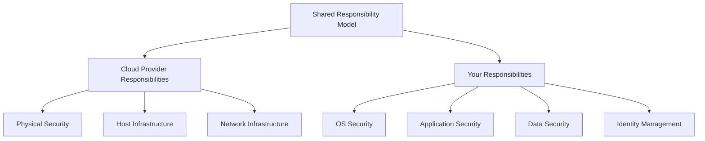

# Debian Cloud Security

## Introduction

When deploying Debian systems in cloud environments, security becomes a critical concern. Cloud deployments face unique security challenges compared to traditional on-premises installations. This guide will walk you through the fundamental security practices for Debian systems running in cloud environments like AWS, Azure, and Google Cloud Platform.

Debian, known for its stability and security focus, provides an excellent foundation for cloud deployments. However, proper configuration and security hardening are essential to protect your systems from the broader attack surface that comes with cloud environments.

## Understanding Cloud Security Principles

Before diving into specific security measures, let's understand the shared responsibility model that most cloud providers implement:



Even though cloud providers handle many security aspects, you're still responsible for securing your Debian instances, applications, and data.

## Securing Debian Cloud Images

### Starting with Trusted Images

Always start with official Debian cloud images:

```bash
# AWS CLI example to find official Debian images
aws ec2 describe-images \
    --owners 136693071363 \
    --filters "Name=name,Values=debian-11-*" \
    --query 'Images[*].[ImageId,Name,CreationDate]' \
    --output table
```

This command lists official Debian 11 (Bullseye) images in AWS, provided by the Debian Cloud team.

### Verifying Image Integrity

Before using a Debian cloud image, verify its authenticity:

```bash
# Download the checksums file and signature
wget https://cloud.debian.org/images/cloud/bullseye/latest/SHA512SUMS
wget https://cloud.debian.org/images/cloud/bullseye/latest/SHA512SUMS.sign

# Import the Debian signing key
gpg --keyserver keyring.debian.org --recv-keys 0xF04F6973FE8BC6183C9C37F4483EE3F88675C6B9

# Verify the signature
gpg --verify SHA512SUMS.sign SHA512SUMS

# Calculate and verify checksum of your downloaded image
sha512sum -c SHA512SUMS --ignore-missing
```

## Initial Security Configuration

### System Updates

The first step after launching a Debian instance is to update the system:

```bash
# Update package lists
sudo apt update

# Upgrade all packages
sudo apt upgrade -y

# Install security updates only (alternative)
sudo apt-get -s dist-upgrade | grep "^Inst" | grep -i security | awk -F " " '{print $2}' | xargs sudo apt-get install -y
```

### Minimal Installation Principle

Install only what you need:

```bash
# List installed packages
dpkg-query -W -f='${Package}
'

# Remove unnecessary services
sudo apt remove --purge <package-name>

# Examples of packages that might be unnecessary in cloud environments
sudo apt remove --purge apache2 cups bluetooth
```

## Network Security

### Firewall Configuration with UFW

Debian can use Uncomplicated Firewall (UFW) to manage iptables:

```bash
# Install UFW
sudo apt install ufw

# Set default policies
sudo ufw default deny incoming
sudo ufw default allow outgoing

# Allow SSH (adjust port if needed)
sudo ufw allow 22/tcp

# Allow other necessary services
# Web server example
sudo ufw allow 80/tcp
sudo ufw allow 443/tcp

# Enable the firewall
sudo ufw enable

# Check status
sudo ufw status verbose
```

### SSH Hardening

SSH is the primary entry point to your cloud instances:

```bash
# Edit SSH configuration
sudo nano /etc/ssh/sshd_config
```

Apply the following configurations:

```
# Disable root login
PermitRootLogin no

# Use only SSH protocol 2
Protocol 2

# Disable password authentication (use keys only)
PasswordAuthentication no
ChallengeResponseAuthentication no

# Limit access to specific users
AllowUsers your_username

# Set idle timeout (in seconds)
ClientAliveInterval 300
ClientAliveCountMax 2
```

Restart SSH to apply changes:

```bash
sudo systemctl restart ssh
```

## Identity and Access Management

### Creating Limited User Accounts

Avoid using the root account for daily operations:

```bash
# Create a new user
sudo adduser debian_user

# Add to sudo group for admin privileges
sudo usermod -aG sudo debian_user

# Create .ssh directory for the new user
sudo mkdir -p /home/debian_user/.ssh
sudo chown debian_user:debian_user /home/debian_user/.ssh
sudo chmod 700 /home/debian_user/.ssh

# Add SSH public key
echo "ssh-rsa AAAA..." | sudo tee /home/debian_user/.ssh/authorized_keys
sudo chown debian_user:debian_user /home/debian_user/.ssh/authorized_keys
sudo chmod 600 /home/debian_user/.ssh/authorized_keys
```

### Using Cloud Provider IAM

Integrate your Debian instance with your cloud provider's IAM services:

#### AWS Example:

```bash
# Install AWS CLI
sudo apt install awscli

# Configure instance profile (from EC2)
aws configure
```

#### Azure Example:

```bash
# Install Azure CLI
curl -sL https://aka.ms/InstallAzureCLIDeb | sudo bash

# Login with managed identity
az login --identity
```

## System Hardening

### Kernel Hardening with sysctl

Edit sysctl configuration:

```bash
sudo nano /etc/sysctl.conf
```

Add or modify these security-related settings:

```
# Prevent IP spoofing
net.ipv4.conf.all.rp_filter = 1
net.ipv4.conf.default.rp_filter = 1

# Disable IP forwarding
net.ipv4.ip_forward = 0

# Disable ICMP redirect acceptance
net.ipv4.conf.all.accept_redirects = 0
net.ipv4.conf.default.accept_redirects = 0
net.ipv6.conf.all.accept_redirects = 0
net.ipv6.conf.default.accept_redirects = 0

# Disable source routing
net.ipv4.conf.all.accept_source_route = 0
net.ipv4.conf.default.accept_source_route = 0
net.ipv6.conf.all.accept_source_route = 0
net.ipv6.conf.default.accept_source_route = 0

# Log suspicious packets
net.ipv4.conf.all.log_martians = 1
net.ipv4.conf.default.log_martians = 1
```

Apply changes:

```bash
sudo sysctl -p
```

### Securing Storage

Enable disk encryption for sensitive data:

```bash
# Install required packages
sudo apt install cryptsetup

# Create an encrypted volume (example for an additional volume)
sudo cryptsetup luksFormat /dev/xvdf

# Open the encrypted volume
sudo cryptsetup luksOpen /dev/xvdf secure-volume

# Format the volume
sudo mkfs.ext4 /dev/mapper/secure-volume

# Mount it
sudo mkdir /secure
sudo mount /dev/mapper/secure-volume /secure
```

## Monitoring and Logging

### Setting Up Central Logging

Configure rsyslog to send logs to a central log server or cloud logging service:

```bash
# Edit rsyslog configuration
sudo nano /etc/rsyslog.conf
```

Add a line to forward logs (example for sending to a remote syslog server):

```
*.* @logserver.example.com:514
```

For secure transmission:

```
*.* @@logserver.example.com:6514
```

Restart rsyslog:

```bash
sudo systemctl restart rsyslog
```

### Log Analysis with Fail2ban

Install and configure Fail2ban to protect against brute force attacks:

```bash
# Install Fail2ban
sudo apt install fail2ban

# Create a local configuration file
sudo cp /etc/fail2ban/jail.conf /etc/fail2ban/jail.local
sudo nano /etc/fail2ban/jail.local
```

Basic SSH protection configuration:

```
[sshd]
enabled = true
port = 22
filter = sshd
logpath = /var/log/auth.log
maxretry = 3
bantime = 3600
```

Start Fail2ban:

```bash
sudo systemctl enable fail2ban
sudo systemctl start fail2ban
```

### Cloud-Native Monitoring Integration

Most cloud providers offer monitoring services that can be integrated with Debian:

#### AWS CloudWatch Example:

```bash
# Install CloudWatch agent
wget https://s3.amazonaws.com/amazoncloudwatch-agent/debian/amd64/latest/amazon-cloudwatch-agent.deb
sudo dpkg -i amazon-cloudwatch-agent.deb

# Configure the agent
sudo /opt/aws/amazon-cloudwatch-agent/bin/amazon-cloudwatch-agent-config-wizard
```

## Automated Security Updates

Configure automatic security updates to ensure your system is protected against known vulnerabilities:

```bash
# Install unattended-upgrades
sudo apt install unattended-upgrades apt-listchanges

# Configure automatic updates
sudo dpkg-reconfigure unattended-upgrades
```

Edit the configuration file for more control:

```bash
sudo nano /etc/apt/apt.conf.d/50unattended-upgrades
```

Key settings to adjust:

```
Unattended-Upgrade::Allowed-Origins {
    "${distro_id}:${distro_codename}";
    "${distro_id}:${distro_codename}-security";
    // "${distro_id}:${distro_codename}-updates";
};

// Automatically reboot if required
Unattended-Upgrade::Automatic-Reboot "true";
Unattended-Upgrade::Automatic-Reboot-Time "02:00";
```

## Backup and Disaster Recovery

### Automated Backups

Set up automated backups of your critical data:

```bash
# Install backup tools
sudo apt install rsync

# Create a backup script
nano ~/backup.sh
```

Simple backup script:

```bash
#!/bin/bash
# Simple backup script for Debian cloud instance

# Source and destination
SRC="/var/www /etc /home"
DEST="/backup"
DATE=$(date +%Y-%m-%d)

# Create backup
mkdir -p ${DEST}/${DATE}
for dir in ${SRC}; do
    rsync -avz --delete ${dir} ${DEST}/${DATE}/
done

# Rotate backups (keep last 7 days)
find ${DEST} -type d -mtime +7 -exec rm -rf {} \;
```

Make it executable and schedule with cron:

```bash
chmod +x ~/backup.sh
crontab -e
```

Add a cron job to run daily:

```
0 3 * * * /home/your_username/backup.sh
```

### Cloud Provider Snapshots

Use your cloud provider's snapshot capabilities:

#### AWS Example:

```bash
# Install AWS CLI if not already installed
sudo apt install awscli

# Create a snapshot of an EBS volume
aws ec2 create-snapshot --volume-id vol-1234567890abcdef0 --description "Daily backup"
```

## Security Compliance Scanning

### Install and Run Lynis

Lynis is a security auditing tool for UNIX-based systems:

```bash
# Install Lynis
sudo apt install lynis

# Run a system scan
sudo lynis audit system

# Generate a report
sudo lynis audit system --report-file /tmp/lynis-report.dat
```

### OpenSCAP for Compliance Checking

OpenSCAP helps with security compliance:

```bash
# Install OpenSCAP
sudo apt install libopenscap8 openscap-scanner

# Install SCAP Security Guide
sudo apt install ssg-debian

# Run a scan with the Debian security profile
sudo oscap xccdf eval --profile xccdf_org.ssgproject.content_profile_standard --results scan-results.xml --report scan-report.html /usr/share/xml/scap/ssg/content/ssg-debian10-ds.xml
```

## Real-World Security Configuration Example

Let's put everything together in a real-world scenario: securing a Debian web server in AWS.

### Step 1: Launch a Debian Instance with Secure Configuration

```bash
# Use the AWS CLI to launch a hardened Debian instance
aws ec2 run-instances \
    --image-id ami-0c4d56fec3661985c \  # Official Debian 11 AMI
    --instance-type t3.micro \
    --key-name your-key-pair \
    --security-group-ids sg-0123456789abcdef0 \
    --user-data file://secure-bootstrap.sh
```

Content of `secure-bootstrap.sh`:

```bash
#!/bin/bash
# Initial security hardening script for Debian cloud instance

# Update system
apt update && apt upgrade -y

# Install essential security packages
apt install -y ufw fail2ban unattended-upgrades lynis

# Configure firewall
ufw default deny incoming
ufw default allow outgoing
ufw allow 22/tcp
ufw allow 80/tcp
ufw allow 443/tcp
ufw --force enable

# Configure automatic updates
echo 'APT::Periodic::Update-Package-Lists "1";
APT::Periodic::Unattended-Upgrade "1";
APT::Periodic::AutocleanInterval "7";' > /etc/apt/apt.conf.d/20auto-upgrades

# Harden SSH configuration
sed -i 's/#PermitRootLogin prohibit-password/PermitRootLogin no/' /etc/ssh/sshd_config
sed -i 's/#PasswordAuthentication yes/PasswordAuthentication no/' /etc/ssh/sshd_config
systemctl restart ssh

# Set up basic fail2ban
cat > /etc/fail2ban/jail.local << EOL
[sshd]
enabled = true
port = 22
filter = sshd
logpath = /var/log/auth.log
maxretry = 3
bantime = 3600
EOL
systemctl enable fail2ban
systemctl start fail2ban

# Create a standard user with sudo rights
useradd -m -s /bin/bash debian_user
echo "debian_user ALL=(ALL) NOPASSWD:ALL" > /etc/sudoers.d/debian_user
mkdir -p /home/debian_user/.ssh
chmod 700 /home/debian_user/.ssh

# Add your public key (replace with your actual key)
echo "ssh-rsa YOUR_PUBLIC_KEY" > /home/debian_user/.ssh/authorized_keys
chmod 600 /home/debian_user/.ssh/authorized_keys
chown -R debian_user:debian_user /home/debian_user/.ssh

# Apply kernel hardening
cat >> /etc/sysctl.conf << EOL
# Security hardening
net.ipv4.conf.all.rp_filter = 1
net.ipv4.conf.default.rp_filter = 1
net.ipv4.ip_forward = 0
net.ipv4.conf.all.accept_redirects = 0
net.ipv4.conf.default.accept_redirects = 0
net.ipv6.conf.all.accept_redirects = 0
net.ipv6.conf.default.accept_redirects = 0
net.ipv4.conf.all.accept_source_route = 0
net.ipv4.conf.default.accept_source_route = 0
net.ipv4.conf.all.log_martians = 1
net.ipv4.conf.default.log_martians = 1
EOL
sysctl -p

# Run initial security scan
lynis audit system > /root/initial_audit.log
```

### Step 2: Ongoing Security Monitoring

Set up a daily security check and report:

```bash
# Create a security monitoring script
cat > /home/debian_user/security-check.sh << 'EOL'
#!/bin/bash

DATE=$(date +%Y-%m-%d)
REPORT_DIR="/home/debian_user/security-reports"
mkdir -p $REPORT_DIR

# Check for failed login attempts
echo "=== Failed Login Attempts ===" > $REPORT_DIR/security-report-$DATE.txt
grep "Failed password" /var/log/auth.log | tail -n 20 >> $REPORT_DIR/security-report-$DATE.txt
echo "" >> $REPORT_DIR/security-report-$DATE.txt

# Check for banned IPs in Fail2ban
echo "=== Banned IPs (Fail2ban) ===" >> $REPORT_DIR/security-report-$DATE.txt
sudo fail2ban-client status sshd >> $REPORT_DIR/security-report-$DATE.txt
echo "" >> $REPORT_DIR/security-report-$DATE.txt

# Check for listening ports
echo "=== Listening Ports ===" >> $REPORT_DIR/security-report-$DATE.txt
sudo ss -tulpn >> $REPORT_DIR/security-report-$DATE.txt
echo "" >> $REPORT_DIR/security-report-$DATE.txt

# Check disk usage (potential DoS)
echo "=== Disk Usage ===" >> $REPORT_DIR/security-report-$DATE.txt
df -h >> $REPORT_DIR/security-report-$DATE.txt
echo "" >> $REPORT_DIR/security-report-$DATE.txt

# Check for available updates
echo "=== Available Updates ===" >> $REPORT_DIR/security-report-$DATE.txt
apt list --upgradable 2>/dev/null >> $REPORT_DIR/security-report-$DATE.txt
echo "" >> $REPORT_DIR/security-report-$DATE.txt

# Run quick Lynis audit
echo "=== Lynis Security Audit Summary ===" >> $REPORT_DIR/security-report-$DATE.txt
sudo lynis audit system --quick >> $REPORT_DIR/security-report-$DATE.txt 2>&1
echo "" >> $REPORT_DIR/security-report-$DATE.txt

# Keep only last 30 reports
find $REPORT_DIR -type f -name "security-report-*.txt" -mtime +30 -delete
EOL

# Make the script executable
chmod +x /home/debian_user/security-check.sh

# Add to crontab
(crontab -l 2>/dev/null; echo "0 4 * * * /home/debian_user/security-check.sh") | crontab -
```

## Summary

Securing Debian systems in cloud environments requires a comprehensive approach that addresses multiple layers of security. In this guide, we've covered:

1. Starting with trusted Debian cloud images
2. Initial security configuration and system updates
3. Network security with firewalls and SSH hardening
4. Identity and access management best practices
5. System hardening techniques
6. Monitoring, logging, and intrusion detection
7. Automated security updates
8. Backup and disaster recovery strategies
9. Security compliance scanning and reporting
10. A real-world example combining these security measures

By implementing these security practices, you'll establish a strong security foundation for your Debian cloud deployments. Remember that security is an ongoing process that requires regular reviews, updates, and improvements as new threats emerge and your infrastructure evolves.

## Additional Resources

- [Debian Security Information](https://www.debian.org/security/)
- [Debian Wiki - Security](https://wiki.debian.org/Security)
- [CIS Debian Linux Benchmarks](https://www.cisecurity.org/benchmark/debian_linux/)
- [Linux Server Hardening Security Tips](https://debian-handbook.info/browse/stable/security.html)

## Exercises

1. **Basic Security Audit**: Use Lynis to audit your Debian cloud instance and address at least three findings from the report.

2. **Firewall Configuration**: Configure UFW to allow only the necessary services for your specific application, then verify the rules are working correctly.

3. **Intrusion Detection**: Set up and configure Fail2ban with custom jails for at least two services running on your Debian cloud instance.

4. **Disaster Recovery Drill**: Create a backup of your Debian cloud instance, then practice restoring it to a new instance to verify your backup process works.

5. **Security Monitoring**: Modify the security monitoring script provided in this guide to include additional checks relevant to your specific environment, then set it up to email the daily reports to your team.