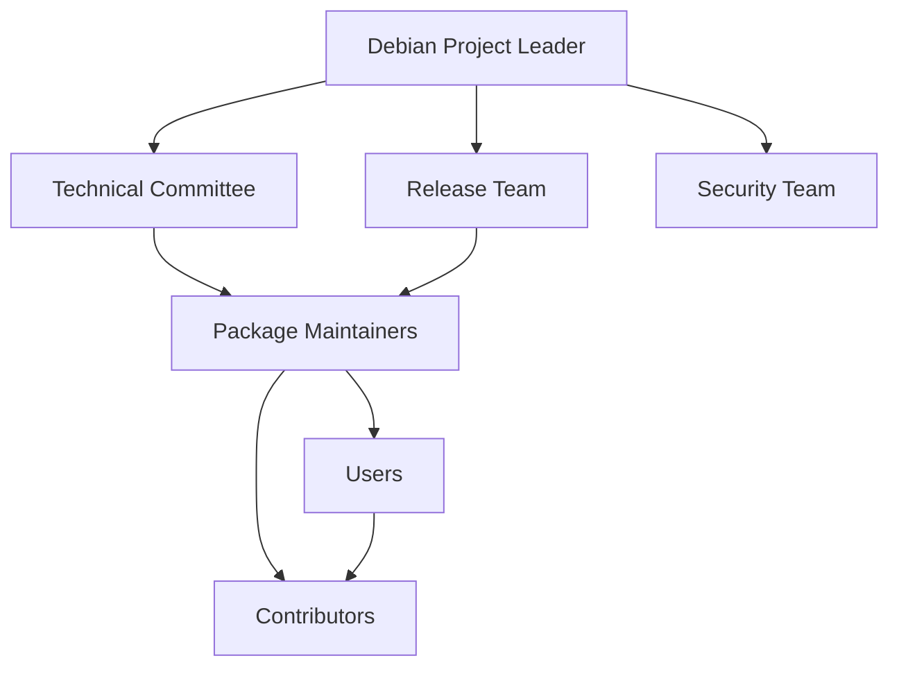

# Debian Community Introduction

## What is the Debian Community?

The Debian community is a diverse global network of volunteers who work together to develop and maintain the Debian operating system. Founded in 1993 by Ian Murdock, Debian has grown to become one of the largest and most influential open-source projects in the world, with thousands of contributors spread across the globe.

Unlike commercial software developed by companies, Debian is created through collaborative efforts of individuals who share common goals and values. This community-driven approach is what makes Debian special and has allowed it to thrive for decades.

## The Debian Social Contract

At the heart of the Debian community is the Debian Social Contract, which outlines the project's commitments to its users and to the free software community. This document serves as the ethical foundation for all community activities.

The Social Contract includes these key promises:

1. **Debian will remain 100% free software**
2. **We will give back to the free software community**
3. **We will not hide problems**
4. **Our priorities are our users and free software**
5. **Works that do not meet our free software standards may be included in separate areas**

These principles guide all decisions made within the project and help maintain the community's focus on freedom, transparency, and user empowerment.

## Community Structure

The Debian community has a well-defined structure that enables effective collaboration while maintaining its democratic nature.



### Key Roles in the Community

- **Debian Project Leader (DPL)**: Elected annually by Debian Developers, the DPL represents the project externally and helps coordinate internal activities.

- **Debian Developers**: These are the core members who have voting rights on major decisions and typically maintain packages or contribute significantly to the project.

- **Maintainers**: Individuals responsible for specific packages, ensuring they work properly, fixing bugs, and keeping them updated.

- **Contributors**: Anyone who helps by submitting patches, testing, documenting, translating, or advocating for Debian.

- **Users**: People who use Debian and contribute by reporting bugs, providing feedback, and supporting others.

## Communication Channels

The Debian community uses various channels to coordinate its activities:

- **Mailing Lists**: The primary means of communication for development discussions and decisions.
- **IRC Channels**: Real-time chat for quick questions and community building.
- **Bug Tracking System (BTS)**: Where issues are reported and tracked.
- **Wiki**: Collaborative documentation platform.
- **Planet Debian**: Aggregated blog posts from community members.
- **DebConf**: Annual conference where community members meet in person.

### Joining a Mailing List

Here's how you can subscribe to a Debian mailing list:

```bash
# Visit the Debian mailing list page
# https://lists.debian.org

# Find the list you're interested in
# For beginners, debian-user is recommended

# Send an email with the subject "subscribe" to:
debian-user-request@lists.debian.org

# Follow the confirmation instructions that will be emailed to you
```

## Getting Involved as a Beginner

The Debian community welcomes newcomers, and there are many ways to get involved regardless of your technical skills.

### Step 1: Use Debian

The first step is to become a Debian user. Install Debian on your system and start using it regularly. This helps you understand the system from a user's perspective.

### Step 2: Learn and Explore

- Read the documentation on the [Debian website](https://www.debian.org/)
- Follow the [Debian Wiki](https://wiki.debian.org/)
- Join the `#debian` IRC channel on OFTC
- Subscribe to beginner-friendly mailing lists like `debian-user`

### Step 3: Start Contributing

There are many ways to contribute:

- **Report bugs**: When you find an issue, report it through the Bug Tracking System.

```bash
# Install the reportbug tool
sudo apt install reportbug

# Configure it
reportbug --configure

# Report a bug in a package
reportbug package-name
```

- **Help with documentation**: Improve or translate documentation.
- **Test packages**: Especially in testing or unstable branches.
- **Provide support**: Help other users in forums and IRC.
- **Translate**: Help make Debian accessible in more languages.

### Step 4: Become a Package Maintainer

As you gain experience, you might consider maintaining a package:

1. Find a package that needs a maintainer or create a new one
2. Learn Debian packaging guidelines
3. Work with mentors through the [Debian Mentors program](https://wiki.debian.org/DebianMentorsFaq)

## Debian Values and Culture

Understanding Debian's values is essential for effective participation in the community:

- **Technical excellence**: Debian strives for high-quality, stable software.
- **Democracy**: Major decisions are made through voting among developers.
- **Openness**: Discussions and development happen in public.
- **Inclusivity**: The community welcomes diverse contributions and perspectives.
- **Volunteerism**: People contribute because they care, not for financial gain.
- **Independence**: Debian is not controlled by any corporation or commercial entity.

## The Debian Developer Process

Becoming a Debian Developer (DD) is a significant milestone that gives you full rights in the project. The process involves:

1. **Contributing regularly**: Demonstrate sustained contributions
2. **Finding a sponsor**: An existing DD who will advocate for you
3. **Application**: Submit an application to become a Debian Maintainer (DM) or Developer (DD)
4. **Philosophy and Procedures (P&P)**: Demonstrate understanding of Debian's principles
5. **Tasks and Skills (T&S)**: Prove technical competence
6. **Final approval**: Account Manager reviews and approves

This process can take several months or longer, depending on your contributions and the current queue of applicants.

## Common Challenges for Newcomers

It's normal to face some challenges when joining the Debian community:

- **Technical complexity**: Debian's systems and processes can be complex for beginners
- **Communication style**: Technical discussions can sometimes seem terse or direct
- **Finding the right place**: With so many teams and packages, finding where to contribute can be overwhelming
- **Imposter syndrome**: Feeling not skilled enough compared to experienced contributors

Remember that everyone started as a beginner, and the community generally appreciates sincere efforts to learn and contribute.

## Success Stories

Many current Debian Developers started with small contributions:

- Laura Arjona Reina began by translating documentation and now leads internationalization efforts
- Paul Wise started by reporting bugs and eventually became a Developer involved in multiple teams
- Many others began with simple patches or documentation improvements

## Summary

The Debian community is a global, volunteer-driven organization united by shared values of freedom, technical excellence, and collaboration. It offers numerous opportunities for participation regardless of your skill level, from using Debian and reporting bugs to maintaining packages and becoming a Debian Developer.

By understanding the community's structure, values, and processes, you can find your place in this remarkable open-source project and contribute to software that impacts millions of users worldwide.

## Additional Resources

- [Debian New Maintainers' Guide](https://www.debian.org/doc/manuals/maint-guide/)
- [Debian Developer's Reference](https://www.debian.org/doc/manuals/developers-reference/)
- [Debian Policy Manual](https://www.debian.org/doc/debian-policy/)
- [New Member Process](https://www.debian.org/devel/join/newmaint)

## Exercises for Beginners

1. Install Debian on your system (or in a virtual machine) and use it for daily tasks for two weeks.
2. Subscribe to a Debian mailing list and read discussions for one week.
3. Find and report a bug in a Debian package.
4. Help answer a question from another user on IRC or forums.
5. Identify a package that interests you and review its open bug reports.