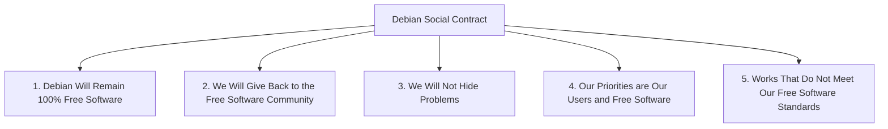
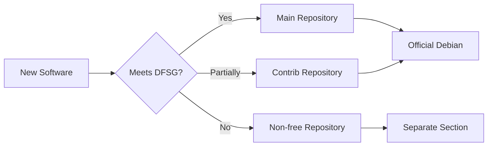

# The Debian Social Contract

## Introduction

The Debian Social Contract is a fundamental document that defines the core principles and commitments of the Debian project to the free software community. Established in 1997 and revised in 2004, this social contract acts as both a moral compass and a practical guide for Debian's development practices. For beginners entering the world of Linux and open-source software, understanding the Debian Social Contract provides valuable insights into the ethical foundations that drive one of the most respected open-source communities.

## What is the Debian Social Contract?

The Debian Social Contract is a declaration of Debian's commitments to its users and to the free software community. It consists of five core principles that guide all aspects of the project's work. These principles reflect Debian's dedication to freedom, openness, and community-driven development.



Let's explore each of these principles in detail.

## The Five Principles

### 1. Debian Will Remain 100% Free Software

Debian commits to ensuring that its main distribution system will always consist of free software as defined by the Debian Free Software Guidelines (DFSG). This means that all software in the main Debian repository can be freely used, modified, and distributed.

#### The Debian Free Software Guidelines (DFSG)

The DFSG defines the criteria that a software license must meet to be considered "free" according to Debian:

1. **Free Redistribution**: The license must allow free redistribution.
2. **Source Code**: The license must include source code and allow distribution in source form.
3. **Derived Works**: The license must allow modifications and derived works.
4. **Integrity of The Author's Source Code**: The license may restrict distribution of modified source only if it allows patches.
5. **No Discrimination Against Persons or Groups**
6. **No Discrimination Against Fields of Endeavor**
7. **Distribution of License**: The rights attached to the program must apply to everyone who receives it.
8. **License Must Not Be Specific to Debian**
9. **License Must Not Contaminate Other Software**
10. **Example Licenses**: GPL, BSD, and Artistic licenses are examples that Debian considers free.

#### Practical Example: Checking a Package's Freedom

To check if a package in Debian is free according to the DFSG, you can use the `apt show` command:

```bash
apt show firefox
```

In the output, look for the "Section" line. If it shows "main", the package is considered free according to Debian's standards.

### 2. We Will Give Back to the Free Software Community

This principle emphasizes Debian's commitment to contributing back to the open-source ecosystem. When Debian developers write components for the Debian system, they release them as free software. The project also reports bugs it finds to upstream developers and contributes improvements whenever possible.

#### Example: Contributing Patches Upstream

When Debian maintainers find and fix bugs in software packages, they typically submit these fixes back to the original (upstream) project:

```bash
# Example workflow for a Debian maintainer
# 1. Fix a bug in a package
git clone https://github.com/example/project
cd project
# Make changes to fix the bug
git add changed_file.c
git commit -m "Fix buffer overflow in function x"

# 2. Create a patch
git format-patch -1

# 3. Submit the patch upstream
git send-email --to=upstream-maintainers@example.com 0001-Fix-buffer-overflow-in-function-x.patch
```

### 3. We Will Not Hide Problems

Debian commits to transparency by maintaining its entire bug tracking system openly and publicly. Bug reports filed by users are immediately visible to others, and the status of bug fixes is publicly tracked.

#### Practical Example: Accessing Debian's Bug Tracking System

You can access Debian's bug tracking system through its web interface or via command-line tools:

```bash
# Install the reportbug tool
sudo apt install reportbug

# Search for bugs in a package
reportbug --query --package=firefox

# Or access the web interface
# https://bugs.debian.org/firefox
```

This transparency ensures that all users can see the current state of the distribution, including any known issues.

### 4. Our Priorities are Our Users and Free Software

Debian explicitly states that its priorities are its users and free software. The project commits to providing a robust operating system that meets the needs of its user base while maintaining its commitment to free software principles.

#### Real-world Application: Debian's Decision-Making Process

This principle can be observed in Debian's decision-making process, which involves:

1. Technical discussions on mailing lists
2. Bug reporting and tracking
3. General Resolution procedures for major decisions
4. The Debian Project Leader's guidance

When conflicts arise between user needs and free software ideals, Debian strives to find solutions that honor both, often through innovative technical approaches or by creating separate repositories (like "non-free") for content that doesn't meet free software criteria.

### 5. Works That Do Not Meet Our Free Software Standards

Debian recognizes that some users may need to use software that doesn't meet the DFSG. While such software isn't included in the main Debian system, the project provides infrastructure (such as the "non-free" and "contrib" repositories) to help users who choose to use such software.

#### Example: Installing Non-Free Software

To access non-free software, you need to add the appropriate repositories to your system:

```bash
# Edit the sources.list file
sudo nano /etc/apt/sources.list

# Add non-free repositories
# Example line:
# deb http://deb.debian.org/debian bullseye main contrib non-free

# Update package lists
sudo apt update

# Now you can install non-free packages
sudo apt install firmware-iwlwifi
```

This approach allows Debian to maintain its commitment to free software while still serving users who need proprietary software for practical reasons.

## The Social Contract and Community Governance

The Debian Social Contract doesn't just define principles; it shapes how the Debian community governs itself. Debian's decision-making processes, from package inclusion to policy changes, are guided by these principles.

### The Debian Constitution

The Debian Constitution, which defines the organizational structure of the project, draws its authority and direction from the Social Contract. It establishes:

- The role of the Debian Project Leader
- The process for making General Resolutions
- The responsibilities of developers
- The delegation of authority

### Community Example: Package Maintenance

The Social Contract influences how packages are maintained in practice:

1. Maintainers ensure packages meet DFSG requirements
2. Bug reports are openly tracked
3. Security issues are promptly addressed and disclosed
4. Upstream improvements are contributed back



## Impact Beyond Debian

The Debian Social Contract has influenced many other open-source projects and communities. Its principles have been adopted, adapted, or used as inspiration for governance models across the broader free software ecosystem.

### Influence on Derivative Distributions

Ubuntu, one of the most popular Linux distributions, is derived from Debian and has its own set of principles inspired by the Debian Social Contract. Many other Debian-derived distributions similarly adopt ethical frameworks that echo Debian's commitments.

### The Open Source Definition

The Debian Free Software Guidelines formed the basis of the Open Source Definition, which is used by the Open Source Initiative to determine whether a software license can be considered "open source."

## Practical Engagement with the Social Contract

As a beginner in the Debian community, there are several ways to engage with and support the principles of the Social Contract:

1. **Report bugs** you find in Debian software
2. **Contribute improvements** to packages you use
3. **Help document** software and processes
4. **Participate in discussions** on mailing lists
5. **Advocate for free software** in your communities

## Summary

The Debian Social Contract represents the core ethical and practical commitments of the Debian project. By prioritizing user freedom, transparency, community contribution, and pragmatic approaches to software freedom, Debian has established itself as a leader in the free software movement.

For beginners, understanding the Social Contract provides important context for how and why Debian operates as it does. It explains the project's dedication to free software, its approach to community governance, and its influence on the broader open-source ecosystem.

## Additional Resources

For those interested in learning more about the Debian Social Contract and related topics:

- [The official Debian Social Contract](https://www.debian.org/social_contract)
- [The Debian Free Software Guidelines](https://www.debian.org/social_contract#guidelines)
- [The Debian Constitution](https://www.debian.org/devel/constitution)
- [Debian Bug Tracking System](https://bugs.debian.org/)
- [How to contribute to Debian](https://www.debian.org/doc/manuals/developers-reference/contributing.html)

## Exercises for Understanding

1. Review the license of a software package you commonly use. Does it meet the Debian Free Software Guidelines? Why or why not?

2. Explore Debian's bug tracking system and find an open bug in a package you're interested in. How is the community responding to this issue?

3. Compare the Debian Social Contract with the philosophical principles of another Linux distribution. What similarities and differences do you notice?

4. Consider a scenario where user needs might conflict with free software principles. How might the Debian community approach resolving this tension?