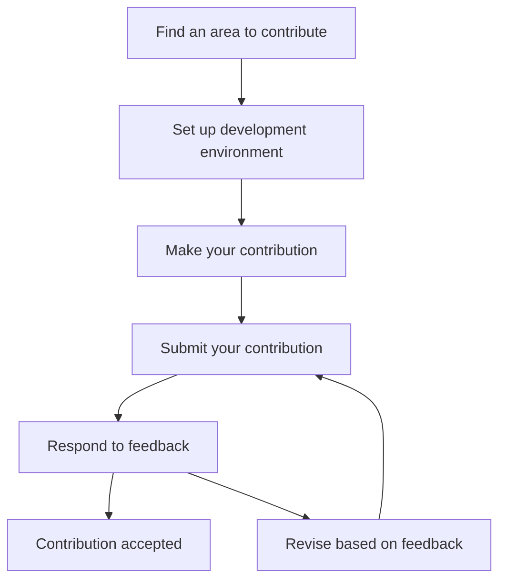

# Debian Contributions

## Introduction

Debian is one of the oldest and most respected Linux distributions, known for its stability, security, and commitment to free software principles. What makes Debian particularly special is that it's entirely built and maintained by a community of volunteers from around the world. Contributing to Debian not only helps improve a critical piece of computing infrastructure used by millions, but also provides an excellent opportunity to develop your skills, connect with like-minded individuals, and participate in open source development.

This guide will walk you through the various ways you can contribute to Debian, from simple tasks suitable for beginners to more advanced contributions as you gain experience.

## Why Contribute to Debian?

Before diving into how to contribute, let's understand why contributing to Debian is valuable:

- **Learn by doing**: Contributing to Debian provides hands-on experience with real-world software development, packaging, and community collaboration.
- **Build your portfolio**: Your contributions are public and can be showcased to potential employers.
- **Connect with experts**: Interact with experienced developers who can mentor and guide you.
- **Give back to the community**: Help improve software that's used by millions of people and organizations worldwide.
- **Become part of something bigger**: Join a global community with a 30+ year history of promoting free and open source software.

## Getting Started: First Steps

### 1. Set Up a Debian Environment

Before contributing, it's helpful to familiarize yourself with Debian by using it:

```bash
# If you're new to Debian, you can start with a virtual machine
# Install Debian in VirtualBox or similar virtualization software
# Or use a Debian container with Docker
docker pull debian:latest
docker run -it debian:latest bash
```

### 2. Create a Debian Account

To contribute officially, you'll need a Debian account:

1. Visit [Debian Account Management](https://nm.debian.org/)
2. Follow the registration process
3. Set up your GPG key and SSH key as instructed

### 3. Subscribe to Relevant Mailing Lists

Debian coordination happens primarily through mailing lists:

```bash
# Example of subscribing to debian-devel mailing list using the command line tool
apt-get install mailutils
echo "subscribe" | mail debian-devel-request@lists.debian.org
```

Or simply visit [Debian Mailing Lists](https://lists.debian.org/) and subscribe through the web interface.

## Types of Contributions

Debian welcomes various types of contributions, suitable for different skill levels and interests:

### Documentation Contributions

Documentation is an excellent starting point for beginners:

```bash
# Clone the Debian documentation repository
git clone https://salsa.debian.org/debian/debian-handbook.git
cd debian-handbook

# Make your changes, then commit and push
git add .
git commit -m "Fix typo in installation instructions"
git push
```

Common documentation tasks include:
- Correcting typos and grammatical errors
- Updating outdated information
- Translating content to other languages
- Writing new guides or tutorials

### Bug Reporting and Triage

Finding and reporting bugs helps improve Debian's quality:

```bash
# Install the reportbug tool
apt-get install reportbug

# Report a bug
reportbug firefox-esr
```

When reporting bugs:
1. Check if the bug has already been reported
2. Provide clear steps to reproduce the issue
3. Include relevant system information
4. Follow up on any questions from developers

### Package Maintenance

Debian consists of thousands of packages that need maintenance:

```bash
# Install packaging tools
apt-get install build-essential devscripts git-buildpackage

# Clone a package repository
git clone https://salsa.debian.org/debian/package-name.git
cd package-name

# Update the package to a new upstream version
uscan --verbose
gbp import-orig ../package_newversion.orig.tar.gz
```

As a beginner, you can:
- Adopt orphaned packages
- Help maintain existing packages
- Update packages to newer versions
- Fix bugs in packages

### Code Contributions

Direct code contributions to Debian projects:

```bash
# Example: Contributing to the Debian Installer
git clone https://salsa.debian.org/installer-team/debian-installer.git
cd debian-installer

# Make changes, build, and test
make build
```

Code contributions might include:
- Fixing bugs in Debian-specific tools
- Adding new features to Debian utilities
- Improving performance or security

## The Contribution Workflow

Here's a typical workflow for contributing to Debian:



### Example: Fixing a Bug in a Debian Package

Let's walk through a real-world example of fixing a bug in a Debian package:

1. **Find a bug to fix**:

```bash
# Browse the Debian Bug Tracking System
firefox https://bugs.debian.org/

# Look for bugs tagged 'newcomer' or 'easy'
firefox https://bugs.debian.org/cgi-bin/pkgreport.cgi?tag=newcomer;users=debian-qa@lists.debian.org
```

2. **Set up the development environment**:

```bash
# Install necessary tools
apt-get install devscripts build-essential fakeroot
apt-get build-dep package-name

# Get the source code
apt-get source package-name
cd package-name-X.Y.Z/
```

3. **Fix the bug**:

```bash
# Edit the relevant files
nano src/file-with-bug.c

# Update the changelog
dch -i "Fix bug #XXXXXX: Brief description of the fix"
```

4. **Build and test the package**:

```bash
# Build the package
debuild -us -uc

# Install and test the fixed package
cd ..
sudo dpkg -i package-name_X.Y.Z-N_amd64.deb

# Run tests to verify the fix
package-name --test
```

5. **Submit a patch**:

```bash
# Create a patch
git format-patch -1

# Submit the patch to the Bug Tracking System
reportbug --attach=0001-fix-bug-description.patch package-name
```

## Becoming a Debian Developer or Maintainer

After contributing regularly, you might consider becoming an official Debian Developer or Maintainer:

### Debian Maintainer (DM)

A Debian Maintainer can upload specific packages to the Debian archive:

1. Contribute regularly to Debian
2. Apply for Debian Maintainer status
3. Get endorsements from existing Debian Developers
4. Pass a verification process

### Debian Developer (DD)

A Debian Developer has full rights in the project:

1. Contribute as a Maintainer first
2. Apply to become a Debian Developer
3. Go through the New Member process
4. Pass technical and philosophical evaluations
5. Complete identity verification

```bash
# Check the status of your application
nm-frontend
```

## Community Interaction

Contributing to Debian involves interacting with the community:

### IRC Channels

```bash
# Install an IRC client
apt-get install hexchat

# Connect to OFTC network and join Debian channels
# Common channels: #debian, #debian-devel, #debian-mentors
```

### Debian Events

Debian hosts various events where you can meet contributors in person:

- DebConf: The annual Debian Conference
- Mini-DebConfs: Smaller regional events
- Bug Squashing Parties: Focused events to fix bugs

## Best Practices for Contributors

To be an effective Debian contributor:

- **Start small**: Begin with simple tasks and gradually take on more complex ones
- **Be patient**: The review process can take time
- **Follow the Debian guidelines**: Read and adhere to the Debian Policy
- **Ask for help**: Use the #debian-mentors channel or mailing list
- **Be respectful**: Follow the Debian Code of Conduct in all interactions

## Summary

Contributing to Debian is a rewarding way to participate in open source development. As a beginner, you can start with documentation, bug reports, and simple package maintenance tasks. As you gain experience, you can take on more responsibilities and potentially become an official Debian Maintainer or Developer.

The Debian community values quality, stability, and adherence to free software principles. By contributing to Debian, you're helping millions of users worldwide who rely on this distribution for their computing needs.

## Additional Resources

- [Debian New Maintainers' Guide](https://www.debian.org/doc/manuals/maint-guide/)
- [Debian Developer's Reference](https://www.debian.org/doc/manuals/developers-reference/)
- [How to join Debian](https://www.debian.org/devel/join/)
- [Debian Bug Tracking System](https://bugs.debian.org/)
- [Debian Mentors](https://www.debian.org/devel/mentors/)

## Exercises

1. Set up a Debian virtual machine and familiarize yourself with the system.
2. Find and report a bug in a Debian package.
3. Fix a documentation issue and submit a patch.
4. Find an orphaned package that interests you and learn about its adoption process.
5. Subscribe to a Debian mailing list and follow discussions for a week.

By completing these exercises, you'll gain practical experience and start building connections within the Debian community.