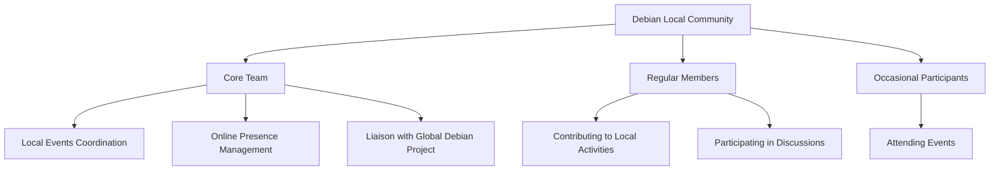

# Debian Local Communities

## Introduction

Debian Local Communities (DLCs) are groups of Debian users, developers, and enthusiasts who organize themselves based on geographical proximity or language. These communities form the backbone of Debian's global presence, making the project accessible to people of diverse cultural and linguistic backgrounds. For beginners entering the world of Linux and open-source development, DLCs provide invaluable support, mentorship, and a sense of belonging.

## What Are Debian Local Communities?

Debian Local Communities are self-organized groups that promote Debian in specific regions or language communities. They serve multiple purposes:

- Provide support in local languages
- Organize regional events and meetups
- Help with localization efforts
- Create localized documentation
- Offer a friendly entry point for newcomers

These communities operate autonomously while adhering to Debian's principles and philosophy.

## Types of Debian Local Communities

### Language-based Communities

These focus on making Debian accessible in specific languages:

- **Debian l10n teams** - Localization teams that translate Debian documentation, websites, and software interfaces
- **Debian i18n teams** - Internationalization teams that ensure software can be adapted to various languages and regions

### Geographic Communities

Organized by geographical regions, these include:

- **Country-specific groups** - Like Debian France, Debian Brazil, Debian Taiwan
- **Regional groups** - Spanning multiple countries with cultural or linguistic similarities
- **City-level groups** - Local user groups in metropolitan areas

## Structure of a DLC

Local communities typically have the following components:



## Getting Involved with a DLC

For beginners, joining a local Debian community can be an excellent starting point in your open-source journey. Here's how to get involved:

### 1. Find Your Local Community

To discover a Debian Local Community near you:

```bash
# This is a conceptual example - not actual code
$ browser https://wiki.debian.org/LocalGroups
```

The Debian Wiki maintains a comprehensive list of active local groups worldwide.

### 2. Join Communication Channels

Most DLCs maintain various communication channels:

- Mailing lists
- IRC channels
- Matrix/Element rooms
- Telegram or Signal groups
- Forums

For example, to subscribe to a local mailing list:

```bash
# Example of subscribing to the debian-user-french mailing list
$ browser https://lists.debian.org/debian-user-french/
# Then follow the "Subscribe" link and fill out the form
```

### 3. Attend Local Events

DLCs organize various events:

- Install parties
- Bug squashing parties
- Release parties
- Workshops and training sessions
- Social gatherings

These events are usually announced on:

```
- The local community website
- Local mailing lists
- Social media channels
- The Debian Events page: https://www.debian.org/events/
```

### 4. Start Contributing

Even as a beginner, there are many ways to contribute:

- Help with translations
- Improve local documentation
- Assist with event organization
- Support new users in your language
- Report bugs specific to your locale

## Case Study: Debian France

Debian France is an excellent example of a well-established local community:

- **Legal entity**: Established as a non-profit organization under French law
- **Activities**: Organizes Mini-DebConfs, represents Debian at FOSDEM and other French FOSS events
- **Infrastructure**: Provides hosting services for Debian-related projects
- **Funding**: Collects donations to support Debian development
- **Website**: [https://france.debian.net/](https://france.debian.net/)

## Creating a New Local Community

If there's no DLC in your area, you can start one:

1. **Gather interested people**:
   Find other Debian users in your area through university clubs, tech meetups, or online forums.

2. **Set up basic infrastructure**:
   ```bash
   # Example of creating a mailing list request
   $ mail new-list-request@lists.debian.org
   Subject: New list request: debian-users-[your-location]
   
   Hello,
   
   I'd like to request a new mailing list for Debian users in [your location].
   
   Purpose: To coordinate local Debian activities and provide support in [local language].
   Expected traffic: Low to moderate
   Language: [Your local language]
   
   Thank you,
   [Your name]
   ```

3. **Register on the Debian Wiki**:
   Add your group to the LocalGroups page.

4. **Organize a first meetup**:
   Start with something simple like a café gathering or online meeting.

5. **Coordinate with nearby DLCs**:
   They can provide guidance and potentially collaborate on larger events.

## Challenges and Solutions for DLCs

### Language Barriers

**Challenge**: Not all Debian documentation is available in all languages.

**Solution**: Join localization efforts:

```bash
# Example of checking translation status for Debian Installer
$ browser https://d-i.debian.org/l10n-stats/
```

### Geographic Distance

**Challenge**: Members may be spread across a large area.

**Solution**: Combine online and offline activities:

```
- Regular online meetings (e.g., monthly)
- Quarterly in-person gatherings
- Annual participation in larger Debian events
```

### Technical Expertise Variation

**Challenge**: Communities include both experts and beginners.

**Solution**: Implement mentor-mentee relationships and structured learning paths.

## Summary

Debian Local Communities are essential components of the broader Debian ecosystem. They bring the global project to the local level, making it accessible and relevant to users worldwide. For beginners, these communities provide a friendly entry point to the world of Debian and open-source software development.

By joining or creating a DLC, you can:
- Learn from experienced Debian users and developers
- Contribute to the project in your native language
- Help spread free and open-source software in your region
- Build valuable technical and community skills

## Additional Resources

- **Debian Wiki**: [https://wiki.debian.org/LocalGroups](https://wiki.debian.org/LocalGroups)
- **Debian International**: [https://www.debian.org/international/](https://www.debian.org/international/)
- **DebConf (Annual Debian Conference)**: [https://debconf.org/](https://debconf.org/)

## Exercises for Readers

1. **Research Exercise**: Find the nearest Debian Local Community to you and identify their primary communication channels.

2. **Participation Task**: Join a mailing list or chat channel of a DLC and introduce yourself.

3. **Contribution Challenge**: Identify a piece of Debian documentation that isn't translated into your native language and learn about the steps to contribute a translation.

4. **Community Building**: If there's no DLC in your area, list the steps you would take to form one and the resources you would need.

5. **Event Planning**: Design a simple agenda for a local Debian install party that would be welcoming to complete beginners.