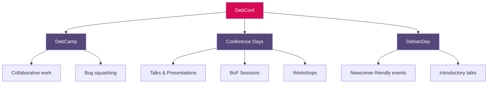
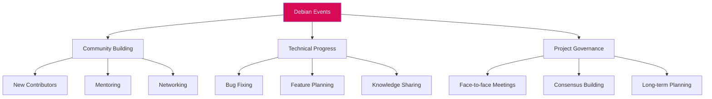

# Debian Events

## Introduction

Debian Events are gatherings where Debian users, developers, maintainers, and enthusiasts come together to collaborate, share knowledge, and strengthen the Debian community. These events range from large international conferences to small local meetups, all united by a passion for the Debian operating system and free software philosophy.

As a beginner in the Debian ecosystem, understanding these events can help you:
- Connect with experienced developers
- Learn about Debian's development process
- Contribute to the project
- Stay updated with the latest Debian developments
- Build lasting relationships within the open-source community

## Types of Debian Events

Debian hosts and participates in various types of events throughout the year:

### DebConf (Debian Conference)

DebConf is the annual Debian developers' conference - the largest and most significant Debian event of the year.

#### Key Aspects of DebConf:

- **Duration**: Typically spans 1-2 weeks
- **Activities**: Talks, workshops, coding sessions, and social activities
- **Locations**: Rotates between different countries each year
- **Participation**: Open to everyone, with special tracks for newcomers



### Mini-DebConf

Mini-DebConfs are smaller regional events that happen throughout the year.

- **Duration**: Usually 2-3 days
- **Scale**: Regional focus with typically 50-200 participants
- **Purpose**: To provide more accessible events to those who cannot attend the main DebConf

### BSP (Bug Squashing Party)

BSPs are focused working sessions where contributors come together to fix bugs in Debian packages.

```jsx
// Example of a typical BSP announcement email format
const bspAnnouncement = `Subject: Bug Squashing Party in Berlin, April 15-17, 2025

Hello Debian enthusiasts!

We're organizing a Bug Squashing Party in Berlin on April 15-17, 2025.

Location: Hackspace Berlin, Wilhelmstraße 123
Time: 10:00 - 18:00 each day

Please bring:
- Your laptop
- Debian installation (or VM)
- Enthusiasm for fixing bugs!

Mentors will be available to help newcomers.

Please register at https://debian.org/events/bsp-berlin (example link)

See you there!
`;

console.log(bspAnnouncement);
```

### Release Parties

When a new Debian stable version is released, communities around the world celebrate with release parties.

- **Timing**: Following a stable Debian release (approximately every 2 years)
- **Activities**: Demonstrations, installation help, and social gatherings
- **Organization**: Usually community-led and locally organized

### Debian Presence at Other Events

Debian often participates in larger open-source and free software events:

- FOSDEM (Free and Open Source Software Developers' European Meeting)
- Linux conferences (SCALE, LinuxCon, etc.)
- Local FLOSS (Free/Libre Open Source Software) meetups

## Participating in Debian Events

### Finding Upcoming Events

You can discover Debian events through these channels:

- The [Debian Events page](https://www.debian.org/events/)
- Debian mailing lists, especially [debian-events-*](https://lists.debian.org/) regional lists
- The #debian-events IRC channel on OFTC
- Social media accounts of Debian and local Debian communities

### Ways to Participate

#### Attending In-Person

```jsx
// Example function to prepare for attending a Debian event
function prepareForDebianEvent() {
  const checklist = [
    "Register for the event (if required)",
    "Check visa requirements (for international events)",
    "Prepare questions for developers",
    "Review the schedule and mark interesting talks",
    "Set up your laptop with latest Debian version",
    "Bring Debian stickers/swag to share"
  ];
  
  return checklist.map((item, index) => 
    console.log(`${index + 1}. ${item}`)
  );
}

// Call the function to see the checklist
prepareForDebianEvent();
```

#### Remote Participation

Many Debian events offer remote participation options:

- Live streaming of talks and presentations
- IRC or Matrix channels for real-time discussions
- Collaborative note-taking on pads
- Video conferencing for selected sessions

### Contributing to Events

As you become more familiar with Debian, you can contribute to events by:

- **Volunteering**: Help with organization, video team, or welcome desk
- **Presenting**: Share your Debian experiences or projects
- **Organizing**: Initiate local meetups or Mini-DebConfs
- **Sponsoring**: Support events financially or through in-kind donations

## The Impact of Debian Events

### Community Building

Events are crucial for building and maintaining the Debian community:

- Face-to-face meetings strengthen online relationships
- New contributors are introduced to the community
- Mentoring relationships are established
- Diverse perspectives are shared and understood

### Technical Progress

Substantial development often happens at Debian events:

- Complex technical discussions are easier in person
- Collaboration on difficult bugs and features
- Decision-making on future directions
- Knowledge transfer between experienced and new developers



### Project Governance

Many important decisions about Debian's direction happen at events:

- General Resolutions are discussed
- Teams meet to plan their roadmaps
- The Debian Project Leader can address the community directly
- Project-wide initiatives are launched and coordinated

## Case Study: DebConf Impact

### DebConf20: The First Fully Virtual DebConf

Due to the COVID-19 pandemic, DebConf20 was held entirely online:

- Over 850 attendees from around the world
- 100+ talks and sessions delivered virtually
- Bug squashing and team meetings conducted remotely
- New forms of participation emerged

```jsx
// Example data showing DebConf attendance over the years
const debConfAttendance = [
  { year: 2016, location: "Cape Town", attendees: 280 },
  { year: 2017, location: "Montreal", attendees: 306 },
  { year: 2018, location: "Hsinchu", attendees: 302 },
  { year: 2019, location: "Curitiba", attendees: 380 },
  { year: 2020, location: "Online", attendees: 851 },
  { year: 2021, location: "Online", attendees: 730 },
  { year: 2022, location: "Prizren", attendees: 312 },
  { year: 2023, location: "Kochi", attendees: 350 },
  { year: 2024, location: "Haifa", attendees: 325 }
];

// Function to display attendance statistics
function analyzeAttendance(data) {
  const totalAttendees = data.reduce((sum, conf) => sum + conf.attendees, 0);
  const avgAttendees = Math.round(totalAttendees / data.length);
  
  console.log(`Average DebConf attendance: ${avgAttendees} people`);
  console.log(`Highest attendance: ${Math.max(...data.map(conf => conf.attendees))}`);
  
  // Find online vs. in-person differences
  const onlineEvents = data.filter(conf => conf.location === "Online");
  const inPersonEvents = data.filter(conf => conf.location !== "Online");
  
  const avgOnline = Math.round(onlineEvents.reduce((sum, conf) => sum + conf.attendees, 0) / onlineEvents.length);
  const avgInPerson = Math.round(inPersonEvents.reduce((sum, conf) => sum + conf.attendees, 0) / inPersonEvents.length);
  
  console.log(`Average online attendance: ${avgOnline}`);
  console.log(`Average in-person attendance: ${avgInPerson}`);
}

analyzeAttendance(debConfAttendance);
```

### Technical Outcomes from Recent DebConfs

- **DebConf19**: Significant progress on the Debian Installer Rewrite (d-i-2)
- **DebConf21**: Security team coordination for supply chain improvements
- **DebConf22**: Finalization of plans for Debian 12 "Bookworm"
- **DebConf23**: Accessibility improvements across the project

## How to Organize a Debian Event

### Local Meetups

Starting small with local Debian meetups is an excellent way to build community:

1. **Find a venue**: Look for tech-friendly spaces like hackerspaces, universities, or community centers
2. **Set a date and agenda**: Plan topics relevant to local interests
3. **Announce**: Use Debian mailing lists and social media
4. **Prepare materials**: Have installation media and documentation ready
5. **Document**: Share photos and summaries with the wider community

### Mini-DebConf Organization

For more ambitious events, consider organizing a Mini-DebConf:

```jsx
// Mini-DebConf planning timeline
const miniDebConfTimeline = {
  "12 months before": [
    "Form organizing team",
    "Secure venue commitment",
    "Create initial budget"
  ],
  "9 months before": [
    "Announce date and location",
    "Open call for sponsors",
    "Set up website"
  ],
  "6 months before": [
    "Open registration",
    "Call for presentations",
    "Arrange accommodation options"
  ],
  "3 months before": [
    "Finalize schedule",
    "Confirm sponsors and budget",
    "Arrange catering and social events"
  ],
  "1 month before": [
    "Send final announcements",
    "Prepare signage and swag",
    "Brief volunteers on roles"
  ],
  "After event": [
    "Send thank-you notes",
    "Publish videos and photos",
    "Write report for debian-news"
  ]
};

// Example usage
for (const [timeframe, tasks] of Object.entries(miniDebConfTimeline)) {
  console.log(`
${timeframe}:`);
  tasks.forEach(task => console.log(`- ${task}`));
}
```

### Resources for Organizers

Debian provides resources for event organizers:

- **DebConf wiki**: Documentation of past events
- **debian-events mailing lists**: For coordination and advice
- **DebConf team**: Experienced organizers who can mentor
- **Event box**: Banners, tablecloths, and promotional materials

## Summary

Debian Events form the backbone of the Debian community, providing essential opportunities for collaboration, learning, and social connections. Whether you're attending your first local meetup or helping organize the next DebConf, participation in these events can significantly enhance your Debian experience and contribution impact.

These gatherings demonstrate the human side of free software development, showing that behind every package, bug fix, and feature is a community of passionate individuals working together toward shared goals.

## Additional Resources

- **Debian Events Page**: The official listing of upcoming events
- **DebConf Website**: Information about past and future DebConfs
- **Debian Wiki**: Community-maintained guides for event organization
- **IRC Channels**: #debian-events and #debconf on OFTC

## Practical Exercises

1. **Research**: Find the next Debian-related event in your region or online
2. **Participate**: Join a Debian mailing list and introduce yourself
3. **Contribute**: Help translate event announcements to make them more accessible
4. **Organize**: Plan a small Debian install party or meetup in your community
5. **Document**: Write a blog post about your Debian event experience and share it with the community