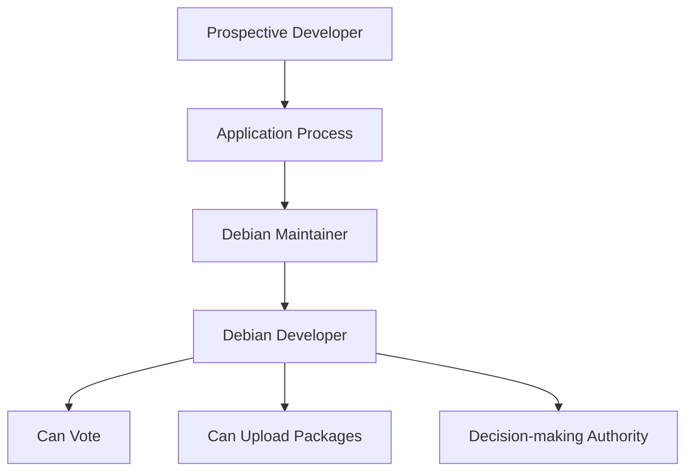
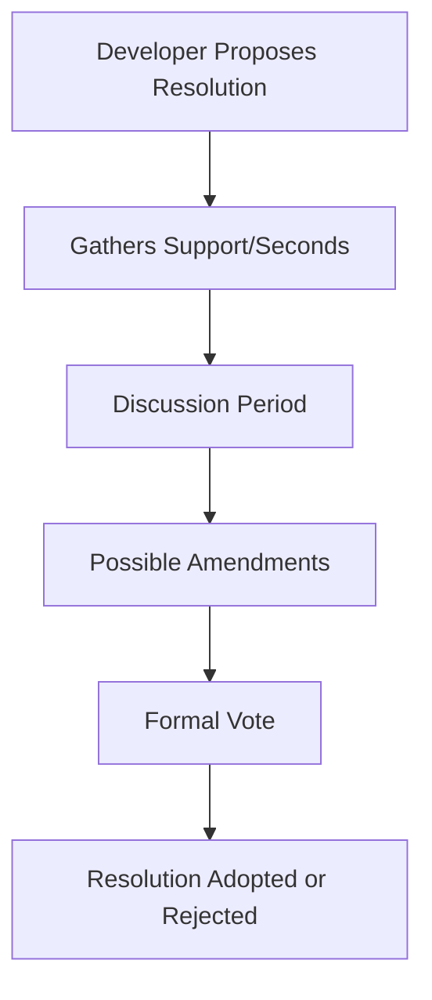

# Debian Constitution

## Introduction

The Debian Constitution is a foundational document that outlines the organizational structure and decision-making processes within the Debian Project. Established in December 1998, it serves as the governance framework for one of the oldest and most respected Linux distributions in existence. 

Unlike traditional software projects with centralized leadership, Debian operates as a democratic community where developers have collective ownership and responsibility. The constitution formalizes this democratic approach, defining roles, responsibilities, and procedures that enable hundreds of volunteers worldwide to collaborate effectively on maintaining and advancing the Debian operating system.

## The Need for Governance in Open Source

Before diving into the specifics of Debian's governance model, it's important to understand why formal governance structures matter in open source projects:

- **Decision-making clarity**: With contributors spread across the globe, clear processes prevent confusion and deadlocks
- **Conflict resolution**: Formal procedures help resolve disagreements constructively
- **Project continuity**: Governance ensures the project can continue even as individual contributors come and go
- **Value alignment**: Constitutional documents help maintain the project's core principles and mission

## Key Components of the Debian Constitution

### 1. Debian Developers

The constitution establishes Debian Developers (DDs) as the primary decision-makers in the project. DDs are volunteers who:

- Have gone through an application process demonstrating technical skills and understanding of Debian's principles
- Can vote on general resolutions and leadership positions
- Have the ability to upload packages to the Debian archives
- Share collective responsibility for the project's direction

### 2. The Debian Project Leader (DPL)

The constitution establishes the role of the Debian Project Leader (DPL), who:

- Is elected annually by Debian Developers
- Represents Debian externally to other organizations
- Can make decisions on resource allocation (such as equipment or funds)
- Can appoint delegates for specific responsibilities
- Cannot unilaterally change technical or policy decisions

The DPL's authority is intentionally limited, reflecting Debian's commitment to distributed decision-making.

### 3. Technical Committee

The Technical Committee serves as Debian's court of last resort for technical disputes. The constitution grants this body the power to:

- Decide on technical matters when developers cannot reach consensus
- Interpret or create policy when required for resolving disputes
- Make technical decisions when asked to do so by developers involved in a disagreement
- Override developer decisions when necessary (though this power is rarely used)

Committee members are appointed based on their technical expertise and understanding of Debian's principles.

### 4. General Resolutions

The constitution establishes a formal process for Debian Developers to collectively make decisions through General Resolutions:

- Any developer can propose a resolution
- Resolutions require a "second" (support from other developers) to proceed to voting
- Discussion periods ensure thorough debate before voting
- The Condorcet voting method is used to allow ranking of multiple options
- Different types of resolutions may require different supermajorities

This process is used for major decisions that affect the entire project, such as:
- Approving or amending Foundation Documents
- Making decisions about property trusted to the Project
- Approving or removing the Project Leader
- Overriding Technical Committee decisions (with appropriate supermajority)

## Debian's Foundation Documents

The constitution designates several documents as foundational to the project:

1. **The Debian Social Contract**: Outlines Debian's commitments to the free software community
2. **The Debian Free Software Guidelines (DFSG)**: Defines what Debian considers "free" software
3. **The Debian Constitution itself**: The governance document we're discussing
4. **The Debian Policy Manual**: Technical standards for the distribution

These documents can only be changed through General Resolutions with special supermajorities.

## Decision-Making in Practice

Let's examine how Debian's constitutional process works in real-world scenarios:

### Example 1: Package Maintenance Dispute

When two developers disagree on how a particular package should be maintained:

1. The developers attempt to resolve the issue through discussion
2. If unsuccessful, they may seek input from the wider developer community
3. If still unresolved, they can escalate to the Technical Committee
4. The Committee makes a binding decision after hearing all sides

### Example 2: Project-Wide Policy Change

When a developer proposes a significant change to Debian's policies:

1. The developer drafts a General Resolution proposal
2. They gather seconds (support) from other developers
3. A discussion period allows for debate and refinement
4. The proposal may be amended based on feedback
5. A formal vote is held using the Condorcet method
6. If approved with the required majority, the policy is adopted

## Evolution of the Constitution

The Debian Constitution is not static. Through General Resolutions, it has evolved over time to address new challenges and improve governance processes. Some notable amendments include:

- Clarifications to the delegate appointment process
- Refinements to voting procedures
- Updates to Technical Committee selection
- Adjustments to decision-making timelines

This evolution demonstrates Debian's commitment to responsive, community-driven governance.

## Practical Implications for Contributors

If you're considering contributing to Debian, understanding the constitution helps you navigate the project effectively:

- Know where decisions are made and how to participate
- Understand the escalation path when facing obstacles
- Recognize the value of building consensus before formal procedures
- Appreciate the balance between individual initiative and collective governance

## Comparison with Other Open Source Governance Models

Debian's constitutional model differs from other open source projects in several ways:

| Project | Governance Model | Leadership | Decision Making |
|---------|------------------|------------|-----------------|
| Debian | Constitutional Democracy | Elected DPL with limited powers | Voting, Technical Committee |
| Linux Kernel | Benevolent Dictator | Linus Torvalds | Hierarchical approval |
| Apache | Foundation | Board of Directors | Project Management Committees |
| Fedora | Sponsor-backed | Fedora Council with Red Hat influence | Council and Working Groups |
| Ubuntu | Commercial | Canonical leadership | Company-driven with community input |

Debian's approach emphasizes democratic processes and collective ownership to a degree unusual even among major open source projects.

## Summary

The Debian Constitution represents one of the most sophisticated governance systems in the open source world. By formalizing democratic processes, clearly defining roles, and establishing mechanisms for dispute resolution, it enables a global community of volunteers to collaboratively maintain a complex operating system.

The constitution embodies Debian's core values of technical excellence, democracy, and freedom. While it may seem bureaucratic compared to smaller projects, this governance structure has provided stability and continuity for over two decades, allowing Debian to remain independent and true to its principles while many other distributions have come and gone.

## Additional Resources

For those interested in learning more about Debian governance:

- The full text of the [Debian Constitution](https://www.debian.org/devel/constitution)
- The [Debian Social Contract](https://www.debian.org/social_contract)
- The [Debian Free Software Guidelines](https://www.debian.org/social_contract#guidelines)
- The [Debian Developer's Reference](https://www.debian.org/doc/manuals/developers-reference/)

## Learning Exercises

1. Compare the Debian Constitution with the governance model of another open source project you're familiar with. What are the key similarities and differences?

2. Imagine you're a Debian Developer who wants to propose a significant change to how packages are maintained. Draft a brief outline of how you would navigate the constitutional process.

3. Research a historical General Resolution in Debian's past. How was the issue presented, debated, and resolved? Did the constitutional process work effectively?

4. Consider how Debian's governance model reflects broader principles of open source development. How does the constitution promote collaboration, transparency, and quality?