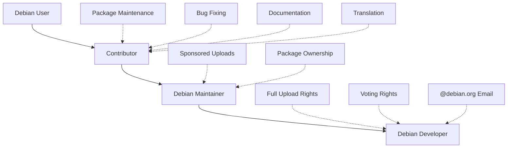

# Debian Developer Process

## Introduction

Debian is one of the oldest and most respected Linux distributions, known for its stability, commitment to free software principles, and democratic governance. Behind Debian's success is a community of dedicated volunteers who maintain packages, develop tools, and make decisions about the project's direction.

This guide explains how someone can progress from being a casual Debian user to becoming an official Debian Developer (DD) with full upload rights and voting privileges. The process is meticulous by design, ensuring that developers understand Debian's philosophy, technical standards, and community norms.

## The Debian Developer Journey

Becoming a Debian Developer isn't just about technical skills—it's about demonstrating your commitment to Debian's values and community. Let's explore this journey step by step.



### 1. Start as a Contributor

Before becoming an official Debian Developer, most people begin by contributing to Debian in various ways:

#### Ways to Contribute

- **Fix bugs**: Find bugs in the [Debian Bug Tracking System](https://bugs.debian.org) and submit patches
- **Package maintenance**: Help maintain existing packages
- **Documentation**: Improve Debian documentation, wikis, or websites
- **Translation**: Translate Debian materials into other languages
- **Event organization**: Help organize Debian conferences or meetups

#### Example: Submitting a Bug Fix

Let's say you found a bug in a Debian package and want to submit a fix:

```bash
# First, clone the package repository
git clone https://salsa.debian.org/debian/package-name.git
cd package-name

# Make your changes
nano src/buggy-file.c

# Test your changes
debuild -us -uc
sudo dpkg -i ../package-name_version_arch.deb

# Create a patch
git diff > fix-description.patch

# Attach your patch to the bug report
reportbug -A fix-description.patch package-name
```

### 2. Find a Mentor

Debian has an official mentoring program to help newcomers navigate the Debian ecosystem. A mentor can:

- Guide you through the package maintenance process
- Review your work
- Sponsor your package uploads (since you don't yet have upload rights)
- Help you understand Debian's policies and procedures

You can find a mentor through:
- The [Debian Mentors](https://wiki.debian.org/DebianMentorsFaq) program
- Mailing lists like [debian-mentors@lists.debian.org](mailto:debian-mentors@lists.debian.org)
- IRC channels like #debian-mentors on OFTC

### 3. Become a Debian Maintainer (DM)

Once you've been contributing for a while, you might consider becoming a Debian Maintainer (DM). This is an intermediate step before becoming a full Debian Developer.

#### Requirements for Debian Maintainer Status

1. Actively maintain at least one package in Debian
2. Have your packages sponsored by existing Debian Developers
3. Get an existing DD to advocate for you
4. Demonstrate understanding of Debian's packaging policies
5. Complete a limited process with Debian's Account Managers

#### The Application Process

```bash
# Generate a GnuPG key if you don't have one
gpg --full-generate-key

# Upload your key to a keyserver
gpg --keyserver keyring.debian.org --send-keys YOUR_KEY_ID

# Apply through the Debian NM (New Member) process
# Visit https://nm.debian.org and follow the instructions
```

As a Debian Maintainer, you can:
- Upload packages you maintain directly (without a sponsor)
- Still need sponsorship for new packages

### 4. Apply to Become a Debian Developer

After serving as a Debian Maintainer and showing consistent contribution, you can apply to become a full Debian Developer.

#### Requirements for Becoming a Debian Developer

1. Strong track record of contribution to Debian
2. Deep understanding of Debian policy
3. Demonstrated commitment to Debian's principles
4. Endorsement from existing Debian Developers
5. Successful completion of tests and interviews

#### The Application Process in Detail

The path to becoming a Debian Developer involves several steps:

1. **Initial application**: Register on the [New Member](https://nm.debian.org/) portal
2. **Advocacy**: An existing DD must advocate for your application
3. **Application Manager**: An Application Manager (AM) is assigned to guide you
4. **Identity check**: Verify your identity with GPG key signatures
5. **Philosophy and Procedures**: Demonstrate your understanding of Debian's philosophy and procedures
6. **Tasks and Skills**: Prove your technical skills and package maintenance abilities
7. **Final report**: Your AM submits a report to the Debian Account Managers
8. **Account creation**: If approved, you receive a debian.org account

#### The Philosophy and Procedures Check

You'll need to demonstrate understanding of:

- Debian Social Contract and Free Software Guidelines (DFSG)
- Debian governance and decision-making processes
- Debian Policy Manual and packaging standards

Example question you might be asked:

> "How would you determine if a software license is compatible with the DFSG, and what would you do if you're unsure?"

#### The Tasks and Skills Check

This involves demonstrating your technical abilities, such as:

- Creating and maintaining packages that follow Debian standards
- Using the Debian build tools correctly
- Understanding security implications of package maintenance
- Troubleshooting common packaging issues

Example task:

```bash
# You might be asked to package a new piece of software
# Starting with creating the basic structure
dh_make --createorig -p project_1.0

# Then modifying the debian/ files appropriately
nano debian/control
nano debian/rules
nano debian/copyright

# Building the package
dpkg-buildpackage -us -uc

# Checking for policy compliance
lintian -Ivi *.changes
```

### 5. Life as a Debian Developer

Once accepted as a Debian Developer, you'll have:

- Full upload rights to the Debian archive
- Voting rights on Debian decisions
- A debian.org email address
- Access to Debian infrastructure

#### Responsibilities

With these privileges come responsibilities:

- Maintaining packages to Debian's quality standards
- Responding to bug reports
- Participating in discussions and decisions
- Upholding the Debian Social Contract
- Helping to mentor new contributors

#### Continued Learning

Even as a Debian Developer, learning never stops:

- Keep up with changes in Debian policy
- Learn new packaging tools and techniques
- Stay informed about security issues
- Expand your knowledge to new areas of the project

## Real-World Application: Packaging a Python Application

Let's walk through a practical example of packaging a simple Python application for Debian. This is a common task for Debian Developers.

### Step 1: Set up your environment

```bash
# Install necessary tools
sudo apt-get install build-essential devscripts debhelper dh-python python3-all

# Create a working directory
mkdir -p ~/debian-work
cd ~/debian-work
```

### Step 2: Get the source code

```bash
# For this example, we'll use a fictional Python application
git clone https://github.com/example/python-hello.git
cd python-hello
```

### Step 3: Initialize the Debian packaging

```bash
# Create basic Debian packaging files
dh_make --createorig -p python-hello_1.0 -i

# Select 'p' for Python package when prompted
```

### Step 4: Edit the Debian control files

```bash
# Edit the control file to specify dependencies
nano debian/control
```

Example `debian/control` file:

```
Source: python-hello
Section: python
Priority: optional
Maintainer: Your Name <your.email@example.com>
Build-Depends: debhelper-compat (= 13), dh-python, python3-all, python3-setuptools
Standards-Version: 4.5.1
Homepage: https://github.com/example/python-hello
Rules-Requires-Root: no

Package: python3-hello
Architecture: all
Depends: ${python3:Depends}, ${misc:Depends}
Description: Simple Python hello world application
 This is a simple Python application that prints
 "Hello, World!" and demonstrates basic Python
 functionality for educational purposes.
```

### Step 5: Configure the build process

```bash
# Edit the rules file
nano debian/rules
```

Example `debian/rules` file:

```makefile
#!/usr/bin/make -f

export PYBUILD_NAME=hello

%:
	dh $@ --with python3 --buildsystem=pybuild
```

### Step 6: Update copyright information

```bash
# Edit the copyright file
nano debian/copyright
```

### Step 7: Build the package

```bash
# Build the package
dpkg-buildpackage -us -uc

# Check for policy compliance
cd ..
lintian -Ivi python-hello_1.0-1_all.deb
```

### Step 8: Test the package

```bash
# Install and test the package
sudo dpkg -i python-hello_1.0-1_all.deb
python3-hello
```

### Step 9: Prepare for upload

```bash
# Sign the package (as a Developer)
debsign python-hello_1.0-1_amd64.changes

# Upload to Debian (as a Developer)
dput ftp-master python-hello_1.0-1_amd64.changes

# Or request sponsorship (as a Contributor)
dput mentors python-hello_1.0-1_amd64.changes
```

## Common Challenges and How to Address Them

### Challenge 1: Finding Time to Contribute

Debian is maintained by volunteers, and balancing contribution with other responsibilities can be challenging.

**Solution**: Start small with focused contributions in areas you're already familiar with. Quality matters more than quantity.

### Challenge 2: Understanding Debian Policy

Debian has comprehensive policies that can be overwhelming to newcomers.

**Solution**: Break it down into sections and learn gradually. Use tools like `lintian` to check your packages for policy compliance.

### Challenge 3: Getting Packages Sponsored

It can sometimes be difficult to find sponsors for your packages.

**Solution**: 
- Maintain high-quality packages
- Be responsive to feedback
- Participate actively in the community
- Help others with their packages

### Challenge 4: Technical Disagreements

You may encounter disagreements about technical decisions.

**Solution**: 
- Focus on technical merits rather than personal preferences
- Document your reasoning clearly
- Be open to compromise
- Remember Debian's technical committee can help resolve disputes

## Summary

The journey to becoming a Debian Developer is challenging but rewarding. It involves:

1. Starting as a contributor in various ways
2. Finding mentors to guide your progress
3. Becoming a Debian Maintainer with limited upload rights
4. Applying for and completing the Debian New Member process
5. Participating as a full Debian Developer

While the process may seem lengthy, it ensures that Debian maintains its high standards and that new developers fully understand the project's philosophy, policies, and technical requirements.

## Additional Resources

- [Debian Developer's Corner](https://www.debian.org/devel/)
- [Debian New Maintainers' Guide](https://www.debian.org/doc/manuals/maint-guide/)
- [Debian Policy Manual](https://www.debian.org/doc/debian-policy/)
- [Debian Developer's Reference](https://www.debian.org/doc/manuals/developers-reference/)
- [How to join Debian](https://www.debian.org/devel/join/)

## Exercises for Practice

1. **Bug hunting**: Find a simple bug in a Debian package and prepare a patch.
2. **Package review**: Review an existing package for policy compliance using `lintian`.
3. **New package**: Create a Debian package for a simple application that isn't yet in Debian.
4. **Mentoring**: Help answer questions from newer contributors on the debian-mentors mailing list.
5. **Documentation**: Improve a section of the Debian wiki or documentation.

Remember, becoming a Debian Developer is not just about technical skills—it's about becoming part of a community dedicated to creating a free, high-quality operating system for everyone.