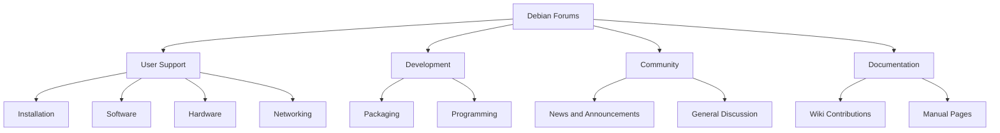

# Debian Forums

## Introduction

Debian Forums serve as a vital communication platform within the broader Debian community, connecting users, developers, and enthusiasts worldwide. These forums provide a structured environment where individuals can ask questions, share knowledge, troubleshoot issues, and contribute to the collective wisdom of the Debian ecosystem.

For beginners, Debian Forums represent an invaluable resource on your journey with this powerful Linux distribution. Unlike real-time chat platforms or mailing lists, forums offer a persistent, searchable knowledge base that you can reference at your own pace. This asynchronous nature makes forums particularly beginner-friendly, as they allow you to carefully craft your questions and thoroughly review responses.

## Understanding Debian Forums Structure

The official Debian Forums are organized into several key sections, each serving different needs within the community:



### Main Forum Categories

- **User Support**: The heart of the forums for beginners, covering installation help, software configuration, hardware compatibility, and troubleshooting.
- **Development**: Discussion focused on Debian development, including packaging, programming, and system architecture.
- **Community**: General discussion, news, announcements, and non-technical Debian-related topics.
- **Documentation**: Conversations about improving Debian's documentation, wiki pages, and manuals.

## Getting Started with Debian Forums

### Creating an Account

Before you can actively participate in the Debian Forums, you'll need to create an account:

1. Visit the [Debian Forums website](https://forums.debian.net/)
2. Click on the "Register" link (usually found in the upper right corner)
3. Fill out the registration form with your details
4. Verify your email address via the confirmation link
5. Log in with your new credentials

Here's what the process typically looks like in code:

```javascript
// Simplified representation of the registration process
const registerUser = async (userData) => {
  try {
    // Submit registration form
    const response = await fetch('https://forums.debian.net/register', {
      method: 'POST',
      headers: {
        'Content-Type': 'application/json',
      },
      body: JSON.stringify(userData),
    });
    
    const result = await response.json();
    
    if (result.success) {
      console.log('Registration successful! Check your email for verification.');
    } else {
      console.error('Registration failed:', result.message);
    }
  } catch (error) {
    console.error('An error occurred during registration:', error);
  }
};

// Example usage
registerUser({
  username: 'debian_beginner',
  email: 'your.email@example.com',
  password: 'securePassword123',
  confirmPassword: 'securePassword123',
});
```

### Forum Etiquette and Guidelines

Debian Forums, like most technical communities, operate by certain community norms:

1. **Search before asking**: Always search existing posts to see if your question has been answered.
2. **Post in the correct section**: Select the appropriate subforum for your question.
3. **Be descriptive with titles**: Use clear, specific titles that summarize your issue.
4. **Provide complete information**: Include relevant details, system specifications, and steps to reproduce problems.
5. **Format code properly**: Use code tags (`<code>`) for terminal output, error messages, and configuration files.
6. **Be patient and courteous**: Remember that forum helpers are volunteers.

## How to Effectively Ask Questions

The quality of answers you receive often depends directly on how well you ask your question. Here's a step-by-step approach:

### Step 1: Prepare your question

Gather all relevant information about your issue:
- Debian version and architecture
- Hardware specifications
- Exact error messages
- Steps to reproduce the problem
- What you've already tried

### Step 2: Structure your post

Create a clear, well-organized post:

```
Title: [Specific, concise description of issue]

## System Information
- Debian version: 12 (Bookworm)
- Architecture: amd64
- Desktop Environment: GNOME 3.38
- Hardware: [Relevant specs]

## Problem Description
[Detailed explanation of the issue]

## Error Message
```
apt-get update
Hit:1 http://deb.debian.org/debian bookworm InRelease
Err:2 http://security.debian.org/debian-security bookworm-security InRelease
  Could not resolve 'security.debian.org'
E: Some index files failed to download. They have been ignored, or old ones used instead.
```

## What I've Tried
- [List of attempted solutions]

## Question
[Clearly state what you're asking for]
```

### Step 3: Follow up

After receiving responses:
- Thank volunteers for their time
- Report what worked and what didn't
- Mark solutions as "solved" once your issue is resolved

## Searching and Navigating the Forums

Effective forum use starts with knowing how to find information:

### Basic Search Techniques

```javascript
// Example of how a forum search might work
function searchForums(query, options = {}) {
  const defaultOptions = {
    forumSection: 'all',
    sortBy: 'relevance',
    timeFrame: 'all',
    resultsPerPage: 20,
  };
  
  const searchOptions = { ...defaultOptions, ...options };
  
  console.log(`Searching for "${query}" in ${searchOptions.forumSection} forums...`);
  
  // Search logic would go here
  
  return [
    {
      title: 'Example search result 1',
      author: 'debian_user_123',
      date: '2023-01-15',
      relevance: 0.95,
      excerpt: 'This post contains information about your search query...'
    },
    // More results...
  ];
}

// Example usage
const results = searchForums('network configuration wlan0', {
  forumSection: 'networking',
  sortBy: 'date',
  timeFrame: 'past_year'
});
```

Search operators you can use:
- `"exact phrase"` - Search for an exact sequence of words
- `user:username` - Find posts by a specific user
- `tag:networking` - Search within a specific tag
- `solved:yes` - Find threads marked as solved

### Advanced Navigation

Most Debian Forums offer additional navigation tools:
- Tag clouds for topic-based browsing
- "Popular threads" for trending discussions
- "Unanswered threads" to find questions needing help
- User profiles to follow knowledgeable community members

## Participating in the Community

Forums thrive on active participation. Here are ways to contribute:

### Answering Questions

Even as a beginner, you can help others:
- Start with questions you're confident about
- Provide clear, step-by-step instructions
- Include code examples when relevant
- Link to official documentation

### Sharing Knowledge

As you learn, share your experiences:
- Write tutorials on problems you've solved
- Document unusual hardware configurations
- Create guides for common beginner issues

Example of a helpful answer format:

```
I encountered this same issue with my network card. Here's how I fixed it:

1. First, check if your wireless card is recognized:
   ```
   lspci | grep -i wireless
   ```

2. Install the required firmware package:
   ```
   sudo apt install firmware-iwlwifi
   ```

3. Reload the kernel module:
   ```
   sudo modprobe -r iwlwifi
   sudo modprobe iwlwifi
   ```

Your wireless interface should now appear when you run `ip a`.

Hope this helps!
```

## Beyond Asking: Becoming a Forum Contributor

As you gain experience, consider deeper involvement:

### Regular Participation

Consistent forum participation helps build community and knowledge:
- Visit the forums regularly (daily or weekly)
- Follow threads in your areas of interest
- Acknowledge helpful answers
- Update threads when you solve problems

### Building Reputation

Most forums have reputation systems:
- Upvotes or "helpful" marks for valuable contributions
- Achievement badges for different types of participation
- Ranks or levels based on contributions


## Debian Forums vs. Other Support Channels

Debian offers multiple support channels, each with unique advantages:

| Channel | Best For | Response Time | Persistence |
|---------|----------|---------------|-------------|
| Forums | Complex questions, sharing solutions | Hours to days | High (years) |
| IRC (#debian) | Quick questions, real-time help | Minutes to hours | Low (unless logged) |
| Mailing Lists | Technical discussions, development | Hours to days | High (archived) |
| Wiki | Reference information, guides | N/A | High (versioned) |

## Practical Examples: Forum Success Stories

### Example 1: Solving Installation Issues

**Problem**: A user couldn't install Debian on a new laptop with secure boot enabled.

**Forum Solution**: Through forum guidance, they learned to:
1. Access UEFI settings and modify secure boot options
2. Add specific boot parameters to handle their hardware
3. Install the correct firmware packages post-installation

**Outcome**: Successful installation with all hardware functioning properly.

### Example 2: Learning Package Management

**Problem**: A beginner was confused about package dependencies and conflicts.

**Forum Thread Excerpt**:
```
User: When I try to install package-X, I get these dependency errors. I don't understand what to do next.

Helper: Let's break down what's happening. APT is telling you that package-X depends on library-Y, but you have library-Z installed which conflicts with it.

Try these commands to resolve it:
```
sudo apt update
sudo apt install package-X package-W
```

This will install both packages and resolve the dependency chain.

User: That worked! Can you explain why I needed package-W as well?

Helper: Sure! Package-W provides a compatibility layer that allows package-X and library-Z to coexist...
```

**Learning Value**: The user gained deeper understanding of Debian's package management system through guided troubleshooting.

## Summary

Debian Forums represent much more than just a technical support channel—they're a living knowledge base and community hub that connects users of all experience levels. For beginners, they offer:

- A supportive environment to ask questions and learn
- A searchable archive of solutions to common problems
- Opportunities to connect with experienced Debian users
- A platform to contribute back as your skills grow

By following forum etiquette, asking well-structured questions, and actively participating in discussions, you'll not only solve your immediate technical problems but also become a valued member of the broader Debian community.

## Additional Resources

- [Debian Forums Official Website](https://forums.debian.net/)
- [Debian Wiki: Getting Help](https://wiki.debian.org/GettingHelp)
- [How to Ask Smart Questions](http://www.catb.org/esr/faqs/smart-questions.html)
- [Debian Mailing Lists](https://lists.debian.org/)

## Exercises for Practice

1. **Search Exercise**: Find three different solutions to a common Debian installation problem using the forum search function.
2. **Question Formulation**: Practice writing a detailed, well-structured forum post about a hypothetical Debian issue.
3. **Community Exploration**: Identify five active forum members who regularly provide helpful answers and review their contribution patterns.
4. **Documentation Contribution**: Find a solved forum thread that isn't documented in the wiki, and create notes on how you would convert it to a wiki article.
5. **Answer Practice**: Find an unanswered question in your area of knowledge and draft a helpful response.

By engaging with these exercises, you'll develop the skills needed to effectively navigate, contribute to, and benefit from the Debian Forums community.