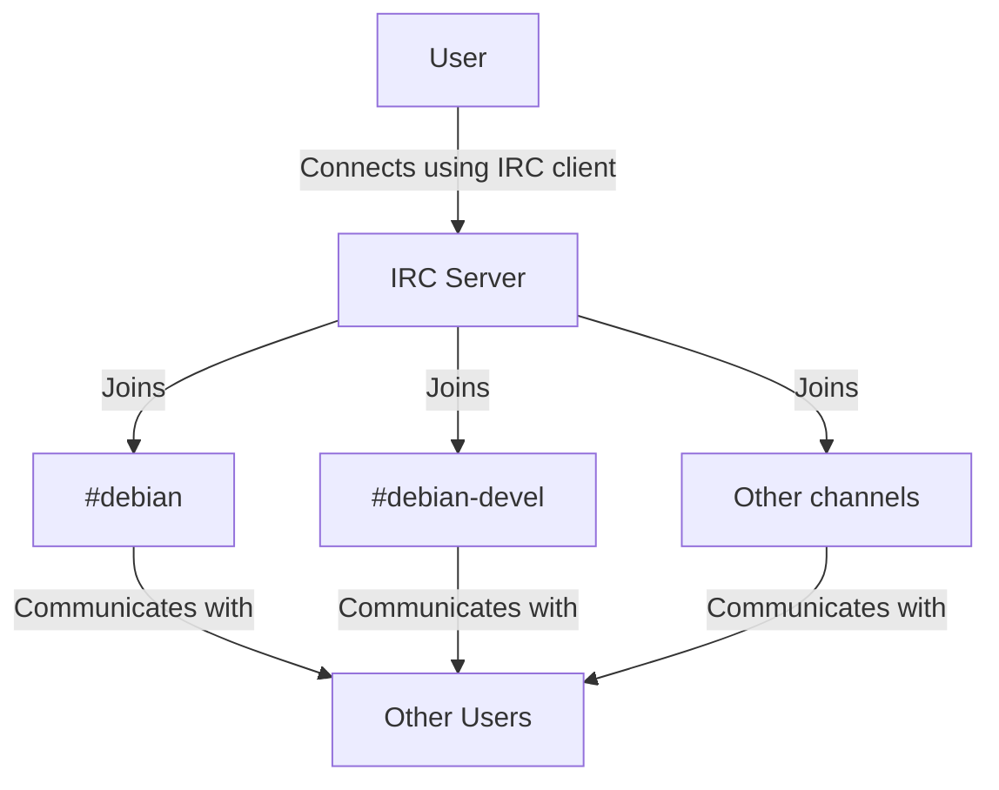

# Debian IRC Channels

## Introduction

Internet Relay Chat (IRC) is one of the oldest and most established communication platforms in the open-source world. For the Debian community, IRC serves as a central hub where developers, contributors, and users gather to discuss issues, coordinate efforts, and provide support. This guide will introduce you to Debian's IRC channels, explain how to connect to them, and provide best practices for effective participation in this vital community resource.

## What is IRC?

IRC (Internet Relay Chat) is a text-based communication protocol that enables real-time messaging in channel-based discussions. Unlike modern chat platforms that store messages indefinitely, IRC is primarily focused on live communication, though some channels may log conversations for reference.



## Primary Debian IRC Channels

Debian maintains numerous channels on the OFTC (Open and Free Technology Community) IRC network. Here are some of the most important ones:

### Main Channels

- **#debian** - The primary support channel for Debian users
- **#debian-devel** - Discussion among Debian developers about development
- **#debian-next** - Channel for the next Debian release development
- **#debian-www** - Website maintenance and development
- **#debian-boot** - Debian installer development
- **#debian-doc** - Documentation team coordination

### Language-Specific Channels

Debian provides support in multiple languages, each with dedicated channels:

- **#debian-fr** - French support
- **#debian-es** - Spanish support
- **#debian-de** - German support
- **#debian-br** - Brazilian Portuguese support

## Getting Started with IRC

### Choosing an IRC Client

To connect to Debian IRC channels, you'll need an IRC client. Here are some popular options:

#### Command-Line Clients
- **irssi** - A terminal-based IRC client with extensive customization options
- **WeeChat** - Another powerful terminal-based client with plugin support

```bash
# Install irssi on Debian
sudo apt install irssi

# Install WeeChat on Debian
sudo apt install weechat
```

#### Graphical Clients
- **HexChat** - A cross-platform IRC client with a user-friendly interface
- **Konversation** - KDE-based IRC client
- **Polari** - GNOME-based IRC client

```bash
# Install HexChat on Debian
sudo apt install hexchat

# Install Konversation on Debian
sudo apt install konversation

# Install Polari on Debian
sudo apt install polari
```

#### Web-Based Options
- **OFTC WebChat** - Access via [https://webchat.oftc.net/](https://webchat.oftc.net/)

### Connecting to the OFTC Network

Once you have your IRC client installed, you need to connect to the OFTC network where Debian channels are hosted.

#### Using Hexchat (Example)

1. Open HexChat
2. When prompted to select a network, click "Add"
3. Enter the following details:
   - Network Name: OFTC
   - Server: irc.oftc.net
   - Port: 6697 (for SSL)
4. Check "Use SSL for all servers on this network"
5. Add a nickname of your choice
6. Click "Connect"

#### Using Command-Line Clients (irssi example)

```bash
# Start irssi
irssi

# Inside irssi, connect to OFTC
/connect irc.oftc.net 6697 -ssl

# Set your nickname
/nick your_chosen_nickname
```

## Joining Debian Channels

Once connected to the OFTC network, you can join Debian channels using the `/join` command:

```
/join #debian
```

To join multiple channels at once:

```
/join #debian #debian-devel #debian-next
```

## IRC Etiquette and Best Practices

Effective participation in Debian IRC channels involves following some community norms:

### 1. Be Patient

IRC is asynchronous—people may not respond immediately. Ask your question and wait patiently for a response, which might take minutes or even hours depending on the channel activity.

### 2. Don't Ask to Ask

Instead of asking "Can someone help me with an issue?", directly state your problem with relevant details.

**Don't do this:**
```
<newuser> Is anyone available to help with a networking issue?
```

**Do this instead:**
```
<newuser> I'm having trouble configuring my network interface on Debian 11. My NIC is an Intel I219-V, and the issue started after the latest update. Here's the output of `ip addr`: [paste output]
```

### 3. Use Paste Services for Long Outputs

If you need to share logs or command outputs that span multiple lines, use a paste service and share the link:

```bash
# Install pastebinit
sudo apt install pastebinit

# Pipe command output to pastebinit
dmesg | pastebinit
```

Popular paste services for Debian community:
- [Debian Paste](https://paste.debian.net/)
- [OFTC Paste](https://paste.oftc.net/)

### 4. Use Channel-Appropriate Topics

Ensure you're posting in the right channel:
- Use **#debian** for general Debian support
- Use **#debian-devel** for development discussions, not user support
- Use language-specific channels if you're more comfortable in a language other than English

### 5. Respect the Code of Conduct

Debian has a [Code of Conduct](https://www.debian.org/code_of_conduct) that applies to all communication platforms, including IRC. This includes:
- Being respectful
- Assuming good intentions
- Being collaborative
- Being concise
- Valuing diversity

## Advanced IRC Usage

As you become more comfortable with IRC, you might want to explore advanced features:

### Setting Up a Bouncer

An IRC bouncer (like ZNC) allows you to stay connected to IRC even when you're offline, maintaining your presence and logging messages for later review.

```bash
# Install ZNC on Debian
sudo apt install znc

# Generate initial configuration
znc --makeconf
```

### Registering Your Nickname

To prevent others from using your nickname, you can register it with NickServ:

```
/msg NickServ REGISTER your_password your_email@example.com
```

### Using Notifications

Most IRC clients allow you to set up notifications for when your nickname is mentioned:

```
# In irssi
/hilight your_nickname
```

## Debian IRC Bots and Services

Debian channels feature several useful bots that provide various services:

### MeetBot

Used for managing and logging meetings in development channels:

```
#startmeeting Meeting Title
#topic Discussion Point 1
#agreed We will implement feature X
#action username Will research implementation options
#endmeeting
```

### debbugs

Provides information about Debian bug reports:

```
!bug 12345
```

### dpt

The Debian Package Tracker bot, which provides information about packages:

```
!info package_name
```

## Summary

IRC remains an essential communication tool for the Debian community, offering real-time support, development coordination, and community building. By joining these channels, you become part of the larger Debian ecosystem and gain access to a wealth of knowledge and experience from community members.

As you grow more comfortable with IRC, you'll discover it's not just a support mechanism but a vibrant community space where relationships are built and collaborative work happens.

## Additional Resources

- [Official Debian IRC information](https://wiki.debian.org/IRC)
- [OFTC Network website](https://www.oftc.net/)
- [Debian Community page](https://www.debian.org/intro/organization)
- [IRC Protocol RFC](https://tools.ietf.org/html/rfc1459)

## Exercises

1. **Connect to IRC**: Install an IRC client and connect to the OFTC network.
2. **Join #debian**: Join the main Debian channel and observe the conversations.
3. **Ask a Question**: Formulate a well-structured question about something you're having trouble with in Debian.
4. **Explore Other Channels**: Join at least two other Debian-related channels that align with your interests.
5. **Set Up Client Configuration**: Configure your IRC client with custom highlights and notifications.