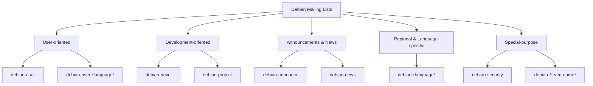

# Debian Mailing Lists

## Introduction

Mailing lists are one of the primary communication channels in the Debian community. They serve as a platform for discussions, announcements, support, and collaboration among Debian users, developers, and contributors. Unlike forums or chat rooms, mailing lists work entirely through email, making them accessible to participants worldwide regardless of internet bandwidth limitations.

In this guide, we'll explore the Debian mailing list ecosystem, understand how to subscribe and participate effectively, and learn about the etiquette that makes these mailing lists valuable resources for the entire community.

## Understanding Debian Mailing Lists

Debian maintains dozens of specialized mailing lists that cater to different aspects of the project and community. These lists can be categorized broadly as:

### Types of Debian Mailing Lists

1. **User-oriented lists** - Focused on helping Debian users with questions and problems
2. **Development-oriented lists** - For discussions about Debian development
3. **Announcements and news lists** - For important announcements and news
4. **Regional and language-specific lists** - For discussions in specific languages or regions
5. **Special-purpose lists** - For specific teams or projects within Debian



### Popular Debian Mailing Lists

Here are some of the most popular and active Debian mailing lists:

- **debian-announce** - Official announcements like new releases (moderated)
- **debian-news** - News about Debian that isn't release-related
- **debian-user** - General help and discussion for Debian users
- **debian-devel** - General discussions among Debian developers
- **debian-security-announce** - Security advisories for Debian packages
- **debian-mentors** - Help for new package maintainers

## Subscribing to Debian Mailing Lists

Subscribing to a Debian mailing list is straightforward and can be done in a few simple steps.

### How to Subscribe

1. Visit the [Debian Mailing List Subscription page](https://lists.debian.org/mailman/listinfo)
2. Find and click on the list you want to join
3. Fill out the subscription form with your email address
4. Choose a password (optional but recommended)
5. Select your email delivery preferences
6. Click the "Subscribe" button
7. Confirm your subscription via the confirmation email

Here's an example of the subscription process for the `debian-user` list:

```
To: debian-user-request@lists.debian.org
Subject: subscribe

subscribe your@email.address "Your Full Name" 
```

### Managing Your Subscription

You can manage your subscription preferences through the web interface or via email commands. Here are some common email commands you can send to `listname-request@lists.debian.org`:

```
help               # Get information about commands
subscribe          # Subscribe to the list
unsubscribe        # Unsubscribe from the list
set digest on      # Receive emails in digest form (daily summaries)
set delivery off   # Temporarily stop receiving emails
```

For example, to unsubscribe from the debian-user list:

```
To: debian-user-request@lists.debian.org
Subject: unsubscribe

unsubscribe
```

## Effectively Participating in Debian Mailing Lists

Participating effectively in mailing lists requires understanding some technical aspects and following community etiquette.

### Technical Aspects

#### Plain Text Format

Debian mailing lists prefer plain text emails rather than HTML or rich text:

- Set your email client to send plain text messages
- Avoid using special formatting like bold or italics
- Use symbols like `*asterisks*` or `_underscores_` for emphasis

#### Quoting Properly

When responding to messages, quote only the relevant parts:

```
On Thu, Mar 13, 2025 at 10:00 AM, Sender <sender@example.com> wrote:
> This is the part I'm responding to.
> I need help with this specific issue.

Here's my response to your issue...
```

#### Attachments

Most Debian lists have attachment size limits or don't allow attachments at all:

- Use text-based formats instead of binary formats
- For code or logs, use inline text with proper formatting
- Use pastebin services for longer code snippets and share the link

### Mailing List Etiquette

Following proper etiquette ensures productive discussions and fosters a positive community environment:

1. **Read before posting**
   - Check list archives to see if your question has been answered
   - Review the list's FAQ if available

2. **Use descriptive subject lines**
   - Good: "Cannot boot after kernel update to 6.1.0-18"
   - Bad: "Help!" or "Debian problem"

3. **Stay on topic**
   - Keep discussions relevant to the list's purpose
   - For off-topic discussions, move to an appropriate list

4. **Be respectful and constructive**
   - Even in disagreements, maintain a professional tone
   - Focus on ideas and technical content, not personalities

5. **Provide context and information**
   - For technical problems, include relevant system information
   - Share the outputs of diagnostic commands when appropriate

6. **Acknowledge helpful responses**
   - Thank people who help you
   - Share the solution if you resolve your issue

## Practical Examples

Let's look at some practical examples of effective mailing list communications:

### Example 1: Asking for Technical Help

```
Subject: Cannot mount USB drive on Debian 12 (Bookworm)

Hello,

I'm having trouble mounting a USB drive on my Debian 12 system. When I 
plug in the drive, nothing happens automatically. When I try to mount
it manually, I get the following error:

```

```
$ sudo mount /dev/sdb1 /mnt/usb
mount: /mnt/usb: wrong fs type, bad option, bad superblock on /dev/sdb1, 
missing codepage or helper program, or other error.
```

```
Here's the output of lsblk and dmesg:

```

```
$ lsblk
NAME   MAJ:MIN RM   SIZE RO TYPE MOUNTPOINTS
sda      8:0    0 256.0G  0 disk 
├─sda1   8:1    0   512M  0 part /boot/efi
└─sda2   8:2    0 255.5G  0 part /
sdb      8:16   1  32.0G  0 disk 
└─sdb1   8:17   1  32.0G  0 part 

$ dmesg | tail -20
[13267.214928] usb 1-2: new high-speed USB device number 5 using xhci_hcd
[13267.363517] usb 1-2: New USB device found, idVendor=0781, idProduct=5591, bcdDevice= 1.00
[13267.363523] usb 1-2: New USB device strings: Mfr=1, Product=2, SerialNumber=3
[13267.363525] usb 1-2: Product: Ultra
[13267.363527] usb 1-2: Manufacturer: SanDisk
[13267.363529] usb 1-2: SerialNumber: 4C530001231121118241
[13267.364130] usb-storage 1-2:1.0: USB Mass Storage device detected
[13267.364258] scsi host3: usb-storage 1-2:1.0
[13268.384251] scsi 3:0:0:0: Direct-Access     SanDisk  Ultra            1.00 PQ: 0 ANSI: 6
[13268.384653] sd 3:0:0:0: Attached scsi generic sg1 type 0
[13268.385044] sd 3:0:0:0: [sdb] 62333952 512-byte logical blocks: (31.9 GB/29.7 GiB)
[13268.385366] sd 3:0:0:0: [sdb] Write Protect is off
[13268.385370] sd 3:0:0:0: [sdb] Mode Sense: 43 00 00 00
[13268.385673] sd 3:0:0:0: [sdb] Write cache: disabled, read cache: enabled, doesn't support DPO or FUA
[13268.391160]  sdb: sdb1
[13268.393289] sd 3:0:0:0: [sdb] Attached SCSI removable disk
```

```
I'm running Debian 12.2 with kernel 6.1.0-18-amd64. I've tried different 
USB ports and rebooting, but I get the same error.

Any suggestions on how to troubleshoot this issue would be appreciated.

Thanks,
John
```

### Example 2: Reporting a Bug on the Mailing List

```
Subject: Possible bug: Network-Manager 1.42.0 disconnects WiFi after suspend

Hello,

I believe I've found a bug in Network-Manager version 1.42.0 on Debian 12.
After resuming from suspend, WiFi always disconnects and doesn't 
automatically reconnect. I have to manually reconnect each time.

Steps to reproduce:
1. Connect to a WiFi network
2. Suspend the laptop (e.g., close the lid or use systemctl suspend)
3. Resume from suspend
4. Observe that WiFi is disconnected and doesn't auto-reconnect

System information:
- Debian 12.2 Bookworm
- Linux kernel 6.1.0-18-amd64
- Network-Manager 1.42.0-1
- Laptop: ThinkPad X1 Carbon (8th gen)
- WiFi adapter: Intel Wi-Fi 6 AX201

The issue doesn't occur with older versions of Network-Manager and doesn't
happen on my other Debian 11 system.

I've checked the logs and found these relevant entries:

```

```
Mar 13 09:15:23 laptop NetworkManager[1234]: <info>  [1678665323.4235] manager: sleep: sleep requested (sleeping: no  enabled: yes)
Mar 13 09:15:23 laptop NetworkManager[1234]: <info>  [1678665323.4236] manager: NetworkManager state is now ASLEEP
Mar 13 09:15:23 laptop NetworkManager[1234]: <info>  [1678665323.4237] device (wlp0s20f3): state change: activated -> deactivating (reason 'sleeping', sys-iface-state: 'managed')
Mar 13 09:17:45 laptop NetworkManager[1234]: <info>  [1678665465.1234] manager: sleep: wake requested (sleeping: yes  enabled: yes)
Mar 13 09:17:45 laptop NetworkManager[1234]: <info>  [1678665465.1235] device (wlp0s20f3): state change: deactivating -> disconnected (reason 'sleeping', sys-iface-state: 'managed')
```

```
I've already tried several solutions including:
- Restarting Network-Manager service
- Disabling/enabling power management for WiFi
- Updating firmware for the WiFi adapter

None of these resolved the issue. Would this be appropriate to file as a 
formal bug report? Any suggestions for additional troubleshooting?

Thanks,
Sarah
```

## Searching the Mailing List Archives

Before posting a question, it's good practice to search the archives to see if your question has been answered before.

### How to Search Debian Mailing List Archives

Debian provides several ways to search the mailing list archives:

1. **Web interface** at [lists.debian.org](https://lists.debian.org/)
   - Navigate to the specific list
   - Use the "Archives" section

2. **External search engines**
   - Use site-specific search with `site:lists.debian.org your-search-term`

3. **Using the `mail-archive` package**
   - Install the package: `sudo apt install mail-archive`
   - Set up and configure it to access local archives

Here's a practical example of a search query:

```
site:lists.debian.org "network-manager wifi suspend" bookworm
```

## Summary

Debian mailing lists are vital communication channels for the Debian community. They provide a structured way for users, developers, and contributors to interact, seek help, and collaborate on the Debian project.

Key points to remember:

- Debian has various types of mailing lists for different purposes
- Subscription is straightforward through the web interface or email commands
- Effective participation requires following technical guidelines and etiquette
- Plain text emails with proper quoting are preferred
- Always search the archives before posting a question
- Be respectful, provide context, and acknowledge helpful responses

By participating in Debian mailing lists, you're not just getting help or information; you're becoming part of a global community that collaboratively maintains and improves one of the world's most important open-source projects.

## Additional Resources

- [Official Debian Mailing Lists Page](https://lists.debian.org/)
- [Debian Mailing List Netiquette](https://www.debian.org/MailingLists/index#codeofconduct)
- [Debian Social Contract](https://www.debian.org/social_contract)
- [How to Report Bugs Effectively](https://www.chiark.greenend.org.uk/~sgtatham/bugs.html)

## Exercises

1. Subscribe to the `debian-user` mailing list and observe the discussions for a week.
2. Find an unanswered question in the archives that you know the answer to, and practice formulating a helpful response.
3. Practice writing a well-structured question about a (real or hypothetical) Debian issue you're experiencing.
4. Search the archives for information about a Debian package you regularly use.
5. Set up your email client to properly format messages for mailing list participation.