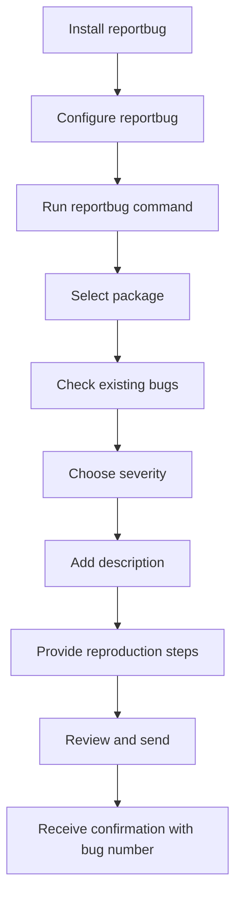

# Debian Bug Reporting

## Introduction

Bug reporting is a crucial aspect of open-source software development. For Debian, one of the largest and most established Linux distributions, an effective bug reporting system ensures the stability, security, and usability of thousands of software packages. This guide will walk you through the process of identifying, reporting, and tracking bugs in Debian, helping you contribute meaningfully to the Debian community even as a beginner.

When you report a bug, you're not just fixing an issue you encountered; you're helping improve the experience for millions of Debian users worldwide. Let's learn how to do this properly!

## Understanding the Debian Bug Tracking System (BTS)

Debian uses a specialized system called the Debian Bug Tracking System (BTS) to manage reports. The BTS is accessible at [bugs.debian.org](https://bugs.debian.org/) and serves as the central repository for all known issues with Debian packages.

### Key Features of the BTS

- Assigns a unique number to each bug report
- Tracks the status of each bug (open, fixed, pending, etc.)
- Records all communications about each bug
- Allows for categorization by severity and tags
- Provides public access to all bug information

## When to Report a Bug

Before reporting a bug, it's important to understand what qualifies as a bug in Debian:

1. Software doesn't work as documented
2. A package fails to install or upgrade properly
3. Security vulnerabilities
4. Packaging issues (missing dependencies, conflicts)
5. Documentation errors or omissions
6. Feature requests (though these are usually marked as "wishlist" items)

### Verifying Your Bug

Before submitting a report, follow these steps:

1. **Update your system**: Ensure you're running the latest version of the package
2. **Check existing reports**: Search the BTS to see if your issue has already been reported
3. **Reproduce the issue**: Verify the bug occurs consistently
4. **Check upstream**: Determine if the issue is Debian-specific or also exists in the original software

## How to Report a Bug in Debian

Debian provides several methods for reporting bugs. We'll cover the most common and recommended approach: using the `reportbug` tool.

### Method 1: Using the `reportbug` Tool

The `reportbug` utility is the recommended way to submit bug reports as it:
- Automatically collects system information
- Helps you categorize the bug correctly
- Formats your report appropriately
- Sends it to the right place

Let's walk through the process:

#### Step 1: Install reportbug

```bash
sudo apt update
sudo apt install reportbug
```

#### Step 2: Configure reportbug (first-time only)

When you run `reportbug` for the first time, it will ask you some configuration questions:

```bash
reportbug
```

Follow the prompts to set up your email and preferred submission method. The recommended settings for beginners are:
- Interface: Text
- Default MTA: Yes
- Enter your real email address
- SMTP server: Use default or your provider's details

#### Step 3: Report a Bug

To report a bug for a specific package, run:

```bash
reportbug package-name
```

Replace `package-name` with the actual package name (e.g., `reportbug firefox-esr`).

The tool will walk you through the process with prompts:

1. **Package check**: Confirms the package is installed and checks for existing bugs
2. **Severity**: Choose from critical, grave, serious, important, normal, minor, or wishlist
3. **Bug type**: Select the appropriate category
4. **Short description**: Provide a concise, descriptive title
5. **Long description**: Detail the issue, including steps to reproduce
6. **Tags**: Add optional categorization tags
7. **Review and send**: Check your report and submit it

Here's a diagram of the reportbug workflow:



### Method 2: Using Email Directly

If you prefer, you can report bugs directly via email:

1. Send an email to `submit@bugs.debian.org`
2. Use the subject line: `Package: package-name` (replacing `package-name` with the actual package)
3. In the body, include:
   - `Package: package-name`
   - `Version: [package version]`
   - `Severity: [severity level]`
   - Detailed description of the issue
   - Steps to reproduce
   - System information

For example:

```
To: submit@bugs.debian.org
Subject: firefox-esr: Crashes when opening multiple tabs

Package: firefox-esr
Version: 91.6.0esr-1
Severity: important

When opening more than 10 tabs simultaneously, firefox-esr crashes with the following error:
[Include error message here]

Steps to reproduce:
1. Launch firefox-esr
2. Hold Ctrl and middle-click a link 10 times rapidly
3. Observe the crash

System information:
Debian 11 (Bullseye)
GNOME Desktop Environment
8GB RAM
```

## Understanding Bug Severity Levels

Choosing the right severity level helps maintainers prioritize their work:

- **Critical**: The bug makes unrelated software on the system (or the whole system) break, causes serious data loss, or introduces a security hole
- **Grave**: Makes the package in question unusable or mostly unusable
- **Serious**: Represents a severe violation of Debian policy or makes the package unsuitable for release
- **Important**: A bug that has a major effect on the usability of the package
- **Normal**: The default value, applicable to most bugs
- **Minor**: Doesn't affect the package's usefulness, and is likely easy to fix
- **Wishlist**: Feature requests or very difficult-to-fix bugs

## Writing Effective Bug Reports

A good bug report increases the chances of the issue being fixed quickly. Include:

1. **Clear title**: Summarize the issue concisely
2. **Detailed description**: Explain what happened vs. what you expected
3. **Reproduction steps**: Numbered, specific steps to trigger the bug
4. **System information**: Debian version, desktop environment, relevant hardware
5. **Error messages**: Include full error text or logs
6. **Screenshots or videos**: If applicable (attach to email or provide links)
7. **Workarounds**: If you've found any temporary solutions

### Example of a Good Bug Report

```
Package: libreoffice-writer
Version: 7.0.4-4+deb11u1
Severity: normal

When inserting a table in LibreOffice Writer with more than 20 columns, the application freezes for approximately 30 seconds before becoming responsive again.

Steps to reproduce:
1. Open LibreOffice Writer
2. Click on Table > Insert Table
3. Set columns to 25 and rows to 5
4. Click Insert
5. Observe the application freeze

Expected behavior: The table should insert without significant delay

System information:
- Debian 11 Bullseye
- GNOME 3.38.5
- Intel Core i5-8250U
- 8GB RAM

Log output from terminal (when launching with `libreoffice --writer`):
[paste relevant log output here]

This issue does not occur with tables of 19 or fewer columns.
```

## Tracking Your Bug Report

After submitting your report, you'll receive an email confirmation with a bug number. You can track the status of your bug at:

```
https://bugs.debian.org/bugnumber
```

Replace `bugnumber` with your actual bug number.

### Bug States

Your bug can have various states:

- **Open**: Not yet fixed
- **Fixed**: Resolved in a newer version
- **Pending**: Fixed, but waiting for package update
- **Done**: Closed and resolved
- **Forwarded**: Sent to upstream developers

### Interacting with Your Bug Report

To add information to an existing bug, send an email to `bugnumber@bugs.debian.org`.

To control a bug (change severity, mark as fixed, etc.), send an email to `control@bugs.debian.org` with commands in the message body.

For example:

```
To: control@bugs.debian.org
Subject: Bug #1234567

severity 1234567 important
tag 1234567 + patch
thanks
```

This changes the severity of bug #1234567 to important and adds the "patch" tag.

## Advanced Bug Reporting Techniques

### Capturing Debug Information

Many packages support debug options. For example:

```bash
DEBIAN_VERBOSE=1 apt-get update
```

### Using strace to Identify System Call Issues

The `strace` tool can help identify where a program is failing:

```bash
sudo apt install strace
strace -o output.txt program-name
```

This will record all system calls to `output.txt`.

### Debugging Crashes with gdb

For programs that crash:

```bash
sudo apt install gdb
gdb program-name
```

Once in gdb:

```
run
# [program crashes]
backtrace
```

### Using apport-bug on Ubuntu-derived Systems

If you're using an Ubuntu-derived system with Debian packages:

```bash
ubuntu-bug package-name
```

## Working with Package Maintainers

Maintainers are volunteers who appreciate clear, respectful communication:

- Be patient: They have limited time
- Be thorough: Provide all necessary information
- Be responsive: Reply to questions promptly
- Be understanding: Not all bugs can be fixed immediately

## Common Debian Bug Tags

Tags help categorize and search for bugs:

- `patch`: Bug report includes a patch
- `security`: Security-related issue
- `upstream`: Issue exists in the original software
- `confirmed`: Bug has been reproduced by someone else
- `fixed-upstream`: Fixed in the original software but not yet in Debian
- `help`: Maintainer needs assistance
- `moreinfo`: More information is needed from the reporter
- `unreproducible`: The issue cannot be reproduced consistently

## Testing Fixed Packages

When a maintainer fixes a bug, they may ask you to test the fix:

1. Enable the appropriate repositories:

```bash
# Add to /etc/apt/sources.list
deb http://deb.debian.org/debian bullseye-proposed-updates main
```

2. Update and install the specific version:

```bash
sudo apt update
sudo apt install package-name/bullseye-proposed-updates
```

3. Test and provide feedback via the bug report

## Example: A Complete Bug Reporting Workflow

Let's walk through a complete example of reporting a bug in the `htop` package:

1. You notice htop doesn't display disk I/O statistics correctly
2. You ensure your system is up-to-date:

```bash
sudo apt update && sudo apt upgrade
```

3. You verify the issue still exists in the latest version
4. You search the BTS:

```bash
reportbug -l htop
```

5. No existing bug found, so you report it:

```bash
reportbug htop
```

6. The tool guides you through reporting:
   - You select severity "normal"
   - You provide a title: "htop incorrectly displays disk I/O on NVMe drives"
   - You describe the issue, reproduction steps, and your system information
   - You send the report

7. You receive a confirmation email with bug number 1234567
8. A maintainer responds asking for htop version information
9. You reply to `1234567@bugs.debian.org` with the requested information
10. The maintainer commits a fix and asks you to test it
11. You test and confirm the fix works
12. The bug is marked as "fixed" in the next package version

## Summary

Bug reporting is a fundamental way to contribute to the Debian ecosystem. By submitting clear, detailed bug reports, you help maintainers identify and fix issues, improving the distribution for everyone. Remember these key points:

- Use `reportbug` whenever possible
- Check if the bug has already been reported
- Provide detailed reproduction steps
- Select the appropriate severity
- Be responsive to maintainer questions
- Test fixes when requested

As you become more familiar with Debian, consider taking the next step by helping triage bug reports or even becoming a package maintainer yourself!

## Additional Resources

- [Debian Bug Reporting HOWTO](https://www.debian.org/Bugs/Reporting)
- [Debian Developer's Reference: The Bug Tracking System](https://www.debian.org/doc/manuals/developers-reference/pkgs.html#bug-tracking-system)
- [How to be a Bug Triager](https://wiki.debian.org/HowtoUseBTS)
- [Debian Bug Tracking System Documentation](https://www.debian.org/Bugs/)

## Exercises

1. Install `reportbug` and configure it for your system
2. Search for existing bugs in a package you use regularly
3. Create a test report (but don't submit it) for a fictional issue
4. Find and read a recent bug report for a popular package
5. Subscribe to a bug that interests you to follow its resolution process