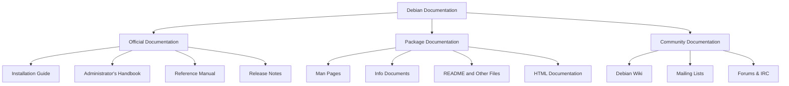
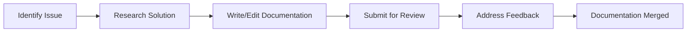

# Debian Documentation

## Introduction

Documentation is the backbone of any successful open-source project, and Debian—one of the oldest and most respected Linux distributions—has developed a robust documentation ecosystem over its nearly three-decade history. Whether you're a new Debian user, a system administrator managing Debian servers, or a developer interested in contributing to the project, understanding how to navigate, use, and contribute to Debian's documentation is essential.

This guide will walk you through the various types of Debian documentation, where to find them, how to use them effectively, and how you can contribute to improving them.

## Types of Debian Documentation

Debian's documentation is organized into several categories to serve different purposes and audiences:

### 1. Official Documentation

The Debian Project maintains several core documentation resources:

#### Debian Installation Guide

The comprehensive manual for installing Debian on various hardware architectures.

#### Debian Administrator's Handbook

A complete resource covering system administration tasks specifically for Debian systems.

#### Debian Reference

A post-installation user's guide covering many aspects of system administration through the shell command examples.

#### Release Notes

Detailed information about the current release, including known issues and upgrade paths.

### 2. Package Documentation

Each software package in Debian typically comes with its own documentation:

- **Man pages**: Traditional Unix manual pages accessible via the `man` command
- **Info documents**: GNU's hypertext system accessible via the `info` command
- **README files**: Usually located in `/usr/share/doc/package-name/`
- **HTML documentation**: For many packages, especially development libraries and tools

### 3. Wiki and Community Resources

- **Debian Wiki**: Community-maintained documentation with tips, tricks, and guides
- **Mailing Lists Archives**: Valuable source of problem-solving discussions
- **IRC and Forum Logs**: Real-time help channels where many solutions are documented

## Finding Debian Documentation

### Online Resources

The main entry points to Debian documentation online are:

```bash
# URLs to bookmark for Debian documentation
https://www.debian.org/doc/ # Official documentation portal
https://wiki.debian.org/ # Community wiki
https://manpages.debian.org/ # Online man pages
```

### Local Documentation

Debian installs documentation locally, making it available even without internet access:

```bash
# Commands to access local documentation
man command-name # View manual page for a command
info package-name # View GNU Info documentation
ls /usr/share/doc/package-name/ # Browse package-specific documentation
```

## Using Documentation Effectively

### Finding the Right Information

The Debian documentation system provides several search tools:

```bash
# Search for documentation about a topic
apropos keyword # Search man page descriptions
man -k keyword # Same as apropos
dpkg -L package-name | grep doc # Find documentation files in a package
```

### Example: Finding Network Configuration Documentation

Let's say you need to configure networking on your Debian system:

```bash
# Search for networking-related documentation
apropos network configuration

# Sample output:
# interfaces (5)       - network interface configuration for ifup and ifdown
# ip (8)               - show / manipulate routing, network devices, interfaces and tunnels
# netplan (5)          - Network configuration format for netplan
```

Based on the results, you can then view the detailed documentation:

```bash
man 5 interfaces
```

This will display the manual page explaining how to configure network interfaces in Debian.

## Working with Package Documentation

Most software packages in Debian include their own documentation. Here's how to access it:

```bash
# Install a package and check its documentation
sudo apt install nginx
ls -la /usr/share/doc/nginx/
```

Example output:
```
total 68
drwxr-xr-x   2 root root  4096 Feb 15 14:23 .
drwxr-xr-x 369 root root 12288 Feb 15 14:23 ..
-rw-r--r--   1 root root  1306 Jan 19 12:34 changelog.Debian.gz
-rw-r--r--   1 root root   163 Jan 19 12:34 copyright
-rw-r--r--   1 root root 34656 Jan 19 12:34 NEWS.gz
-rw-r--r--   1 root root  4774 Jan 19 12:34 README.Debian
```

You can then view these files using standard tools:

```bash
# View a compressed documentation file
zless /usr/share/doc/nginx/changelog.Debian.gz

# View plain text documentation
cat /usr/share/doc/nginx/README.Debian
```

## Debian Documentation Structure

The Debian documentation system follows a logical organizational structure:



## Contributing to Debian Documentation

One of the strengths of the Debian project is that anyone can contribute to improving its documentation.

### Why Contribute to Documentation?

- Fix errors or outdated information
- Clarify confusing explanations
- Add examples for complex procedures
- Translate documentation to other languages
- Create new guides for undocumented features

### How to Start Contributing

The process for contributing varies depending on which type of documentation you want to improve:

#### 1. Official Documentation

Official documentation is maintained in Git repositories:

```bash
# Clone the documentation repository
git clone https://salsa.debian.org/debian/debian-reference.git
cd debian-reference

# Make your changes
# Commit and create a merge request
```

#### 2. Package Documentation

For issues in package-specific documentation:

```bash
# Report a documentation bug
reportbug --ui text packagename

# In the bug report, set:
# Severity: normal
# Tags: documentation
# Subject: Documentation issue: [brief description]
```

#### 3. Wiki Contributions

The Debian Wiki is the easiest place to start contributing:

1. Create an account on wiki.debian.org
2. Find a page that needs improvement
3. Click the "Edit" button
4. Make your changes following the Wiki guidelines
5. Save your changes with a brief description

### Example: Improving a Wiki Page

Let's say you notice outdated information on the Debian Wiki about setting up a firewall:

1. Navigate to the page (e.g., https://wiki.debian.org/Firewall)
2. Log in to your Wiki account
3. Click "Edit"
4. Update the outdated information
5. Add a note to the page history explaining your change
6. Submit your changes

## Documentation Development Workflow

For more involved documentation contributions, follow this typical workflow:



## Best Practices for Using Debian Documentation

### 1. Start with the Basics

If you're new to Debian, begin with these documents:

- The Installation Guide for your architecture
- The "Getting Started" chapter of the Debian Reference
- The "Introduction to Debian" section of the Wiki

### 2. Use Version-Specific Documentation

Debian has different releases (Stable, Testing, Unstable), each with potentially different documentation:

```bash
# Check your Debian version
cat /etc/debian_version
lsb_release -a
```

Make sure you're referencing documentation that matches your version.

### 3. Combine Multiple Sources

For complex topics, it's often helpful to consult multiple documentation sources:

- Start with the official manual
- Check the Wiki for practical examples
- Look at package-specific documentation for details
- Search the mailing list archives for real-world experiences

## Practical Examples

### Example 1: Finding and Using Documentation for Apache2 Configuration

Let's say you need to configure Apache2 on your Debian system:

```bash
# Install Apache2
sudo apt install apache2

# Find the documentation
dpkg -L apache2 | grep doc
ls -la /usr/share/doc/apache2/
```

You'll find configuration examples and documentation in `/usr/share/doc/apache2/`. Additionally:

```bash
# Find Apache2 man pages
apropos apache2

# View the main configuration file documentation
man apache2.conf
```

### Example 2: Troubleshooting Using Documentation

If you encounter an error message like "Failed to start networking service":

1. First, check the service status for details:
   ```bash
   systemctl status networking.service
   ```

2. Look up the documentation for the networking service:
   ```bash
   man networking
   ```

3. Examine the interfaces configuration file documentation:
   ```bash
   man interfaces
   ```

4. Check for known issues in the Debian Wiki:
   ```bash
   # Open in browser
   https://wiki.debian.org/NetworkConfiguration
   ```

### Example 3: Learning About Security Updates

To understand how Debian handles security updates:

```bash
# Check the security documentation
less /usr/share/doc/debian-security-support/README.security-updates

# View the security manual
zless /usr/share/doc/apt/examples/sources.list

# Find information about security repositories
man sources.list
```

## Summary

Debian's documentation system is comprehensive, well-organized, and continuously improved by its community. By understanding how to navigate and use this documentation effectively, you can:

- Solve problems independently
- Learn about advanced Debian features
- Configure systems correctly and securely
- Contribute back to the project by improving documentation

The ability to find, understand, and apply information from Debian's documentation is perhaps the most valuable skill for any Debian user or administrator. With practice, you'll become proficient at quickly locating the information you need.

## Additional Resources

To further develop your Debian documentation skills:

- Join the debian-doc mailing list
- Participate in the #debian-doc IRC channel on OFTC
- Attend Debian documentation sprints (announced on debian-doc mailing list)
- Follow the debian-www and debian-doc Git repositories

## Exercises

1. Find all the documentation for the SSH server package on your system
2. Locate the manual page for configuring Debian package priorities
3. Find and read the documentation about Debian's release cycle
4. Identify a page on the Debian Wiki that needs updating and make a small improvement
5. Find the documentation for reporting bugs in Debian packages