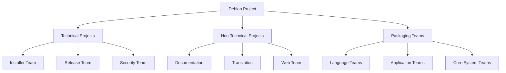

# Debian Projects

## Introduction

Debian is one of the oldest and most respected Linux distributions, known for its commitment to free software principles, stability, and extensive package repository. Behind this powerful operating system is a vibrant community organized into various projects that maintain and develop different aspects of the Debian ecosystem.

In this guide, we'll explore the diverse world of Debian projects, understand how they operate, and learn how beginners can start contributing to this welcoming open-source community.

## What are Debian Projects?

Debian projects are organized efforts within the Debian community that focus on specific aspects of the distribution. Each project has its own team of volunteers, goals, and workflows, but all operate under the shared principles outlined in the [Debian Social Contract](https://www.debian.org/social_contract).

These projects cover everything from packaging software and developing installation tools to translation, documentation, and quality assurance. They form the backbone of Debian's development model and provide numerous entry points for new contributors.

## Structure of Debian Projects

Debian's organizational structure is often described as a "do-ocracy" - those who do the work make the decisions. While there is a Project Leader elected annually, most of the work happens in self-organizing teams focused on specific tasks.



## Major Debian Projects

Let's explore some of the key projects within the Debian ecosystem:

### 1. Debian Installer

The Debian Installer project focuses on creating and maintaining the tools used to install Debian on various hardware platforms. This team works on both the standard installer and specialized versions.

#### Example: Customizing the Debian Installer Preseed File

A preseed file allows for automated installations. Here's a simple example:

```bash
# Basic network configuration
d-i netcfg/choose_interface select auto
d-i netcfg/get_hostname string debian-system
d-i netcfg/get_domain string local

# Root password (in clear text, be careful!)
d-i passwd/root-password password mypassword
d-i passwd/root-password-again password mypassword

# Create a normal user account
d-i passwd/user-fullname string Debian User
d-i passwd/username string debuser
d-i passwd/user-password password userpassword
d-i passwd/user-password-again password userpassword
```

### 2. Debian Package Tracking System

This system tracks the status of packages in different Debian releases. Understanding how it works helps beginners follow package development.

#### How to Check Package Status

Using the command-line:

```bash
# Find information about a package
$ apt-cache show firefox

Package: firefox
Version: 91.0-1
Priority: optional
Section: web
...
```

### 3. Debian Documentation Project

This project maintains official documentation, including the Debian Installation Guide, Debian Reference, and various manuals.

### 4. Debian Women

Debian Women is a project aimed at increasing the participation of women in the Debian community through mentoring programs, online resources, and networking opportunities.

### 5. Debian Pure Blends

Pure Blends are specialized Debian distributions focused on particular user groups like educators, medical professionals, or astronomers.

#### Example Blends:

- Debian Med: For medical practice and research
- Debian Science: For scientific research
- Debian Edu: For educational environments

## How Debian Projects Collaborate

Debian projects collaborate through various channels:

1. **Mailing Lists**: The primary communication method for most projects
2. **IRC Channels**: Real-time discussion spaces
3. **Bug Tracking System**: Coordination of issue resolution
4. **Wiki Pages**: Shared documentation space
5. **Sprint Meetings**: Occasional in-person meetings for intensive work

### Example: Debian Bug Tracking System

To report a bug in Debian, you can use the `reportbug` tool:

```bash
$ sudo apt-get install reportbug
$ reportbug firefox
```

This will guide you through submitting a bug report to the appropriate package maintainers.

## Getting Started with Debian Projects

Contributing to Debian projects is a rewarding way to enhance your skills while supporting free software. Here's how to get started:

### 1. Find a Project That Interests You

Browse the [Debian Wiki](https://wiki.debian.org/) and [Teams](https://www.debian.org/intro/organization) page to find projects that match your interests and skills.

### 2. Join Communication Channels

Subscribe to relevant mailing lists and join IRC channels to observe and learn from ongoing discussions.

```bash
# Example of subscribing to a mailing list via email
$ echo "subscribe" | mail debian-user-request@lists.debian.org
```

### 3. Start with Simple Tasks

Look for tasks marked as "good first issue" or "help wanted" in the bug tracking system.

### 4. Follow the Packaging Tutorial

If you're interested in packaging, follow the New Maintainer's Guide:

```bash
# Install the guide locally
$ sudo apt-get install maint-guide
```

### 5. Participate in Mentoring Programs

Debian offers mentoring programs to help new contributors get started:

- New Member Process
- Outreachy internships
- Google Summer of Code

## Real-World Applications

Let's look at some practical examples of how Debian projects work in real-world scenarios:

### Example 1: Package Maintenance Workflow

Consider a scenario where a security vulnerability is discovered in a package:

1. The security team identifies the issue
2. The package maintainer prepares a fix
3. The fix is reviewed by other team members
4. The updated package is uploaded to the security repository
5. An announcement is sent to users

The code might look like this:

```bash
# Update a package source
$ apt-get source somepackage
$ cd somepackage-1.2.3
# Make security fix
$ nano src/vulnerable_file.c
# Build fixed package
$ dch -i "Fixed security vulnerability CVE-2023-12345"
$ dpkg-buildpackage -us -uc
# Test fixed package
$ sudo dpkg -i ../somepackage_1.2.3-2_amd64.deb
```

### Example 2: Translation Project Workflow

For translating Debian documentation:

1. Join the translation team for your language
2. Check out translation files
3. Work on untranslated strings
4. Submit changes for review

```bash
# Example of working with PO files for translation
$ sudo apt-get install gettext
$ msgfmt --statistics de.po
# Output: 1234 translated messages, 56 untranslated messages.
$ nano de.po
# After translation
$ msgfmt --statistics de.po
# Output: 1290 translated messages.
```

## Building Your Own Debian-Based Project

Inspired to create your own Debian-based project? Here's a simple example of creating a customized Debian live system:

```bash
# Install required tools
$ sudo apt-get install live-build

# Create build directory
$ mkdir my-debian-live
$ cd my-debian-live

# Configure the build
$ lb config

# Customize package selection
$ echo "firefox libreoffice gimp" > config/package-lists/my-packages.list.chroot

# Build the ISO
$ sudo lb build
```

This creates a custom Debian live ISO with Firefox, LibreOffice, and GIMP pre-installed.

## Summary

Debian projects form the collaborative backbone of one of the most important Linux distributions. They provide numerous opportunities for beginners to learn about open-source development, package maintenance, documentation, translation, and many other aspects of software development.

By joining these projects, you not only improve your technical skills but also become part of a global community dedicated to creating and maintaining free software for everyone.

## Additional Resources

- [Debian New Maintainers' Guide](https://www.debian.org/doc/manuals/maint-guide/)
- [Debian Developer's Reference](https://www.debian.org/doc/manuals/developers-reference/)
- [Debian Policy Manual](https://www.debian.org/doc/debian-policy/)

## Exercises for Beginners

1. **Package Exploration**: Pick a package you use regularly and explore its details using `apt-cache show` and `apt-cache policy`. Try to understand its dependencies and versions.

2. **Bug Triage**: Find an open bug in the Debian Bug Tracking System and try to reproduce it on your system. Add any additional information you discover.

3. **Translation Practice**: Find a small package with incomplete translations for your language and prepare a translation file (even if you don't submit it officially).

4. **Custom Live System**: Create a customized Debian live system for a specific purpose (e.g., digital art workstation, programming environment, etc.).

5. **Documentation Review**: Review a page of the Debian Wiki for accuracy and clarity. Prepare notes on how it could be improved.

Start small, be patient, and remember that every contribution, no matter how minor it seems, helps make Debian better for millions of users worldwide!