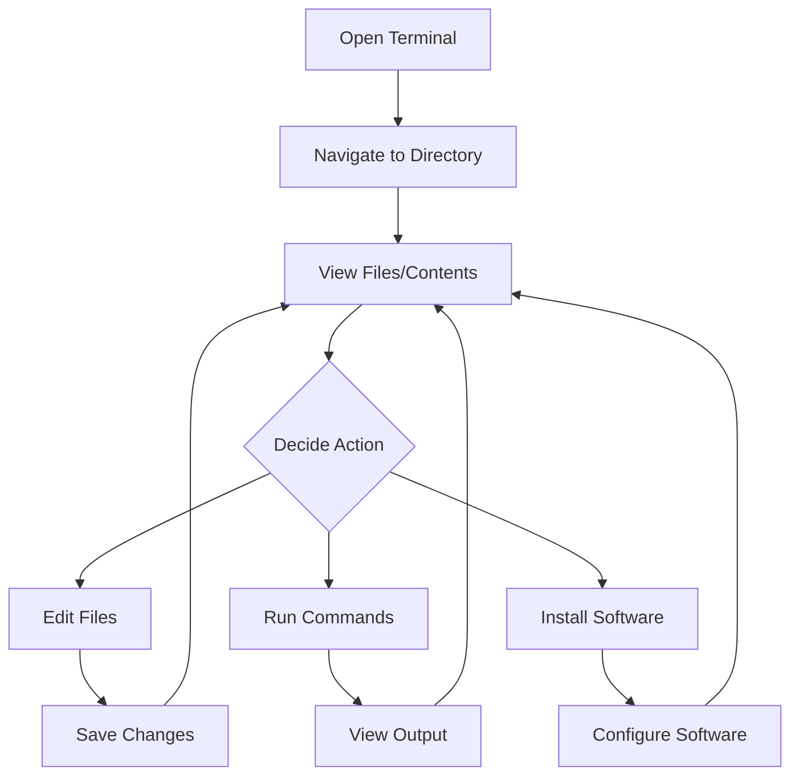

# Debian Terminal Introduction

## What is the Terminal?

The terminal (also called the command line or shell) is a text-based interface to interact with your Debian Linux system. Think of it as a powerful control center that allows you to perform tasks by typing commands instead of clicking buttons in a graphical interface.

While graphical user interfaces (GUIs) are user-friendly, the terminal provides:

- **Efficiency**: Perform complex tasks with a few keystrokes
- **Automation**: Easily script repetitive tasks
- **Remote access**: Manage systems without a graphical interface
- **Greater control**: Access advanced system functions

## Opening the Terminal

In Debian, you can open the terminal in several ways:

1. **Keyboard shortcut**: Press `Ctrl + Alt + T`
2. **Applications menu**: Applications → System Tools → Terminal
3. **Right-click on desktop**: Some Debian versions allow opening a terminal from the context menu

When you open the terminal, you'll see something like this:

```
username@hostname:~$ 
```

This is called the **prompt**. Let's break it down:
- `username`: Your user account
- `hostname`: Your computer's name
- `~`: Your current directory (~ means your home directory)
- `$`: Indicates you're a regular user (root users see a `#` instead)

## Understanding the Shell

The terminal runs a program called a "shell" that interprets your commands. Debian's default shell is **Bash** (Bourne Again SHell), but others exist like ZSH and Fish.

You can check your current shell with:

```bash
echo $SHELL
```

Output:
```
/bin/bash
```

## Basic Navigation Commands

### Checking Your Location

To see which directory you're currently in:

```bash
pwd
```

Output:
```
/home/username
```

`pwd` stands for "print working directory."

### Listing Files and Directories

To view the contents of the current directory:

```bash
ls
```

Output:
```
Documents  Downloads  Music  Pictures  Videos
```

To see more details, use the `-l` (long) flag:

```bash
ls -l
```

Output:
```
drwxr-xr-x 2 username username 4096 Mar 10 15:20 Documents
drwxr-xr-x 2 username username 4096 Mar 12 09:45 Downloads
drwxr-xr-x 2 username username 4096 Feb 28 14:30 Music
drwxr-xr-x 2 username username 4096 Mar 05 11:15 Pictures
drwxr-xr-x 2 username username 4096 Jan 15 18:40 Videos
```

To show hidden files (those that start with a dot), use the `-a` flag:

```bash
ls -a
```

Output:
```
.  ..  .bash_history  .bashrc  .config  Documents  Downloads  Music  Pictures  Videos
```

You can combine flags:

```bash
ls -la
```

### Changing Directories

To move to another directory:

```bash
cd Documents
```

To move up one level to the parent directory:

```bash
cd ..
```

To return to your home directory from anywhere:

```bash
cd
```

or

```bash
cd ~
```

To move to a specific path:

```bash
cd /etc/apt
```

To go back to your previous directory:

```bash
cd -
```

## Working with Files and Directories

### Creating Directories

To create a new directory:

```bash
mkdir projects
```

To create nested directories in one command:

```bash
mkdir -p projects/python/basics
```

The `-p` flag creates parent directories if they don't exist.

### Creating Files

To create an empty file:

```bash
touch notes.txt
```

To create a file and add content immediately, use a text editor like `nano`:

```bash
nano notes.txt
```

This opens the nano editor where you can type content. Press `Ctrl + X`, then `Y`, and `Enter` to save and exit.

### Viewing File Content

To display the contents of a file:

```bash
cat notes.txt
```

For large files, you can use:

```bash
less notes.txt
```

Navigate with arrow keys, and press `q` to quit.

To see just the beginning of a file:

```bash
head -n 5 notes.txt  # Shows first 5 lines
```

To see the end of a file:

```bash
tail -n 5 notes.txt  # Shows last 5 lines
```

### Copying, Moving, and Renaming

To copy a file:

```bash
cp notes.txt notes_backup.txt
```

To copy a directory and all its contents:

```bash
cp -r projects projects_backup
```

To move or rename a file:

```bash
mv notes.txt documents/notes.txt  # Moves the file
mv notes.txt study_notes.txt     # Renames the file
```

### Deleting Files and Directories

To delete a file:

```bash
rm notes.txt
```

To delete an empty directory:

```bash
rmdir projects
```

To delete a directory and all its contents (**use with caution**):

```bash
rm -r projects
```

**Warning**: In the terminal, there's no "recycle bin" or "trash." Deleted items are permanently gone.

## Understanding Command Structure

Most commands follow this pattern:

```
command -options arguments
```

For example:

```bash
ls -la /etc
```

- `ls` is the command
- `-la` are the options (or flags)
- `/etc` is the argument (in this case, the directory to list)

## Getting Help

If you're unsure how to use a command, you have several ways to get help:

1. Use the `--help` flag:

```bash
ls --help
```

2. Use the `man` (manual) command:

```bash
man ls
```

Navigate the manual with arrow keys and press `q` to quit.

3. For a shorter help summary, try:

```bash
whatis ls
```

Output:
```
ls (1) - list directory contents
```

## Terminal Shortcuts

Learning these shortcuts will make you more efficient:

- `Tab`: Auto-complete commands and filenames
- `Ctrl + C`: Cancel the current command
- `Ctrl + L`: Clear the screen (same as the `clear` command)
- `Ctrl + A`: Move cursor to beginning of line
- `Ctrl + E`: Move cursor to end of line
- `Ctrl + U`: Clear the line before the cursor
- `Up/Down arrows`: Navigate through command history

## Command History

The terminal keeps track of commands you've typed. To see your history:

```bash
history
```

To repeat a recent command, press the up arrow until you find it.

To search through your history, press `Ctrl + R` and start typing:

```
(reverse-i-search)`ls': ls -la
```

## Command Chaining

You can run multiple commands in sequence:

- `command1 ; command2` - Run command2 after command1 completes
- `command1 && command2` - Run command2 only if command1 succeeds
- `command1 || command2` - Run command2 only if command1 fails

Example:

```bash
mkdir projects && cd projects
```

This creates a directory and changes into it if the creation was successful.

## Input/Output Redirection

The terminal allows you to redirect input and output:

- `>` - Redirect output to a file (overwrites existing content)
- `>>` - Append output to a file
- `<` - Take input from a file

Examples:

```bash
ls -la > file_list.txt  # Save directory listing to a file
echo "New task" >> todo.txt  # Append text to a file
```

## Piping Commands

The pipe symbol `|` lets you send the output of one command as input to another:

```bash
ls -la | grep "txt"  # List all files and filter for those containing "txt"
```

Output might look like:
```
-rw-r--r-- 1 username username  156 Mar 13 10:25 notes.txt
-rw-r--r-- 1 username username  156 Mar 13 10:26 todo.txt
```

## Real-World Examples

Let's explore some practical examples of terminal usage:

### Example 1: Finding Large Files

To find the 5 largest files in your home directory:

```bash
find ~ -type f -exec du -h {} \; | sort -rh | head -n 5
```

This combines multiple commands:
1. `find` locates all files
2. `du` measures their size
3. `sort` arranges them by size
4. `head` shows only the top 5

### Example 2: System Monitoring

To monitor system resources in real-time:

```bash
top
```

Press `q` to quit.

For a more user-friendly alternative:

```bash
htop
```

Note: You might need to install htop first with `sudo apt install htop`.

### Example 3: Batch File Renaming

To rename all .txt files to .md files:

```bash
for file in *.txt; do mv "$file" "${file%.txt}.md"; done
```

### Example 4: Quick Web Server

If you have Python installed, you can start a simple web server in the current directory:

```bash
python3 -m http.server 8000
```

This makes the current directory accessible at http://localhost:8000 in a web browser.

## The Terminal Workflow

Here's a diagram showing a typical terminal workflow:



## Summary

The terminal is an essential tool for anyone using Debian Linux. While it may seem intimidating at first, learning even a few basic commands can significantly increase your productivity and understanding of your system.

In this introduction, you've learned how to:
- Navigate the file system
- Create, modify, and delete files and directories
- View file contents
- Get help with commands
- Use shortcuts and command history
- Chain commands and redirect output
- Apply terminal commands to real-world tasks

## Practice Exercises

1. Create a directory structure for a project with subdirectories for "docs", "src", and "tests".
2. Create a simple text file and append three lines to it using different methods.
3. Find all files in your home directory that were modified in the last 24 hours.
4. Use the `grep` command to search for a specific word in a text file.
5. Write a simple bash command that prints "Hello, Debian!" ten times.

## Additional Resources

To continue learning about the Debian terminal, consider these resources:

- The Debian Reference manual
- The Bash manual (`man bash`)
- Linux Command Line and Shell Scripting Bible (book)
- LinuxCommand.org (website)
- The Linux Documentation Project (TLDP)

Remember, the best way to learn the terminal is through regular practice. Try to incorporate terminal commands into your daily workflow, and you'll quickly become comfortable with this powerful tool.