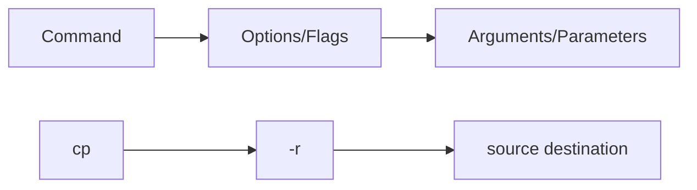

# Debian Command Structure

## Introduction

When working with Debian or any Linux distribution, understanding the structure and syntax of terminal commands is essential. The command line interface (CLI) provides powerful control over your system, but it follows specific patterns and rules. This guide explores how commands are structured in Debian, helping beginners understand the logic behind terminal operations.

## Basic Command Structure

At its simplest, a Debian command follows this general pattern:

```
command [options] [arguments]
```

Let's break down each component:

### Command

The command is the program or utility you want to run. It's the fundamental part that tells the system what action to perform.

Examples of basic commands:
- `ls` - List files and directories
- `cd` - Change directory
- `cp` - Copy files or directories
- `mv` - Move or rename files or directories
- `rm` - Remove files or directories

### Options (Flags)

Options modify the behavior of commands. They typically start with one or two hyphens:
- Short options: Single-letter options prefixed with a single hyphen (e.g., `-a`)
- Long options: Word options prefixed with two hyphens (e.g., `--all`)

Multiple short options can be combined after a single hyphen. For example, `ls -la` combines the `-l` (long format) and `-a` (all files) options.

### Arguments

Arguments are the targets of the command, such as filenames, directories, or other values the command needs to operate on.

## Command Structure Visualization



## Practical Examples

Let's explore some real-world examples to illustrate command structure:

### Example 1: Listing Files

```bash
ls -la /home/user
```

- Command: `ls`
- Options: `-la` (combining `-l` for long format and `-a` to show hidden files)
- Argument: `/home/user` (the directory to list)

Output:
```
total 128
drwxr-xr-x 15 user user 4096 Mar 10 09:23 .
drwxr-xr-x  5 root root 4096 Feb 15 12:30 ..
-rw-------  1 user user 8980 Mar 10 09:40 .bash_history
-rw-r--r--  1 user user  220 Feb 15 12:30 .bash_logout
-rw-r--r--  1 user user 3771 Feb 15 12:30 .bashrc
drwxr-xr-x  2 user user 4096 Mar  5 14:22 Documents
drwxr-xr-x  2 user user 4096 Mar  3 19:45 Downloads
```

### Example 2: Copying Files

```bash
cp -r Documents/ Backup/
```

- Command: `cp`
- Option: `-r` (recursive, to copy directories and their contents)
- Arguments: `Documents/` (source) and `Backup/` (destination)

No output is displayed if successful.

### Example 3: Finding Files

```bash
find /home/user -name "*.txt" -size +1M
```

- Command: `find`
- Argument: `/home/user` (starting directory)
- Options with arguments: 
  - `-name "*.txt"` (pattern to match)
  - `-size +1M` (files larger than 1 megabyte)

Example output:
```
/home/user/Documents/report.txt
/home/user/Downloads/data.txt
```

## Command Categories

Debian commands can be categorized into several groups:

### File Operations
- `ls`, `cp`, `mv`, `rm`, `mkdir`, `touch`, `chmod`, `chown`

### Text Processing
- `cat`, `grep`, `sed`, `awk`, `head`, `tail`, `sort`, `uniq`

### System Information
- `uname`, `whoami`, `df`, `du`, `free`, `top`, `ps`

### Package Management
- `apt`, `apt-get`, `dpkg`, `aptitude`

### Networking
- `ping`, `ifconfig`, `ip`, `netstat`, `ssh`, `curl`, `wget`

## Command Chaining and Redirection

Commands can be combined and their inputs/outputs can be redirected:

### Chaining with Operators

- `&&` - Run the next command only if the previous one succeeds
- `||` - Run the next command only if the previous one fails
- `;` - Run the next command regardless of the previous command's status
- `|` - Pipe the output of the first command as input to the next

Example:
```bash
mkdir new_directory && cd new_directory
```
This creates a new directory and changes into it if the creation was successful.

### Redirection

- `>` - Redirect output to a file (overwrite)
- `>>` - Redirect output to a file (append)
- `<` - Take input from a file
- `2>` - Redirect error output to a file

Example:
```bash
ls -la > file_list.txt
```
This saves the directory listing to a file instead of displaying it on the screen.

## Command Arguments vs. Parameters

Although often used interchangeably, these terms have specific meanings:

- **Arguments**: Values passed to the command
- **Parameters**: Variables in the command that receive the arguments

For example, in `cp source.txt destination.txt`:
- `source.txt` and `destination.txt` are arguments
- The `cp` command has parameters that receive these values (source file and destination file)

## Command Help and Documentation

Debian provides several ways to learn about commands:

### Man Pages

The `man` command displays detailed documentation:

```bash
man ls
```

Output (partial):
```
LS(1)                            User Commands                           LS(1)

NAME
       ls - list directory contents

SYNOPSIS
       ls [OPTION]... [FILE]...

DESCRIPTION
       List information about the FILEs (the current directory by default).
       Sort entries alphabetically if none of -cftuvSUX nor --sort is specified.
...
```

### Command Help

Many commands support a `--help` option:

```bash
ls --help
```

Output (partial):
```
Usage: ls [OPTION]... [FILE]...
List information about the FILEs (the current directory by default).
Sort entries alphabetically if none of -cftuvSUX nor --sort is specified.

Mandatory arguments to long options are mandatory for short options too.
  -a, --all                  do not ignore entries starting with .
  -A, --almost-all           do not list implied . and ..
...
```

## Summary

Understanding command structure in Debian is fundamental to effective terminal usage:

1. Commands follow a consistent pattern: `command [options] [arguments]`
2. Options (or flags) modify command behavior and start with one or two hyphens
3. Short options can be combined (e.g., `-la` instead of `-l -a`)
4. Arguments provide the targets or values for the command to operate on
5. Commands can be chained and their input/output redirected
6. Documentation is available through `man` pages and the `--help` option

Mastering command structure enables you to work efficiently in the Debian terminal, building a foundation for more advanced Linux skills.

## Practice Exercises

1. List all files in your home directory, including hidden ones, and save the output to a file named `my_files.txt`.
2. Find all `.jpg` files in your home directory that are larger than 500KB.
3. Create a new directory called `practice`, create a text file in it, and then move that directory to another location.
4. Use the `ps` command with appropriate options to show all running processes in a user-readable format.
5. Chain commands to update your package lists and install a new package in one line.

## Additional Resources

- The Debian Reference: An extensive guide to Debian systems
- Linux Command Line by William Shotts: A comprehensive resource for command line usage
- `info` pages: More detailed than man pages for many GNU utilities
- The Debian Wiki: Community-maintained documentation on various aspects of Debian

Remember that practice is key to becoming proficient with the Debian command line. Start with simple commands and gradually incorporate more complex structures as your confidence grows.