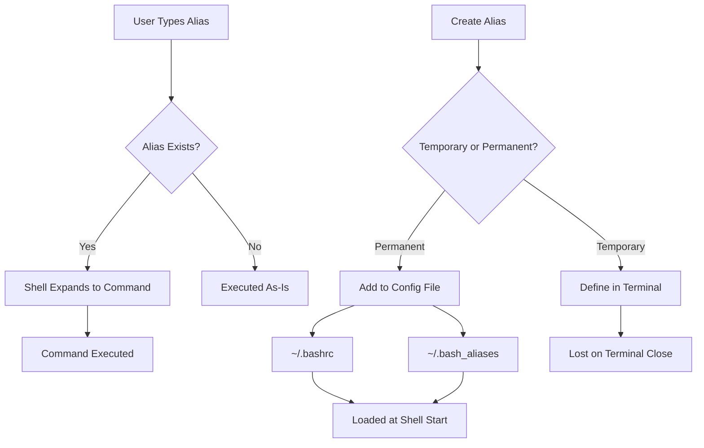

# Debian Command Aliases

## Introduction

Working in the Debian terminal involves typing many commands repeatedly. Command aliases allow you to create shortcuts for longer or frequently used commands, helping you work more efficiently. An alias is essentially a custom keyboard shortcut or abbreviation that the shell automatically expands into a longer command or series of commands.

In this tutorial, you'll learn how to create, manage, and effectively use command aliases in Debian, allowing you to customize your terminal experience and boost your productivity.

## Understanding Command Aliases

### What is an Alias?

An alias is a shorthand name or abbreviation for a longer command. For example, instead of typing `ls -la` every time you want to list all files (including hidden ones) with detailed information, you could create an alias named `ll` that automatically expands to `ls -la`.

### Basic Alias Syntax

The basic syntax for creating an alias is:

```bash
alias name='command'
```

Where:
- `name` is your chosen shortcut
- `command` is the actual command that will be executed

## Creating Temporary Aliases

Aliases created directly in the terminal session are temporary and will be lost when you close the terminal. Here's how to create them:

### Example 1: Create a simple alias

```bash
alias ll='ls -la'
```

Now when you type `ll`, the system executes `ls -la` instead:

```bash
# Input
ll

# Output
total 108
drwxr-xr-x 16 user user  4096 Mar 13 10:15 .
drwxr-xr-x  3 root root  4096 Jan  5 14:22 ..
-rw-------  1 user user 12345 Mar 13 09:45 .bash_history
-rw-r--r--  1 user user   220 Jan  5 14:22 .bash_logout
-rw-r--r--  1 user user  3771 Jan  5 14:22 .bashrc
drwx------ 14 user user  4096 Mar 12 17:30 .cache
```

### Example 2: Create an alias for a more complex command

```bash
alias update='sudo apt update && sudo apt upgrade -y'
```

This creates an alias named `update` that performs system updates with a single command:

```bash
# Input
update

# Output
Hit:1 http://deb.debian.org/debian bullseye InRelease
Hit:2 http://security.debian.org/debian-security bullseye-security InRelease
Hit:3 http://deb.debian.org/debian bullseye-updates InRelease
Reading package lists... Done
Building dependency tree... Done
Reading state information... Done
All packages are up to date.
Reading package lists... Done
Building dependency tree... Done
Reading state information... Done
Calculating upgrade... Done
0 upgraded, 0 newly installed, 0 to remove and 0 not upgraded.
```

## Making Aliases Permanent

To make aliases permanent, you need to add them to your shell configuration file. For Bash (the default shell in Debian), you can use either `~/.bashrc` or `~/.bash_aliases`.

### Using .bashrc

1. Open the file with a text editor:

```bash
nano ~/.bashrc
```

2. Add your aliases at the end of the file:

```bash
# Custom aliases
alias ll='ls -la'
alias update='sudo apt update && sudo apt upgrade -y'
```

3. Save and exit (in nano: `Ctrl+O` then `Enter`, then `Ctrl+X`)

4. Apply the changes:

```bash
source ~/.bashrc
```

### Using .bash_aliases (Recommended)

The `.bashrc` file in Debian usually contains code to load aliases from a separate `.bash_aliases` file, which is a cleaner approach:

1. Check if your `.bashrc` contains these lines (it usually does by default):

```bash
if [ -f ~/.bash_aliases ]; then
    . ~/.bash_aliases
fi
```

2. Create or edit the `.bash_aliases` file:

```bash
nano ~/.bash_aliases
```

3. Add your aliases:

```bash
# Navigation aliases
alias ll='ls -la'
alias la='ls -A'
alias l='ls -CF'

# System management
alias update='sudo apt update && sudo apt upgrade -y'
alias install='sudo apt install'
alias remove='sudo apt remove'

# Directory shortcuts
alias docs='cd ~/Documents'
alias downloads='cd ~/Downloads'
```

4. Save, exit, and apply the changes:

```bash
source ~/.bashrc
```

## Viewing Existing Aliases

To see all currently defined aliases, simply type:

```bash
# Input
alias

# Output
alias l='ls -CF'
alias la='ls -A'
alias ll='ls -la'
alias ls='ls --color=auto'
alias update='sudo apt update && sudo apt upgrade -y'
```

## Removing Aliases

### Temporary Removal

To remove an alias for the current session:

```bash
unalias alias_name
```

Example:

```bash
# Input
unalias ll

# Output
# No output, but the 'll' alias is now removed for this session
```

To remove all aliases:

```bash
unalias -a
```

### Permanent Removal

To permanently remove an alias, edit your `.bash_aliases` or `.bashrc` file and remove or comment out the line containing the alias definition.

## Practical Examples of Useful Aliases

Here are some practical aliases that can enhance your productivity in the Debian terminal:

### System Management

```bash
# Update and upgrade in one command
alias update='sudo apt update && sudo apt upgrade -y'

# Clean up unnecessary packages
alias autoclean='sudo apt autoclean && sudo apt autoremove'

# Show disk space in human-readable format
alias df='df -h'

# Show memory usage
alias meminfo='free -m'

# Show running processes (sorted by memory usage)
alias psmem='ps auxf | sort -nr -k 4 | head -10'

# Show running processes (sorted by CPU usage)
alias pscpu='ps auxf | sort -nr -k 3 | head -10'
```

### Navigation Enhancements

```bash
# Enhanced directory listings
alias ll='ls -la'
alias la='ls -A'
alias l='ls -CF'

# Add colors to grep
alias grep='grep --color=auto'

# Create parent directories as needed
alias mkdir='mkdir -pv'

# Make 'cd..' work even with the typo
alias cd..='cd ..'

# Go back multiple directory levels
alias ..='cd ..'
alias ...='cd ../..'
alias ....='cd ../../..'
```

### Network Tools

```bash
# Show all open ports
alias ports='netstat -tulanp'

# Simple ping (5 packets only)
alias ping='ping -c 5'

# Show my public IP address
alias myip='curl http://ipecho.net/plain; echo'

# Display HTTP headers of a website
alias header='curl -I'
```

### Safety Nets

```bash
# Confirm before overwriting
alias cp='cp -i'
alias mv='mv -i'

# Don't accidentally remove root directory
alias rm='rm -I --preserve-root'

# Don't accidentally overwrite files
alias ln='ln -i'
```

## Advanced Alias Techniques

### Aliases with Arguments

Simple aliases don't accept arguments, but you can use functions for more complex behavior:

```bash
# Add this to your .bash_aliases or .bashrc
extract() {
  if [ -f $1 ] ; then
    case $1 in
      *.tar.bz2)   tar xjf $1    ;;
      *.tar.gz)    tar xzf $1    ;;
      *.bz2)       bunzip2 $1    ;;
      *.rar)       unrar e $1    ;;
      *.gz)        gunzip $1     ;;
      *.tar)       tar xf $1     ;;
      *.tbz2)      tar xjf $1    ;;
      *.tgz)       tar xzf $1    ;;
      *.zip)       unzip $1      ;;
      *.Z)         uncompress $1 ;;
      *.7z)        7z x $1       ;;
      *)           echo "'$1' cannot be extracted via extract()" ;;
    esac
  else
    echo "'$1' is not a valid file"
  fi
}
```

Usage:

```bash
# Input
extract archive.tar.gz

# Output
# The contents of the archive will be extracted
```

### Creating Aliases for Git Workflow

If you use Git frequently, you might find these aliases helpful:

```bash
# Git status
alias gs='git status'

# Git commit with message
alias gc='git commit -m'

# Git add all and commit
alias gac='git add . && git commit -m'

# Git pull
alias gpl='git pull'

# Git push
alias gps='git push'

# Git log with a nice format
alias glog='git log --oneline --decorate --graph'
```

## Visualizing Alias Usage

Here's a Mermaid diagram showing how aliases flow in your system:



## Summary

Command aliases are powerful tools that can significantly enhance your productivity in the Debian terminal. By creating shortcuts for long or frequently used commands, you can:

- Save time by typing fewer characters
- Avoid errors in complex commands
- Create safer versions of commands with useful default options
- Customize your terminal experience to suit your workflow

Remember that aliases are meant to make your life easier, so create ones that match your specific needs and workflow. Start with a few essential aliases and gradually add more as you identify repetitive tasks in your daily work.

## Additional Resources and Exercises

### Exercises

1. Create an alias called `upd` that updates your package lists but doesn't upgrade packages.
2. Create a permanent alias called `findfile` that uses the `find` command to locate files by name in the current directory and subdirectories.
3. Set up an alias to quickly edit your `.bash_aliases` file and another to reload it after making changes.
4. Create an alias that shows system information including hostname, kernel version, and uptime.

### Further Learning

- Read the Bash manual section on aliases: `man bash` and search for "ALIASES" (press `/` then type "ALIASES" and press Enter)
- Explore the `.bashrc` file to understand how Debian configures the shell by default
- Look at others' alias configurations on platforms like GitHub for inspiration