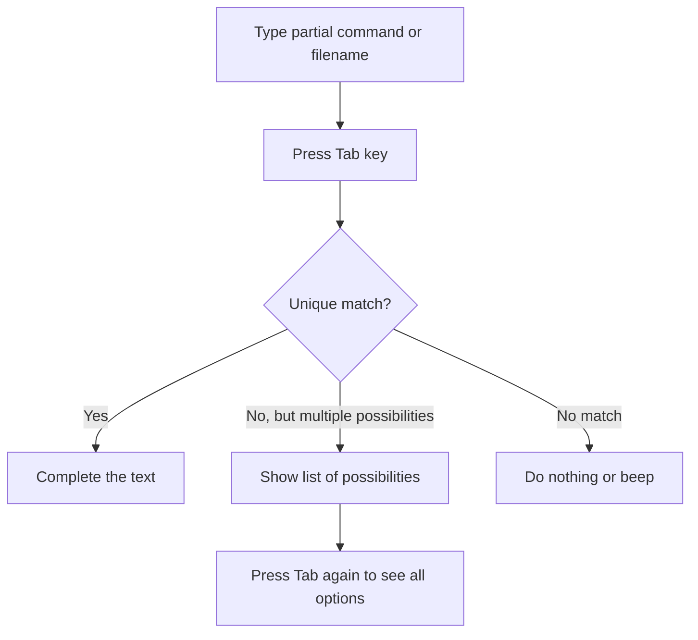

# Debian Tab Completion

## Introduction

Tab completion is one of the most powerful productivity features available in the Debian terminal. This functionality allows you to type a partial command, filename, or directory name and then press the Tab key to automatically complete it. Not only does tab completion save you from typing long commands and filenames, but it also helps prevent typing errors and lets you discover available commands and options.

In this tutorial, we'll explore tab completion in Debian's default shell (Bash), how it works, and how you can customize it to make your terminal experience even more efficient.

## How Tab Completion Works

Tab completion in Debian is primarily provided by the Bash shell's programmable completion system. When you press the Tab key after typing part of a command or filename, Bash attempts to complete what you've started typing.

The basic workflow looks like this:



### Basic Tab Completion Examples

Let's start with some simple examples:

#### Command Completion

When you begin typing a command, pressing Tab will attempt to complete it:

```bash
# Type:
ap[TAB]

# Possible completions might include:
apt apt-cache apt-get aptitude aplay
```

If there's only one possibility, Bash will complete it automatically:

```bash
# Type:
upti[TAB]

# Bash completes to:
uptimed
```

#### File and Directory Completion

Tab completion works for files and directories too:

```bash
# If you have files named document1.txt, document2.txt in the current directory
# Type:
cat doc[TAB]

# If these are the only files starting with "doc", you'll see:
cat doc[TAB][TAB]
document1.txt  document2.txt

# Type '1' after doc and press Tab again:
cat doc1[TAB]

# Completes to:
cat document1.txt
```

## Advanced Tab Completion Features

Debian's tab completion goes beyond simple command and filename completion. Here are some advanced features:

### Command Options Completion

Many commands in Debian have tab completion support for their options:

```bash
# Type:
apt --[TAB][TAB]

# Will show all available options for apt:
--allow-change-held-packages       --fix-broken
--allow-downgrades                 --force-yes
--allow-remove-essential           --help
# ... and many more
```

### Package Name Completion

When using package management commands like `apt`, you can use tab completion for package names:

```bash
# Type:
sudo apt install python3-[TAB][TAB]

# Will show all available packages starting with python3-:
python3-aiohttp            python3-markupsafe
python3-appdirs            python3-matplotlib
python3-apt                python3-matplotlib-inline
# ... and many more
```

### Path Completion

Tab completion is especially useful when navigating the filesystem:

```bash
# Type:
cd /etc/net[TAB]

# Might complete to:
cd /etc/network/

# Continue typing:
cd /etc/network/if-[TAB][TAB]

# Might show:
if-down.d/  if-post-down.d/  if-pre-up.d/  if-up.d/
```

## Setting Up and Customizing Tab Completion

Debian comes with tab completion enabled by default, but there are ways to enhance and customize it.

### Checking Your Completion Setup

First, let's check if bash completion is properly set up:

```bash
# Check if bash-completion package is installed
dpkg -l | grep bash-completion
```

If it's not installed, you can install it with:

```bash
sudo apt update
sudo apt install bash-completion
```

### Enabling Bash Completion

In most Debian installations, bash completion is enabled by default. The configuration is typically in `/etc/bash.bashrc` or in your personal `~/.bashrc` file.

You should see something like this in your `.bashrc`:

```bash
# enable programmable completion features
if ! shopt -oq posix; then
  if [ -f /usr/share/bash-completion/bash_completion ]; then
    . /usr/share/bash-completion/bash_completion
  elif [ -f /etc/bash_completion ]; then
    . /etc/bash_completion
  fi
fi
```

If these lines are commented out (with a `#` at the beginning), remove the comment markers to enable completion.

### Adding Custom Completions

You can create your own tab completions for your custom scripts or commands. Here's a simple example:

```bash
# Add this to your ~/.bashrc file
# This example adds completion for a hypothetical 'myapp' command

complete -W "start stop restart status" myapp
```

After adding this and reloading your `.bashrc` (by running `source ~/.bashrc`), typing `myapp` followed by Tab will suggest the words "start", "stop", "restart", and "status".

## Practical Examples

Let's walk through some real-world scenarios where tab completion shines:

### Example 1: Finding and Editing Configuration Files

Finding and editing configuration files in `/etc` becomes much easier:

```bash
# Type:
sudo nano /etc/ssh/ss[TAB]

# Completes to:
sudo nano /etc/ssh/ssh_config

# Or press Tab again to see all options:
ssh_config  ssh_config.d/  sshd_config  sshd_config.d/
```

### Example 2: Working with Multiple Similar Files

When working with multiple files with similar names:

```bash
# If you have log files named app_log_2023-01-01.txt, app_log_2023-01-02.txt, etc.
# Type:
cat app_log_2023-01-[TAB][TAB]

# Shows:
app_log_2023-01-01.txt  app_log_2023-01-02.txt  app_log_2023-01-03.txt
```

### Example 3: Command History Search

Bash also supports searching command history by typing part of a command and using the up/down arrows:

```bash
# Type the beginning of a previously used command:
sudo apt ins

# Press the up arrow key to cycle through matching commands in your history
```

This isn't technically tab completion but works well alongside it.

### Example 4: Git Branch Completion

If you have the git package properly installed with its completions:

```bash
# Type:
git checkout [TAB][TAB]

# Shows all available branches:
main  feature/login  bugfix/header  development
```

## Troubleshooting Tab Completion

If tab completion isn't working as expected, try these troubleshooting steps:

1. Make sure the `bash-completion` package is installed:
   ```bash
   sudo apt install bash-completion
   ```

2. Ensure your `.bashrc` file is loading completions (see the "Enabling Bash Completion" section above).

3. Try reloading your bash configuration:
   ```bash
   source ~/.bashrc
   ```

4. Check if the specific command you're trying to complete has completion support installed.

## Summary

Tab completion in Debian is an essential productivity tool that:
- Saves time by reducing typing
- Helps prevent errors by auto-completing commands and filenames
- Provides a way to discover available commands, options, and files
- Makes navigating the filesystem much faster
- Can be customized to fit your specific workflow

By mastering tab completion, you'll significantly improve your efficiency when working in the Debian terminal.

## Additional Resources and Exercises

### Resources for Further Learning

- Read the Bash completion documentation: `man bash` and search for "Programmable Completion"
- Explore `/usr/share/bash-completion/completions/` to see completion scripts for various commands

### Exercises to Practice Tab Completion

1. **Command Discovery Exercise**:
   Type `apt-` and press Tab twice. Count how many different `apt-` commands are available on your system.

2. **File Navigation Challenge**:
   Using only tab completion (no typing full names), navigate to `/usr/share/doc/` and find a package you've installed.

3. **Completion Script Exploration**:
   Look at the completion script for `git` located at `/usr/share/bash-completion/completions/git`. Try to understand how it enables the rich completion for git commands.

4. **Custom Completion Script**:
   Create a simple bash script called `hello.sh` that accepts parameters "world", "friend", or "everyone". Then write a completion script for it that suggests these parameters when you type `./hello.sh` and press Tab.