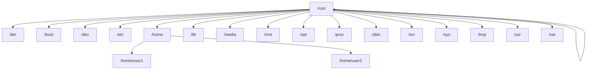

# Debian Navigation Commands

## Introduction

Navigating through the Debian file system using the terminal is a fundamental skill for any Linux user. The terminal provides powerful ways to move between directories, locate files, and manage your system efficiently. This guide covers essential navigation commands that will help you become proficient in using the Debian terminal.

## Basic Navigation Commands

### pwd - Print Working Directory

The `pwd` command displays your current location in the file system.

**Example:**
```bash
pwd
```

**Output:**
```
/home/username
```

This shows that you're currently in the home directory of user "username".

### ls - List Directory Contents

The `ls` command displays the files and directories in your current location.

**Basic usage:**
```bash
ls
```

**Output:**
```
Documents  Downloads  Music  Pictures  Videos
```

**Common options:**

- `ls -l`: Long format listing with permissions, size, and dates
- `ls -a`: Shows all files, including hidden ones (those starting with a dot)
- `ls -h`: Shows file sizes in human-readable format (KB, MB, GB)

**Example with options:**
```bash
ls -lah
```

**Output:**
```
total 88K
drwxr-xr-x 15 username username 4.0K Feb 12 10:24 .
drwxr-xr-x  3 root     root     4.0K Jan 15 09:35 ..
-rw-------  1 username username 9.3K Feb 12 10:30 .bash_history
drwxr-xr-x  2 username username 4.0K Feb 10 14:22 Documents
drwxr-xr-x  4 username username 4.0K Feb 11 16:15 Downloads
drwxr-xr-x  2 username username 4.0K Jan 15 09:45 Music
drwxr-xr-x  2 username username 4.0K Jan 15 09:45 Pictures
drwxr-xr-x  2 username username 4.0K Jan 15 09:45 Videos
```

### cd - Change Directory

The `cd` command lets you navigate between directories.

**Basic usage:**
```bash
cd directory_name
```

**Common navigation patterns:**

- `cd /`: Navigate to the root directory
- `cd ~` or just `cd`: Navigate to your home directory
- `cd ..`: Move up one directory level
- `cd -`: Return to the previous directory

**Examples:**
```bash
cd Documents
pwd
```

**Output:**
```
/home/username/Documents
```

```bash
cd ..
pwd
```

**Output:**
```
/home/username
```

## Advanced Navigation Techniques

### File System Hierarchy Visualization



### Tab Completion

Tab completion is a powerful feature that saves time and prevents typing errors.

**Usage:**
1. Start typing a directory or file name
2. Press the Tab key
3. The terminal will either:
   - Complete the name if there's only one match
   - Show possible completions if there are multiple matches

**Example:**
```bash
cd Doc[TAB]
```

This will automatically complete to `cd Documents/` if that's the only directory starting with "Doc".

### find - Locating Files and Directories

The `find` command allows you to search for files and directories based on various criteria.

**Basic syntax:**
```bash
find [starting_directory] [options] [expression]
```

**Examples:**

Find all `.txt` files in the current directory and subdirectories:
```bash
find . -name "*.txt"
```

**Output:**
```
./Documents/notes.txt
./Documents/project/readme.txt
```

Find directories named "config":
```bash
find / -type d -name "config" 2>/dev/null
```

**Output:**
```
/etc/config
/usr/local/etc/config
```

*Note: `2>/dev/null` redirects error messages to prevent them from cluttering your output.*

### locate - Quick File Search

The `locate` command provides a faster way to find files using a pre-built database.

**Basic usage:**
```bash
locate filename
```

**Example:**
```bash
locate bashrc
```

**Output:**
```
/etc/bash.bashrc
/etc/skel/.bashrc
/home/username/.bashrc
```

**Note:** You may need to install and update the locate database:
```bash
sudo apt install mlocate
sudo updatedb
```

## Navigating with Shortcuts

### Command History Navigation

Debian terminal keeps a history of commands you've used.

- Press `Up Arrow` to cycle through previous commands
- Press `Down Arrow` to move forward in the history
- `Ctrl+R`: Search through command history (reverse search)

**Example of reverse search:**
```bash
# Press Ctrl+R and type "find"
(reverse-i-search)`find': find . -name "*.txt"
```

### Directory Bookmarks

You can create shortcuts to frequently used directories using shell variables.

**Example:**
```bash
# Define a bookmark
export DOCS="$HOME/Documents/project"

# Use the bookmark
cd $DOCS
```

## Real-World Applications

### Scenario 1: Web Development Project Navigation

Let's say you're working on a web development project with a typical structure:

```
/home/username/projects/mywebsite/
├── css/
├── js/
├── images/
├── index.html
└── README.md
```

**Navigation workflow:**
```bash
# Navigate to project
cd ~/projects/mywebsite

# List all project files
ls -la

# Check CSS directory
cd css
ls -la

# Go back to project root
cd ..

# Open a file for editing
nano index.html
```

### Scenario 2: System Administration

As a system administrator, you often need to navigate through system configuration files.

**Example workflow:**
```bash
# Check system logs
cd /var/log
ls -la

# Look at recent system messages
tail syslog

# Navigate to network configuration
cd /etc/network

# Return to home directory
cd
```

## Tips and Tricks

### 1. Use Absolute vs. Relative Paths

- **Absolute paths** start from the root directory (`/`)
- **Relative paths** are in relation to your current position

**Example:**
```bash
# Absolute path
cd /var/www/html

# Relative path (assuming you're in /var)
cd www/html
```

### 2. Quickly Navigate to Deeply Nested Directories

```bash
cd ~/Documents/projects/website/src/components
```

### 3. Creating and Using Directory Aliases

Add these to your `~/.bashrc` file for permanent shortcuts:

```bash
# Add to ~/.bashrc
alias docs='cd ~/Documents'
alias projects='cd ~/Documents/projects'
alias www='cd /var/www/html'
```

After adding aliases, run:
```bash
source ~/.bashrc
```

Now you can simply type:
```bash
docs
projects
www
```
