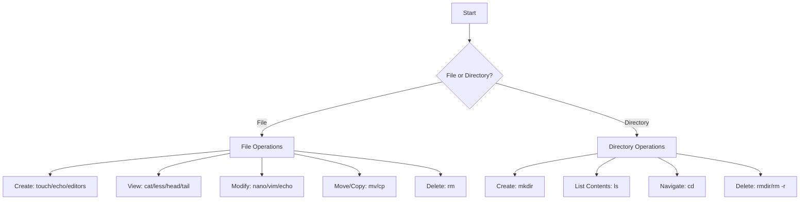

# Debian File Commands

## Introduction

When working with Debian Linux, understanding how to manipulate files through the terminal is a fundamental skill. File commands allow you to create, view, modify, and manage files directly from the command line without needing any graphical interfaces. This guide will walk you through the most common and useful file commands in Debian, with practical examples to help you become proficient in file manipulation via the terminal.

## Basic File Navigation

Before diving into file commands, it's important to understand how to navigate the file system.

### Checking Your Location

To see your current directory:

```bash
pwd
```

**Output:**
```
/home/username
```

The `pwd` command (Print Working Directory) shows your current location in the file system.

### Listing Files and Directories

To list files in the current directory:

```bash
ls
```

**Output:**
```
Documents  Downloads  Music  Pictures  Videos
```

For a more detailed view with hidden files:

```bash
ls -la
```

**Output:**
```
total 56
drwxr-xr-x 2 username username 4096 Mar 10 14:30 .
drwxr-xr-x 4 username username 4096 Mar 10 14:15 ..
-rw------- 1 username username  220 Mar 10 14:15 .bash_history
-rw-r--r-- 1 username username 3771 Mar 10 14:15 .bashrc
drwxr-xr-x 2 username username 4096 Mar 10 14:20 Documents
drwxr-xr-x 2 username username 4096 Mar 10 14:20 Downloads
drwxr-xr-x 2 username username 4096 Mar 10 14:20 Music
drwxr-xr-x 2 username username 4096 Mar 10 14:20 Pictures
drwxr-xr-x 2 username username 4096 Mar 10 14:20 Videos
```

### Changing Directories

Move to a specific directory:

```bash
cd Documents
```

Move to your home directory:

```bash
cd ~
```

Move up one level:

```bash
cd ..
```

## Creating Files and Directories

### Creating Directories

To create a new directory:

```bash
mkdir projects
```

Creating nested directories in one command:

```bash
mkdir -p projects/website/css
```

The `-p` flag allows you to create parent directories if they don't exist.

### Creating Files

There are several ways to create new files in Debian:

Using `touch` (creates an empty file):

```bash
touch notes.txt
```

Using redirection:

```bash
echo "Hello, Debian!" > greeting.txt
```

Using text editors:

```bash
nano document.txt
```

**Note:** After using `nano`, you'll enter the editor interface. Press `Ctrl+X`, then `Y`, and then `Enter` to save and exit.

## Viewing File Content

### Displaying File Content

View the entire content of a file:

```bash
cat greeting.txt
```

**Output:**
```
Hello, Debian!
```

View a file with pagination (for large files):

```bash
less large_file.txt
```

Display the first 10 lines of a file:

```bash
head -n 10 large_file.txt
```

Display the last 10 lines of a file:

```bash
tail -n 10 large_file.txt
```

Live monitoring of file changes (useful for log files):

```bash
tail -f /var/log/syslog
```

### Finding Text in Files

Search for text in a file:

```bash
grep "search_term" filename.txt
```

**Example:**
```bash
grep "Debian" greeting.txt
```

**Output:**
```
Hello, Debian!
```

## Copying, Moving, and Renaming Files

### Copying Files

Copy a file to another location:

```bash
cp source.txt destination.txt
```

Copy a directory and its contents recursively:

```bash
cp -r source_directory destination_directory
```

### Moving and Renaming Files

In Debian, moving and renaming use the same command:

```bash
mv oldname.txt newname.txt  # Renaming a file
```

```bash
mv file.txt /path/to/destination/  # Moving a file
```

## Removing Files and Directories

### Deleting Files

Remove a file:

```bash
rm unwanted_file.txt
```

### Deleting Directories

Remove an empty directory:

```bash
rmdir empty_directory
```

Remove a directory and all its contents:

```bash
rm -r directory_to_delete
```

**Warning:** Use the `rm -r` command with caution as it permanently deletes all files and subdirectories!

For safer deletion, add the `-i` flag which prompts for confirmation:

```bash
rm -ri directory_to_delete
```

## File Permissions

### Viewing Permissions

File permissions control who can read, write, or execute files. To view permissions:

```bash
ls -l file.txt
```

**Output:**
```
-rw-r--r-- 1 username group 14 Mar 10 15:30 file.txt
```

The permissions are represented by the first 10 characters:
- First character: file type (`-` for regular file, `d` for directory)
- Next 3 characters: owner permissions (read, write, execute)
- Next 3 characters: group permissions
- Last 3 characters: others/world permissions

### Changing Permissions

Change file permissions using the `chmod` command:

```bash
chmod 755 script.sh
```

This numeric representation means:
- 7 (4+2+1) for owner: read, write, execute
- 5 (4+0+1) for group: read, execute
- 5 (4+0+1) for others: read, execute

You can also use symbolic notation:

```bash
chmod u+x script.sh  # Add execute permission for the user
```

### Changing Ownership

Change the file owner:

```bash
sudo chown newowner file.txt
```

Change both owner and group:

```bash
sudo chown newowner:newgroup file.txt
```

## File Information and Attributes

### File Details

Get detailed information about a file:

```bash
stat document.txt
```

**Output:**
```
  File: document.txt
  Size: 45        Blocks: 8          IO Block: 4096   regular file
Device: 801h/2049d  Inode: 12345678  Links: 1
Access: (0644/-rw-r--r--)  Uid: (1000/username)   Gid: (1000/username)
Access: 2023-03-10 15:45:30.000000000 +0100
Modify: 2023-03-10 15:45:25.000000000 +0100
Change: 2023-03-10 15:45:25.000000000 +0100
 Birth: 2023-03-10 15:45:20.000000000 +0100
```

### File Type

Determine the type of a file:

```bash
file mystery_file
```

**Output:**
```
mystery_file: ASCII text
```

## Finding Files

### Locate Command

Find files by name (needs the database to be updated):

```bash
sudo updatedb  # Update the file database
locate filename
```

### Find Command

More powerful but slower searching:

```bash
find /home -name "*.txt"  # Find all .txt files in /home
```

**Output:**
```
/home/username/Documents/notes.txt
/home/username/greeting.txt
```

Find files modified in the last 7 days:

```bash
find /home/username -type f -mtime -7
```

## Advanced File Operations

### Linking Files

Create a symbolic link (like a shortcut):

```bash
ln -s /path/to/original/file link_name
```

### Comparing Files

Compare two files:

```bash
diff file1.txt file2.txt
```

**Output (example):**
```
3c3
< This line is different in file1
---
> This line is different in file2
```

### Archiving and Compressing

Create a compressed archive:

```bash
tar -czvf archive.tar.gz directory/
```

Extract a compressed archive:

```bash
tar -xzvf archive.tar.gz
```

## File Command Workflow Examples

### Creating a Basic Web Project

Here's how you might use file commands to set up a basic web project:

```bash
# Create project structure
mkdir -p mywebsite/{css,js,images}

# Create initial files
touch mywebsite/index.html
touch mywebsite/css/style.css
touch mywebsite/js/script.js

# Add some content to index.html
echo "<!DOCTYPE html>
<html>
<head>
    <title>My Website</title>
    <link rel='stylesheet' href='css/style.css'>
</head>
<body>
    <h1>Welcome to My Website</h1>
    <script src='js/script.js'></script>
</body>
</html>" > mywebsite/index.html

# Check the structure
ls -R mywebsite
```

### Log Analysis Workflow

Here's how you might analyze log files:

```bash
# View the last 100 lines of a log file
tail -n 100 /var/log/apache2/access.log

# Find all 404 errors
grep "404" /var/log/apache2/access.log

# Count the occurrences of a specific IP address
grep -c "192.168.1.1" /var/log/apache2/access.log

# Save the findings to a report
grep "404" /var/log/apache2/access.log > error_report.txt
```

## Common File Command Patterns

Here's a diagram showing common file command workflows:



## Summary

In this guide, we've covered the essential file commands in Debian Linux that every beginner should know:

- **Navigation**: `pwd`, `cd`, `ls`
- **File Creation**: `touch`, `echo`, text editors
- **Directory Creation**: `mkdir`
- **Viewing Content**: `cat`, `less`, `head`, `tail`
- **Searching**: `grep`, `find`, `locate`
- **File Operations**: `cp`, `mv`, `rm`
- **Permissions**: `chmod`, `chown`
- **Information**: `file`, `stat`
- **Advanced Operations**: linking, comparing, archiving

Mastering these commands will give you powerful control over your Debian system through the terminal, making many tasks faster and more efficient than using graphical interfaces.

## Additional Resources and Exercises

### Exercises

1. Create a directory structure for a personal project with at least three levels of nested directories.
2. Create 5 text files with different content, then practice searching for specific text across all files.
3. Create a shell script that creates a backup of a specific directory, compressing it into an archive with the current date in the filename.
4. Set up proper permissions for a directory where multiple users need different levels of access.

### Further Learning

For more advanced file manipulation, consider exploring:
- Batch file operations with `find` and `xargs`
- File monitoring tools like `inotify`
- Advanced text processing with `awk` and `sed`
- Version control systems like `git` for tracking file changes

These Debian file commands form the foundation of Linux system administration and will serve as essential tools throughout your programming journey.